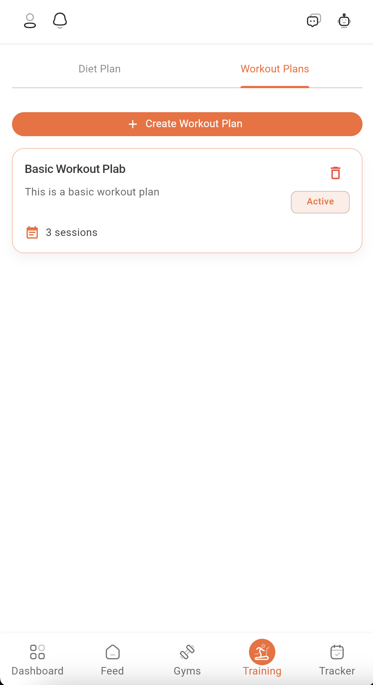
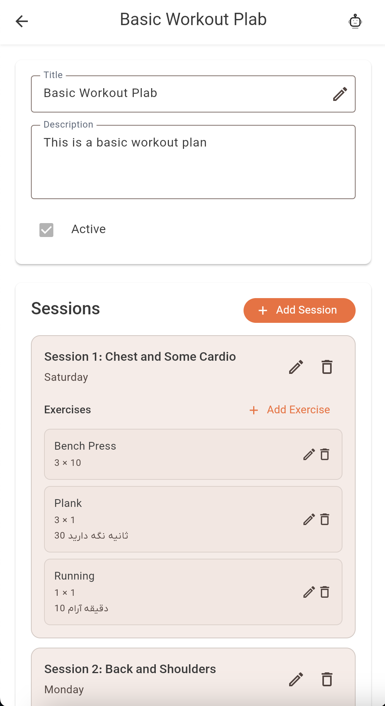

# Workout Plans Guide

Welcome to the Workout Plans section of Dambel. This comprehensive guide will walk you through all features of workout plans, including viewing plans, managing sessions, organizing exercises, and understanding super sets.

## Overview

The Workout Plans section allows you to create, view, and manage structured workout programs. Each workout plan contains sessions organized by day of the week, with exercises that include sets, reps, and optional descriptions. Exercises can be organized into super sets for efficient training.

Workout plans serve multiple purposes:
- **Program Structure**: Organize workouts by day of the week
- **Exercise Management**: Add exercises with specific set and rep counts
- **Super Set Organization**: Group related exercises together
- **Session Planning**: Create workout sessions for specific days
- **Active Plan Management**: Mark plans as active or inactive

## Accessing Workout Plans

You can access workout plans from the Training page:

1. Navigate to the **Training** section from the main navigation
2. Select the **"Workout Plans"** tab at the top
3. You'll see a list of all available workout plans

*The workout plans list showing all available plans with session counts*

## Viewing Workout Plans

The workout plans list displays all plans you have access to:

**Plan Information**:
- **Title**: The name of the workout plan
- **Description**: Optional description of the plan
- **Session Count**: Number of sessions in the plan (displayed as a badge)
- **Active Status**: Indicates if the plan is currently active

**Empty State**:
If no workout plans exist, you'll see a message: "No workout plans yet" with an option to create your first plan.

**Pagination**:
If you have many plans, use pagination controls at the bottom to navigate through pages.

## Opening a Workout Plan

Tap on any workout plan card to open the detailed view. The detail screen shows:

### Plan Header

The plan header displays:
- **Title**: The plan name (editable)
- **Description**: Optional plan description (editable)
- **Active Status**: Checkbox to mark plan as active or inactive

*The workout plan detail screen showing plan information and sessions section*

### Sessions Section

The Sessions section displays all workout sessions in the plan:

**Session Information**:
- **Title**: Name of the session (e.g., "Push Day", "Leg Day")
- **Day**: Day of the week (Saturday, Sunday, Monday, Tuesday, Wednesday, Thursday, Friday)
- **Description**: Optional session description
- **Exercises**: List of exercises in the session

**Session Display**:
Each session shows:
- Title in bold
- Day of the week below the title
- Description (if provided)
- Exercises list with set/rep information

**Empty State**:
If no sessions exist, you'll see: "No sessions yet" with an "Add Session" button.

## Editing a Workout Plan

To edit plan information:

1. Tap the **edit icon** (pencil) next to the title field
2. Modify the title, description, or active status
3. Tap **"Save"** to save changes or **"Cancel"** to discard

**Validation**:
- Title is required

## Managing Sessions

### Adding a Session

1. In the Sessions section, tap the **"Add Session"** button
2. Fill out the session form:
   - **Session Title** (Required): Name of the session
   - **Day** (Required): Select day of the week from dropdown
   - **Description** (Optional): Additional notes about the session
3. Tap **"Save"** to create the session

**Note**: You must save the session before adding exercises to it.

### Editing a Session

1. Tap the **edit icon** (pencil) on any session card
2. Modify the fields as needed
3. Tap **"Save"** to update or **"Cancel"** to discard changes

### Deleting a Session

1. Tap the **delete icon** (trash) on any session card
2. Confirm deletion in the dialog
3. The session and all its exercises will be permanently removed

**Note**: Deleting a session cannot be undone and will remove all exercises in that session.

## Managing Exercises

### Adding an Exercise

1. In a session, tap the **"Add Exercise"** button (only available after session is saved)
2. Fill out the exercise form:
   - **Exercise** (Required): Select from available exercises dropdown
   - **Set Count** (Required): Number of sets (must be > 0)
   - **Rep Count** (Required): Number of repetitions (must be > 0)
   - **Description** (Optional): Additional notes about the exercise
   - **Add to Super Set** (Optional): Link this exercise to another exercise as a super set
3. Tap **"Save"** to create the exercise

### Super Sets

Super sets allow you to group exercises together:

**Creating a Super Set**:
1. Add the first exercise (this becomes the parent)
2. Add a second exercise
3. In the second exercise form, select the first exercise from "Add to Super Set" dropdown
4. The second exercise becomes part of the super set

**Super Set Display**:
- Super sets are displayed with a special border and label
- The parent exercise is shown first
- Child exercises are indented and marked with "Part of Super Set" badge
- All exercises in a super set are visually grouped together

**Removing from Super Set**:
- When editing a child exercise, tap "Remove from Super Set" to make it standalone

### Editing an Exercise

1. Tap the **edit icon** (pencil) on any exercise card
2. Modify the fields as needed
3. You can change the exercise, sets, reps, description, or super set relationship
4. Tap **"Save"** to update or **"Cancel"** to discard changes

### Deleting an Exercise

1. Tap the **delete icon** (trash) on any exercise card
2. Confirm deletion in the dialog
3. The exercise will be permanently removed

**Note**: If you delete a parent exercise in a super set, child exercises become orphaned (they remain but are no longer grouped).

## AI Assistant Integration

The Workout Plan detail screen integrates with the AI Assistant:

**AI Can Help**:
- Fill out exercise forms with set and rep counts
- Suggest exercise combinations
- Organize exercises into super sets
- Create balanced workout sessions
- Plan weekly workout schedules

**How to Use**:
1. Open AI Assistant while viewing a workout plan (tap robot icon 🤖)
2. Ask for help: "Add a chest and triceps session for Monday"
3. AI automatically populates form fields
4. Review and adjust as needed
5. Save when satisfied

A blue notification appears when AI updates the form: "AI updated the form"

## Troubleshooting

### Plans Not Loading

**Solutions**:
1. Check internet connection
2. Pull down to refresh
3. Tap "Retry" button if error screen appears
4. Logout and login again
5. Contact support if issue persists

### Cannot Edit Plan

**Solutions**:
1. Ensure you're logged in
2. Close and reopen the app
3. Check that the plan belongs to you or you have editing access
4. Contact support if issue persists

### Sessions Not Loading

**Solutions**:
1. Verify stable internet connection
2. Pull down to refresh
3. Check error message for specific issues
4. Contact support if issue persists

### Cannot Add/Edit/Delete Sessions

**Solutions**:
1. Ensure all required fields are filled
2. Check validation errors (red messages on fields)
3. Verify you have editing access to the plan
4. Try again after a moment
5. Contact support if issue persists

### Exercises Not Loading

**Solutions**:
1. Verify stable internet connection
2. Ensure the session has been saved first
3. Pull down to refresh
4. Contact support if issue persists

### Cannot Add Exercises

**Solutions**:
1. Ensure the session is saved (you can't add exercises to unsaved sessions)
2. Check that exercise is selected from dropdown
3. Verify set count and rep count are valid numbers (> 0)
4. Verify you have editing access to the plan
5. Contact support if issue persists

### Super Set Issues

**Solutions**:
1. Ensure parent exercise is saved before adding child exercises
2. Only standalone exercises can be used as super set parents
3. Check that exercises are not already part of another super set
4. Try removing and re-adding super set relationships

## Best Practices

### Organizing Sessions

- Use clear, descriptive session titles (e.g., "Push Day", "Pull Day", "Leg Day")
- Assign sessions to specific days of the week
- Add descriptions to explain session focus or goals
- Balance sessions throughout the week

### Managing Exercises

- Use appropriate set and rep counts for your goals
- Add descriptions for form cues or special instructions
- Organize related exercises into super sets for efficiency
- Maintain consistent exercise selection across sessions

### Plan Management

- Mark only one plan as active at a time
- Keep plan descriptions informative
- Update plans as your goals change
- Review and adjust sessions regularly

## Getting Help

If you need assistance:

1. **AI Assistant**: Ask for help (tap robot icon 🤖)
2. **In-App Support**: Check support options in settings
3. **Documentation**: Browse other help articles
4. **Contact Support**: Reach out to Dambel support team

Workout plans are essential for structured training. Use them to organize your workouts and track your progress!

