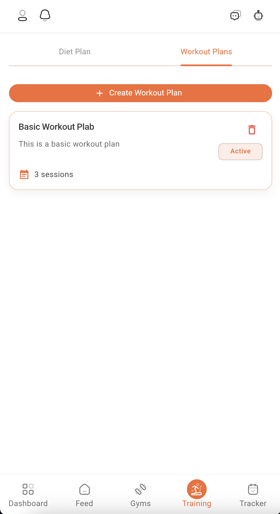
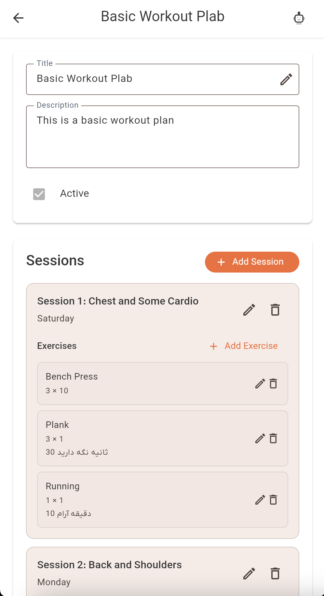

# Workout Plans

Workout plans are where you build your training program. Think of them as your workout blueprint – sessions organized by day of the week, exercises with sets and reps, all structured to keep you on track.

## Getting There

Head to the Training section from the main navigation, then tap the "Workout Plans" tab at the top. You'll see all your plans listed out.

## What You'll See

Each plan shows its title, description (if you added one), and how many sessions it has. There's also an indicator if the plan is currently active. If you don't have any plans yet, you'll see an empty state inviting you to create your first one.

Got a bunch of plans? Use the pagination controls at the bottom to browse through them.

## Opening a Plan

Tap any plan card to dive into the details.

At the top, you'll see the plan's title, description, and an active status checkbox. Want to mark this as your current plan? Just check that box. You can edit these details anytime by tapping the pencil icon, making your changes, and hitting "Save". Title is the only required field.

Below that is where your sessions live.

## Sessions

Sessions are your individual workout days. Each one has a title (like "Push Day" or "Leg Day"), a day of the week, an optional description, and a list of exercises.

When you open a session, you'll see all this info laid out clearly. The title is bold, the day is right below it, and if there's a description, that shows up too. Then comes the exercises list with all the set and rep details.

No sessions yet? You'll see a friendly message with an "Add Session" button.

### Adding a Session

Tap "Add Session" in the sessions section. Fill in the session title (required), pick a day from the dropdown (Saturday through Friday), and add a description if you want. Hit "Save" and you're done.

You need to save the session before you can add exercises to it.

### Editing & Deleting

Tap the pencil icon on any session to edit it. Change whatever you need and save. Want to delete it? Tap the trash icon and confirm. Just know that deleting a session wipes out all its exercises too, and there's no undo.

## Exercises

This is where the actual work happens. Each exercise in a session shows which exercise it is, how many sets and reps, and any notes you added.

### Adding an Exercise

Inside a saved session, tap "Add Exercise". Pick an exercise from the dropdown (required), enter the set count and rep count (both must be greater than zero), and add a description if you want. There's also an option to add this exercise to a super set, which we'll get to in a second.

Hit "Save" and the exercise appears in your session.

### Super Sets

Super sets let you group exercises together – perfect for when you want to do two exercises back-to-back with minimal rest.

To create a super set, add your first exercise normally. Then add a second exercise, and in that form, use the "Add to Super Set" dropdown to select the first exercise. The second exercise becomes part of the super set.

Super sets show up with a special border and label. The parent exercise is listed first, and child exercises are indented with a "Part of Super Set" badge. Everything's visually grouped so you can see what goes together.

Want to break up a super set? Edit the child exercise and tap "Remove from Super Set" to make it standalone again.

### Editing & Deleting

Tap the pencil icon on any exercise to edit it. You can change the exercise itself, the sets, reps, description, or even the super set relationship. Save when you're done.

To delete an exercise, tap the trash icon and confirm. If you delete a parent exercise in a super set, the child exercises stick around but they're no longer grouped.

## AI Can Help

The AI assistant works great with workout plans. Open it (tap the robot icon) while you're viewing a plan and ask for help. Something like "Add a chest and triceps session for Monday" works perfectly. The AI will populate the form fields, you review and adjust, then save. You'll see a blue notification when the AI updates something.

## When Things Go Wrong

Plans not loading? Check your internet connection and pull down to refresh. If you see an error screen, tap "Retry". Still stuck? Try logging out and back in.

Can't edit a plan? Make sure you're logged in. Sometimes closing and reopening the app helps.

Sessions not loading? Verify your internet connection is stable and try refreshing. Check any error messages for specifics.

Can't add, edit, or delete sessions? Make sure all required fields are filled and look for red error messages on the fields. Give it a moment and try again.

Exercises not loading? Verify your connection and make sure the session is saved first. Pull down to refresh if needed.

Can't add exercises? The session must be saved before you can add exercises. Make sure you've selected an exercise from the dropdown and that your set and rep counts are valid numbers greater than zero.

Super set issues? Make sure the parent exercise is saved before adding child exercises. Only standalone exercises can be super set parents, and exercises can't be part of multiple super sets at once. Try removing and re-adding the relationship if something's off.

## Tips

Use clear session titles that make sense to you. Assign sessions to specific days and spread them out through the week. Add descriptions when they're helpful – form cues, intensity notes, whatever keeps you on track.

For exercises, use set and rep counts that match your goals. Organize related exercises into super sets for efficiency. Keep your exercise selection consistent across sessions so you can track progress.

Mark only one plan as active at a time. Keep descriptions informative. Update your plans as your goals evolve.

If you need help, the AI assistant is always there, or check out the support options in settings.

