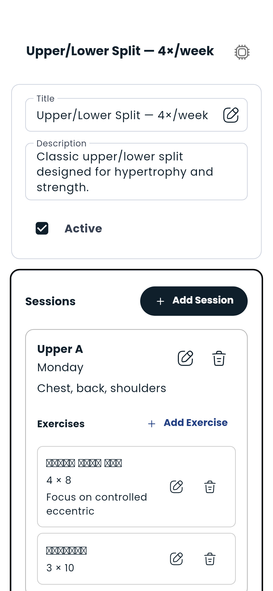

# Workout Plans

A workout plan is built from sessions — each one maps to a training day or workout type — with exercises inside.

---

## Create a plan

1. Go to **Training → Workout Plans**
2. Tap the **+** button to create a new plan
3. Give it a name (e.g., "Push/Pull/Legs", "5-Day Split")
4. Save — your empty plan is ready

---

## Add sessions

A session represents one training day or type (e.g., "Monday – Chest", "Upper Body A").

Inside your plan:
1. Tap **Add Session**
2. Name the session and assign it to a day of the week (optional)
3. Save

You can add as many sessions as your program needs.

---

## Add exercises to a session

Inside a session:
1. Tap **Add Exercise**
2. Search or browse to find the exercise
3. Add sets — each set has **reps** and **weight** targets
4. Save

Repeat for each exercise in the session.

---

## Super sets

Super sets let you group two or more exercises to be performed back-to-back with no rest between them.

To create a super set:
1. Add the exercises you want to group
2. Select them and tap **Create Super Set**
3. They'll appear visually linked in the session view

Super sets are great for antagonist muscle pairings (e.g., biceps + triceps) or circuit-style training.

---

## Set a plan as active

Only one workout plan can be active at a time. The active plan shows up on your Dashboard and is suggested when you log a workout in the Tracker.

To activate a plan: open it and tap **Set as Active**.

---

## Edit or delete a plan

- To **edit** plan details: tap the pencil icon at the top of the plan
- To **delete** a plan: open plan settings and tap **Delete**
- To **reorder sessions** or **remove exercises**: long-press or use the edit mode inside the session

---

## AI assistance

Tap the AI button (sparkle icon) anywhere in the workout plan to get help — ask it to suggest exercises, explain a movement, or auto-fill a session based on your goals.

---

> **Next:** [Set up a diet plan](diet-plans.md) or [start tracking your workouts](tracker.md)
