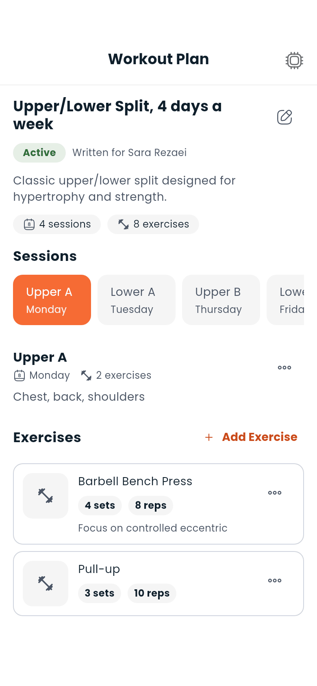

# Workout Plans

A workout plan is built from sessions — each one maps to a training day or workout type — with exercises inside.

The plan opens in **read mode**: a summary of the plan, a strip of session tabs across the top, and the selected session's exercises below. Editing is always an explicit action, so you can open a plan just to look at it.

---

## Create a plan

The **Workout Plans** tab is part of the Training area, and it is there only if your account may see plans.

1. Go to **Training → Workout Plans**
2. Tap the **+** button to create a new plan
3. Give it a name (e.g., "Push/Pull/Legs", "5-Day Split")
4. Save — your empty plan is ready

---

## Add sessions

A session represents one training day or type (e.g., "Monday – Chest", "Upper Body A").

Inside your plan:
1. Tap **+** at the end of the session strip
2. Name the session and assign it to a day of the week
3. Save

You can add as many sessions as your program needs. Tap any session in the strip to switch to it — the exercise list below updates to match.

---

## Add exercises to a session

Inside a session:
1. Tap **Add Exercise**
2. **Search the exercise library** — start typing a name or a body area (for example "chest") and the list narrows as you type
3. Set the number of sets and reps
4. Save

Repeat for each exercise in the session.

Each exercise row shows its sets and reps as labelled figures, plus any note you added. **Tap a row to expand it** for the exercise's illustration and step-by-step instructions.

---

## Super sets

Super sets group two or more exercises to be performed back-to-back with no rest between them.

You make one from the *second* exercise, not from a selection:
1. Add both exercises to the session
2. Open the second one for editing
3. In its **Super set** field, pick the exercise it belongs with
4. Save

The grouped exercises then render together inside one highlighted card, labelled **Super set**. To break a group up, clear that field again.

Super sets are great for antagonist muscle pairings (e.g., biceps + triceps) or circuit-style training.

---

## Set a plan as active

Only one workout plan can be active at a time. The active plan shows up on your Dashboard and is suggested when you log a workout in the Tracker.

To activate a plan: open it and tap **Set as active plan**.

---

## Edit or delete a plan

- To **edit** plan details: tap the pencil icon next to the plan name
- To **edit or delete a session or an exercise**: tap the **⋮** menu on it and pick the action
- To **delete** a plan: open plan settings and tap **Delete**

Edit and delete options only appear for plans that are yours to change. A plan your trainer wrote for you is theirs: you can read it, follow it and log against it, but the pencil and the ⋮ menus are not offered, and the header says who wrote it. The same plan on your trainer's screen carries the name of the trainee it was written for, and all of its editing.

---

## AI assistance

Tap the AI button (sparkle icon) anywhere in the workout plan to get help — ask it to suggest exercises, explain a movement, or auto-fill a session based on your goals.

---

> **Next:** [Set up a diet plan](diet-plans.md) or [start tracking your workouts](tracker.md)

---

[← Previous: Dashboard](dashboard.md) | [Next: Diet Plans →](diet-plans.md)
