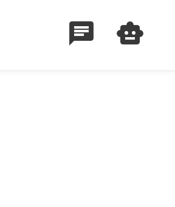
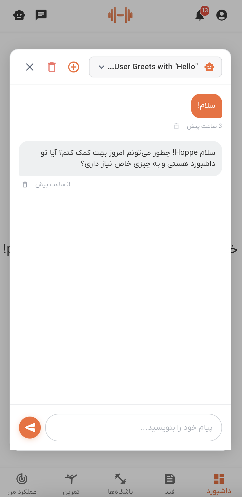

# راهنمای دستیار هوش مصنوعی

به ویژگی دستیار هوش مصنوعی در دمبل خوش آمدید. این راهنما به شما کمک می‌کند تا نحوه استفاده از دستیار هوشمند را برای دریافت راهنمایی شخصی‌سازی شده در طول سفر تناسب اندام خود بیاموزید.

## نمای کلی

دستیار هوش مصنوعی دمبل یک کمک‌کننده هوشمند است که کمک‌های آگاه به زمینه را در حین استفاده از برنامه ارائه می‌دهد. این دستیار می‌تواند به سوالات پاسخ دهد، مشاوره تمرینی ارائه کند، در زمینه تغذیه کمک کند و شما را در استفاده از ویژگی‌های برنامه راهنمایی کند. دستیار تاریخچه گفتگوها را در قالب رشته‌های سازمان‌یافته نگه‌داری می‌کند که به شما امکان می‌دهد گفتگوهای قبلی را ادامه دهید یا در هر زمان گفتگوهای جدیدی را شروع کنید.

دستیار هوش مصنوعی می‌فهمد که در برنامه چه کاری انجام می‌دهید (کدام صفحه را مشاهده می‌کنید، چه فرم‌هایی را پر می‌کنید و غیره) و از این زمینه برای ارائه پاسخ‌های مرتبط‌تر و مفیدتر استفاده می‌کند.

## دسترسی به دستیار هوش مصنوعی

### مرحله ۱: یافتن آیکون دستیار هوش مصنوعی

دستیار هوش مصنوعی از اکثر صفحات برنامه از طریق نوار بالای صفحه قابل دسترسی است:

۱. به دنبال **آیکون ربات** (🤖) در گوشه بالا سمت راست صفحه باشید
۲. این آیکون در کنار آیکون چت در نوار برنامه قرار دارد

*آیکون ربات در نوار برنامه دسترسی سریع به دستیار هوش مصنوعی را از هر صفحه‌ای فراهم می‌کند*

### مرحله ۲: باز کردن دستیار هوش مصنوعی

به سادگی روی آیکون ربات ضربه بزنید تا پنجره دستیار هوش مصنوعی باز شود. دستیار به عنوان یک پنجره شناور در مرکز صفحه شما با یک رابط چت تمیز ظاهر می‌شود.

## استفاده از دستیار هوش مصنوعی

### شروع یک گفتگوی جدید

وقتی برای اولین بار دستیار هوش مصنوعی را باز می‌کنید، یک گفتگوی خالی جدید خواهید دید:

۱. ناحیه چت خالی خواهد بود و آماده دریافت اولین پیام شما
۲. در پایین، فیلد ورودی پیام همراه با دکمه ارسال (آیکون هواپیمای کاغذی) را مشاهده خواهید کرد
۳. سوال یا پیام خود را در فیلد ورودی تایپ کنید
۴. روی دکمه **ارسال** ضربه بزنید تا پیام خود را ارسال کنید

**چه اتفاقی می‌افتد**:
- پیام شما به هوش مصنوعی ارسال می‌شود
- برنامه به طور خودکار یک رشته گفتگوی جدید ایجاد می‌کند
- هوش مصنوعی پیام شما را همراه با زمینه فعلی برنامه پردازش می‌کند
- پاسخی از دستیار هوش مصنوعی دریافت خواهید کرد
- عنوان رشته به طور خودکار بر اساس اولین پیام شما تولید می‌شود

*پنجره دستیار هوش مصنوعی که رابط چت با تاریخچه پیام‌ها، فیلد ورودی و کنترل‌ها را نشان می‌دهد*

### ارسال پیام

برای ارسال پیام در یک گفتگوی فعال:

۱. **پیام خود را تایپ کنید**: در فیلد ورودی پایین کلیک کنید و سوال یا درخواست خود را تایپ کنید
۲. **شامل زمینه**: هوش مصنوعی به طور خودکار می‌داند که در برنامه چه کاری انجام می‌دهید، بنابراین می‌توانید به "این صفحه" یا "این تمرین" اشاره کنید
۳. **ارسال**: Enter را فشار دهید یا روی دکمه ارسال ضربه بزنید
۴. **منتظر پاسخ بمانید**: هوش مصنوعی پیام شما را پردازش کرده و به طور خودکار پاسخ می‌دهد

دکمه ارسال در حین تولید پاسخ توسط هوش مصنوعی، یک نشانگر بارگذاری نمایش می‌دهد.

### مشاهده تاریخچه چت

دستیار هوش مصنوعی تاریخچه تمام گفتگوهای شما را نگه‌داری می‌کند:

۱. **دسترسی به تاریخچه**: روی منوی کشویی انتخابگر چت در بالای پنجره دستیار هوش مصنوعی کلیک کنید (عنوان رشته فعلی با فلش کشویی نمایش داده می‌شود)
۲. **مرور رشته‌ها**: در رشته‌های گفتگوی قبلی خود پیمایش کنید
۳. **انتخاب یک رشته**: روی هر رشته ضربه بزنید تا آن گفتگو را مشاهده کرده و ادامه دهید

هر رشته در تاریخچه موارد زیر را نمایش می‌دهد:
- عنوان رشته (تولید خودکار از گفتگو)
- زمان آخرین به‌روزرسانی (مثلاً "۲ ساعت پیش"، "همین الان")
- نشانگر آیکون چت
- دکمه حذف (در صورت موجود بودن)

**صفحه‌بندی**: اگر رشته‌های گفتگوی زیادی دارید، می‌توانید برای بارگذاری موارد بیشتر به انتهای لیست پیمایش کنید.

### ادامه گفتگوهای قبلی

برای ادامه یک گفتگوی قبلی:

۱. با کلیک روی منوی کشویی در بالا، تاریخچه چت را باز کنید
۲. گفتگویی که می‌خواهید ادامه دهید را پیدا کنید
۳. روی آن ضربه بزنید تا آن رشته بارگذاری شود
۴. پیام‌های قبلی به طور خودکار بارگذاری می‌شوند
۵. یک پیام جدید تایپ کنید تا گفتگو را ادامه دهید

هوش مصنوعی زمینه پیام‌های قبلی در همان رشته را به خاطر می‌سپارد.

### ایجاد چندین گفتگو

می‌توانید موضوعات مختلف را در رشته‌های گفتگوی جداگانه سازماندهی کنید:

۱. **دکمه چت جدید**: روی آیکون **+** (به علاوه) در سربرگ، در کنار منوی کشویی انتخابگر چت ضربه بزنید
۲. **رشته جدید**: یک گفتگوی خالی تازه باز می‌شود
۳. **ارسال اولین پیام**: اولین پیام خود را تایپ و ارسال کنید
۴. **عنوان خودکار**: عنوان رشته به طور خودکار بر اساس پیام شما تعیین می‌شود

این برای موارد زیر مفید است:
- جدا کردن بحث‌های تمرینی از مشاوره تغذیه
- نگه‌داشتن برنامه‌های تمرینی مختلف در رشته‌های جداگانه
- سازماندهی سوالات عمومی جدا از راهنمایی‌های ویژگی‌های خاص

## ویژگی‌های پیشرفته

### کمک آگاه به زمینه

دستیار هوش مصنوعی آگاه به زمینه است، یعنی می‌داند:

- **صفحه فعلی**: چه صفحه یا نمایشی را مشاهده می‌کنید
- **فرم‌های فعال**: چه اطلاعاتی را وارد می‌کنید
- **موجودیت در حال مشاهده**: کدام باشگاه، تمرین یا پروفایل را مشاهده می‌کنید
- **فیلترهای اعمال شده**: چه معیارهای جستجو یا فیلتری را تنظیم کرده‌اید

این بدان معناست که می‌توانید سوالاتی مانند موارد زیر بپرسید:
- "کمک کن این فرم را پر کنم"
- "این صفحه چه کاری انجام می‌دهد؟"
- "این گزینه‌ها را برایم توضیح بده"
- "اینجا چه چیزی وارد کنم؟"

هوش مصنوعی بر اساس زمینه فعلی شما درک خواهد کرد که "این" به چه چیزی اشاره دارد.

### مدیریت پیام‌ها

می‌توانید پیام‌های جداگانه در یک گفتگو را مدیریت کنید (در صورت موجود بودن):

۱. **حذف پیام**: روی آیکون کوچک حذف که در کنار زمان هر پیام ظاهر می‌شود ضربه بزنید
۲. **تأیید**: در پنجره‌ای که ظاهر می‌شود، حذف پیام را تأیید کنید
۳. **حذف آبشاری**: حذف یک پیام، آن و همه پیام‌های بعد از آن در رشته را حذف می‌کند

### مدیریت رشته‌ها

رشته‌های گفتگوی خود را مدیریت کنید (در صورت موجود بودن):

۱. **حذف رشته فعلی**: روی آیکون سطل زباله در سربرگ (گوشه بالا سمت راست پنجره دستیار هوش مصنوعی) ضربه بزنید
۲. **حذف از تاریخچه**: یا روی آیکون حذف در کنار هر رشته در منوی کشویی تاریخچه چت ضربه بزنید
۳. **تأیید**: تأیید کنید که می‌خواهید کل رشته را حذف کنید
۴. **دائمی**: این عمل قابل بازگشت نیست

### صفحه‌بندی و بارگذاری

دستیار هوش مصنوعی از صفحه‌بندی برای رشته‌ها و پیام‌ها پشتیبانی می‌کند:

**صفحه‌بندی رشته‌ها**:
- به انتهای تاریخچه چت پیمایش کنید
- رشته‌های بیشتر به طور خودکار بارگذاری می‌شوند
- یک نشانگر بارگذاری در حین واکشی ظاهر می‌شود

**صفحه‌بندی پیام‌ها**:
- به انتهای پیام‌ها پیمایش کنید
- پیام‌های قدیمی‌تر به طور خودکار بارگذاری می‌شوند (در صورت موجود بودن)
- برای گفتگوهای بسیار طولانی مفید است

## نکات برای نتایج بهتر

### نوشتن سوالات مؤثر

برای بهترین پاسخ‌های هوش مصنوعی:

۱. **مشخص باشید**: به جای "کمک"، بگویید "به من کمک کن یک برنامه تمرینی برای مبتدیان ایجاد کنم"
۲. **زمینه ارائه دهید**: حتی اگر هوش مصنوعی زمینه برنامه شما را می‌داند، جزئیات اضافی کمک می‌کند
۳. **یک موضوع در هر رشته**: موضوعات مختلف را در رشته‌های جداگانه نگه دارید برای سازماندهی بهتر
۴. **سوالات پیگیری**: در همان رشته، سوالات توضیحی بپرسید

### سازماندهی گفتگوها

بهترین شیوه‌ها برای مدیریت رشته‌های شما:

۱. **پیام‌های اول توصیفی**: پیام اول شما عنوان رشته می‌شود، آن را واضح کنید
۲. **حذف رشته‌های قدیمی**: گفتگوهایی که دیگر نیازی به آنها ندارید را حذف کنید
۳. **ادامه رشته‌های مرتبط**: از رشته‌های موجود برای سوالات پیگیری مرتبط استفاده کنید
۴. **ایجاد جدید برای موضوعات جدید**: هنگام تغییر موضوع، یک رشته جدید شروع کنید

### استفاده از زمینه برنامه

از ویژگی‌های آگاه به زمینه بهره ببرید:

۱. **در حین مشاهده بپرسید**: دستیار هوش مصنوعی را در حین مشاهده یک صفحه یا آیتم خاص باز کنید
۲. **اشاره به صفحه فعلی**: بگویید "این صفحه"، "این تمرین"، "این گزینه‌ها"
۳. **کمک در فرم**: در حین پر کردن فرم‌ها کمک بگیرید - هوش مصنوعی می‌تواند ببیند چه چیزی وارد می‌کنید
۴. **راهنمایی درون زمینه‌ای**: در حین استفاده از ویژگی‌ها درباره آنها سوال بپرسید

## رفع مشکلات

### آیکون دستیار هوش مصنوعی را نمی‌بینم

اگر آیکون ربات را در نوار برنامه نمی‌بینید:

۱. **به‌روزرسانی برنامه**: اطمینان حاصل کنید که از آخرین نسخه دمبل استفاده می‌کنید
۲. **ورود مجدد**: خروج و ورود مجدد را امتحان کنید
۳. **تماس با پشتیبانی**: اگر مشکل ادامه دارد، با پشتیبانی تماس بگیرید

### پیام‌ها ارسال نمی‌شوند

اگر پیام‌های شما ارسال نمی‌شوند:

۱. **بررسی اینترنت**: اطمینان حاصل کنید که اتصال اینترنت پایدار دارید
۲. **منتظر پاسخ بمانید**: در حین پردازش یک پیام، چند پیام ارسال نکنید
۳. **دوباره تلاش کنید**: در صورت بروز خطا، پیام به فیلد ورودی بازگردانده می‌شود - دوباره تلاش کنید
۴. **راه‌اندازی مجدد برنامه**: اگر مشکلات ادامه دارد، برنامه را مجدداً راه‌اندازی کنید

### رشته‌ها بارگذاری نمی‌شوند

اگر تاریخچه گفتگوی شما بارگذاری نمی‌شود:

۱. **تازه‌سازی**: پنجره دستیار هوش مصنوعی را ببندید و دوباره باز کنید
۲. **بررسی اتصال**: اتصال اینترنت پایدار خود را تأیید کنید
۳. **دکمه تلاش مجدد**: در صورت ظاهر شدن خطا، از دکمه تلاش مجدد استفاده کنید
۴. **بارگذاری مجدد برنامه**: کل برنامه را مجبور به بسته شدن و دوباره باز کردن کنید

### پاسخ‌های کند

اگر هوش مصنوعی به کندی پاسخ می‌دهد:

۱. **سرعت شبکه**: سرعت اتصال اینترنت خود را بررسی کنید
۲. **بار سرور**: زمان‌های پاسخ ممکن است بر اساس بار سرور متفاوت باشد
۳. **صبور باشید**: پردازش هوش مصنوعی می‌تواند برای پاسخ‌های پیچیده ۵ تا ۱۵ ثانیه طول بکشد
۴. **ساده کردن سوال**: پرس‌وجوهای بسیار پیچیده ممکن است زمان بیشتری ببرند

### زمینه کار نمی‌کند

اگر به نظر می‌رسد هوش مصنوعی زمینه برنامه شما را درک نمی‌کند:

۱. **ارجاعات صریح**: به جای استفاده از "این" یا "اینجا"، صریح‌تر باشید
۲. **پیمایش صفحه**: اطمینان حاصل کنید که در صفحه‌ای هستید که می‌خواهید به آن اشاره کنید
۳. **تازه‌سازی زمینه**: دستیار هوش مصنوعی را ببندید و دوباره باز کنید تا زمینه تازه شود
۴. **گزارش مشکل**: اگر زمینه به طور مداوم شکست می‌خورد، با پشتیبانی تماس بگیرید

## حریم خصوصی و داده‌ها

### چه اطلاعاتی به اشتراک گذاشته می‌شود

هنگامی که از دستیار هوش مصنوعی استفاده می‌کنید:

- **پیام‌های شما**: همه پیام‌هایی که ارسال می‌کنید توسط هوش مصنوعی پردازش می‌شوند
- **زمینه برنامه**: صفحه فعلی، فرم‌ها، فیلترها و وضعیت مشاهده
- **تاریخچه گفتگو**: همه رشته‌ها و پیام‌ها ذخیره می‌شوند
- **داده‌های زمان**: زمان ارسال پیام‌ها

### ذخیره‌سازی داده‌ها

- **ذخیره‌سازی سرور**: گفتگوها در سرورهای دمبل ذخیره می‌شوند
- **مرتبط با حساب**: رشته‌های شما به حساب شما مرتبط هستند
- **دائمی**: رشته‌ها تا زمانی که آنها را حذف کنید باقی می‌مانند
- **امن**: همه داده‌ها به طور ایمن منتقل شده و رمزگذاری می‌شوند

### بهترین شیوه‌های حریم خصوصی

برای حفظ حریم خصوصی شما:

۱. **اطلاعات حساس به اشتراک نگذارید**: از به اشتراک گذاشتن رمز عبور یا داده‌های شخصی حساس خودداری کنید
۲. **قبل از ارسال بررسی کنید**: پیام‌ها را قبل از ارسال دوباره بررسی کنید
۳. **رشته‌های قدیمی را حذف کنید**: گفتگوهایی که دیگر نیازی به آنها ندارید را حذف کنید
۴. **امنیت حساب**: اطلاعات ورود حساب خود را ایمن نگه دارید

## دریافت کمک

اگر به کمک بیشتری نیاز دارید:

۱. **از هوش مصنوعی بپرسید**: دستیار هوش مصنوعی می‌تواند با اکثر سوالات درباره برنامه کمک کند
۲. **راهنماهای دیگر را بررسی کنید**: مستندات کمک دیگر را در برنامه مرور کنید
۳. **تماس با پشتیبانی**: برای مشکلات فنی با پشتیبانی دمبل تماس بگیرید
۴. **انجمن**: به انجمن دمبل بپیوندید برای نکات و مشاوره کاربران

دستیار هوش مصنوعی طراحی شده است تا سفر تناسب اندام شما را آسان‌تر و شخصی‌تر کند. در پرسیدن سوالات و کاوش در قابلیت‌های آن تردید نکنید!

