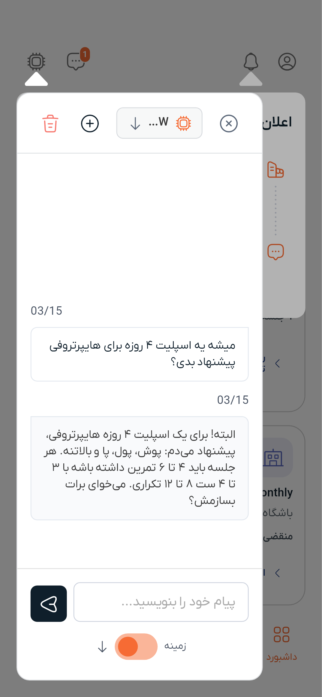

# دستیار هوش مصنوعی

دمبل یک دستیار هوش مصنوعی داخلی دارد که می‌فهمد شما در اپ چه می‌کنید و می‌تواند واقعاً کمک کند — نه فقط سؤالات کلی جواب بدهد.

---

## باز کردن دستیار

به دنبال **آیکون جرقه** (✦) در هر صفحه‌ای که پشتیبانی می‌کند بگردید — برنامه‌های تمرینی، برنامه‌های غذایی، پروفایل و بیشتر. روی آن ضربه بزنید تا پنل چت باز شود.

---

## چه می‌داند

دستیار از محیط شما آگاه است. وقتی آن را در صفحه برنامه تمرینی باز می‌کنید، می‌داند که روی برنامه تمرینی کار می‌کنید. وقتی در فرم برنامه غذایی هستید، اهداف تغذیه‌ای فعلی شما را می‌داند. یعنی می‌توانید چیزهایی مثل این بپرسید:

- «۳ تمرین برای جلسه سینه پیشنهاد بده»
- «پروتئین روزانه‌ام در دوره کات چقدر باشد؟»
- «وعده ناهار امروز را بر اساس مرغ و برنج پر کن»
- «سوپرست چیست؟»

---

## پر کردن خودکار فرم

در صفحه‌های پشتیبانی‌شده، دستیار می‌تواند فیلدهای فرم را برای شما پر کند. فقط توضیح دهید چه می‌خواهید:

> «یک جلسه پوش با پرس سینه، پرس سرشانه و جلو بازو پشتی بازو اضافه کن»

دستیار فیلدها را پر می‌کند — شما فقط بررسی کنید و ذخیره کنید.

---

## مسیریابی از طریق چت

دستیار می‌تواند شما را به بخش دیگری از اپ هدایت کند. بگویید «نقشه باشگاه‌ها را نشانم بده» یا «تاریخچه ردیابم را باز کن» و آنجا می‌رود.

---

## تردهای گفتگو

هر گفتگو به عنوان یک ترد نام‌دار ذخیره می‌شود. تردها بر اساس محتوای گفتگو به صورت خودکار نام‌گذاری می‌شوند. می‌توانید:
- بین تردهای قبلی جابه‌جا شوید
- یک ترد که دیگر نیازی ندارید حذف کنید
- هر زمان یک ترد تازه شروع کنید

---

## نکاتی برای بهترین نتیجه

- دقیق باشید — «یک اسپلیت ۴ روزه برای هایپرتروفی پیشنهاد بده» بهتر از «برایم یک برنامه بساز» کار می‌کند
- دستیار وقتی از قبل در صفحه مربوطه هستید بهترین عملکرد را دارد
- نمی‌تواند به جای شما فرم‌ها را ارسال کند — کمک می‌کند اطلاعات را پر کنید، نه اینکه خودش ثبت کند

---

> **بعدی:** [به فهرست مستندات برگردید](README.md)
