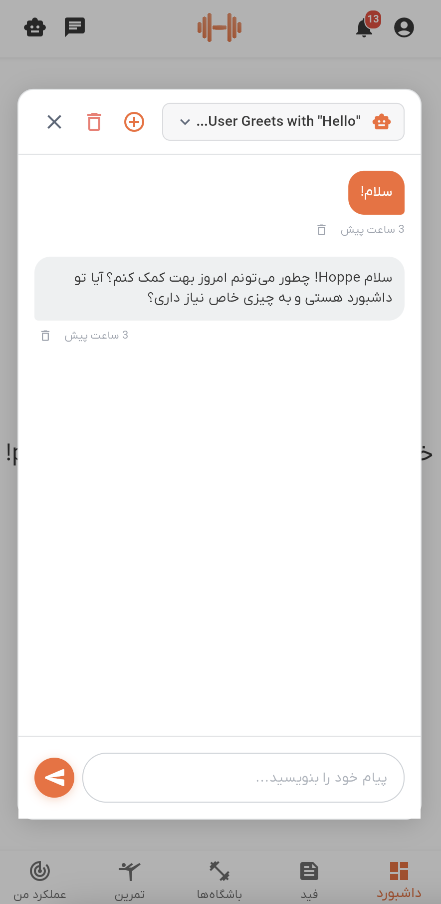
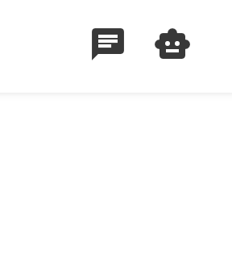

# دستیار هوش مصنوعی

دستیار شخصی هوش مصنوعی که می‌دونه توی اپ داری چیکار می‌کنی و واقعاً می‌تونه کمکت کنه کارها رو انجام بدی. فکرش رو بکن مثل یه دوست باسواد فیتنس که همیشه در دسترسه تا به سوالات جواب بده، فرم‌ها رو پر کنه، یا راهنماییت کنه.

## چطوری برم اونجا

آیکون ربات رو توی گوشه بالا سمت راست بیشتر صفحات می‌بینی؟ همون دستیار هوش مصنوعیته. بزنش و یه پنجره چت همونجا باز میشه.

## چطور کار می‌کنه

دستیار هوش مصنوعی context-aware هست، که یه راه فانتزی برای گفتن اینه که می‌دونه داری به چی نگاه می‌کنی. داری یه برنامه تمرینی می‌بینی؟ می‌دونه. داری پروفایلت رو پر می‌کنی؟ اونم می‌بینه. یعنی می‌تونی چیزایی مثل "کمکم کن این رو پر کنم" یا "اینجا چی باید بنویسم" بپرسی و واقعاً می‌فهمه داری از چی حرف می‌زنی.

همه گفتگوهات توی thread ها ذخیره میشن، پس می‌تونی از جایی که موندی ادامه بدی یا هر وقت خواستی از اول شروع کنی.

## اولین چت

وقتی اولین بار دستیار رو باز می‌کنی، یه چت خالی با یه باکس پیام پایین صفحه می‌بینی. فقط سوالت رو تایپ کن و ارسال رو بزن (آیکون هواپیمای کاغذی).

اینجوری پیش میره: اپ یه thread گفتگوی جدید می‌سازه، پیامت رو همراه با اطلاعاتی درباره کاری که الان توی اپ داری انجام میدی می‌فرسته، و هوش مصنوعی جواب میده. thread خودکار یه عنوان می‌گیره بر اساس اولین پیامت، پس اگه می‌خوای بعداً راحت پیداش کنی، حواست باشه چی می‌نویسی.

## چت کردن

پیامت رو توی باکس پایین تایپ کن و بفرست. هوش مصنوعی سوالت رو همراه با context فعلی اپت پردازش می‌کنه و جواب میده. وقتی داره فکر می‌کنه یه نشانگر لودینگ می‌بینی.

می‌تونی مستقیم به چیزی که داری نگاهش می‌کنی اشاره کنی – "این صفحه"، "این تمرین"، "این گزینه‌ها" – و هوش مصنوعی می‌فهمه منظورت چیه. خیلی کاربردیه وقتی داری سعی می‌کنی یه چیزی رو بفهمی.

## مدیریت گفتگوها

روی منوی کشویی بالای پنجره چت بزن تا همه گفتگوهای قبلیت رو ببینی. هر کدوم عنوانش، آخرین باری که آپدیت شده، و یه دکمه حذف داره اگه بخوای تمیزشون کنی.

گفتگوهای زیادی داری؟ فقط به پایین اسکرول کن و بیشتر خودکار لود میشن.

می‌خوای یه گفتگوی قدیمی رو ادامه بدی؟ توی منوی کشویی پیداش کن، بزنش، و تاریخچه پیام‌هات لود میشه. هوش مصنوعی یادشه قبلاً درباره چی حرف زدید، پس می‌تونی فقط ادامه بدی.

می‌خوای از اول شروع کنی؟ آیکون + کنار انتخابگر thread رو بزن تا یه گفتگوی جدید بسازی. اولین پیامت میشه عنوان thread.

## قسمت باهوش

هوش مصنوعی می‌دونه روی چه صفحه‌ای هستی، چه فرم‌هایی رو داری پر می‌کنی، کدوم باشگاه یا تمرین رو داری می‌بینی، و چه فیلترهایی اعمال کردی. این context خودکار با پیام‌هات فرستاده میشه، پس هوش مصنوعی می‌تونه جواب‌های مرتبط بده بدون اینکه مجبور باشی همه چیز رو توضیح بدی.

می‌تونی ازش بخوای کمکت کنه فرم‌ها رو پر کنه، قابلیت‌ها رو توضیح بده، یا راهنماییت کنه توی انجام کارها. اگه هوش مصنوعی چیزی رو توی یه فرم آپدیت کنه، یه نوتیفیکیشن آبی می‌بینی. فقط تغییرات رو بررسی کن و وقتی آماده شدی ذخیره کن.

بعضی وقتا هوش مصنوعی حتی می‌تونه تو رو به صفحات مختلف هدایت کنه اگه لازم باشه. پنجره چت رو می‌بنده و می‌بره اونجا.

## تمیز کردن

می‌خوای یه پیام خاص رو حذف کنی؟ دنبال آیکون حذف کوچیک کنار timestamp ش بگرد. یادت باشه که حذف یه پیام همه چیزی که بعدش اومده رو هم توی اون thread حذف می‌کنه.

برای حذف کل یه گفتگو، یا آیکون سطل زباله رو توی هدر چت بزن یا از دکمه حذف کنار thread توی منوی تاریخچه استفاده کن. این کار برگشت نداره، پس مطمئن شو واقعاً می‌خوای این کار رو بکنی.

## وقتی مشکلی پیش میاد

آیکون ربات رو نمی‌بینی؟ مطمئن شو که آخرین نسخه اپ رو داری. یه بار خارج شو و دوباره وارد شو. هنوز نیست؟ به پشتیبانی پیام بده.

پیام ارسال نمیشه؟ اتصال اینترنتت رو چک کن و مطمئن شو که دکمه ارسال رو اسپم نمی‌کنی وقتی هوش مصنوعی هنوز داره پردازش می‌کنه. اگه خطا گرفتی، پیامت برمی‌گرده توی باکس متن تا دوباره امتحان کنی.

Thread ها لود نمیشن؟ پنجره چت رو ببند و دوباره باز کن. اگه کار نکرد، اتصالت رو چک کن یا اپ رو ریستارت کن.

هوش مصنوعی خیلی طول می‌کشه؟ ممکنه سرعت اینترنتت یا بار سرور باشه. ۱۰-۱۵ ثانیه صبر کن قبل از اینکه نگران بشی. سوالات پیچیده بیشتر طول می‌کشن تا پردازش بشن.

هوش مصنوعی context ت رو نمی‌فهمه؟ سعی کن خاص‌تر باشی به جای اینکه بگی "این" یا "اینجا". مطمئن شو واقعاً روی صفحه‌ای هستی که درباره‌ش سوال می‌پرسی. بستن و باز کردن دوباره چت می‌تونه context رو رفرش کنه.

## موضوع حریم خصوصی

پیام‌هات، تاریخچه گفتگوها، و context اپت همه به هوش مصنوعی فرستاده میشن و روی سرورهای دمبل ذخیره میشن. همه چیز رمزنگاری شده و به اکانتت لینک شده. Thread ها تا وقتی حذفشون نکنی می‌مونن.

رمز عبور یا اطلاعات خیلی حساس رو توی چت به اشتراک نذار. پیام‌هات رو قبل از فرستادن بررسی کن. گفتگوهای قدیمی که دیگه نیازی بهشون نداری رو تمیز کن.

## نکته‌ها

توی سوالات خاص باش. "کمکم کن یه برنامه تمرینی مبتدی بسازم" خیلی بهتر از فقط "کمک" کار می‌کنه.

موضوعات مختلف رو توی thread های جدا نگه دار. یکی برای تمرینات، یکی برای تغذیه، یکی برای سوالات عمومی – هر چی که برات منطقیه.

اولین پیامت میشه عنوان thread، پس اگه می‌خوای بعداً پیداش کنی، توصیفی باش.

دستیار رو وقتی باز کن که واقعاً داری به چیزی که بهش نیاز داری نگاه می‌کنی. context فرق زیادی می‌سازه.

اگه کمک بیشتری لازم داری، هوش مصنوعی معمولاً می‌تونه به سوالات درباره اپ جواب بده. برای مشکلات فنی، از طریق تنظیمات به پشتیبانی پیام بده.
