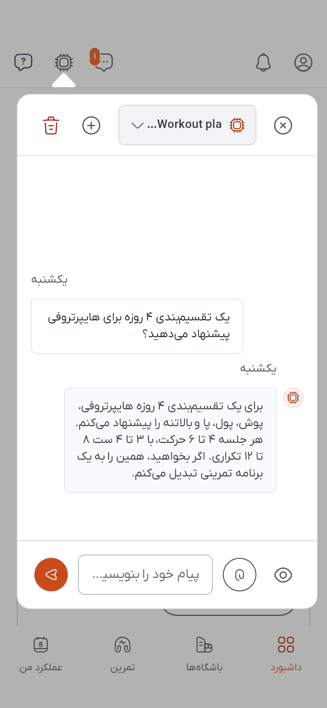

# دستیار هوش مصنوعی

دمبل یک دستیار هوش مصنوعی داخلی دارد که می‌فهمد شما در اپ چه می‌کنید و می‌تواند واقعاً کمک کند — نه فقط سؤالات کلی جواب بدهد.

---

## باز کردن دستیار

به دنبال **آیکون جرقه** (✦) در هر صفحه‌ای که پشتیبانی می‌کند بگردید — برنامه‌های تمرینی، برنامه‌های غذایی، پروفایل و بیشتر. روی آن ضربه بزنید تا پنل چت باز شود.

---

## چه می‌داند

دستیار از محیط شما آگاه است. وقتی آن را در صفحه برنامه تمرینی باز می‌کنید، می‌داند که روی برنامه تمرینی کار می‌کنید. وقتی در فرم برنامه غذایی هستید، اهداف تغذیه‌ای فعلی شما را می‌داند. یعنی می‌توانید چیزهایی مثل این بپرسید:

- «۳ تمرین برای جلسه سینه پیشنهاد بده»
- «پروتئین روزانه‌ام در دوره کات چقدر باشد؟»
- «وعده ناهار امروز را بر اساس مرغ و برنج پر کن»
- «سوپرست چیست؟»

---

## اقدامات زنده

دستیار می‌تواند کارهای واقعی را جلوی چشم شما انجام دهد. وقتی چیزی را جست‌وجو می‌کند، در وب می‌گردد یا نکته‌ای درباره شما به خاطر می‌سپارد، یک خط وضعیت زنده می‌بینید — «در حال خواندن داده‌ها…»، «در حال جست‌وجوی وب…»، «در حال ذخیره یک خاطره…» — تا همیشه بدانید چه می‌کند.

برای هر کار حساس — ساخت یا تغییر یک برنامه، فراموش کردن چیزی که درباره شما به خاطر سپرده — اول می‌پرسد. این پیام دقیقاً می‌گوید چه کاری می‌خواهد انجام دهد: نام آن عمل و همه اطلاعاتی که قرار است استفاده کند، تا پیش از تصمیم‌گیری جزئیات را ببینید. برای دیدن همه اطلاعات روی **نمایش همه جزئیات** ضربه بزنید. تا **اجازه بده** یا **رد کن** را انتخاب نکنید، هیچ اتفاقی نمی‌افتد.

اگر به یک عمل اطمینان دارید و نمی‌خواهید هر بار از شما پرسیده شود، روی **همیشه به این عمل اجازه بده** ضربه بزنید. از آن پس دستیار همان عمل مشخص را بدون پرسش انجام می‌دهد — برای بقیه اعمال همچنان می‌پرسد. این انتخاب فقط روی دستگاه خودتان ذخیره می‌شود و هر زمان می‌توانید از **تنظیمات ← دسترسی‌های دستیار هوشمند** آن را لغو کنید.

دستیار محتوای صفحه شما را می‌خواند تا پاسخ بهتری بدهد، اما هرگز صفحه شما را تغییر نمی‌دهد و فرم‌ها را به جای شما ثبت نمی‌کند.

---

## پیوست کردن فایل

روی دکمه **پیوست** ضربه بزنید تا حداکثر **۵ فایل** (تصویر یا PDF، هرکدام تا ۱۰ مگابایت) به پیام اضافه کنید — برای پرسیدن درباره عکس یک وعده غذایی، یک فایل PDF برنامه تمرینی یا یک اسکرین‌شات مفید است. فایل‌های پیوست‌شده به صورت بندانگشتی در گفتگو نمایش داده می‌شوند.

---

## تردهای گفتگو

هر گفتگو به عنوان یک ترد نام‌دار ذخیره می‌شود. تردها بر اساس محتوای گفتگو به صورت خودکار نام‌گذاری می‌شوند. می‌توانید:
- بین تردهای قبلی جابه‌جا شوید
- یک ترد که دیگر نیازی ندارید حذف کنید
- هر زمان یک ترد تازه شروع کنید

---

## نکاتی برای بهترین نتیجه

- دقیق باشید — «یک اسپلیت ۴ روزه برای هایپرتروفی پیشنهاد بده» بهتر از «برایم یک برنامه بساز» کار می‌کند
- دستیار وقتی از قبل در صفحه مربوطه هستید بهترین عملکرد را دارد — همان محیط را برای پاسخ می‌خواند
- وقتی سؤالتان درباره چیزی دیداری است، یک عکس یا PDF پیوست کنید

---

> **بعدی:** [به فهرست مستندات برگردید](README.md)

---

[→ قبلی: پروفایل](profile.md) | [بعدی: چت ←](chat.md)
