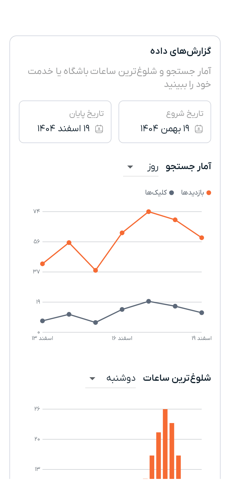

# گزارش‌های داده

اگر باشگاهی را اداره می‌کنید یا خدمتی می‌فروشید، دمبل می‌شمارد که چند بار پیدا و چند بار باز شده و مردم در چه ساعت‌هایی دنبالش بوده‌اند. این آمار در بخش «گزارش‌های داده»، پایین فرم همان باشگاه یا خدمت است.

---

## کجا پیدایش کنید

| برای | کجا |
|---|---|
| **یک باشگاه** | از «باشگاه‌های من» باشگاه را برای ویرایش باز کنید و تا «گزارش‌های داده» در انتهای فرم پایین بروید |
| **یک خدمت** | از «خدمات من» خدمت را برای ویرایش باز کنید و تا «گزارش‌های داده» پایین بروید |

این بخش تنها وقتی وجود دارد که باشگاه یا خدمت ساخته شده باشد؛ پیش از ذخیره چیزی برای شمردن نیست.

---

## چه کسی آن را می‌بیند

- **مالک باشگاه**، همیشه.
- **مدیر باشگاه**، اگر مالک دسترسی گزارش‌ها را به او داده باشد و تا زمانی که اشتراک ویژهٔ مالک فعال است. [باشگاه‌ها](gyms.md) را ببینید.
- **مربی‌ای که خدمت را منتشر کرده**، برای همان خدمت.

هیچ‌کس دیگر، و نسخهٔ عمومی یا اشتراکی از این آمار وجود ندارد.

---

## آمار جستجو

«تاریخ شروع» و «تاریخ پایان» را انتخاب کنید و سپس تعیین کنید نتیجه بر پایهٔ **روز**، **هفته** یا **ماه** گروه‌بندی شود. نمودار دو خط را در آن بازه رسم می‌کند:

| خط | چه چیزی را می‌شمارد |
|---|---|
| **بازدیدها** | دفعاتی که باشگاه یا خدمت شما در نتایج جستجوی کسی آمده است |
| **کلیک‌ها** | دفعاتی که کسی آن را از میان همان نتایج باز کرده است |

این دو کنار هم دو چیز متفاوت می‌گویند: بازدید دربارهٔ دیده‌شدن است و کلیک دربارهٔ این‌که آگهی کارش را انجام می‌دهد یا نه. بازدید زیاد و کلیک کم معمولاً یعنی مشکل از تصویرها، نام یا قیمت است، نه از دسترسی.

زیر نمودار، همان عددها به شکل فهرست هم آمده‌اند تا رقم دقیق را بخوانید و از روی خط حدس نزنید.

---

## شلوغ‌ترین ساعات

یک **روز هفته** را انتخاب کنید تا نمودار میله‌ای نشان دهد مردم در چه ساعت‌هایی از آن روز جستجو کرده‌اند. این نزدیک‌ترین تصویری است که دمبل از تقاضا دارد و برای تنظیم ساعات کاری، نیروی پذیرش یا انتخاب زمان خرید تقویت به کار می‌آید.

---

## چه چیزی را نشان نمی‌دهد

- **چه کسی** جستجو یا کلیک کرده است. اینجا هیچ چیزی دربارهٔ افراد نیست.
- **حضور مشترکان شما.** این آمارِ جستجوست، نه حضور. ثبت حضور روی خودِ اشتراک است.
- **پول.** درآمد شما در [کیف پول](wallet.md) است.

اگر در بازهٔ انتخابی هیچ فعالیتی نباشد، همین را می‌گوید و نمودار خالی نمی‌کشد.

---

> **بعدی:** [اشتراک ویژه، تقویت و پول](monetization.md) یا [باشگاه‌ها](gyms.md)

---

[→ قبلی: گزارش](reporting.md) | [بعدی: اشتراک ویژه، تقویت و پول ←](monetization.md)
