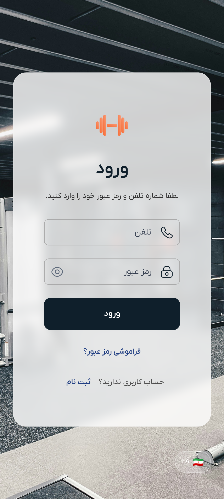
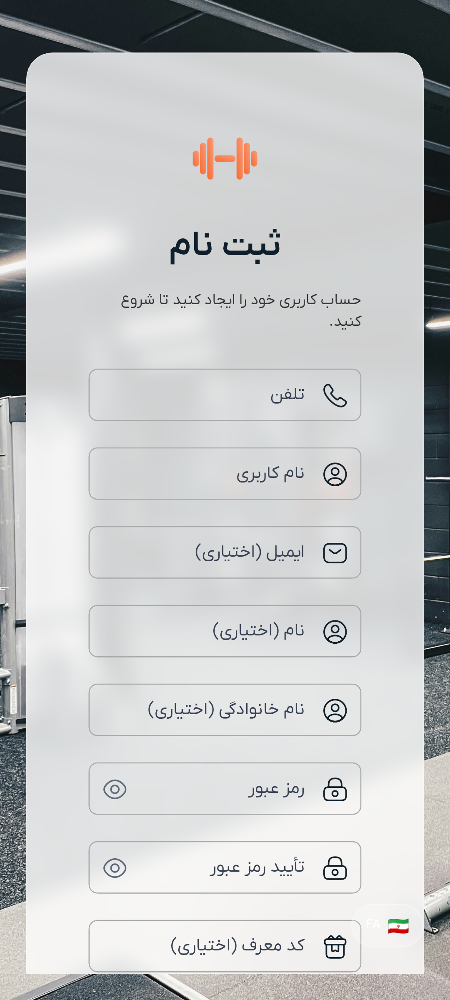

# راهنمای احراز هویت

به سیستم احراز هویت دمبل خوش آمدید. این راهنما شما را گام به گام با فرآیند ورود و ایجاد حساب کاربری جدید در اپلیکیشن دمبل آشنا می‌کند.

## نمای کلی

دمبل از سیستم احراز هویت مبتنی بر شماره تلفن استفاده می‌کند که شما می‌توانید با شماره تلفن خود حساب کاربری ایجاد کرده و به همه ویژگی‌های برنامه دسترسی پیدا کنید. احراز هویت ایمن است و اطلاعات شما محافظت می‌شود.

## نحوه ورود به حساب کاربری

### مرحله ۱: دسترسی به صفحه ورود

وقتی اپلیکیشن دمبل را برای اولین بار باز می‌کنید یا اگر وارد نشده‌اید، صفحه ورود را خواهید دید.

### مرحله ۲: ورود اطلاعات

صفحه ورود فرم ساده‌ای با تنها دو فیلد اجباری دارد:

۱. **شماره تلفن**: شماره تلفن ثبت‌شده خود را وارد کنید (حداقل ۱۰ رقم)
۲. **رمز عبور**: رمز عبور حساب کاربری خود را وارد کنید (حداقل ۶ کاراکتر)

### مرحله ۳: کلیک روی دکمه ورود

پس از وارد کردن اطلاعات خود، روی دکمه "ورود" کلیک کنید تا وارد حساب کاربری خود شوید.

### مرحله ۴: دسترسی به برنامه اصلی

پس از ورود موفق، به طور خودکار به رابط اصلی برنامه هدایت خواهید شد که می‌توانید از آنجا به همه ویژگی‌ها دسترسی پیدا کنید.

## نحوه ثبت‌نام

### مرحله ۱: دسترسی به صفحه ثبت‌نام

از صفحه ورود، می‌توانید با کلیک روی "ثبت نام" در پایین صفحه، به صفحه ثبت‌نام دسترسی پیدا کنید.

### مرحله ۲: تکمیل فرم ثبت‌نام

فرم ثبت‌نام نیاز به اطلاعات زیر دارد:

#### فیلدهای اجباری:
- **شماره تلفن**: شماره تلفن همراه خود (حداقل ۱۰ رقم)
- **نام کاربری**: نام کاربری یکتا انتخاب کنید (حداقل ۳ کاراکتر)
- **رمز عبور**: رمز عبور امن ایجاد کنید (حداقل ۶ کاراکتر)
- **تأیید رمز عبور**: رمز عبور خود را مجدداً وارد کنید تا مطابقت آن تأیید شود

#### فیلدهای اختیاری:
- **ایمیل**: آدرس ایمیل شما (اختیاری، اما اگر ارائه شود باید فرمت معتبر داشته باشد)
- **نام**: نام کوچک شما (اختیاری)
- **نام خانوادگی**: نام خانوادگی شما (اختیاری)

### مرحله ۳: ارسال ثبت‌نام

پس از تکمیل فرم، روی دکمه "ثبت نام" کلیک کنید تا حساب کاربری خود را ایجاد کنید.

### مرحله ۴: کد تأیید شماره تلفن

پس از ارسال فرم ثبت‌نام، یک کد تأیید از طریق پیامک به شماره تلفنی که ارائه داده‌اید ارسال می‌شود. این کد را وارد کنید تا شماره تلفن خود را تأیید کرده و فرآیند ثبت‌نام را تکمیل کنید.

### مرحله ۵: ورود خودکار

پس از تأیید شماره تلفن و ایجاد موفق حساب کاربری، به طور خودکار وارد شده و به برنامه اصلی هدایت خواهید شد.

## الزامات رمز عبور

- رمز عبور شما باید حداقل ۶ کاراکتر باشد
- رمزی انتخاب کنید که ترکیبی از حروف، اعداد و کاراکترهای خاص باشد برای امنیت بهتر
- رمز عبور خود را در فیلد تأیید دقیقاً وارد کنید

## الزامات شماره تلفن

- شماره تلفن خود را بدون کد کشور وارد کنید
- شماره تلفن باید حداقل ۱۰ رقم باشد
- اطمینان حاصل کنید که شماره تلفن فعال است چون ممکن است برای بازیابی حساب استفاده شود

## رفع مشکلات

### مشکلات ورود

اگر در ورود مشکل دارید:

۱. **بررسی شماره تلفن**: اطمینان حاصل کنید که شماره تلفن صحیح مورد استفاده در ثبت‌نام را وارد می‌کنید
۲. **تأیید رمز عبور**: مطمئن شوید که رمز عبور را صحیح وارد کرده‌اید
۳. **بررسی اتصال اینترنت**: اطمینان حاصل کنید که اتصال اینترنت پایدار دارید
۴. **تلاش مجدد**: در صورت بروز خطای موقت، چند لحظه صبر کرده و دوباره تلاش کنید

### مشکلات ثبت‌نام

اگر در ثبت‌نام مشکل دارید:

۱. **بررسی فیلدهای اجباری**: اطمینان حاصل کنید که همه فیلدهای اجباری پر شده‌اند
۲. **تأیید رمز عبور**: مطمئن شوید که هر دو فیلد رمز عبور دقیقاً مطابقت دارند
۳. **در دسترس بودن نام کاربری**: نام کاربری انتخاب شده ممکن است قبلاً استفاده شده باشد، نام دیگری امتحان کنید
۴. **اتصال اینترنت**: اطمینان حاصل کنید که اتصال اینترنت پایدار دارید

## فراموشی رمز عبور

اگر رمز عبور خود را فراموش کرده‌اید، می‌توانید با استفاده از ویژگی فراموشی رمز عبور آن را بازنشانی کنید:

### مرحله ۱: دسترسی به فراموشی رمز عبور

از صفحه ورود، روی "فراموشی رمز عبور" یا لینک مشابه کلیک کنید.

### مرحله ۲: وارد کردن شماره تلفن

شماره تلفن مرتبط با حساب کاربری خود را وارد کنید.

### مرحله ۳: دریافت کد تأیید

یک کد تأیید از طریق پیامک به شماره تلفن ثبت‌شده شما ارسال می‌شود.

### مرحله ۴: وارد کردن کد تأیید

کد تأییدی که دریافت کرده‌اید را وارد کنید تا هویت شما تأیید شود.

### مرحله ۵: تنظیم رمز عبور جدید

پس از تأیید، می‌توانید رمز عبور جدیدی برای حساب کاربری خود تنظیم کنید. مطمئن شوید که رمز عبور قوی انتخاب کنید که الزامات رمز عبور را برآورده کند.

### مرحله ۶: ورود با رمز عبور جدید

پس از بازنشانی موفق رمز عبور، می‌توانید با استفاده از شماره تلفن و رمز عبور جدید وارد شوید.

## تغییر رمز عبور

می‌توانید در هر زمان از صفحه تنظیمات رمز عبور خود را تغییر دهید:

### دسترسی به تغییر رمز عبور

۱. به بخش پروفایل برنامه بروید
۲. به تنظیمات بروید
۳. گزینه "تغییر رمز عبور" را پیدا کرده و روی آن کلیک کنید

### تغییر رمز عبور

۱. رمز عبور فعلی خود را وارد کنید تا هویت شما تأیید شود
۲. رمز عبور جدید خود را وارد کنید (باید الزامات رمز عبور را برآورده کند)
۳. رمز عبور جدید خود را با وارد کردن مجدد آن تأیید کنید
۴. روی "ذخیره" یا "به‌روزرسانی" کلیک کنید تا تغییر رمز عبور تکمیل شود

پس از تغییر موفق رمز عبور، باید از رمز عبور جدید برای ورودهای آینده استفاده کنید.

## امنیت حساب کاربری

- اطلاعات ورود شما به صورت ایمن ذخیره می‌شوند
- رمز عبور رمزنگاری شده و محافظت می‌شود
- همیشه هنگام استفاده از برنامه در دستگاه‌های اشتراکی، خارج شوید
- اطلاعات حساب کاربری خود را در اختیار دیگران قرار ندهید
- در صورت مشکوک بودن به دسترسی غیرمجاز به حساب کاربری، از ویژگی فراموشی رمز عبور استفاده کنید
