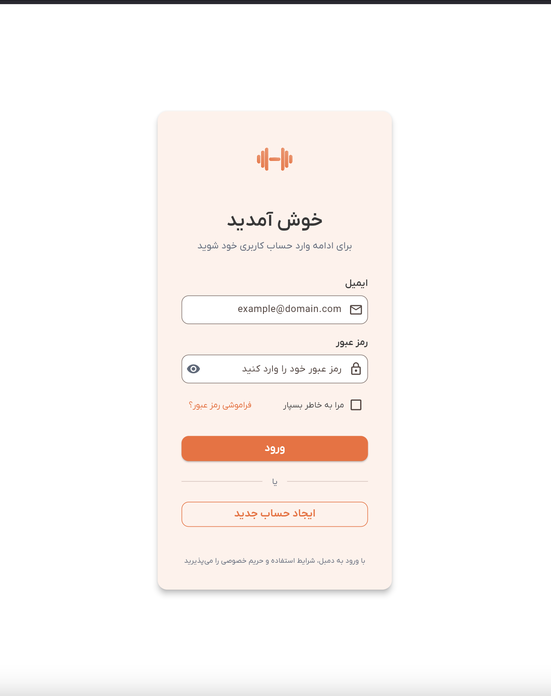
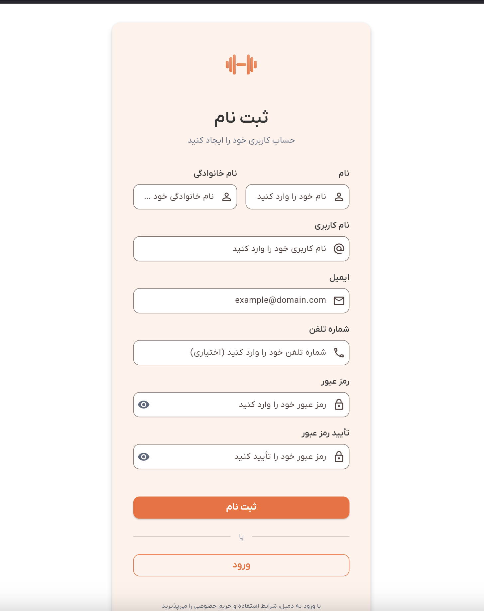

# راهنمای احراز هویت

به دمبل خوش آمدید! این راهنما به شما کمک می‌کند تا با ایجاد حساب کاربری و ورود به اپلیکیشن شروع کنید.

## شروع کار

وقتی برای اولین بار اپلیکیشن دمبل را باز می‌کنید، صفحه ورود را خواهید دید. اینجا می‌توانید به حساب موجود خود وارد شوید یا حساب جدیدی ایجاد کنید.

## ایجاد حساب جدید

اگر تازه‌کار هستید، ابتدا باید حساب کاربری ایجاد کنید. مراحل زیر را دنبال کنید:

### مرحله ۱: دسترسی به صفحه ثبت نام

1. در صفحه ورود، دکمه **"ایجاد حساب جدید"** را در پایین صفحه لمس کنید
2. به صفحه ثبت نام منتقل خواهید شد

### مرحله ۲: تکمیل اطلاعات

فرم ثبت نام شامل فیلدهای زیر است:

- **نام** (اجباری): نام شما
- **نام خانوادگی** (اجباری): نام خانوادگی شما
- **نام کاربری** (اجباری): نام کاربری منحصر به فرد (حداقل ۳ کاراکتر، فقط حروف، اعداد و خط تیره)
- **ایمیل** (اجباری): آدرس ایمیل شما
- **شماره تلفن** (اختیاری): شماره تلفن شما
- **رمز عبور** (اجباری): رمز عبور امن (حداقل ۶ کاراکتر)
- **تأیید رمز عبور** (اجباری): رمز عبور را دوباره وارد کنید

### مرحله ۳: ارسال ثبت نام

1. تمام فیلدهای اجباری را پر کنید
2. مطمئن شوید رمزهای عبور مطابقت دارند
3. دکمه **"ثبت نام"** را لمس کنید
4. منتظر پیام تأیید بمانید
5. به طور خودکار وارد شده و به صفحه اصلی اپلیکیشن منتقل خواهید شد

## ورود به حساب

اگر قبلاً حساب دارید، ورود سریع و آسان است:

### مرحله ۱: وارد کردن اطلاعات

1. اپلیکیشن دمبل را باز کنید
2. **آدرس ایمیل** خود را در فیلد ایمیل وارد کنید
3. **رمز عبور** خود را در فیلد رمز عبور وارد کنید

### مرحله ۲: انتخاب تنظیمات

- **مرا به خاطر بسپار**: اگر می‌خواهید مدت بیشتری وارد بمانید، این گزینه را انتخاب کنید (بدون انتخاب این گزینه، حداکثر ۱ ساعت)
- **فراموشی رمز عبور؟**: اگر نیاز به بازنشانی رمز عبور دارید، این گزینه را لمس کنید (به زودی!)

### مرحله ۳: ورود

1. دکمه **"ورود"** را لمس کنید
2. منتظر تأیید اطلاعات توسط اپلیکیشن بمانید
3. به داشبورد اصلی منتقل خواهید شد

## انتخاب زبان

می‌توانید زبان اپلیکیشن را در هر زمان تغییر دهید:

1. انتخابگر زبان را در گوشه بالا راست پیدا کنید (نمایش "EN" یا "FA")
2. روی آن لمس کنید تا منوی زبان باز شود
3. بین گزینه‌های زیر انتخاب کنید:
   - **🇺🇸 English**
   - **🇮🇷 فارسی**

تغییر زبان بلافاصله اعمال می‌شود و برای جلسات آینده ذخیره می‌شود.

## عیب‌یابی

### مشکلات رایج

**"ایمیل قبلاً استفاده شده است"**
- این یعنی کسی قبلاً با این ایمیل ثبت نام کرده
- به جای آن وارد شوید، یا از ایمیل دیگری استفاده کنید

**"نام کاربری فقط می‌تواند شامل حروف، اعداد و خط تیره باشد"**
- مطمئن شوید نام کاربری شما فاصله یا کاراکترهای خاص ندارد
- فقط از حروف (a-z, A-Z)، اعداد (0-9) و خط تیره (_) استفاده کنید

**"رمزهای عبور مطابقت ندارند"**
- مطمئن شوید هر دو فیلد رمز عبور دقیقاً یکسان هستند
- فاصله‌های اضافی یا اشتباهات تایپی را بررسی کنید

**"رمز عبور باید حداقل ۶ کاراکتر باشد"**
- رمز عبور شما باید حداقل ۶ کاراکتر باشد
- برای امنیت بهتر، ترکیبی از حروف، اعداد و نمادها استفاده کنید

### مشکلات شبکه

اگر در اتصال مشکل دارید:

1. اتصال اینترنت خود را بررسی کنید
2. مطمئن شوید در شبکه محدود شده نیستید
3. چند لحظه بعد دوباره تلاش کنید
4. اگر مشکل ادامه داشت، با پشتیبانی تماس بگیرید

## نکات امنیتی

- از رمز عبور قوی و منحصر به فرد استفاده کنید
- اطلاعات ورود خود را با دیگران به اشتراک نگذارید
- از دستگاه‌های مشترک خارج شوید
- اپلیکیشن را به آخرین نسخه به‌روزرسانی کنید

## نیاز به کمک؟

اگر هنوز با احراز هویت مشکل دارید:

1. بخش عیب‌یابی بالا را بررسی کنید
2. مطمئن شوید از آخرین نسخه اپلیکیشن استفاده می‌کنید
3. با تیم پشتیبانی ما تماس بگیرید

---

*آخرین به‌روزرسانی: [تاریخ فعلی]*
