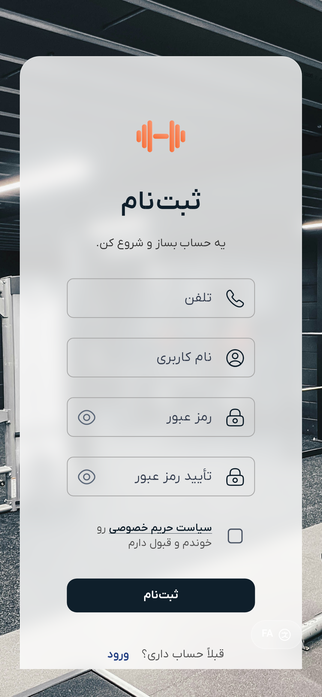
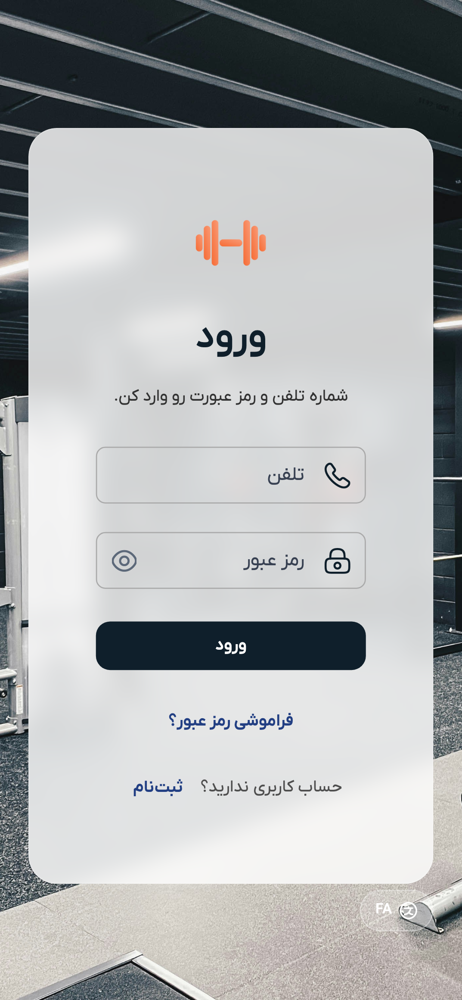
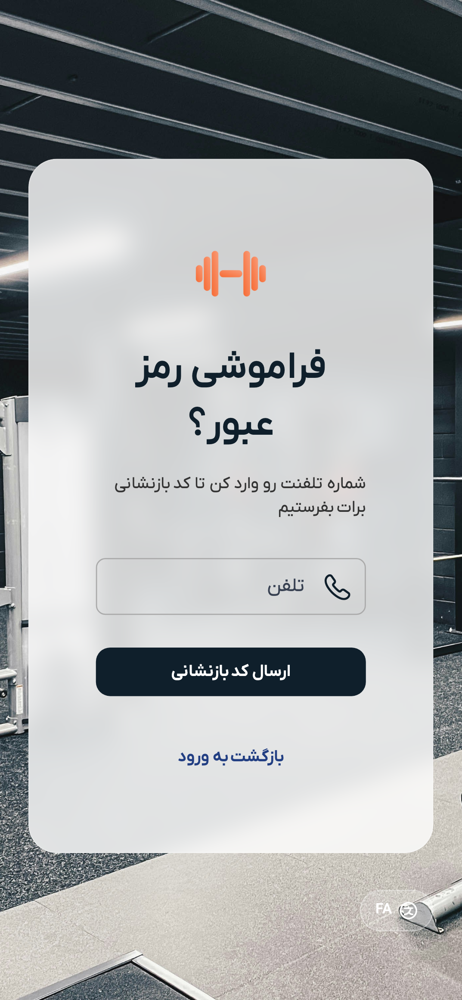
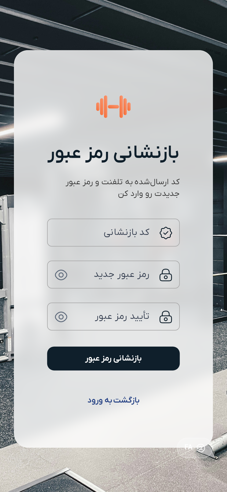

# ورود و ثبت‌نام

همه چیز از یک حساب شروع می‌شه. اینجا توضیح می‌دیم چطور ثبت‌نام کنید، وارد بشید و رمزتون رو بازیابی کنید.

---

## ساخت حساب کاربری

روی **ثبت‌نام** در صفحه خوش‌آمد ضربه بزنید و موارد زیر را پر کنید:

| فیلد | شرط |
|---|---|
| شماره موبایل | حداقل ۱۰ رقم — برای تأیید هویت استفاده می‌شود |
| نام کاربری | حداقل ۳ کاراکتر، باید یکتا باشد |
| رمز عبور | حداقل ۸ کاراکتر |
| ایمیل | اختیاری، اما برای پشتیبانی مفید است |
| نام کامل | اختیاری |
| کد معرف | اختیاری — اگر دوستی شما را دعوت کرده |

بعد از ارسال فرم، یک **کد ۶ رقمی** پیامک می‌شود. کد را وارد کنید تا شماره‌تان تأیید و حساب فعال شود.

---

## ورود به حساب

**شماره موبایل** و **رمز عبور** را وارد کنید و روی **ورود** ضربه بزنید.

---

## فراموشی رمز عبور

۱. روی **فراموشی رمز عبور** در صفحه ورود ضربه بزنید
۲. شماره موبایل ثبت‌شده خود را وارد کنید
۳. کد ۶ رقمی ارسال‌شده را وارد کنید
۴. رمز عبور جدید را تنظیم کنید

رمز بلافاصله تغییر می‌کند — می‌توانید فوری با رمز جدید وارد شوید.

---

## خروج از حساب

به **پروفایل → تنظیمات** بروید و روی **خروج** در پایین صفحه ضربه بزنید.

---

> **بعدی:** [پروفایل خود را تکمیل کنید](profile.md) یا [داشبورد را کاوش کنید](dashboard.md)
