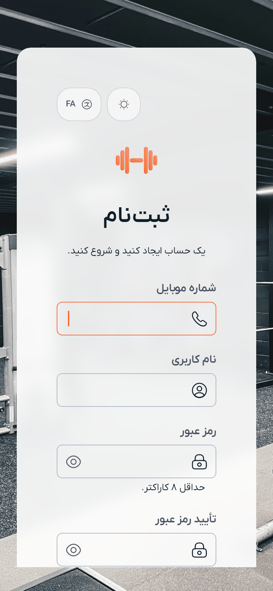
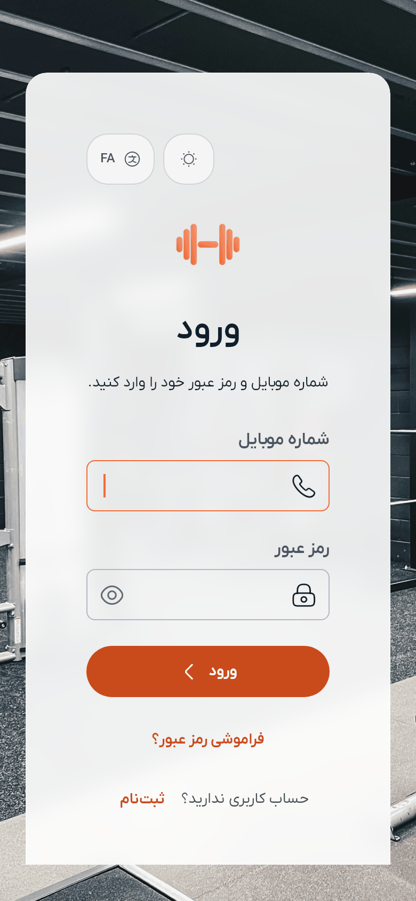
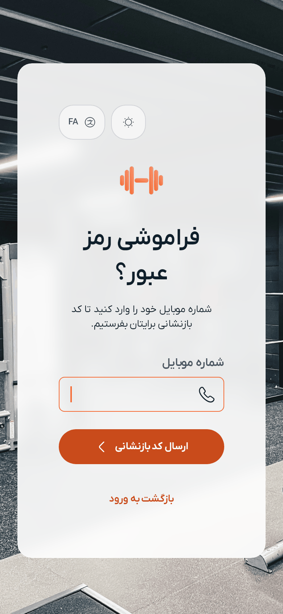
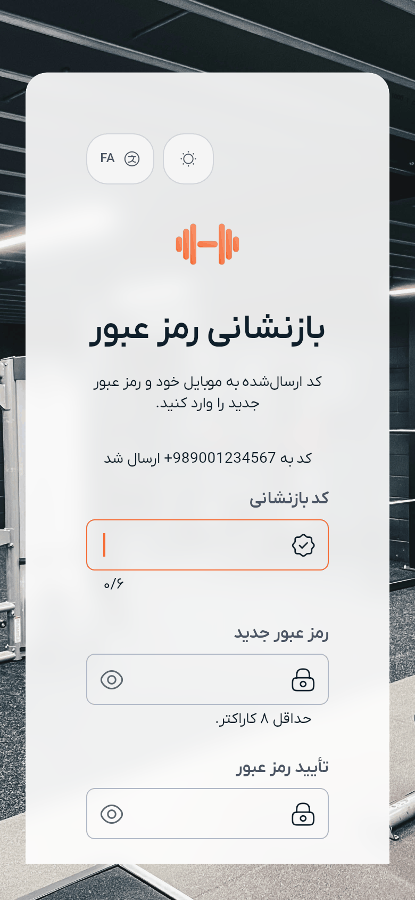

# ورود و ثبت‌نام

همه چیز از یک حساب کاربری آغاز می‌شود. اینجا می‌گوییم چگونه حساب بسازید، وارد شوید و اگر رمز عبور را فراموش کردید آن را بازیابی کنید.

---

## ایجاد حساب کاربری

در صفحهٔ خوش‌آمد «ثبت‌نام» را بزنید و این‌ها را پر کنید:

| فیلد | شرط |
|---|---|
| شماره موبایل | دست‌کم ۱۰ رقم — برای تأیید هویت به کار می‌رود |
| نام کاربری | دست‌کم ۳ کاراکتر و یکتا |
| رمز عبور | دست‌کم ۸ کاراکتر |

پیش از ادامه، کادر کنار «سیاست حریم خصوصی را خوانده‌ام و می‌پذیرم» را علامت بزنید — زدن روی خود جمله هم کادر را علامت می‌زند، و زدن روی «سیاست حریم خصوصی» متن آن را در برگه‌ای روی همین فرم باز می‌کند، پس برای خواندنش ثبت‌نام نیمه‌تمام خود را رها نمی‌کنید.

پس از زدن «ثبت‌نام»، فرم جای خود را به یک صفحهٔ تأیید می‌دهد. یک **کد ۶ رقمی** به شمارهٔ موبایل شما پیامک می‌شود؛ آن را وارد کنید و «تأیید و ثبت نام» را بزنید تا حساب فعال شود.

اگر کد نرسید، پس از پایان یک دقیقه انتظار «ارسال مجدد کد» را بزنید.

> **با دعوت یک دوست آمده‌اید؟** اگر کسی لینک معرف خود را برای شما فرستاده باشد، با باز کردن آن مستقیم به صفحهٔ ثبت‌نام می‌روید و کد معرف از پیش پر شده است؛ چیزی برای تایپ نیست.

---

## ورود به حساب

شمارهٔ موبایل و رمز عبور را وارد کنید و «ورود» را بزنید.

---

## فراموشی رمز عبور

۱. در صفحهٔ ورود «فراموشی رمز عبور؟» را بزنید
۲. شمارهٔ موبایل ثبت‌شدهٔ خود را وارد کنید
۳. کد ۶ رقمی پیامک‌شده را وارد کنید
۴. رمز عبور تازه را تعیین کنید

رمز عبور بی‌درنگ تغییر می‌کند و می‌توانید همان لحظه با رمز تازه وارد شوید.

---

## خروج از حساب

تصویر خود را در نوار بالا بزنید و «خروج از حساب» را انتخاب کنید. این گزینه در همان منوست و نه در تنظیمات، تا هنگام تغییر یک تنظیم به‌اشتباه به آن نخورید.

اگر می‌خواهید دستگاه دیگری را از حساب خارج کنید و نه همین یکی را، [نشست‌های ورود](login-sessions.md) را ببینید.

---

## بازگشت به همان‌جا که بودید

اگر در حالی که وارد نشده بودید پیوندی به یک باشگاه، برنامه یا خدمت را باز کرده باشید، دمبل نخست شما را به صفحهٔ ورود می‌برد و بعد همان چیزی را که دنبالش بودید باز می‌کند؛ لازم نیست دوباره پیدایش کنید.

هنگام پایان اعتبار نشست هم همین است: به صفحهٔ ورود برمی‌گردید و پس از ورود، به همان صفحه‌ای که می‌خواندید بازگردانده می‌شوید.

---

> **بعدی:** [پروفایل خود را تکمیل کنید](profile.md) یا [داشبورد را ببینید](dashboard.md)

---

[→ قبلی: دمبل چیست؟](getting-started.md) | [بعدی: پروفایل ←](profile.md)
