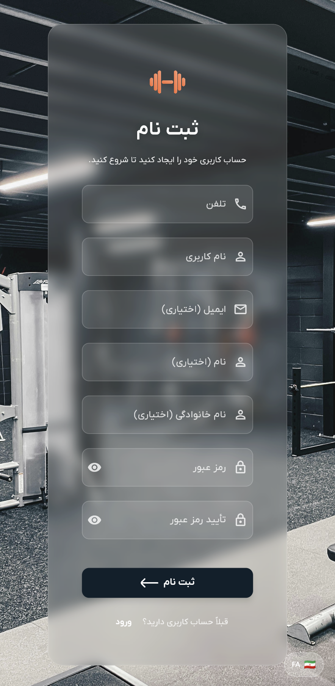

# راهنمای احراز هویت

به سیستم احراز هویت دمبل خوش آمدید. این راهنما شما را گام به گام با فرآیند ورود و ایجاد حساب کاربری جدید در اپلیکیشن دمبل آشنا می‌کند.

## نمای کلی

دمبل از سیستم احراز هویت مبتنی بر شماره تلفن استفاده می‌کند که شما می‌توانید با شماره تلفن خود حساب کاربری ایجاد کرده و به همه ویژگی‌های برنامه دسترسی پیدا کنید. احراز هویت ایمن است و اطلاعات شما محافظت می‌شود.

## نحوه ورود به حساب کاربری

### مرحله ۱: دسترسی به صفحه ورود

وقتی اپلیکیشن دمبل را برای اولین بار باز می‌کنید یا اگر وارد نشده‌اید، صفحه ورود را خواهید دید.

### مرحله ۲: ورود اطلاعات

صفحه ورود فرم ساده‌ای با تنها دو فیلد اجباری دارد:

۱. **شماره تلفن**: شماره تلفن ثبت‌شده خود را وارد کنید (حداقل ۱۰ رقم)
۲. **رمز عبور**: رمز عبور حساب کاربری خود را وارد کنید (حداقل ۶ کاراکتر)

### مرحله ۳: کلیک روی دکمه ورود

پس از وارد کردن اطلاعات خود، روی دکمه "ورود" کلیک کنید تا وارد حساب کاربری خود شوید.

### مرحله ۴: دسترسی به برنامه اصلی

پس از ورود موفق، به طور خودکار به رابط اصلی برنامه هدایت خواهید شد که می‌توانید از آنجا به همه ویژگی‌ها دسترسی پیدا کنید.

## نحوه ثبت‌نام

### مرحله ۱: دسترسی به صفحه ثبت‌نام

از صفحه ورود، می‌توانید با کلیک روی "ثبت نام" در پایین صفحه، به صفحه ثبت‌نام دسترسی پیدا کنید.

### مرحله ۲: تکمیل فرم ثبت‌نام

فرم ثبت‌نام نیاز به اطلاعات زیر دارد:

#### فیلدهای اجباری:
- **شماره تلفن**: شماره تلفن همراه خود (حداقل ۱۰ رقم)
- **نام کاربری**: نام کاربری یکتا انتخاب کنید (حداقل ۳ کاراکتر)
- **رمز عبور**: رمز عبور امن ایجاد کنید (حداقل ۶ کاراکتر)
- **تأیید رمز عبور**: رمز عبور خود را مجدداً وارد کنید تا مطابقت آن تأیید شود

#### فیلدهای اختیاری:
- **ایمیل**: آدرس ایمیل شما (اختیاری، اما اگر ارائه شود باید فرمت معتبر داشته باشد)
- **نام**: نام کوچک شما (اختیاری)
- **نام خانوادگی**: نام خانوادگی شما (اختیاری)

### مرحله ۳: ارسال ثبت‌نام

پس از تکمیل فرم، روی دکمه "ثبت نام" کلیک کنید تا حساب کاربری خود را ایجاد کنید.

### مرحله ۴: ورود خودکار

پس از ایجاد موفق حساب کاربری، به طور خودکار وارد شده و به برنامه اصلی هدایت خواهید شد.

## الزامات رمز عبور

- رمز عبور شما باید حداقل ۶ کاراکتر باشد
- رمزی انتخاب کنید که ترکیبی از حروف، اعداد و کاراکترهای خاص باشد برای امنیت بهتر
- رمز عبور خود را در فیلد تأیید دقیقاً وارد کنید

## الزامات شماره تلفن

- شماره تلفن خود را بدون کد کشور وارد کنید
- شماره تلفن باید حداقل ۱۰ رقم باشد
- اطمینان حاصل کنید که شماره تلفن فعال است چون ممکن است برای بازیابی حساب استفاده شود

## رفع مشکلات

### مشکلات ورود

اگر در ورود مشکل دارید:

۱. **بررسی شماره تلفن**: اطمینان حاصل کنید که شماره تلفن صحیح مورد استفاده در ثبت‌نام را وارد می‌کنید
۲. **تأیید رمز عبور**: مطمئن شوید که رمز عبور را صحیح وارد کرده‌اید
۳. **بررسی اتصال اینترنت**: اطمینان حاصل کنید که اتصال اینترنت پایدار دارید
۴. **تلاش مجدد**: در صورت بروز خطای موقت، چند لحظه صبر کرده و دوباره تلاش کنید

### مشکلات ثبت‌نام

اگر در ثبت‌نام مشکل دارید:

۱. **بررسی فیلدهای اجباری**: اطمینان حاصل کنید که همه فیلدهای اجباری پر شده‌اند
۲. **تأیید رمز عبور**: مطمئن شوید که هر دو فیلد رمز عبور دقیقاً مطابقت دارند
۳. **در دسترس بودن نام کاربری**: نام کاربری انتخاب شده ممکن است قبلاً استفاده شده باشد، نام دیگری امتحان کنید
۴. **اتصال اینترنت**: اطمینان حاصل کنید که اتصال اینترنت پایدار دارید

## امنیت حساب کاربری

- اطلاعات ورود شما به صورت ایمن ذخیره می‌شوند
- رمز عبور رمزنگاری شده و محافظت می‌شود
- همیشه هنگام استفاده از برنامه در دستگاه‌های اشتراکی، خارج شوید
- اطلاعات حساب کاربری خود را در اختیار دیگران قرار ندهید
