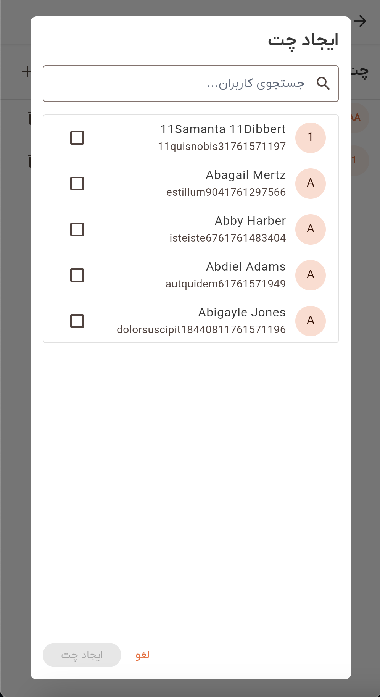
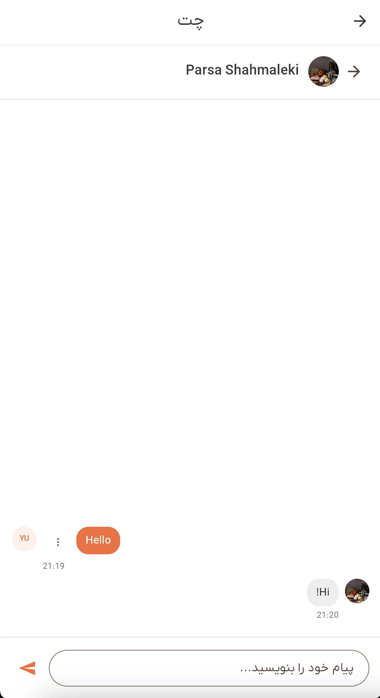

# راهنمای چت

به ویژگی چت در دمبل خوش آمدید. این راهنما به شما کمک می‌کند تا نحوه ارتباط با سایر کاربران از طریق پیام‌های مستقیم و چت‌های گروهی، مدیریت گفتگوهای خود و استفاده مؤثر از تمام ویژگی‌های چت را بیاموزید.

## نمای کلی

سیستم چت دمبل به شما امکان می‌دهد با سایر کاربران در برنامه از طریق پیام‌های متنی ارتباط برقرار کنید. می‌توانید گفتگوهای یک به یک (چت‌های مستقیم) یا گفتگوهای گروهی با چندین شرکت‌کننده داشته باشید. سیستم چت از پیام‌رسانی بلادرنگ، ویرایش پیام و مدیریت گفتگو پشتیبانی می‌کند.

ویژگی‌های کلیدی:
- **چت‌های مستقیم**: گفتگوهای خصوصی بین دو کاربر
- **چت‌های گروهی**: گفتگوها با چندین شرکت‌کننده (۳ کاربر یا بیشتر)
- **پیام‌رسانی بلادرنگ**: پیام‌ها به محض ارسال فوراً ظاهر می‌شوند
- **مدیریت پیام**: پیام‌های خود را ویرایش یا حذف کنید
- **شمارش خوانده نشده**: پیگیری پیام‌های خوانده نشده برای هر چت
- **مدیریت چت**: ایجاد، به‌روزرسانی و حذف چت‌ها
- **تاریخچه پیام**: در تاریخچه گفتگو با صفحه‌بندی پیمایش کنید

## دسترسی به چت

### مرحله ۱: رفتن به چت

می‌توانید از ناوبری اصلی به ویژگی چت دسترسی پیدا کنید:

۱. به دنبال **آیکون چت** (💬) در نوار برنامه در بالای صفحه بگردید
۲. این آیکون در کنار سایر آیکون‌های ناوبری ظاهر می‌شود
۳. روی آیکون چت ضربه بزنید تا صفحه چت باز شود

### مرحله ۲: مشاهده صفحه چت

وقتی چت را باز می‌کنید، موارد زیر را خواهید دید:

- **موبایل**: لیستی از چت‌های شما. روی هر چت ضربه بزنید تا پیام‌ها را مشاهده کنید.
- **دسکتاپ**: نمای تقسیم شده با لیست چت در سمت چپ و پیام‌ها در سمت راست.

*صفحه چت که لیست گفتگوها را در موبایل و نمای تقسیم شده را در دسکتاپ نشان می‌دهد*

## لیست چت

لیست چت تمام گفتگوهای شما را نمایش می‌دهد که با آخرین فعالیت در بالا سازماندهی شده‌اند.

### ویژگی‌های لیست چت

هر چت در لیست موارد زیر را نشان می‌دهد:

- **آواتار**: عکس پروفایل یا حروف اول کاربر(های) دیگر
- **عنوان چت**: 
  - برای چت‌های مستقیم: نام نمایشی کاربر دیگر
  - برای چت‌های گروهی: نام‌های شرکت‌کنندگان (مثلاً "جان و ۲ نفر دیگر")
- **پیش‌نمایش آخرین پیام**: بخشی از آخرین پیام
- **نشان خوانده نشده**: نشان شماره‌دار که تعداد پیام‌های خوانده نشده را نشان می‌دهد (در صورت وجود)
- **دکمه حذف**: گزینه حذف چت (در صورت داشتن مجوز)

### حالت خالی

اگر هنوز چتی ندارید، موارد زیر را خواهید دید:

- یک پیام: "هنوز چتی وجود ندارد"
- دکمه‌ای برای ایجاد اولین چت شما (در صورت داشتن مجوز)

### صفحه‌بندی

اگر چت‌های زیادی دارید:

- به پایین پیمایش کنید تا چت‌های بیشتر بارگذاری شوند
- چت‌های قدیمی‌تر به طور خودکار در انتها بارگذاری می‌شوند
- یک نشانگر بارگذاری در حین واکشی چت‌های بیشتر ظاهر می‌شود

## ایجاد یک چت جدید

### مرحله ۱: باز کردن دیالوگ ایجاد

برای شروع یک گفتگوی جدید:

۱. روی آیکون **+ (پلاس)** در هدر لیست چت ضربه بزنید
۲. یک دیالوگ با رابط انتخاب کاربر باز می‌شود

*دیالوگ ایجاد چت که رابط انتخاب کاربر را نشان می‌دهد*

### مرحله ۲: انتخاب کاربران

در دیالوگ ایجاد:

۱. **جستجو یا مرور**: از فیلد جستجو برای یافتن کاربران استفاده کنید یا در لیست پیمایش کنید
۲. **انتخاب شرکت‌کنندگان**: روی کاربران ضربه بزنید تا آنها را به چت اضافه کنید
   - می‌توانید چندین کاربر را برای یک چت گروهی انتخاب کنید
   - باید حداقل یک کاربر دیگر را انتخاب کنید (شما به طور خودکار شامل می‌شوید)
۳. **کاربران انتخاب شده**: کاربران انتخاب شده به صورت برجسته ظاهر می‌شوند
۴. **کاربر فعلی**: پروفایل خود شما از قبل انتخاب شده و قابل حذف نیست

### مرحله ۳: ایجاد چت

۱. پس از انتخاب حداقل یک کاربر دیگر، دکمه **"ایجاد چت"** فعال می‌شود
۲. روی **"ایجاد چت"** ضربه بزنید تا گفتگو ایجاد شود
۳. چت ایجاد شده و به طور خودکار باز می‌شود
۴. یک پیام موفقیت ظاهر می‌شود: "چت ایجاد شد"

**توجه**: اگر سعی کنید یک چت مستقیم (۲ کاربر در کل) با کسی که قبلاً چت مستقیم دارید ایجاد کنید، چت موجود باز می‌شود به جای ایجاد یک نسخه تکراری.

## مشاهده پیام‌ها

### باز کردن یک چت

برای مشاهده پیام‌ها در یک چت:

۱. **موبایل**: روی هر چت در لیست ضربه بزنید
۲. **دسکتاپ**: روی هر چت در نوار کناری چپ کلیک کنید
۳. چت باز می‌شود و تاریخچه پیام‌ها را نشان می‌دهد

### هدر چت

هنگام مشاهده یک چت، هدر موارد زیر را نشان می‌دهد:

- **دکمه بازگشت** (فقط موبایل): بازگشت به لیست چت
- **آواتار چت**: عکس پروفایل یا حروف اول
- **عنوان چت**: نام گفتگو
- **دکمه ویرایش** (فقط چت‌های گروهی): ویرایش شرکت‌کنندگان (اگر شما مالک هستید)

### نمایش پیام

پیام‌ها در نمای گفتگو نمایش داده می‌شوند:

- **پیام‌های شما**: در سمت راست با پس‌زمینه رنگ اصلی ظاهر می‌شوند
- **پیام‌های کاربران دیگر**: در سمت چپ با پس‌زمینه خاکستری ظاهر می‌شوند
- **حباب‌های پیام**: هر پیام در یک حباب گرد است
- **نام فرستنده**: چت‌های گروهی نام فرستنده را بالای پیام نشان می‌دهند
- **آواتارها**: آواتارهای کاربر در کنار پیام‌ها ظاهر می‌شوند
- **زمان‌ها**: زمان زیر هر پیام نشان داده می‌شود
  - امروز: زمان را نشان می‌دهد (مثلاً "۱۴:۳۰")
  - دیروز: "دیروز" را نشان می‌دهد
  - این هفته: نام روز را نشان می‌دهد (مثلاً "دوشنبه")
  - قدیمی‌تر: تاریخ را نشان می‌دهد (مثلاً "۱۵/۰۶")

*یک چت باز شده که گفتگو را با سبک‌های مختلف پیام برای پیام‌های ارسال شده و دریافت شده نشان می‌دهد*

### چت خالی

اگر چتی هنوز پیامی ندارد:

- یک آیکون پیام و متن را خواهید دید: "پیامی وجود ندارد"
- فیلد ورودی آماده اولین پیام شماست

### صفحه‌بندی پیام

برای گفتگوهای طولانی:

- به بالا پیمایش کنید تا پیام‌های قدیمی‌تر بارگذاری شوند
- پیام‌های قدیمی‌تر به طور خودکار وقتی به بالا نزدیک می‌شوید بارگذاری می‌شوند
- یک نشانگر بارگذاری در حین واکشی پیام‌های قدیمی‌تر ظاهر می‌شود

## ارسال پیام

### مرحله ۱: تایپ پیام شما

۱. در فیلد ورودی پیام در پایین چت ضربه بزنید
۲. پیام خود را تایپ کنید
۳. فیلد ورودی از متن چند خطی پشتیبانی می‌کند

### مرحله ۲: ارسال پیام

برای ارسال پیام خود:

۱. **گزینه ۱**: روی دکمه **ارسال** (آیکون هواپیمای کاغذی) ضربه بزنید
۲. **گزینه ۲**: **Enter** را روی صفحه کلید فشار دهید

**چه اتفاقی می‌افتد**:
- پیام شما فوراً ارسال می‌شود
- یک نشانگر بارگذاری روی دکمه ارسال در حین ارسال ظاهر می‌شود
- پیام پس از ارسال در چت ظاهر می‌شود
- لیست چت به‌روزرسانی می‌شود تا پیام شما را به عنوان آخرین پیام نشان دهد
- شمارش خوانده نشده برای سایر شرکت‌کنندگان به‌روزرسانی می‌شود

### وضعیت پیام

در حین ارسال:
- دکمه ارسال یک اسپینر بارگذاری نشان می‌دهد
- فیلد ورودی غیرفعال است
- پیام پس از ارسال موفق در چت ظاهر می‌شود

اگر ارسال ناموفق باشد:
- یک پیام خطا ظاهر می‌شود
- متن پیام شما در فیلد ورودی حفظ می‌شود
- می‌توانید دوباره تلاش کنید

## ویرایش پیام‌ها

می‌توانید پیام‌های خود را پس از ارسال ویرایش کنید.

### مرحله ۱: باز کردن منوی ویرایش

۱. پیام خود را در گفتگو پیدا کنید
۲. روی آیکون منوی **⋮ (سه نقطه)** در کنار پیام خود ضربه بزنید
۳. یک منو با گزینه‌ها ظاهر می‌شود

### مرحله ۲: ویرایش پیام

۱. **"ویرایش"** را از منو انتخاب کنید
۲. یک دیالوگ با محتوای پیام در یک فیلد قابل ویرایش باز می‌شود
۳. متن را در صورت نیاز تغییر دهید
۴. روی **"ذخیره"** ضربه بزنید تا پیام به‌روزرسانی شود
۵. پیام در چت به‌روزرسانی می‌شود
۶. یک پیام موفقیت ظاهر می‌شود: "پیام به‌روزرسانی شد"

**توجه**: فقط شما می‌توانید پیام‌های خود را ویرایش کنید. نمی‌توانید پیام‌های سایر کاربران را ویرایش کنید.

## حذف پیام‌ها

می‌توانید پیام‌های خود را از یک گفتگو حذف کنید.

### مرحله ۱: باز کردن منوی حذف

۱. پیام خود را در گفتگو پیدا کنید
۲. روی آیکون منوی **⋮ (سه نقطه)** در کنار پیام خود ضربه بزنید
۳. یک منو با گزینه‌ها ظاهر می‌شود

### مرحله ۲: حذف پیام

۱. **"حذف"** را از منو انتخاب کنید
۲. یک دیالوگ تأیید ظاهر می‌شود: "آیا مطمئن هستید که می‌خواهید این پیام را حذف کنید؟"
۳. روی **"حذف"** (دکمه قرمز) ضربه بزنید تا تأیید شود
۴. پیام از چت حذف می‌شود
۵. یک پیام موفقیت ظاهر می‌شود: "پیام حذف شد"

**توجه**: 
- فقط شما می‌توانید پیام‌های خود را حذف کنید
- این عمل قابل بازگشت نیست
- حذف یک پیام آن را برای تمام شرکت‌کنندگان حذف می‌کند

## مدیریت چت‌ها

### به‌روزرسانی چت‌های گروهی

اگر شما مالک یک چت گروهی هستید، می‌توانید شرکت‌کنندگان را اضافه یا حذف کنید.

#### مرحله ۱: باز کردن دیالوگ ویرایش

۱. در یک چت گروهی، روی دکمه **ویرایش** (آیکون مداد) در هدر چت ضربه بزنید
۲. یک دیالوگ باز می‌شود که شرکت‌کنندگان فعلی را نشان می‌دهد

#### مرحله ۲: تغییر شرکت‌کنندگان

۱. **افزودن کاربران**: روی کاربران در لیست ضربه بزنید تا آنها را اضافه کنید
۲. **حذف کاربران**: روی کاربران انتخاب شده ضربه بزنید تا آنها را حذف کنید (به جز مالک)
۳. **مالک**: مالک چت قابل حذف نیست (به عنوان غیرفعال نشان داده می‌شود)

#### مرحله ۳: ذخیره تغییرات

۱. روی **"به‌روزرسانی چت"** ضربه بزنید تا تغییرات ذخیره شوند
۲. چت با شرکت‌کنندگان جدید به‌روزرسانی می‌شود
۳. یک پیام موفقیت ظاهر می‌شود: "چت به‌روزرسانی شد"

### حذف چت‌ها

می‌توانید چت‌هایی که در آنها هستید را حذف کنید.

#### مرحله ۱: باز کردن دیالوگ حذف

۱. در لیست چت، روی دکمه **حذف** (آیکون سطل زباله) در کنار هر چت ضربه بزنید
۲. یک دیالوگ تأیید ظاهر می‌شود: "آیا مطمئن هستید که می‌خواهید این چت را حذف کنید؟"

#### مرحله ۲: تأیید حذف

۱. روی **"حذف"** (دکمه قرمز) ضربه بزنید تا تأیید شود
۲. چت از لیست چت شما حذف می‌شود
۳. یک پیام موفقیت ظاهر می‌شود: "چت حذف شد"

**توجه**: 
- این عمل قابل بازگشت نیست
- حذف یک چت آن را برای تمام شرکت‌کنندگان حذف می‌کند
- برای حذف چت‌ها به مجوزهای مناسب نیاز دارید

## چت‌های مستقیم در مقابل چت‌های گروهی

### چت‌های مستقیم

چت‌های مستقیم گفتگوهای بین دقیقاً دو کاربر هستند:

- **عنوان**: نام نمایشی کاربر دیگر را نشان می‌دهد
- **آواتار**: عکس پروفایل کاربر دیگر را نشان می‌دهد
- **ویژگی‌ها**: ویژگی‌های پیام‌رسانی استاندارد
- **بدون ویرایش**: نمی‌توان شرکت‌کنندگان را اضافه/حذف کرد (همیشه ۲ کاربر)

### چت‌های گروهی

چت‌های گروهی شامل سه کاربر یا بیشتر هستند:

- **عنوان**: نام‌های شرکت‌کنندگان را نشان می‌دهد (مثلاً "جان، جین و ۲ نفر دیگر")
- **آواتار**: عکس پروفایل اولین شرکت‌کننده یا حروف اول را نشان می‌دهد
- **ویژگی‌ها**: تمام ویژگی‌های پیام‌رسانی به علاوه مدیریت شرکت‌کنندگان
- **ویرایش شرکت‌کنندگان**: مالک چت می‌تواند شرکت‌کنندگان را اضافه/حذف کند
- **نام‌های فرستنده**: پیام‌ها نشان می‌دهند چه کسی آنها را ارسال کرده است

## به‌روزرسانی‌های بلادرنگ

سیستم چت از به‌روزرسانی‌های بلادرنگ پیام پشتیبانی می‌کند:

- **پیام‌های جدید**: به طور خودکار هنگام دریافت ظاهر می‌شوند
- **ویرایش پیام**: به‌روزرسانی‌ها فوراً وقتی کسی پیامی را ویرایش می‌کند ظاهر می‌شوند
- **حذف پیام**: پیام‌ها فوراً وقتی حذف می‌شوند ناپدید می‌شوند
- **شمارش خوانده نشده**: به طور خودکار با رسیدن پیام‌ها به‌روزرسانی می‌شوند

نیازی به بازخوانی چت برای دیدن پیام‌های جدید نیست - آنها به طور خودکار ظاهر می‌شوند!

## شمارش پیام‌های خوانده نشده

### نشان‌های لیست چت

هر چت در لیست یک نشان شمارش خوانده نشده نشان می‌دهد:

- **نشان شماره**: نشان دایره‌ای با تعداد پیام‌های خوانده نشده
- **رنگ**: پس‌زمینه رنگ اصلی با متن سفید
- **موقعیت**: بالا-راست آیتم چت
- **به‌روزرسانی**: به طور خودکار با خواندن پیام‌ها به‌روزرسانی می‌شود

### نشان نوار برنامه

آیکون چت در نوار برنامه نشان می‌دهد:

- **کل خوانده نشده**: مجموع تمام پیام‌های خوانده نشده در تمام چت‌ها
- **نشان**: روی آیکون چت ظاهر می‌شود
- **به‌روزرسانی**: به طور بلادرنگ با رسیدن پیام‌ها به‌روزرسانی می‌شود

**توجه**: شمارش خوانده نشده برای چت در حال باز در کل شامل نمی‌شود.

## مجوزها

ویژگی‌های چت به مجوزهای خاص نیاز دارند:

### مشاهده چت‌ها
- **مجوز**: `chats.view`
- **نیاز برای**: مشاهده لیست چت شما

### ایجاد چت‌ها
- **مجوز**: `chats.create`
- **نیاز برای**: ایجاد چت‌های جدید

### به‌روزرسانی چت‌ها
- **مجوز**: `chats.update`
- **نیاز برای**: اضافه/حذف شرکت‌کنندگان در چت‌های گروهی (فقط مالک)

### حذف چت‌ها
- **مجوز**: `chats.delete`
- **نیاز برای**: حذف چت‌ها

### مشاهده پیام‌ها
- **مجوز**: `chat_messages.view`
- **نیاز برای**: مشاهده پیام‌ها در چت‌ها

### ارسال پیام
- **مجوز**: `chat_messages.create`
- **نیاز برای**: ارسال پیام

### ویرایش پیام
- **مجوز**: `chat_messages.update`
- **نیاز برای**: ویرایش پیام‌های خود

### حذف پیام
- **مجوز**: `chat_messages.delete`
- **نیاز برای**: حذف پیام‌های خود

اگر مجوز مورد نیاز را ندارید، یک پیام خطا خواهید دید که توضیح می‌دهد چه مجوزی نیاز است.

## رفع مشکلات

### چت‌ها بارگذاری نمی‌شوند

اگر لیست چت شما بارگذاری نمی‌شود:

۱. **بررسی اینترنت**: اطمینان حاصل کنید که اتصال اینترنت پایدار دارید
۲. **بازخوانی**: برای بازخوانی لیست چت به پایین بکشید
۳. **تلاش مجدد**: اگر خطایی ظاهر شد، روی دکمه "تلاش مجدد" ضربه بزنید
۴. **راه‌اندازی مجدد برنامه**: برنامه را ببندید و دوباره باز کنید
۵. **بررسی مجوزها**: تأیید کنید که مجوز `chats.view` دارید

### پیام‌ها ارسال نمی‌شوند

اگر پیام‌های شما ارسال نمی‌شوند:

۱. **بررسی اینترنت**: اطمینان حاصل کنید که اتصال اینترنت پایدار دارید
۲. **صبر**: در حین پردازش یک پیام، چند پیام ارسال نکنید
۳. **تلاش مجدد**: اگر خطایی رخ داد، پیام حفظ می‌شود - دوباره تلاش کنید
۴. **بررسی مجوزها**: تأیید کنید که مجوز `chat_messages.create` دارید
۵. **راه‌اندازی مجدد برنامه**: برنامه را ببندید و دوباره باز کنید

### پیام‌ها ظاهر نمی‌شوند

اگر پیام‌های جدید ظاهر نمی‌شوند:

۱. **بررسی اینترنت**: اطمینان حاصل کنید که اتصال اینترنت پایدار دارید
۲. **پیمایش به پایین**: پیام‌های جدید در پایین ظاهر می‌شوند
۳. **بازخوانی**: چت را ببندید و دوباره باز کنید
۴. **بررسی مجوزها**: تأیید کنید که مجوز `chat_messages.view` دارید

### نمی‌توانم چت ایجاد کنم

اگر نمی‌توانید چت جدید ایجاد کنید:

۱. **بررسی مجوزها**: تأیید کنید که مجوز `chats.create` دارید
۲. **انتخاب کاربران**: اطمینان حاصل کنید که حداقل یک کاربر دیگر را انتخاب کرده‌اید
۳. **تلاش مجدد**: لحظه‌ای صبر کنید و دوباره تلاش کنید
۴. **تماس با پشتیبانی**: اگر مشکل ادامه دارد

### نمی‌توانم پیام را ویرایش/حذف کنم

اگر نمی‌توانید پیام را ویرایش یا حذف کنید:

۱. **بررسی مجوزها**: تأیید کنید که مجوز `chat_messages.update` یا `chat_messages.delete` دارید
۲. **فقط پیام‌های خود**: فقط می‌توانید پیام‌های خود را ویرایش/حذف کنید
۳. **تلاش مجدد**: لحظه‌ای صبر کنید و دوباره تلاش کنید

### نمی‌توانم چت گروهی را به‌روزرسانی کنم

اگر نمی‌توانید چت گروهی را به‌روزرسانی کنید:

۱. **بررسی مالکیت**: فقط مالک چت می‌تواند شرکت‌کنندگان را به‌روزرسانی کند
۲. **بررسی مجوزها**: تأیید کنید که مجوز `chats.update` دارید
۳. **فقط چت‌های گروهی**: این ویژگی فقط برای چت‌های گروهی (۳+ کاربر) کار می‌کند
۴. **تلاش مجدد**: لحظه‌ای صبر کنید و دوباره تلاش کنید

### به‌روزرسانی‌های بلادرنگ کار نمی‌کنند

اگر به‌روزرسانی‌های بلادرنگ کار نمی‌کنند:

۱. **بررسی اینترنت**: اطمینان حاصل کنید که اتصال اینترنت پایدار دارید
۲. **بازخوانی**: چت را ببندید و دوباره باز کنید
۳. **راه‌اندازی مجدد برنامه**: کل برنامه را ببندید و دوباره باز کنید
۴. **بررسی تنظیمات**: تأیید کنید که اعلان‌های برنامه فعال هستند

## حریم خصوصی و داده‌ها

### چه اطلاعاتی به اشتراک گذاشته می‌شود

هنگامی که از چت استفاده می‌کنید:

- **پیام‌های شما**: تمام پیام‌هایی که ارسال می‌کنید ذخیره شده و برای شرکت‌کنندگان چت قابل مشاهده است
- **شرکت‌کنندگان چت**: سایر کاربران در چت می‌توانند تمام پیام‌ها را ببینند
- **اطلاعات پروفایل**: عکس پروفایل و نام نمایشی شما برای شرکت‌کنندگان چت قابل مشاهده است
- **زمان‌ها**: زمان ارسال پیام‌ها ثبت می‌شود

### ذخیره‌سازی داده‌ها

- **ذخیره‌سازی سرور**: تمام چت‌ها و پیام‌ها در سرورهای دمبل ذخیره می‌شوند
- **مرتبط با حساب**: چت‌های شما به حساب شما مرتبط هستند
- **دائمی**: پیام‌ها تا زمانی که حذف شوند باقی می‌مانند
- **امن**: تمام داده‌ها به طور ایمن منتقل شده و رمزگذاری می‌شوند

### بهترین شیوه‌های حریم خصوصی

برای حفظ حریم خصوصی شما:

۱. **هوشیار باشید**: فقط اطلاعاتی را به اشتراک بگذارید که با دیدن آنها توسط دیگران راحت هستید
۲. **قبل از ارسال بررسی کنید**: پیام‌ها را قبل از ارسال دوباره بررسی کنید
۳. **حذف در صورت نیاز**: پیام‌ها یا چت‌هایی که دیگر نیازی به آنها ندارید را حذف کنید
۴. **امنیت حساب**: اطلاعات ورود حساب خود را ایمن نگه دارید
۵. **گزارش مشکلات**: اگر با محتوای نامناسب مواجه شدید با پشتیبانی تماس بگیرید

## بهترین روش‌ها

### سازماندهی گفتگوها

بهترین شیوه‌ها برای مدیریت چت‌های شما:

۱. **استفاده از چت‌های گروهی**: چت‌های گروهی برای بحث‌های تیمی ایجاد کنید
۲. **پیام‌های مستقیم**: از چت‌های مستقیم برای گفتگوهای خصوصی یک به یک استفاده کنید
۳. **عناوین واضح**: عناوین چت گروهی به شناسایی گفتگوها کمک می‌کند
۴. **حذف چت‌های قدیمی**: گفتگوهایی که دیگر نیازی به آنها ندارید را حذف کنید

### ارتباط مؤثر

نکات برای ارتباط بهتر:

۱. **واضح باشید**: پیام‌های واضح و مختصر بنویسید
۲. **ویرایش در صورت نیاز**: از ویژگی ویرایش برای اصلاح اشتباهات استفاده کنید
۳. **احترام به دیگران**: در گفتگوهای گروهی محترم باشید
۴. **بررسی خوانده نشده**: به طور منظم پیام‌های خوانده نشده را بررسی و پاسخ دهید

### مدیریت چت‌های گروهی

برای مالکان چت گروهی:

۱. **افزودن کاربران مرتبط**: فقط کاربرانی را اضافه کنید که نیاز به حضور در گفتگو دارند
۲. **حذف کاربران غیرفعال**: چت‌های گروهی را متمرکز و مرتبط نگه دارید
۳. **ارتباط تغییرات**: به شرکت‌کنندگان اطلاع دهید وقتی کاربران را اضافه/حذف می‌کنید

## دریافت کمک

اگر به کمک بیشتری نیاز دارید:

۱. **دستیار هوش مصنوعی**: از دستیار هوش مصنوعی برای کمک با ویژگی‌های چت درخواست کنید (روی آیکون ربات ضربه بزنید 🤖)
۲. **بررسی راهنماهای دیگر**: مستندات کمک دیگر را در برنامه مرور کنید
۳. **تماس با پشتیبانی**: برای مشکلات فنی با پشتیبانی دمبل تماس بگیرید
۴. **انجمن**: به انجمن دمبل بپیوندید برای نکات و مشاوره کاربران

ویژگی چت طراحی شده است تا ارتباط را آسان و کارآمد کند. در ارتباط برقرار کردن و شروع گفتگو با سایر کاربران در جامعه دمبل تردید نکنید!

