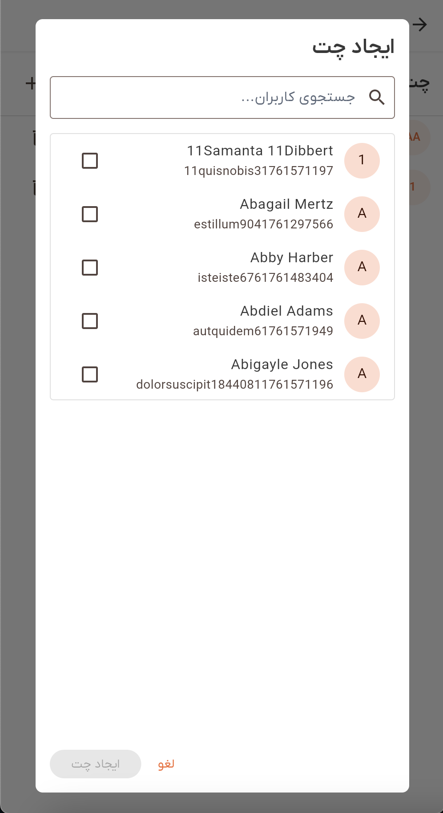
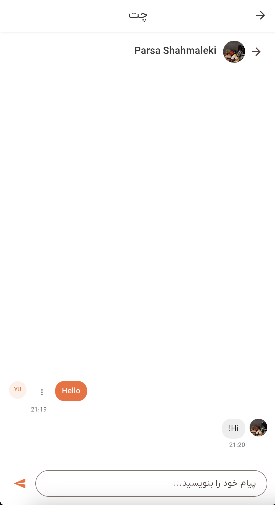

# چت

چت جایی‌ه که با بقیه توی برنامه ارتباط برقرار می‌کنی. چه داری با مربی‌ات پیام می‌دی، چه داری با دوستات برای تمرین هماهنگ می‌کنی، چه توی یه گروه چت کردن، همه‌اش اینجا اتفاق می‌افته.

## رفتن به چت

آیکون چت رو توی نوار بالا بزن. اگه پیام خونده نشده داشته باشی، یه نشون با تعداد پیام‌ها می‌بینی.

## چطور کار می‌کنه

توی موبایل، لیست گفتگوهات رو می‌بینی. هر کدوم رو بزنی باز میشه. توی دسکتاپ، یه نمای تقسیم شده‌ست – چت‌ها سمت چپ، پیام‌ها سمت راست. خیلی ساده‌ست.

هر چت اسم طرف مقابل رو نشون میده (یا اسم‌ها اگه گروهی باشه)، یه پیش‌نمایش از آخرین پیام، و وقتی پیام خونده نشده داری، یه نشون با تعداد. اگه کنار یه چت دکمه حذف دیدی، می‌تونی بزنی و اون گفتگو رو پاک کنی.

## شروع یه چت جدید

دکمه + رو بالای لیست چت‌هات بزن. یه پنجره باز میشه که می‌تونی دنبال آدم‌ها بگردی و انتخاب کنی با کی می‌خوای چت کنی. یه نفر انتخاب کن برای چت مستقیم، یا چند نفر برای چت گروهی. خودت به صورت خودکار اضافه می‌شی، فقط بقیه رو انتخاب کن.

وقتی حداقل یه نفر دیگه رو انتخاب کردی، "ایجاد چت" رو بزن و تموم. چت بلافاصله باز میشه.

اگه بخوای با کسی که قبلاً باهاش چت مستقیم داری دوباره چت بسازی، برنامه همون چت قبلی رو باز می‌کنه به جای اینکه یه چت تکراری بسازه. باهوشه.

## فرستادن پیام

هر چتی رو باز کنی، تاریخچه پیام‌ها رو می‌بینی. پیام‌های خودت سمت چپ با پس‌زمینه رنگی نشون داده میشن، و پیام‌های بقیه سمت راست با پس‌زمینه خاکستری. توی چت‌های گروهی، اسم همه بالای پیام‌هاشون نوشته میشه که بفهمی کی چی گفته.

پیامت رو توی کادر پایین تایپ کن و ارسال رو بزن (یا Enter رو فشار بده). همین. پیام‌ها بلافاصله برای همه توی چت نشون داده میشن به لطف آپدیت‌های لحظه‌ای.

هر پیام یه زمان نشون میده – پیام‌های امروز ساعت رو نشون میدن، دیروز می‌نویسه "دیروز"، این هفته اسم روز رو نشون میده، و قدیمی‌تر تاریخ رو نشون میده.

اگه یه چت هنوز پیامی نداره، یه پیام دوستانه "هنوز پیامی وجود ندارد" می‌بینی. فقط شروع کن به تایپ کردن.

## ویرایش و حذف پیام‌ها

تایپی زدی؟ مشکلی نیست. منوی سه نقطه رو کنار هر کدوم از پیام‌های خودت بزن و "ویرایش" رو انتخاب کن. هر چی نیاز به اصلاح داره رو درست کن و ذخیره کن. پیام برای همه توی چت آپدیت میشه.

می‌خوای یه پیام رو پاک کنی؟ همون کار – سه نقطه رو بزن، "حذف" رو انتخاب کن، تایید کن که مطمئنی، و رفت. این کار پیام رو برای همه پاک می‌کنه، نه فقط برای خودت، پس با احتیاط ازش استفاده کن.

فقط می‌تونی پیام‌های خودت رو ویرایش یا حذف کنی. پیام‌های بقیه دست نخور.

## چت‌های گروهی

چت‌های گروهی دقیقاً مثل چت‌های مستقیم کار می‌کنن، فقط با آدم‌های بیشتر. عنوان چت اسم شرکت‌کننده‌ها رو نشون میده (مثل "علی، سارا و ۲ نفر دیگه"). اسم همه بالای پیام‌هاشون نوشته میشه که بتونی دنبال کنی کی داره چی میگه.

اگه خودت چت گروهی رو ساختی، مالکش هستی. یعنی می‌تونی لیست شرکت‌کننده‌ها رو ویرایش کنی – آدم‌های جدید اضافه کنی یا آدم‌های موجود رو حذف کنی. فقط دکمه ویرایش رو توی هدر چت بزن. مالک نمی‌تونه خودش رو از چت گروهی خودش حذف کنه، واضحه.

## مدیریت چت‌ها

می‌خوای لیست چت‌هات رو تمیز کنی؟ دکمه حذف رو کنار هر چت بزن و تایید کن. این کار چت رو برای همه پاک می‌کنه، نه فقط برای خودت. امکان برگشت نداره، پس مطمئن شو که واقعاً می‌خوای این کار رو بکنی.

برای چت‌های گروهی که مالکشی، هر وقت خواستی می‌تونی عوض کنی چه کسایی توی گفتگو هستن. چت رو باز کن، دکمه ویرایش رو بزن، و لیست شرکت‌کننده‌ها رو تنظیم کن. با زدن روی آدم‌ها اضافه‌شون کن، با زدن دوباره حذف‌شون کن. وقتی تموم شد ذخیره کن.

## آپدیت‌های لحظه‌ای

همه چی زنده اتفاق می‌افته. وقتی یکی پیام میفرسته، بلافاصله نشون داده میشه. یکی پیام رو ویرایش کرد؟ همه فوراً آپدیت رو می‌بینن. یکی چیزی رو پاک کرد؟ بلافاصله برای همه ناپدید میشه. نشون تعداد پیام‌های خونده نشده هم خودکار آپدیت میشه.

نیازی نیست چیزی رو رفرش کنی – همه چی خودش کار می‌کنه.

## پیمایش توی تاریخچه

گفتگوی طولانی داری؟ به بالا اسکرول کن تا پیام‌های قدیمی‌تر لود بشن. وقتی نزدیک بالا می‌رسی خودکار لود میشن. برای لیست چت‌هات هم همینطوره – به پایین اسکرول کن و چت‌های قدیمی‌تر در صورت نیاز لود میشن.

اگه توی یه گفتگوی طولانی هستی و پیام‌های جدید میاد، یه دکمه کوچیک "اسکرول به پایین" نشون داده میشه. بزنش تا به آخرین پیام‌ها بپری.

## وقتی مشکلی پیش میاد

لیست چت لود نمیشه؟ اینترنتت رو چک کن و برای رفرش به پایین بکش. اگه خطا دیدی، معمولاً یه دکمه تلاش مجدد هست.

پیام‌ها ارسال نمیشن؟ مطمئن شو آنلاینی. اگه یه پیام فیل شد، متنت توی کادر ورودی می‌مونه که دوباره امتحان کنی. دکمه ارسال رو اسپم نکن وقتی یکی داره ارسال میشه.

نمی‌تونی چت بسازی یا پیام ویرایش کنی؟ شاید دسترسی لازم رو نداشته باشی. برنامه بهت میگه اگه این مورد باشه.

آپدیت‌های لحظه‌ای عجیب رفتار می‌کنن؟ چت رو ببند و دوباره باز کن، یا برنامه رو ری‌استارت کن. معمولاً درست میشه.

## نکته‌ها

گفتگوهات رو منظم نگه دار با پاک کردن چت‌های قدیمی که دیگه نیازی بهشون نداری. از چت‌های گروهی برای بحث‌های تیمی استفاده کن و چت‌های مستقیم رو برای صحبت‌های یک به یک.

عکس‌های پروفایل کنار پیام‌ها نشون داده میشن – بزنشون تا پروفایل اون شخص رو ببینی. برای چک کردن مدارک یا دستاوردهای کسی مفیده.

دستیار هوش مصنوعی هم می‌تونه با سوالات مربوط به چت کمک کنه. فقط بازش کن (آیکون ربات رو بزن) و بپرس.

تقریباً همین. چت طوری طراحی شده که ساده باشه و از سر راهت کنار بره تا روی گفتگو تمرکز کنی.
