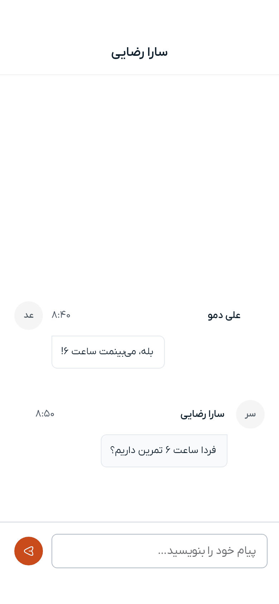

# گفتگو

مستقیم در دمبل با مربی، باشگاه یا هم‌تمرینی‌های خود گفتگو کنید.

---

## آغاز یک گفتگو

گفتگو **نشان حباب در نوار بالاست** و یکی از چهار بخش نیست؛ در همهٔ بخش‌ها هست و وقتی پیام خوانده‌نشده دارید نشانی روی آن می‌آید. با زدنش فهرست گفتگوهای شما باز می‌شود.

دو راه برای شروع هست:

- **از فهرست** — «+» را بزنید، افراد را با نام یا نام کاربری جستجو کنید و انتخابشان کنید. انتخاب یک نفر گفتگوی دونفره می‌سازد و انتخاب چند نفر یک گروه.
- **از خود شخص** — «پیام» در پروفایل یک مربی، روی یک شاگرد، یا کنار خدمتی که خریده‌اید. اگر از پیش با او گفتگویی داشته باشید، همان باز می‌شود و گفتگوی دومی ساخته نمی‌شود.

برای کنار گذاشتن همیشگی یک گفتگو، آن را از فهرست حذف کنید.

---

## پیام مستقیم

گفتگوی دونفره مثل هر پیام‌رسان دیگری کار می‌کند:
- پیام را بنویسید و بی‌درنگ بفرستید
- پیام‌های خودتان را ویرایش یا حذف کنید (روی پیام نگه دارید)
- پیام‌ها صفحه‌به‌صفحه می‌آیند — به بالا بروید تا تاریخچهٔ قدیمی‌تر بیاید
- زمان هر پیام به شکل امروز، دیروز یا تاریخ کامل نوشته می‌شود

---

## گروه‌ها

گروه‌ها به چند نفر اجازه می‌دهند در یک گفتگو حرف بزنند — به کار گروه‌های تمرینی و جمع‌های باشگاهی می‌آید.

- گروه به نام کسانی که در آن هستند شناخته می‌شود، پس نامی برای انتخاب نیست
- اگر حساب شما اجازه داشته باشد، بعداً می‌توانید افراد گفتگو را تغییر دهید
- همهٔ اعضا می‌توانند پیام بفرستند و دریافت کنند

---

## نشان پیام‌های خوانده‌نشده

نشان گفتگو، شمار پیام‌های خوانده‌نشده را روی خود دارد و با باز کردن گفتگوها پاک می‌شود.

---

## رسیدن بی‌درنگ

پیام‌ها همان‌طور که فرستاده می‌شوند می‌رسند؛ چیزی برای تازه‌کردن نیست.

## فهرست و گفتگو

فهرست گفتگوها و یک گفتگو دو صفحهٔ جدا با نشانی خودشان‌اند، پس پیوند یک گفتگو همان گفتگو را باز می‌کند و بازگشت از یک گفتگو شما را به فهرست می‌برد و نه بیرون از گفتگو. روی صفحهٔ پهن، این دو کنار هم می‌نشینند.

---

> **بعدی:** [اعلان‌ها را تنظیم کنید](notifications.md) یا [مربی پیدا کنید](trainers.md)

---

[→ قبلی: دستیار هوشمند](ai-assistant.md) | [بعدی: اعلان‌ها ←](notifications.md)
