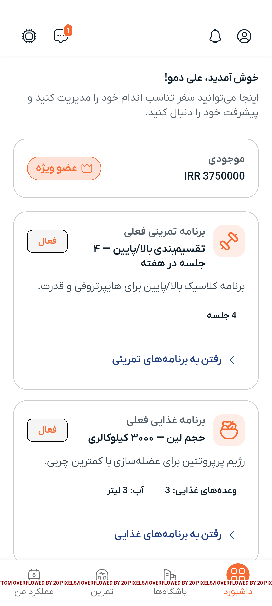

# داشبورد

داشبورد خانه اصلی شماست — یک نگاه کلی به همه اتفاقات روز.

---

## محتوای داشبورد

### کارت‌های ثبت سریع روزانه

شش کارت رنگی به شما اجازه می‌دهند بدون رفتن به جای دیگری، فعالیت‌های روزانه را ثبت کنید:

| کارت | چه ثبت می‌کند |
|---|---|
| **خواب** | مدت و یادداشت |
| **وزن** | وزن بدن به کیلوگرم |
| **تمرین** | جلسه تمرینی فعال |
| **وعده‌ها** | مصرف غذا با ماکروها |
| **مکمل‌ها** | مکمل‌های مصرف‌شده |
| **آب** | تعداد لیوان |

روی هر کارت ضربه بزنید تا فرم ثبت سریع باز شود. اطلاعات به تاریخچه ردیاب شما ذخیره می‌شود.

### پلن فعال

اگر برنامه تمرینی یا غذایی فعالی دارید، اینجا نمایش داده می‌شود — با میانبر برای باز کردن پلن کامل.

### موجودی کیف پول

موجودی فعلی در بالای صفحه نمایش داده می‌شود. برای رفتن به [کیف پول](wallet.md) روی آن ضربه بزنید.

### وضعیت اشتراک باشگاه

اگر اشتراک فعال باشگاهی دارید، نام باشگاه و تاریخ انقضا نمایش داده می‌شود.

---

## عادت روزانه

داشبورد برای یک چک‌این سریع روزانه طراحی شده. آن را باز کنید، روی کارت‌های مربوط ضربه بزنید تا آنچه انجام داده‌اید را ثبت کنید. با گذشت زمان، تاریخچه شما در [ردیاب](tracker.md) شکل می‌گیرد.

---

> **بعدی:** [ردیابی دقیق‌تر را یاد بگیرید](tracker.md) یا [برنامه تمرینی بسازید](workout-plans.md)
