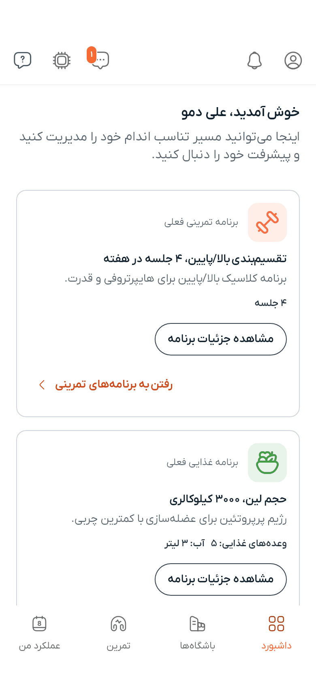
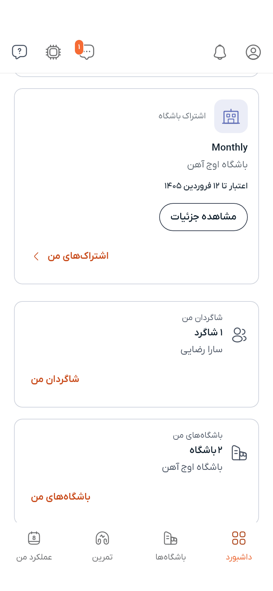

# داشبورد

داشبورد خانه اصلی شماست — جایی که روز از آن شروع می‌شود، و آنچه نشان می‌دهد به این بستگی دارد که شما که هستید.

---

## محتوای داشبورد

### اولین بازدید شما

یک حساب تازه، تنها یک کارت می‌بیند: **از اینجا شروع کنید**، با دو راه ورود — یک مربی پیدا کنید تا برایتان برنامه بنویسد، یا همین حالا از دستیار بخواهید یکی بسازد. به‌محض اینکه چیزی برای نمایش باشد، این کارت کنار می‌رود.

### برنامه‌های فعال

برنامه تمرینی، برنامه غذایی و اشتراک باشگاه فعلی شما، هرکدام یک کارت. هر کارت نام برنامه و چند عدد کلیدی آن را نشان می‌دهد و با **مشاهده جزئیات برنامه** بازش می‌کند؛ پیوند کم‌رنگ‌تر زیر آن به فهرست کامل می‌رود.

اگر هنوز عضو هیچ باشگاهی نیستید، کارت باشگاه به‌جای فهرست خالی، **جستجوی باشگاه‌ها** را پیشنهاد می‌دهد.

### امروز

یک خلاصه یک‌خطی از آنچه امروز ثبت کرده‌اید — آب، وعده‌ها، تمرین‌ها، مکمل‌ها — همراه با **ثبت امروز** که [عملکرد من](tracker.md) را باز می‌کند؛ ثبت آنجا انجام می‌شود. داشبورد گزارش می‌دهد، عملکرد من ثبت می‌کند.

### اشتراک ویژه

وضعیت اشتراک ویژه شما: فعال و تا چه تاریخی، در همین هفته تمام می‌شود، تمام‌شده، یا هرگز شروع‌نشده — همراه با «تمدید اشتراک ویژه» یا «ارتقا به اشتراک ویژه» هرجا که کاربرد داشته باشد. [کیف پول](wallet.md) را ببینید.

### موجودی کیف پول

موجودی فعلی شما در دمبل. برای رفتن به [کیف پول](wallet.md) روی آن بزنید.

### اگر مربی یا مالک باشگاه هستید

کارت‌های دیگری برای آنچه اداره می‌کنید — نه آنچه دنبال می‌کنید — نمایش داده می‌شود:

| کارت | چه نشان می‌دهد |
|---|---|
| **شاگردان من** | چند شاگرد دارید، و تازه‌ترین آن‌ها |
| **باشگاه‌های من** | چند باشگاه دارید، و یکی از آن‌ها |
| **مدرک مربیگری** | اینکه مدرکتان در حال بررسی است یا به تصویر واضح‌تری نیاز دارد — تا تأیید نشود، خدمات شما نمایش داده نمی‌شود |

---

## روی صفحهٔ پهن

با فضای بیشتر، کارت‌ها به‌جای یک ستون بلند در چند ستون چیده می‌شوند و چهار بخش به ستون کناره می‌روند. [دمبل روی رایانه](on-a-computer.md) را ببینید.

---

## عادت روزانه

داشبورد را باز کنید تا شکل روزتان را ببینید، بعد برای ثبت آن به [عملکرد من](tracker.md) بروید. با گذشت زمان، تاریخچه شما شکل می‌گیرد.

---

> **بعدی:** [ثبت دقیق‌تر را یاد بگیرید](tracker.md) یا [برنامه تمرینی بسازید](workout-plans.md)

---

[→ قبلی: نشست‌های ورود](login-sessions.md) | [بعدی: برنامه‌های تمرینی ←](workout-plans.md)
