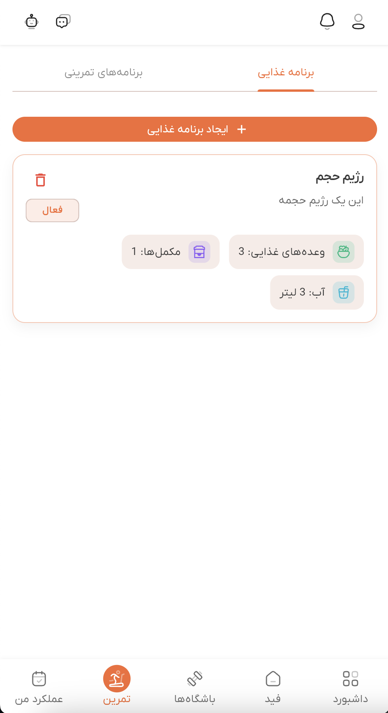
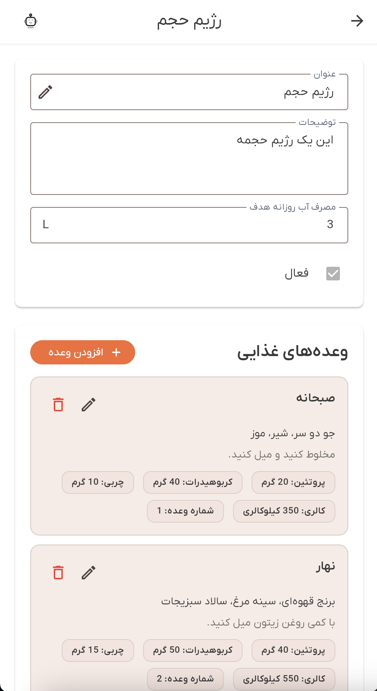

# راهنمای برنامه‌های غذایی

به بخش برنامه‌های غذایی دمبل خوش آمدید. این راهنمای جامع شما را با تمام ویژگی‌های برنامه‌های غذایی آشنا می‌کند، از جمله مشاهده برنامه‌ها، مدیریت وعده‌های غذایی، پیگیری مکمل‌ها و درک اطلاعات تغذیه‌ای.

## نمای کلی

بخش برنامه‌های غذایی به شما امکان ایجاد، مشاهده و مدیریت برنامه‌های تغذیه‌ای شخصی‌سازی شده را می‌دهد. هر برنامه غذایی شامل وعده‌های غذایی با اطلاعات تغذیه‌ای دقیق (پروتئین، کربوهیدرات، چربی، کالری) و مکمل‌های اختیاری است. می‌توانید هدف مصرف روزانه آب را پیگیری کنید و وعده‌های غذایی را بر اساس شاخص وعده غذایی سازماندهی کنید.

برنامه‌های غذایی اهداف مختلفی دارند:
- **برنامه‌ریزی تغذیه‌ای**: ساختاردهی وعده‌های غذایی روزانه با اهداف درشت‌مغذی خاص
- **مدیریت وعده‌های غذایی**: افزودن، ویرایش و سازماندهی وعده‌های غذایی با مواد اولیه و توضیحات
- **پیگیری مکمل‌ها**: شامل مکمل‌ها با مقادیر و زمان‌بندی خاص
- **اهداف آب**: تنظیم و پیگیری اهداف مصرف روزانه آب
- **مدیریت برنامه فعال**: علامت‌گذاری برنامه‌ها به عنوان فعال یا غیرفعال

## دسترسی به برنامه‌های غذایی

می‌توانید از صفحه تمرین به برنامه‌های غذایی دسترسی پیدا کنید:

1. به بخش **تمرین** از ناوبری اصلی بروید
2. تب **"برنامه‌های غذایی"** را در بالا انتخاب کنید
3. لیستی از تمام برنامه‌های غذایی موجود را خواهید دید

*لیست برنامه‌های غذایی که تمام برنامه‌های موجود را با تعداد وعده‌ها و نشان‌های مکمل نشان می‌دهد*

## مشاهده برنامه‌های غذایی

لیست برنامه‌های غذایی تمام برنامه‌هایی که به آن‌ها دسترسی دارید را نمایش می‌دهد:

**اطلاعات برنامه**:
- **عنوان**: نام برنامه غذایی
- **توضیحات**: توضیحات اختیاری برنامه
- **تعداد وعده**: تعداد وعده‌های غذایی در برنامه (به صورت نشان نمایش داده می‌شود)
- **تعداد مکمل**: تعداد مکمل‌ها (در صورت موجود بودن)
- **وضعیت فعال**: نشان می‌دهد که آیا برنامه در حال حاضر فعال است

**حالت خالی**:
اگر هیچ برنامه غذایی وجود نداشته باشد، پیامی خواهید دید: "هنوز برنامه غذایی وجود ندارد" با گزینه ایجاد اولین برنامه.

**صفحه‌بندی**:
اگر برنامه‌های زیادی دارید، از کنترل‌های صفحه‌بندی در پایین برای پیمایش صفحات استفاده کنید.

## باز کردن یک برنامه غذایی

روی هر کارت برنامه غذایی ضربه بزنید تا نمای جزئیات باز شود. صفحه جزئیات نشان می‌دهد:

### هدر برنامه

هدر برنامه نمایش می‌دهد:
- **عنوان**: نام برنامه (قابل ویرایش)
- **توضیحات**: توضیحات اختیاری برنامه (قابل ویرایش)
- **هدف آب روزانه**: هدف مصرف آب روزانه به لیتر (قابل ویرایش)
- **وضعیت فعال**: چک‌باکس برای علامت‌گذاری برنامه به عنوان فعال یا غیرفعال

*صفحه جزئیات برنامه غذایی که اطلاعات برنامه، بخش وعده‌های غذایی و بخش مکمل‌ها را نشان می‌دهد*

### بخش وعده‌های غذایی

بخش وعده‌های غذایی تمام وعده‌های غذایی در برنامه را نمایش می‌دهد:

**اطلاعات وعده غذایی**:
- **عنوان**: نام وعده غذایی
- **مواد اولیه**: فهرست مواد اولیه
- **توضیحات**: توضیحات اختیاری وعده غذایی یا دستورالعمل‌ها
- **مقادیر تغذیه‌ای**: پروتئین، کربوهیدرات، چربی و کالری به گرم/کیلوکالری
- **شاخص وعده غذایی**: شماره ترتیب برای وعده غذایی در روز

**نمایش وعده غذایی**:
هر وعده غذایی نشان می‌دهد:
- عنوان به صورت پررنگ
- فهرست مواد اولیه
- توضیحات (در صورت ارائه)
- تراشه‌های تغذیه‌ای که پروتئین، کربوهیدرات، چربی، کالری و شاخص وعده غذایی را نشان می‌دهند

**بخش مجموع**:
در پایین لیست وعده‌های غذایی، یک کارت مجموع خواهید دید که نشان می‌دهد:
- پروتئین کل (گرم)
- کربوهیدرات کل (گرم)
- چربی کل (گرم)
- کالری کل (کیلوکالری)

**حالت خالی**:
اگر هیچ وعده غذایی وجود نداشته باشد، خواهید دید: "هنوز وعده غذایی وجود ندارد" با دکمه "افزودن وعده غذایی".

### بخش مکمل‌ها

بخش مکمل‌ها تمام مکمل‌های موجود در برنامه را نمایش می‌دهد:

**اطلاعات مکمل**:
- **نام مکمل**: انتخاب شده از مکمل‌های موجود
- **مقدار**: مقدار مکمل
- **واحد مقدار**: واحد اندازه‌گیری (مثلاً "گرم"، "میلی‌لیتر"، "کپسول"، "قرص")
- **بعد از شاخص وعده غذایی**: شماره وعده غذایی که بعد از آن مکمل مصرف شود
- **توضیحات**: یادداشت‌های اختیاری درباره مکمل

**حالت خالی**:
اگر هیچ مکملی وجود نداشته باشد، خواهید دید: "هنوز مکمل وجود ندارد" با دکمه "افزودن مکمل".

## ویرایش یک برنامه غذایی

برای ویرایش اطلاعات برنامه:

1. روی **آیکون ویرایش** (مداد) کنار فیلد عنوان ضربه بزنید
2. عنوان، توضیحات، هدف آب روزانه یا وضعیت فعال را تغییر دهید
3. برای ذخیره تغییرات روی **"ذخیره"** یا برای لغو روی **"لغو"** ضربه بزنید

**اعتبارسنجی**:
- عنوان الزامی است
- هدف آب روزانه باید یک عدد مثبت باشد (در صورت ارائه)

## مدیریت وعده‌های غذایی

### افزودن یک وعده غذایی

1. در بخش وعده‌های غذایی، روی دکمه **"افزودن وعده غذایی"** ضربه بزنید
2. فرم وعده غذایی را پر کنید:
   - **عنوان** (الزامی): نام وعده غذایی
   - **مواد اولیه** (الزامی): فهرست مواد اولیه
   - **توضیحات** (اختیاری): یادداشت‌ها یا دستورالعمل‌های اضافی
   - **پروتئین** (الزامی): پروتئین به گرم (باید ≥ 0 باشد)
   - **کربوهیدرات** (الزامی): کربوهیدرات به گرم (باید ≥ 0 باشد)
   - **چربی** (الزامی): چربی به گرم (باید ≥ 0 باشد)
   - **کالری** (الزامی): کالری به کیلوکالری (باید ≥ 0 باشد)
   - **شاخص وعده غذایی** (الزامی): شماره ترتیب (باید ≥ 0 باشد)
3. برای ایجاد وعده غذایی روی **"ذخیره"** ضربه بزنید

### ویرایش یک وعده غذایی

1. روی **آیکون ویرایش** (مداد) روی هر کارت وعده غذایی ضربه بزنید
2. فیلدها را در صورت نیاز تغییر دهید
3. برای به‌روزرسانی روی **"ذخیره"** یا برای لغو تغییرات روی **"لغو"** ضربه بزنید

### حذف یک وعده غذایی

1. روی **آیکون حذف** (سطل زباله) روی هر کارت وعده غذایی ضربه بزنید
2. حذف را در دیالوگ تأیید کنید
3. وعده غذایی به طور دائم حذف خواهد شد

**نکته**: حذف یک وعده غذایی قابل بازگشت نیست.

## مدیریت مکمل‌ها

### افزودن یک مکمل

1. در بخش مکمل‌ها، روی دکمه **"افزودن مکمل"** ضربه بزنید
2. فرم مکمل را پر کنید:
   - **مکمل** (الزامی): از منوی کشویی مکمل‌های موجود انتخاب کنید
   - **مقدار** (الزامی): مقدار (باید ≥ 0 باشد)
   - **واحد مقدار** (الزامی): واحد اندازه‌گیری
   - **بعد از شاخص وعده غذایی** (الزامی): شماره وعده غذایی که بعد از آن مصرف شود (باید ≥ 0 باشد)
   - **توضیحات** (اختیاری): یادداشت‌های اضافی
3. برای ایجاد مکمل روی **"ذخیره"** ضربه بزنید

### ویرایش یک مکمل

1. روی **آیکون ویرایش** (مداد) روی هر کارت مکمل ضربه بزنید
2. فیلدها را در صورت نیاز تغییر دهید
3. برای به‌روزرسانی روی **"ذخیره"** یا برای لغو تغییرات روی **"لغو"** ضربه بزنید

### حذف یک مکمل

1. روی **آیکون حذف** (سطل زباله) روی هر کارت مکمل ضربه بزنید
2. حذف را در دیالوگ تأیید کنید
3. مکمل به طور دائم حذف خواهد شد

## یکپارچه‌سازی دستیار هوش مصنوعی

صفحه جزئیات برنامه غذایی با دستیار هوش مصنوعی یکپارچه شده است:

**هوش مصنوعی می‌تواند کمک کند**:
- پر کردن فرم‌های وعده غذایی با اطلاعات تغذیه‌ای
- پیشنهاد ترکیبات وعده غذایی بر اساس اهداف
- محاسبه مجموع تغذیه‌ای
- سازماندهی وعده‌های غذایی بر اساس شاخص وعده غذایی
- افزودن مکمل‌ها بر اساس نیازهای برنامه غذایی

**نحوه استفاده**:
1. دستیار هوش مصنوعی را هنگام مشاهده یک برنامه غذایی باز کنید (روی آیکون ربات 🤖 ضربه بزنید)
2. برای کمک بپرسید: "یک وعده صبحانه پرپروتئین اضافه کن"
3. هوش مصنوعی به طور خودکار فیلدهای فرم را پر می‌کند
4. بررسی و در صورت نیاز تنظیم کنید
5. وقتی راضی شدید ذخیره کنید

یک اعلان آبی زمانی ظاهر می‌شود که هوش مصنوعی فرم را به‌روزرسانی می‌کند: "هوش مصنوعی فرم را به‌روزرسانی کرد"

## عیب‌یابی

### برنامه‌ها بارگذاری نمی‌شوند

**راه‌حل‌ها**:
1. اتصال اینترنت را بررسی کنید
2. برای به‌روزرسانی به پایین بکشید
3. اگر صفحه خطا ظاهر شد، روی دکمه "تلاش مجدد" ضربه بزنید
4. دوباره وارد شوید
5. اگر مشکل ادامه داشت، با پشتیبانی تماس بگیرید

### نمی‌توان برنامه را ویرایش کرد

**راه‌حل‌ها**:
1. اطمینان حاصل کنید که وارد شده‌اید
2. برنامه را ببندید و دوباره باز کنید
3. بررسی کنید که برنامه متعلق به شما است یا دسترسی ویرایش دارید
4. اگر مشکل ادامه داشت، با پشتیبانی تماس بگیرید

### وعده‌های غذایی بارگذاری نمی‌شوند

**راه‌حل‌ها**:
1. اتصال اینترنت پایدار را بررسی کنید
2. برای به‌روزرسانی به پایین بکشید
3. پیام خطا را برای مشکلات خاص بررسی کنید
4. اگر مشکل ادامه داشت، با پشتیبانی تماس بگیرید

### نمی‌توان وعده‌های غذایی را افزود/ویرایش/حذف کرد

**راه‌حل‌ها**:
1. اطمینان حاصل کنید که تمام فیلدهای الزامی پر شده‌اند
2. خطاهای اعتبارسنجی را بررسی کنید (پیام‌های قرمز روی فیلدها)
3. بررسی کنید که دسترسی ویرایش به برنامه دارید
4. بعد از یک لحظه دوباره تلاش کنید
5. اگر مشکل ادامه داشت، با پشتیبانی تماس بگیرید

## بهترین روش‌ها

### سازماندهی وعده‌های غذایی

- از شاخص وعده غذایی برای مرتب‌سازی وعده‌های غذایی به ترتیب زمانی استفاده کنید (1 = صبحانه، 2 = ناهار، و غیره)
- مواد اولیه دقیق را برای آماده‌سازی وعده غذایی شامل کنید
- توضیحات را برای دستورالعمل‌های پخت یا یادداشت‌های خاص اضافه کنید
- مقادیر تغذیه‌ای را دقیق نگه دارید

### مدیریت مکمل‌ها

- "بعد از شاخص وعده غذایی" مناسب را برای نشان دادن زمان‌بندی تنظیم کنید
- از واحدهای مقدار واضح استفاده کنید (گرم، میلی‌لیتر، کپسول، قرص)
- توضیحات را برای دستورالعمل‌های خاص اضافه کنید
- مکمل‌ها را با زمان‌بندی وعده غذایی هماهنگ کنید

### مدیریت برنامه

- فقط یک برنامه را در یک زمان به عنوان فعال علامت بزنید
- اهداف مصرف آب واقع‌بینانه تنظیم کنید
- توضیحات برنامه را آموزنده نگه دارید
- برنامه‌ها را با تغییر اهداف به‌روزرسانی کنید

## دریافت کمک

اگر به کمک نیاز دارید:

1. **دستیار هوش مصنوعی**: برای کمک بپرسید (روی آیکون ربات 🤖 ضربه بزنید)
2. **پشتیبانی درون برنامه**: گزینه‌های پشتیبانی را در تنظیمات بررسی کنید
3. **مستندات**: سایر مقالات راهنما را مرور کنید
4. **تماس با پشتیبانی**: با تیم پشتیبانی دمبل تماس بگیرید

برنامه‌های غذایی بخش ضروری سفر فیتنس شما هستند. از آن‌ها برای ساختاردهی تغذیه و دستیابی به اهداف خود استفاده کنید!

