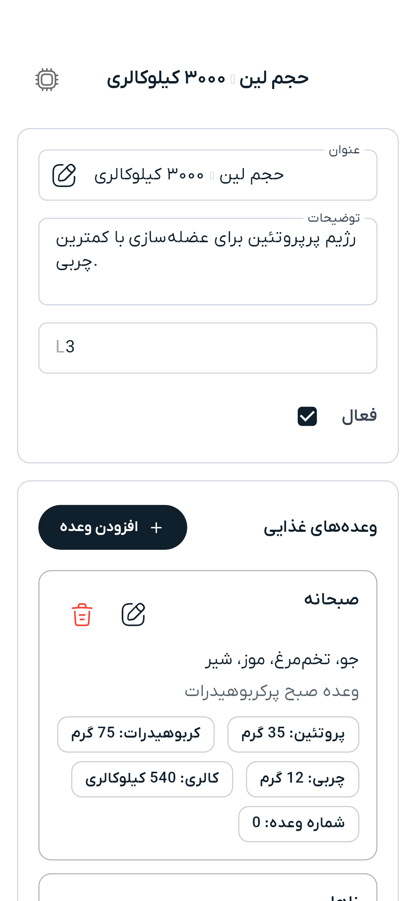

# برنامه‌های غذایی

با برنامه غذایی، تغذیه روزانه‌تون رو سازماندهی کنید — وعده‌ها، ماکروها، مکمل‌ها و هدف آب، همه یک جا.

---

## ساخت برنامه

۱. به **تمرین → برنامه‌های غذایی** بروید
۲. روی **+** ضربه بزنید
۳. نامی انتخاب کنید (مثلاً «دوره کات»، «نگهداری»)
۴. هدف روزانه **آب** (تعداد لیوان) را تنظیم کنید
۵. ذخیره کنید

---

## اضافه کردن وعده

هر وعده یک پنجره غذایی مشخص در روز است (صبحانه، قبل از تمرین، ناهار و غیره).

داخل برنامه:
۱. روی **افزودن وعده** ضربه بزنید
۲. نام و شماره ترتیب وعده را وارد کنید (۱، ۲، ۳... ترتیب نمایش در طول روز را مشخص می‌کند)
۳. مقادیر تغذیه‌ای را وارد کنید:
   - پروتئین (گرم)
   - کربوهیدرات (گرم)
   - چربی (گرم)
   - کالری (کیلوکالری)
۴. ذخیره کنید

برنامه به صورت خودکار ماکروها و کالری روزانه را از همه وعده‌ها جمع می‌کند.

---

## اضافه کردن مکمل

مکمل‌ها به وعده‌ها متصل می‌شوند و کنارشان نمایش داده می‌شوند.

داخل یک وعده:
۱. روی **افزودن مکمل** ضربه بزنید
۲. مکمل را از لیست انتخاب کنید
۳. مقدار و واحد را تنظیم کنید (مثلاً ۵ گرم، ۱ کپسول)
۴. زمان‌بندی نسبت به وعده را انتخاب کنید: **قبل**، **همراه** یا **بعد**
۵. ذخیره کنید

---

## هدف آب

هدف روزانه آب را هنگام ساخت یا ویرایش برنامه تنظیم کنید. کارت آب در داشبورد و ردیاب به شما کمک می‌کند لیوان‌ها را در طول روز ثبت کنید و پیشرفت به سمت هدف را ببینید.

---

## فعال کردن برنامه

فقط یک برنامه غذایی می‌تواند در هر زمان فعال باشد. آن را در داشبورد فعال کنید تا نمایش داده شود.

---

## جمع کل تغذیه

در بالای هر برنامه غذایی، خلاصه‌ای از **کل روزانه پروتئین، کربوهیدرات، چربی و کالری** می‌بینید که با افزودن یا ویرایش وعده‌ها به‌روز می‌شود.

---

## دستیار هوش مصنوعی

روی آیکون دستیار داخل برنامه غذایی ضربه بزنید — پیشنهاد وعده بخواهید، هدف ماکرو بر اساس اهدافتان دریافت کنید یا بگذارید یک وعده را برای شما پر کند.

---

> **بعدی:** [وعده‌های روزانه را ردیابی کنید](tracker.md) یا [یک مربی تغذیه پیدا کنید](trainers.md)
