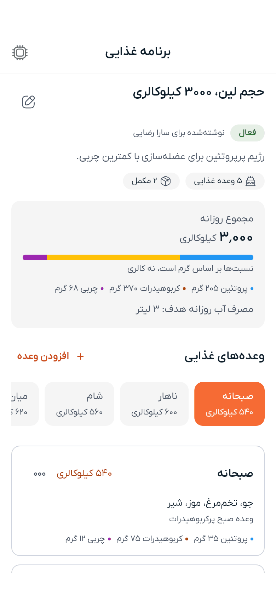

# برنامه‌های غذایی

با برنامهٔ غذایی، تغذیهٔ روزانهٔ خود را سامان دهید — وعده‌های غذایی، درشت‌مغذی‌ها، مکمل‌ها و هدف آب، همه در یک جا.

برنامه در حالت خواندن باز می‌شود: نخست خلاصهٔ تغذیهٔ روزانه و سپس وعده‌های غذایی به شکل کارت‌های خوانا. ویرایش همیشه کاری جداگانه و آگاهانه است.

---

## ایجاد برنامه

بخش «برنامه غذایی» زیرمجموعهٔ «تمرین» است و تنها وقتی هست که حساب شما اجازهٔ دیدن برنامه‌ها را داشته باشد.

۱. به «تمرین ← برنامه غذایی» بروید
۲. «+» را بزنید
۳. نامی انتخاب کنید (مثلاً «دورهٔ کات» یا «نگهداری»)
۴. هدف روزانهٔ آب را بر حسب لیتر تعیین کنید
۵. ذخیره کنید

---

## افزودن وعدهٔ غذایی

هر وعدهٔ غذایی بازهٔ مشخصی از روز است: صبحانه، پیش از تمرین، ناهار و مانند آن.

درون برنامه:
۱. «افزودن وعده» را بزنید
۲. نام و شمارهٔ ترتیب آن را وارد کنید (۱، ۲، ۳ … ترتیب نمایش در طول روز را تعیین می‌کند)
۳. مقدارهای تغذیه‌ای را وارد کنید:
   - پروتئین (گرم)
   - کربوهیدرات (گرم)
   - چربی (گرم)
   - کالری (کیلوکالری)
۴. ذخیره کنید

برنامه، درشت‌مغذی‌ها و کالری روزانه را از همهٔ وعده‌های غذایی خودکار جمع می‌زند.

هر کارت، کالری را کنار نام وعدهٔ غذایی، مواد آن، و یک خط درشت‌مغذی با ترتیب ثابت نشان می‌دهد: پروتئین، کربوهیدرات و چربی. وقتی برنامه چند وعده دارد، نواری از نام آنها بالای فهرست می‌نشیند؛ هر کدام را بزنید، مستقیم به همان می‌روید.

---

## افزودن مکمل

مکمل‌ها به وعده‌های غذایی متصل می‌شوند و کنار آنها دیده می‌شوند.

درون یک وعدهٔ غذایی:
۱. «افزودن مکمل» را بزنید
۲. مکمل را از فهرست انتخاب کنید
۳. مقدار و واحد را تعیین کنید (مثلاً ۵ گرم یا ۱ کپسول)
۴. زمان آن را نسبت به وعده انتخاب کنید: پیش، همراه یا پس از آن
۵. ذخیره کنید

---

## هدف آب

هدف روزانهٔ آب را هنگام ایجاد یا ویرایش برنامه تعیین کنید؛ این فیلد با برچسب «مصرف آب روزانه هدف» و بر حسب لیتر است. کارت آب در «عملکرد من» کمک می‌کند در طول روز مصرف خود را ثبت کنید و پیشرفتتان را تا هدف ببینید.

---

## فعال کردن برنامه

در هر زمان تنها یک برنامهٔ غذایی می‌تواند فعال باشد. برنامه را باز کنید و «تنظیم به عنوان برنامه فعال» را بزنید تا روی داشبورد دیده شود.

---

## جمع کل تغذیه

بالای هر برنامهٔ غذایی، خلاصه‌ای از مجموع روزانهٔ پروتئین، کربوهیدرات، چربی و کالری می‌بینید؛ کالری کل برجسته است و نواری تعادل درشت‌مغذی‌ها را نشان می‌دهد. هدف روزانهٔ آب هم زیر آن می‌آید. این خلاصه با افزودن یا ویرایش وعده‌های غذایی خودش تازه می‌شود.

دو نکته دربارهٔ این خلاصه: هر وعدهٔ غذایی **یک بار** شمرده می‌شود؛ وقتی برنامه برای یک وعده چند گزینه دارد، شما یکی از آنها را می‌خورید، پس تنها اولی در عدد بالا حساب شده و خطی زیر آن همین را می‌گوید. دوم اینکه نوار بر پایهٔ **گرم** است و نه کالری — چربی به ازای هر کالری وزن کمتری دارد، پس سهمش در نوار کوچک‌تر از سهمش در انرژی به چشم می‌آید. این را هم زیر خود نوار نوشته‌ایم.

---

## دستیار هوشمند

نشان جرقه را درون برنامهٔ غذایی بزنید: پیشنهاد وعدهٔ غذایی بخواهید، هدف درشت‌مغذی بر پایهٔ هدف خود بگیرید، یا بگذارید وعده‌ای را برای شما پر کند.

---

> **بعدی:** [وعده‌های غذایی روزانه را ثبت کنید](tracker.md) یا [مربی تغذیه پیدا کنید](trainers.md)

---

[→ قبلی: برنامه‌های تمرینی](workout-plans.md) | [بعدی: عملکرد من ←](tracker.md)
