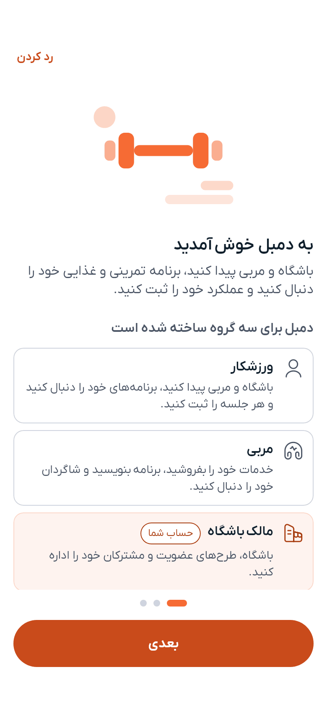

# شروع با دمبل

دمبل هر آنچه را برای مسیر تناسب‌اندام لازم دارید در یک جا جمع کرده است. چه ورزشکار باشید و پیشرفت خود را دنبال کنید، چه مربی باشید و شاگردانتان را اداره کنید، چه باشگاهی داشته باشید که می‌خواهید بزرگ‌ترش کنید — دمبل جایی برای شما دارد.

---

## با دمبل چه کارهایی می‌توانید انجام دهید

**اگر ورزشکار هستید:**
- برنامهٔ تمرینی و برنامهٔ غذایی منظم بسازید
- هر تمرین، وعدهٔ غذایی، خواب و بیشتر را ثبت کنید
- باشگاه‌های نزدیک خود را پیدا کنید و اشتراک بگیرید
- مربی بگیرید و از راه گفتگو با او در ارتباط بمانید

**اگر مربی هستید:**
- خدمات تمرینی و تغذیه‌ای ایجاد کنید و بفروشید
- شاگردان خود را اداره کنید و پیشرفتشان را ببینید
- مستقیم با آنها گفتگو کنید

**اگر مالک باشگاه هستید:**
- باشگاه خود را با ساعات کاری، تجهیزات و طرح‌های عضویت معرفی کنید
- مشترکان و اشتراک‌ها را اداره کنید

---

## اولین اجرا

نخستین بار که پس از ورود دمبل را باز می‌کنید، سه پرسش کوتاه از شما می‌پرسد: چه کسی هستید — ورزشکار، مربی یا مالک باشگاه — برای چه آمده‌اید، و می‌خواهید از کجا شروع کنید. پاسخ‌های شما فقط صفحهٔ آغاز را انتخاب می‌کنند؛ چیزی قفل نمی‌شود و می‌توانید از کل این مرحله رد شوید.

بعد مستقیم به همان جایی می‌روید که انتخاب کرده‌اید: جستجوی باشگاه، جستجوی مربی، دستیار هوشمند با درخواست برنامه‌ای که از پیش برایتان نوشته شده، یا عملکرد من.

---

## چهار بخش اصلی

پس از ورود، چهار بخش در پایین صفحه می‌بینید:

| بخش | کاربرد |
|---|---|
| **داشبورد** | خانهٔ روزانهٔ شما — برنامه‌های فعال، خلاصهٔ امروز، موجودی |
| **باشگاه‌ها** | یافتن باشگاه روی نقشه یا در فهرست |
| **تمرین** | مربیان، برنامه‌های تمرینی، برنامه‌های غذایی و شاگردان شما |
| **عملکرد من** | ثبت روز، و دیدن میانگین‌ها، نمودارها، رکوردها و تاریخچه |

روی صفحهٔ پهن — یک تبلت یا پنجرهٔ مرورگر — این چهار بخش به‌جای نوار پایین، به ستون کنارهٔ پنجره می‌روند. [دمبل روی رایانه](on-a-computer.md) را ببینید.

### نشان‌های بالای صفحه

سه چیز در نوار بالای هر چهار بخش هست و خودشان بخش جداگانه‌ای نیستند:

| نشان | چه چیزی را باز می‌کند |
|---|---|
| **گفتگو** | [گفتگوهای](chat.md) شما |
| **زنگ** | تازه‌ترین [اعلان‌ها](notifications.md) و راه رسیدن به بقیه |
| **جرقه** | [دستیار هوشمند](ai-assistant.md) |

تصویر شما در گوشهٔ نوار، منوی کوتاهی باز می‌کند: پروفایل، کیف پول، لینک دعوت، تنظیمات و خروج از حساب.

---

## راهنما، هر وقت خواستید

هر صفحهٔ اصلی نشان **؟** در نوار بالای خود دارد. با زدن آن، راهنمای کوتاه همان صفحه باز می‌شود: سه نکتهٔ لازم و پیوندی به صفحهٔ کامل در همین راهنما.

نخستین بار که به هر صفحه می‌رسید، دمبل با چند مرحلهٔ برجسته‌شده آن را به شما نشان می‌دهد. می‌توانید از یک تور رد شوید و هر کدام را دوباره ببینید: «تنظیمات ← راهنما و تور معرفی» تور معرفی اولیه را دوباره اجرا می‌کند، تور یک بخش را دوباره نشان می‌دهد، یا همه را از نو فعال می‌کند.

---

## مراحل بعدی

۱. [ایجاد حساب کاربری](authentication.md) — حدود ۲ دقیقه
۲. [تکمیل پروفایل](profile.md) — عکس و اطلاعات شما
۳. [ساختن اولین برنامهٔ تمرینی](workout-plans.md) یا [برنامهٔ غذایی](diet-plans.md)
۴. [شروع ثبت عملکرد](tracker.md) — روز خود را از «عملکرد من» ثبت کنید

---

> **زبان انگلیسی؟** هر زمان می‌توانید از [تنظیمات](settings.md) زبان را عوض کنید. دمبل از هر دو زبان و از چیدمان راست‌به‌چپ کامل پشتیبانی می‌کند.

---

[بعدی: راهنمای ورود و ثبت‌نام ←](authentication.md)
