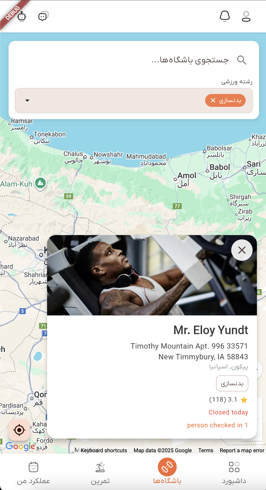

# راهنمای باشگاه‌ها

به ویژگی **جستجوی باشگاه‌ها** در دَمبل خوش آمدید. این راهنما به شما کمک می‌کند تا یاد بگیرید چگونه باشگاه‌ها و مراکز ورزشی را جستجو کنید، نتایج را بر اساس رشته‌های ورزشی فیلتر کنید، موقعیت باشگاه‌ها را روی نقشه تعاملی ببینید و بهترین مرکز ورزشی متناسب با نیازتان را پیدا کنید.

## نمای کلی

صفحه جستجوی باشگاه‌ها به شما امکان می‌دهد باشگاه‌ها و مراکز ورزشی نزدیک خود را با استفاده از رابط تعاملی Google Maps کشف و بررسی کنید. شما می‌توانید بر اساس نام جستجو کنید، با رشته‌های ورزشی فیلتر کنید، موقعیت باشگاه‌ها روی نقشه را ببینید و اطلاعات کامل هر باشگاه را مشاهده کنید.

ویژگی‌های کلیدی:
- **نقشه تعاملی**: مشاهده باشگاه‌ها روی نقشه گوگل با نشانگرهای موقعیت
- **جستجوی متنی**: پیدا کردن باشگاه‌ها بر اساس نام یا کلمات کلیدی
- **فیلتر رشته‌های ورزشی**: محدود کردن نتایج بر اساس رشته‌های ورزشی ارائه شده
- **جستجوی مبتنی بر موقعیت**: یافتن خودکار باشگاه‌های نزدیک به موقعیت شما یا مرکز نقشه
- **جزئیات باشگاه**: مشاهده اطلاعات کامل هر باشگاه شامل امتیاز، آدرس و امکانات
- **موقعیت من**: دسترسی سریع به موقعیت فعلی شما روی نقشه
- **رنگ نشانگرها**: رنگ‌های مختلف نشان‌دهنده وضعیت باشگاه و تبلیغات ویژه

## دسترسی به جستجوی باشگاه‌ها

### مرحله ۱: رفتن به بخش باشگاه‌ها

1. منوی اصلی اپ را باز کنید
2. بخش **باشگاه‌ها** را از نوار پایین انتخاب کنید
3. صفحه باشگاه‌ها با رابط نقشه باز می‌شود

### مرحله ۲: مشاهده صفحه جستجوی باشگاه‌ها

وقتی صفحه باشگاه‌ها را باز می‌کنید، خواهید دید:
- یک نقشه تعاملی Google Maps با موقعیت باشگاه‌ها
- نوار جستجو در بالای صفحه
- گزینه‌های فیلتر بر اساس رشته‌های ورزشی
- نشانگرهای باشگاه‌ها روی نقشه

*صفحه جستجوی باشگاه‌ها با نقشه تعاملی، نوار جستجو، فیلترها و نشانگرها*

## جستجوی متنی

### استفاده از نوار جستجو

نوار جستجو در بالای صفحه، روی نقشه و در یک باکس سفید قرار دارد.

**چگونه جستجو کنیم**:
1. روی فیلد جستجو ضربه بزنید
2. نام باشگاه یا کلمات کلیدی را تایپ کنید
3. نتایج به‌صورت خودکار (با تاخیر ۳۰۰ میلی‌ثانیه) به‌روز می‌شوند
4. لیستی از ۵ نتیجه نزدیک به متن شما نمایش داده می‌شود
5. برای مشاهده باشگاه روی نقشه، روی نتیجه ضربه بزنید

**رفتار جستجو**:
- **به‌روزرسانی لحظه‌ای**: نتایج به محض تایپ شدن فیلتر می‌شوند
- **تاخیر کنترل‌شده**: جلوگیری از ارسال درخواست‌های زیاد به سرور
- **پاک کردن جستجو**: با ضربه زدن روی آیکون X، فیلد جستجو پاک می‌شود
- **نتایج کشویی**: نام و آدرس باشگاه را برای انتخاب سریع نمایش می‌دهد
- **موقعیت روی نقشه**: انتخاب نتیجه، نقشه را روی آن باشگاه متمرکز می‌کند

**وضعیت خالی**:
- اگر هیچ باشگاهی با جستجوی شما پیدا نشد، پیام "باشگاهی پیدا نشد" نمایش داده می‌شود
- جستجو را پاک کنید تا دوباره به نمای نقشه بازگردید

### جستجوی مبتنی بر موقعیت

نقشه به صورت خودکار باشگاه‌ها را بر اساس محدوده قابل مشاهده روی نقشه جستجو می‌کند:

**چگونگی عملکرد**:
- **مرکز نقشه**: جستجو در شعاعی اطراف مرکز نقشه انجام می‌شود
- **سطح زوم**: شعاع جستجو بسته به سطح زوم نقشه تغییر می‌کند
- **حرکت نقشه**: وقتی نقشه را جابه‌جا یا زوم می‌کنید، نتایج باشگاه‌ها به‌روز می‌شوند
- **تاخیر کنترل‌شده**: تاخیر کوتاهی پس از حرکت نقشه برای جلوگیری از درخواست‌های زیاد

**محاسبه شعاع جستجو**:
- شعاع جستجو بر اساس سطح زوم نقشه محاسبه می‌شود
- زوم نزدیک (بزرگ‌تر) = شعاع کوچکتر = جستجوی محلی دقیق‌تر
- زوم دور (کوچکتر) = شعاع بزرگ‌تر = جستجوی گسترده‌تر
- شعاع بین ۰.۵ کیلومتر (بسیار نزدیک) تا ۲۰۰۰ کیلومتر (بسیار دور) متغیر است

## فیلتر نتایج

### فیلتر رشته‌های ورزشی

می‌توانید باشگاه‌ها را بر اساس رشته‌های ورزشی یا امکانات آن‌ها فیلتر کنید.

**چگونگی استفاده**:
1. به بخش فیلتر "رشته ورزشی" در پنل جستجو بروید
2. روی منوی کشویی ضربه بزنید تا رشته‌های موجود نمایش داده شود
3. یک یا چند رشته ورزشی را انتخاب کنید
4. فیلترهای انتخاب شده به صورت تگ‌های قابل حذف نمایش داده می‌شوند
5. نتایج به‌صورت خودکار به‌روزرسانی می‌شوند

**تگ‌های فیلتر انتخاب شده**:
- فیلترهای انتخاب شده به صورت تگ‌های قابل حذف نمایش داده می‌شوند
- نام رشته ورزشی روی هر تگ نمایش داده می‌شود
- با ضربه روی X، فیلتر حذف می‌شود
- از دکمه "پاک کردن همه" برای حذف تمام فیلترها استفاده کنید

**رفتار فیلترها**:
- فیلترها روی نتایج متن و نقشه اعمال می‌شوند
- می‌توان چند فیلتر همزمان انتخاب کرد (منطق AND)
- برای مشاهده همه باشگاه‌ها، همه فیلترها را پاک کنید

### ترکیب جستجو و فیلترها

می‌توانید روش‌های مختلف جستجو را با هم ترکیب کنید:
- **جستجوی متنی + فیلترها**: جستجوی باشگاه‌های خاص با رشته‌های ورزشی مشخص
- **مکان روی نقشه + فیلترها**: فیلتر باشگاه‌ها در منطقه مشخص بر اساس رشته
- **تمام روش‌ها**: ترکیب جستجوی متنی، مکان و فیلترها برای دقیق‌ترین نتایج

## مشاهده نتایج روی نقشه

### نشانگرهای باشگاه

هر باشگاه به صورت یک نشانگر روی نقشه ظاهر می‌شود و رنگ‌های مختلف وضعیت باشگاه را نشان می‌دهند:

**رنگ نشانگرها**:
- **قرمز**: باشگاه فعال استاندارد
- **نارنجی/کهربایی**: باشگاه با تبلیغات ویژه (Promoted)
- **بنفش**: باشگاه بسته یا غیرفعال

**تعامل با نشانگرها**:
- **ضربه روی نشانگر**: باز شدن پنجره جزئیات باشگاه
- **پنجره اطلاعات نشانگر**: نمایش نام و آدرس باشگاه
- **چندین نشانگر**: همه باشگاه‌های مطابق همزمان نمایش داده می‌شوند

### پنجره جزئیات باشگاه

وقتی روی یک نشانگر ضربه می‌زنید، پنجره جزئیات باز می‌شود که شامل:

**اطلاعات باشگاه**:
- **نام**: نام باشگاه
- **آدرس**: آدرس کامل شامل خیابان
- **شهر و کشور**: جزئیات مکان
- **رشته‌های ورزشی**: تگ‌های امکانات موجود (تا ۳ مورد نمایش داده می‌شود)
- **امتیاز**: ستاره‌ها با میانگین امتیاز و تعداد نظرات
- **تصویر**: عکس باشگاه (در صورت موجود بودن)
- **وضعیت کاری**: وضعیت باز یا بسته بودن فعلی (در صورت موجود بودن)

**ساعات کاری**:
- نمایش ساعات کاری برای هر روز هفته
- نمایش وضعیت فعلی (باز/بسته)

**اطلاعات جمعیت**:
- در صورت موجود بودن، میزان شلوغی فعلی باشگاه
- کمک به برنامه‌ریزی بازدید در ساعات خلوت

**عملیات پنجره**:
- مشاهده همه جزئیات باشگاه
- بستن پنجره با ضربه خارج از پنجره یا دکمه بستن

## ناوبری روی نقشه

### زوم و جابجایی

**کنترل زوم**:
- **Pinch to Zoom**: زوم کردن با حرکت دو انگشت (موبایل)
- **Double Tap**: دو بار ضربه برای زوم
- **Scroll Wheel**: استفاده از چرخ ماوس (دسکتاپ)
- **دکمه‌های زوم**: استفاده از دکمه‌های استاندارد نقشه

**جابجایی**:
- **کشیدن نقشه**: کلیک و کشیدن (دسکتاپ و موبایل)
- **کلیدهای جهت‌نما**: در دسکتاپ برای جابجایی (در صورت فوکوس)

**به‌روزرسانی خودکار**:
- باشگاه‌ها بعد از توقف حرکت نقشه به‌روز می‌شوند

### دکمه موقعیت من

یک دکمه شناور برای رفتن سریع به موقعیت فعلی شما:

**چگونگی استفاده**:
1. ضربه روی دکمه موقعیت (معمولاً پایین-راست نقشه)
2. اجازه دسترسی به موقعیت را بدهید
3. نقشه به موقعیت فعلی شما حرکت می‌کند
4. باشگاه‌های نزدیک بارگذاری می‌شوند

**مجوزهای موقعیت**:
- **اولین بار**: اپ درخواست مجوز می‌دهد
- **رد شده**: نیاز به فعال کردن موقعیت در تنظیمات دستگاه
- **وب**: مرورگر درخواست دسترسی می‌دهد
- **موبایل**: استفاده از GPS دستگاه در صورت اجازه

**دقت موقعیت**:
- استفاده از GPS با دقت بالا در صورت امکان
- نشانگر دایره آبی برای موقعیت شما
- به‌روزرسانی هنگام حرکت (در صورت فعال بودن رهگیری)

## وضعیت بارگذاری

### بارگذاری اولیه

وقتی صفحه را برای اولین بار باز می‌کنید:
- **بارگذاری نقشه**: نمایش نشانگر لودینگ هنگام آماده شدن Google Maps
- **بارگذاری باشگاه‌ها**: پس از لود نقشه، باشگاه‌ها بارگذاری می‌شوند
- **بارگذاری فیلترها**: گزینه‌های رشته ورزشی بارگذاری می‌شوند
- **بارگذاری موقعیت**: موقعیت فعلی تشخیص داده می‌شود (در صورت اجازه)

### بارگذاری بعدی

وقتی باشگاه‌های جدید یا به‌روزرسانی انجام می‌شود:
- **به‌روزرسانی مخفی**: باشگاه‌ها در پس‌زمینه به‌روز می‌شوند
- **بدون وقفه**: نشانگرهای موجود باقی می‌مانند
- **تجربه روان**: نشانگرهای جدید پس از بارگذاری ظاهر می‌شوند

### وضعیت خطاها

**خطای بارگذاری نقشه**:
- در صورت مشکل در لود Google Maps، پیام خطا نمایش داده می‌شود
- اتصال اینترنت و پیکربندی API را بررسی کنید
- صفحه را رفرش کنید

**خطای موقعیت**:
- در صورت رد شدن مجوز، نقشه روی مختصات تهران نمایش داده می‌شود
- می‌توانید به صورت دستی منطقه خود را پیدا کنید
- برای استفاده از «موقعیت من»، مجوز را فعال کنید

**خطای جستجو**:
- در صورت عدم موفقیت، پیام خطا نمایش داده می‌شود
- جستجو را دوباره امتحان کنید یا اتصال اینترنت را بررسی کنید
- فیلد جستجو را پاک کرده و دوباره امتحان کنید

## رفع مشکل (Troubleshooting)

### عدم نمایش باشگاه‌ها

اگر باشگاه‌ها روی نقشه ظاهر نمی‌شوند:

1. **بررسی اینترنت**: مطمئن شوید اتصال اینترنت پایدار است
2. **بررسی سطح زوم**: نزدیک‌تر زوم کنید؛ ممکن است خیلی دور باشید
3. **بررسی موقعیت**: به منطقه‌ای با باشگاه‌ها بروید (شهرهای بزرگ را امتحان کنید)
4. **منتظر به‌روزرسانی باشید**: بعد از جابجایی نقشه کمی صبر کنید
5. **رفرش صفحه**: در صورت ادامه مشکل، صفحه را دوباره بارگذاری کنید

### جستجو کار نمی‌کند

اگر نتایج جستجو نمایش داده نمی‌شوند:

1. **پاک کردن جستجو**: فیلد جستجو را پاک کرده و دوباره امتحان کنید
2. **بررسی املاء**: مطمئن شوید کلمات به درستی تایپ شده‌اند
3. **گسترده‌تر کردن جستجو**: از کلمات عمومی یا نام‌های دیگر استفاده کنید
4. **حذف فیلترها**: همه فیلترها را پاک کرده و دوباره جستجو کنید
5. **بررسی اینترنت**: اتصال اینترنت را بررسی کنید

### فیلترها اعمال نمی‌شوند

اگر فیلترها کار نمی‌کنند:

1. **بررسی انتخاب**: مطمئن شوید فیلترها انتخاب شده‌اند (تگ‌ها قابل مشاهده باشند)
2. **پاک کردن و دوباره انتخاب کردن**: فیلترها را پاک کرده و دوباره انتخاب کنید
3. **منتظر به‌روزرسانی**: کمی صبر کنید تا نتایج تازه شوند
4. **بررسی اینترنت**: اتصال اینترنت را بررسی کنید

### نقشه بارگذاری نمی‌شود

اگر نقشه نمایش داده نمی‌شود:

1. **بررسی کلید API**: مطمئن شوید کلید Google Maps درست تنظیم شده است
2. **بررسی اینترنت**: اتصال اینترنت پایدار باشد
3. **رفرش صفحه**: صفحه را دوباره بارگذاری کنید
4. **بررسی کنسول مرورگر**: خطاهای جاوااسکریپت را بررسی کنید
5. **تغییر مرورگر**: برخی مرورگرها ممکن است مشکل ساز باشند

### موقعیت من کار نمی‌کند

اگر دکمه "موقعیت من" کار نمی‌کند:

1. **بررسی مجوزها**: اجازه دسترسی به موقعیت داده شده باشد
2. **فعال کردن موقعیت**: GPS یا خدمات موقعیت روشن باشد
3. **بررسی تنظیمات**: در تنظیمات اپ، دسترسی به موقعیت فعال باشد
4. **ناوبری دستی**: در صورت عدم موفقیت، نقشه را به صورت دستی جابه‌جا کنید
5. **بررسی GPS**: مطمئن شوید GPS در موبایل روشن است

### نشانگرها نمایش داده نمی‌شوند

اگر نشانگرهای باشگاه‌ها دیده نمی‌شوند:

1. **بررسی سطح زوم**: نزدیک‌تر زوم کنید، ممکن است نشانگرها مخفی شده باشند
2. **بررسی فیلترها**: مطمئن شوید فیلترها تمام نتایج را حذف نکرده باشند
3. **بررسی منطقه**: به یک شهر بزرگ بروید که باشگاه دارد
4. **منتظر بارگذاری**: بعد از حرکت نقشه کمی صبر کنید
5. **رفرش**: صفحه را دوباره بارگذاری یا کشیدن برای رفرش

## بهترین روش‌ها

### جستجوی مؤثر

برای پیدا کردن باشگاه مناسب:

1. **شروع از موقعیت**: از دکمه "موقعیت من" یا نقشه منطقه خود استفاده کنید
2. **استفاده از جستجوی متنی**: در صورت دانستن نام باشگاه
3. **استفاده از فیلترها**: بر اساس رشته‌های ورزشی مورد نظر
4. **زوم کردن**: برای نتایج محلی دقیق‌تر
5. **بررسی مناطق مختلف**: محله‌ها یا شهرهای دیگر را نیز بررسی کنید

### استفاده از فیلترها

نکات استفاده مؤثر از فیلترها:

1. **شروع با فیلترهای خاص**: ابتدا رشته‌های مورد نیاز خود را انتخاب کنید
2. **افزودن تدریجی**: فیلترها را یکی‌یکی اضافه کنید
3. **پاک کردن در صورت نیاز**: در صورت عدم نمایش نتایج، فیلترها را پاک کنید
4. **ترکیب منطقی**: استفاده بیش از حد فیلتر ممکن است نتیجه ندهد

### ناوبری روی نقشه

نکات استفاده مؤثر از نقشه:

1. **استفاده از موقعیت من**: برای پیدا کردن باشگاه‌های نزدیک
2. **زوم مناسب**: برای جستجوی محلی زوم کنید، برای جستجوی وسیع زوم را کم کنید
3. **صبر برای توقف نقشه**: قبل از انتظار برای نتایج
4. **بررسی مناطق مختلف**: نقشه را جابجا کرده و باشگاه‌ها را بررسی کنید
5. **ذخیره علاقه‌مندی‌ها**: باشگاه‌های مورد نظر را برای بعد یادداشت کنید

### بررسی جزئیات باشگاه

نکات ارزیابی باشگاه‌ها:

1. **بررسی امتیاز**: میانگین امتیاز و تعداد نظرات
2. **بررسی رشته‌ها**: اطمینان از داشتن امکانات مورد نیاز
3. **بررسی آدرس**: مطمئن شوید مکان مناسب است
4. **بررسی ساعات کاری**: ساعات باز بودن با برنامه شما مطابقت دارد
5. **بررسی میزان شلوغی**: در صورت موجود بودن، بازدید در ساعات خلوت را برنامه‌ریزی کنید

## حریم خصوصی و داده‌ها

### اطلاعات قابل مشاهده

هنگام جستجوی باشگاه‌ها:

- **اطلاعات عمومی**: اطلاعات باشگاه برای همه کاربران قابل مشاهده است
- **داده موقعیت**: موقعیت شما فقط برای جستجو محلی استفاده می‌شود و به اشتراک گذاشته نمی‌شود
- **تاریخچه جستجو**: جستجوهای شما ذخیره یا به اشتراک گذاشته نمی‌شوند

### استفاده از داده‌ها

- **درخواست به سرور**: جستجو و به‌روزرسانی نقشه به سرورهای دَمبل ارسال می‌شود
- **Google Maps**: نمایش نقشه از سرویس‌های گوگل استفاده می‌کند (مطابق سیاست گوگل)
- **خدمات موقعیت**: موقعیت برای عملکرد نقشه درخواست می‌شود ولی به صورت محلی مدیریت می‌شود
- **به‌روزرسانی لحظه‌ای**: نتایج بر اساس وضعیت فعلی پایگاه داده به‌روز می‌شوند
- **کشینگ**: برخی داده‌ها برای عملکرد بهتر کش می‌شوند

### مجوزهای موقعیت

- **ضروری برای**: دکمه "موقعیت من" و جستجوی خودکار مبتنی بر موقعیت
- **غیرضروری برای**: ناوبری دستی روی نقشه و جستجوی متنی
- **مدیریت مجوزها**: اپ هنگام نیاز درخواست مجوز می‌دهد
- **حریم خصوصی**: داده موقعیت فقط برای نمایش موقعیت شما روی نقشه استفاده می‌شود

## دریافت کمک

اگر به کمک بیشتری نیاز داشتید:

1. **دستیار هوش مصنوعی**: از دستیار برای پیدا کردن باشگاه‌ها کمک بگیرید (آیکون ربات 🤖)
2. **راهنماهای دیگر**: مستندات راهنمای دیگر اپ را بررسی کنید
3. **پشتیبانی**: با پشتیبانی دَمبل برای مشکلات فنی تماس بگیرید
4. **جامعه کاربران**: به جامعه دَمبل بپیوندید و نکات کاربران دیگر را ببینید

ویژگی جستجوی باشگاه‌ها به شما کمک می‌کند تا مراکز ورزشی متناسب با نیاز و موقعیت خود را پیدا کنید. با استفاده مؤثر از نقشه، جستجو و فیلترها، باشگاه مناسب برای مسیر ورزشی خود را بیابید!
