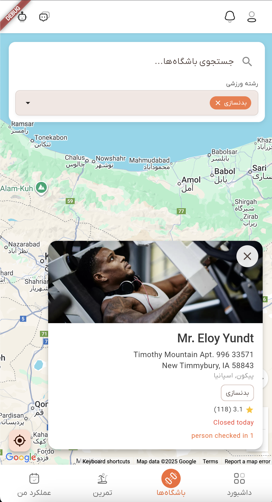

# پیدا کردن باشگاه

دنبال جایی برای تمرین می‌گردی؟ بخش باشگاه‌ها کمکت می‌کنه مراکز ورزشی اطرافت رو پیدا کنی. با اسم جستجو کن، بر اساس امکاناتشون فیلتر کن، و همه چیز رو روی نقشه ببین.

## رفتن به بخش باشگاه‌ها

آیکون باشگاه‌ها رو توی نوار پایین بزن. یه نقشه باز میشه که باشگاه‌های اطراف رو نشون میده.

## چی می‌بینی

نقشه تقریباً تمام صفحه رو پر می‌کنه، با نشانگرهای رنگی که موقعیت باشگاه‌ها رو نشون میدن. نشانگرهای سبز یعنی باشگاه الان بازه، زرد یعنی امروز بعداً باز میشه، قرمز یعنی بسته‌ست، و نارنجی یعنی باشگاه تبلیغ ویژه داره.

بالای صفحه یه باکس سفید هست که توش نوار جستجو و فیلترها هستن. اسم باشگاه رو تایپ کن تا جستجو کنی، یا روی فیلتر رشته ورزشی بزن تا بر اساس چیزی که دنبالشی – بدنسازی، کراس‌فیت، یوگا، هر چی – محدودش کنی.

## جستجوی باشگاه

شروع به تایپ کن توی نوار جستجو و باشگاه‌های مرتبط توی یه منوی کشویی نمایش داده میشن – تا ۵ تا نتیجه همزمان. هر نتیجه اسم و آدرس باشگاه رو نشون میده. روی هر کدوم بزنی مستقیم روی نقشه بهش می‌پری.

می‌خوای جستجو رو پاک کنی؟ دکمه X سمت راست نوار جستجو رو بزن.

نقشه هم خودش باهوشه. وقتی جابجا میشی یا زوم می‌کنی، خودکار باشگاه‌های توی محدوده قابل رؤیت رو نشون میده. زوم کن نزدیک تا گزینه‌های اطراف رو ببینی، زوم کن دور تا محدوده بزرگ‌تری رو ببینی. اپ یه لحظه صبر می‌کنه بعد از اینکه نقشه رو جابجا کردی تا رفرش کنه، پس وقتی داری نقشه رو می‌کشی مدام لود نمیشه.

## فیلتر کردن بر اساس رشته ورزشی

روی منوی کشویی رشته ورزشی بزن تا ببینی چی موجوده – چیزایی مثل بدنسازی، کراس‌فیت، رزمی، شنا، و بقیه. یکی یا چندتا انتخاب کن تا نقشه رو فیلتر کنی.

فیلترهایی که انتخاب کردی به صورت چیپ‌های کوچیک زیر منوی کشویی نمایش داده میشن. هر چیپ یه X داره که می‌تونی بزنی و حذفش کنی. یه دکمه "پاک کردن همه" هم هست اگه خواستی از اول شروع کنی.

فیلترها با همه چیز کار می‌کنن – پس می‌تونی اسم باشگاه رو جستجو کنی و همزمان بر اساس رشته ورزشی فیلتر کنی، یا فقط چیزی که روی نقشه دیده میشه رو فیلتر کنی. هر جور که دوست داری ترکیبشون کن.

## نشانگرها و جزئیات باشگاه

روی هر نشانگر بزن تا یه کارت اطلاعاتی سریع از اون باشگاه ببینی. اسم، آدرس، رشته‌های ورزشی که ارائه میده (تا ۳ تا نشون داده میشه)، امتیازش با تعداد ستاره‌ها، و اینکه الان باز یا بسته‌ست رو می‌بینی.

اگه باشگاه عکس آپلود کرده باشه، توی کارت می‌بینیش. بعضی باشگاه‌ها میزان شلوغی فعلیشون رو هم نشون میدن، که اگه ترجیح میدی وقتی خلوت‌تره تمرین کنی خیلی کاربردیه.

می‌خوای جزئیات بیشتر ببینی؟ هر جای کارت رو بزنی صفحه جزئیات کامل باشگاه باز میشه. اونجا همه چیز رو می‌بینی – لیست کامل تجهیزات، پلن‌های عضویت، اقلام بوفه اگه داشته باشه، ساعات کاری کامل برای هر روز، و امتیازها و نظرات کاربرا.

## حرکت توی نقشه

روی موبایل با دو انگشت زوم کن، یا روی دسکتاپ از چرخ ماوس استفاده کن. دوبار بزن تا سریع زوم کنی. نقشه رو بکش تا مناطق مختلف رو ببینی.

یه دکمه موقعیت هست (معمولاً پایین سمت راست) که مستقیم بهت می‌بره جایی که هستی. اولین باری که میزنیش، اپ اجازه دسترسی به موقعیت رو می‌خواد. بهش اجازه بده، و نقشه می‌پره به موقعیت فعلیت و باشگاه‌های اطراف خودکار لود میشن.

اگه قبلاً اجازه موقعیت رو ندادی و الان می‌خوای ازش استفاده کنی، باید توی تنظیمات دستگاهت فعالش کنی.

## وقتی چیزا لود میشن

اولین باری که صفحه رو باز می‌کنی، یه نشانگر لودینگ می‌بینی تا نقشه آماده بشه. وقتی آماده شد، باشگاه‌های توی محدوده قابل رؤیت خودکار لود میشن، همراه با گزینه‌های فیلتر رشته ورزشی.

وقتی نقشه رو جابجا می‌کنی، باشگاه‌ها توی پس‌زمینه آپدیت میشن بدون اینکه کاری که داری انجام میدی رو قطع کنن. نشانگرهای موجود همونطوری می‌مونن تا نشانگرهای جدید لود بشن.

اگه نقشه لود نشد، اتصال اینترنتت رو چک کن و رفرش کن. اگه اجازه موقعیت رو ندادی، نقشه پیش‌فرض روی تهران نمایش داده میشه – می‌تونی به صورت دستی به منطقه خودت بری.

## وقتی مشکلی پیش میاد

باشگاه‌ها نمایش داده نمیشن؟ اول اتصال اینترنتت رو چک کن. اگه خیلی زوم کردی دور، سعی کن نزدیک‌تر زوم کنی – شاید داری محدوده خیلی بزرگی رو نگاه می‌کنی. بذار نقشه بعد از جابجایی یه لحظه بمونه؛ باشگاه‌ها وقتی دست از کشیدن برداری لود میشن.

جستجو کار نمی‌کنه؟ پاکش کن و دوباره امتحان کن، یا املای کلماتت رو چک کن. فیلترهایی که شاید خیلی محدود کننده باشن رو حذف کن.

نقشه اصلاً لود نمیشه؟ صفحه رو رفرش کن و مطمئن شو اتصال اینترنت پایداری داری. اگه روی وب هستی، یه مرورگر دیگه امتحان کن.

دکمه موقعیت کار نمی‌کنه؟ مطمئن شو اجازه دسترسی به موقعیت رو دادی. در صورت نیاز تنظیمات دستگاهت رو چک کن. اگه بازم کار نکرد، به صورت دستی به منطقه خودت برو.

## نکته‌ها

با موقعیت خودت شروع کن یا به جایی که می‌خوای تمرین کنی برو. از فیلترها استفاده کن تا بر اساس چیزی که برات مهمه – رشته‌های ورزشی که بهشون علاقه داری – محدودش کنی. وقتی باشگاهی پیدا کردی که خوب به نظر میاد، امتیازها و نظراتش رو چک کن.

اگه کمک لازم داشتی، دستیار هوش مصنوعی همیشه اونجاست (آیکون ربات رو بزن). می‌تونه کمکت کنه بر اساس چیزی که دنبالشی باشگاه پیدا کنی.
