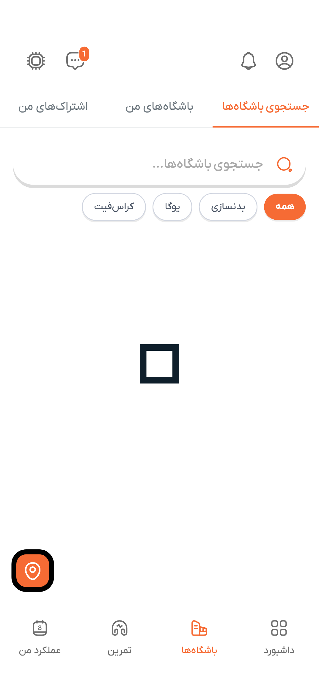
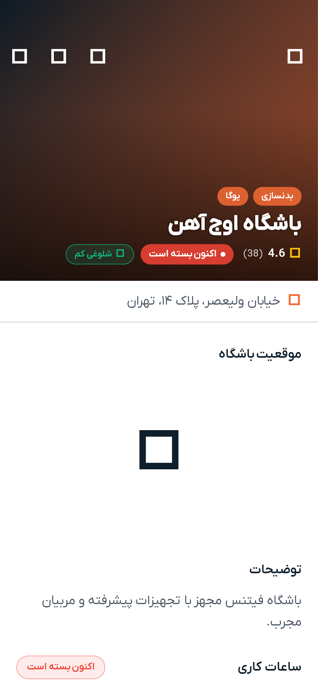
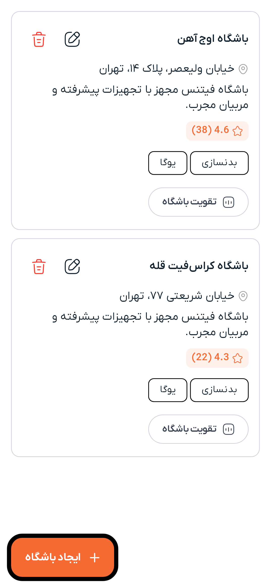
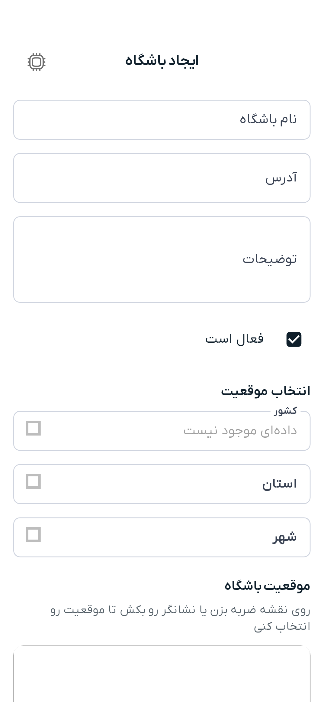
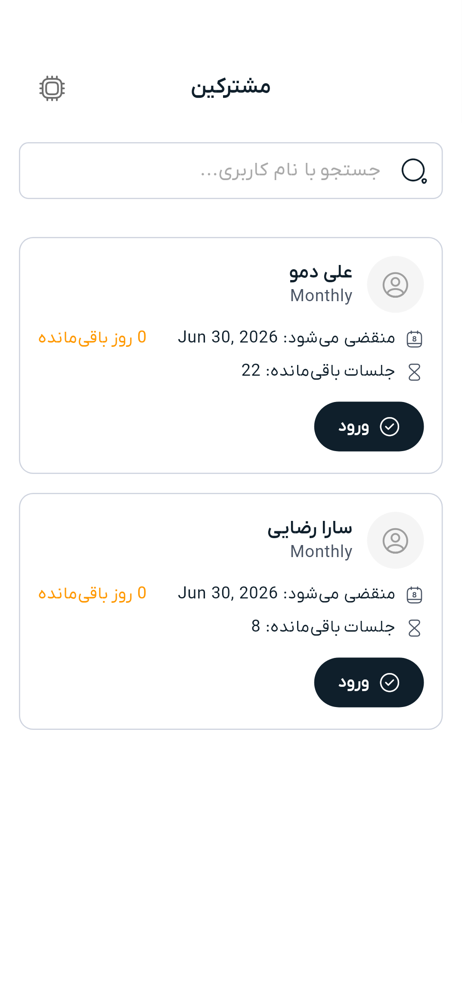
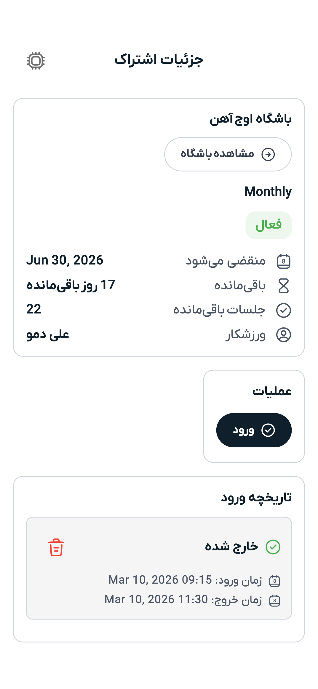

# باشگاه‌ها

تب باشگاه‌ها دور یک نقشه بنا شده. باشگاه‌های نزدیک رو پیدا کنید، ببینید چی دارن، و همونجا اشتراک بگیرید.

---

## پیدا کردن باشگاه

### نقشه

تب **باشگاه‌ها** یک نقشه تمام‌صفحه باز می‌کند. نشانگرهای باشگاه بر اساس وضعیت رنگ‌بندی شده‌اند:

| رنگ | معنی |
|---|---|
| سبز | الان باز است |
| زرد | بعداً امروز باز می‌شود |
| قرمز | بسته است |
| نارنجی | لیست تقویت‌شده |

روی یک نشانگر ضربه بزنید تا خلاصه‌ای ببینید. روی کارت ضربه بزنید تا جزئیات کامل باشگاه باز شود.

### جستجو و فیلتر

از نوار جستجو در بالا برای پیدا کردن باشگاه بر اساس نام استفاده کنید. دکمه فیلتر نتایج را بر اساس **رشته ورزشی** (بدنسازی، کراس‌فیت، یوگا و غیره) محدود می‌کند.

### موقعیت شما

روی دکمه موقعیت ضربه بزنید تا نقشه روی محل شما زوم کند.

---

## جزئیات باشگاه

صفحه جزئیات یک باشگاه نشان می‌دهد:
- نام، آدرس و ساعات کاری
- رشته‌های ورزشی و تجهیزات
- پلن‌های اشتراک و قیمت‌گذاری
- نظرات و امتیازات اعضا

---

## اشتراک در باشگاه

در صفحه جزئیات باشگاه، یک پلن اشتراک انتخاب کنید و پرداخت را از کیف پول دمبل انجام دهید. اشتراک فعال شما روی داشبورد نمایش داده می‌شود.

---

## مدیریت باشگاه خودتان

اگر صاحب باشگاه هستید، می‌توانید باشگاه‌هایتان را از طریق **باشگاه‌های من** مدیریت کنید.

### ایجاد باشگاه

به **باشگاه‌های من → +** بروید و اطلاعات را پر کنید:
- نام، آدرس، اطلاعات تماس
- ساعات کاری
- رشته‌های ورزشی
- لیست تجهیزات
- پلن‌های اشتراک
- آیتم‌های بوفه/کافه (اختیاری)

### مشاهده مشترکین

باشگاه خود را باز کنید و روی **مشترکین** ضربه بزنید تا لیست همه اعضای فعال با جزئیات اشتراکشان را ببینید.

### مدیریت اشتراک

روی هر مشترک ضربه بزنید تا جزئیات اشتراکش را مشاهده یا ویرایش کنید.

---

> **بعدی:** [مربی پیدا کنید](trainers.md) یا [موجودی کیف پول را بررسی کنید](wallet.md)
