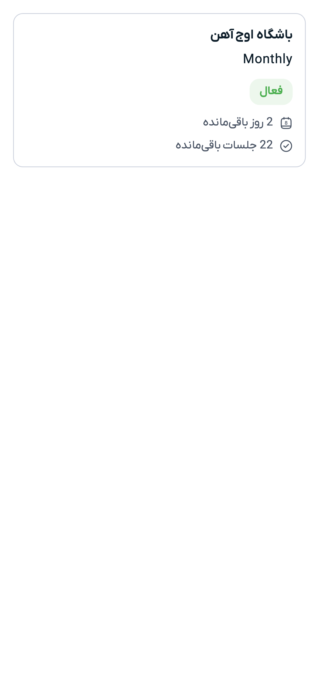

# باشگاه‌ها

تب باشگاه‌ها دور یک نقشه بنا شده. باشگاه‌های نزدیک رو پیدا کنید، ببینید چی دارن، و همونجا اشتراک بگیرید.

---

## پیدا کردن باشگاه

### نقشه

تب **باشگاه‌ها** یک نقشه تمام‌صفحه باز می‌کند. نشانگرهای باشگاه بر اساس وضعیت رنگ‌بندی شده‌اند:

| رنگ | معنی |
|---|---|
| سبز | الان باز است |
| زرد | بعداً امروز باز می‌شود |
| قرمز | بسته است |
| نارنجی | لیست تقویت‌شده |

روی یک نشانگر ضربه بزنید تا خلاصه‌ای ببینید. روی کارت ضربه بزنید تا جزئیات کامل باشگاه باز شود.

### جستجو و فیلتر

از نوار جستجو در بالا برای پیدا کردن باشگاه بر اساس نام استفاده کنید. دکمه فیلتر نتایج را بر اساس **رشته ورزشی** (بدنسازی، کراس‌فیت، یوگا و غیره) محدود می‌کند.

### موقعیت شما

روی دکمه موقعیت ضربه بزنید تا نقشه روی محل شما زوم کند.

---

## جزئیات باشگاه

صفحه جزئیات یک باشگاه نشان می‌دهد:
- نام، آدرس و ساعات کاری
- رشته‌های ورزشی و تجهیزات
- پلن‌های اشتراک و قیمت‌گذاری
- نظرات و امتیازات اعضا

---

## اشتراک در باشگاه

در صفحه جزئیات باشگاه، یک پلن اشتراک انتخاب کنید و پرداخت را از کیف پول دمبل انجام دهید. اشتراک فعال شما روی داشبورد نمایش داده می‌شود و می‌توانید همه اشتراک‌هایتان را در بخش **اشتراک‌های من** ببینید.

---

## مدیریت باشگاه خودتان

اگر صاحب باشگاه هستید، می‌توانید باشگاه‌هایتان را از طریق **باشگاه‌های من** مدیریت کنید.

### ایجاد باشگاه

به **باشگاه‌های من → +** بروید و اطلاعات را پر کنید:
- نام، آدرس، اطلاعات تماس
- ساعات کاری
- رشته‌های ورزشی
- لیست تجهیزات
- پلن‌های اشتراک
- آیتم‌های بوفه/کافه (اختیاری)

### مجوز باشگاه

هر باشگاه باید مجوز فعالیتش ثبت شده باشد. باشگاه را برای ویرایش باز کنید و کادر **مجوز باشگاه** را پیدا کنید؛ این کادر زیر گالری عکس‌ها و جدا از آن قرار دارد — عکس‌های گالری عمومی هستند، اما مجوز هرگز عمومی نیست.

روی **بارگذاری مدرک** ضربه بزنید تا از مدرک عکس بگیرید یا از گالری انتخاب کنید. وضعیت زیر آن نشان می‌دهد کار در چه مرحله‌ای است:

| وضعیت | یعنی چه |
|---|---|
| **بارگذاری نشده** | هنوز مدرکی ثبت نشده است. |
| **در انتظار بررسی** | مدرک را دریافت کرده‌ایم و تیم ما در حال بررسی آن است. |
| **تأیید شده** | مجوز باشگاه تأیید شده است. |
| **رد شده** | مشکلی در مدرک وجود داشته. دلیل آن زیر وضعیت نمایش داده می‌شود. |

**تعویض مدرک** مدرک جدیدی جایگزین می‌کند و **حذف** آن را برمی‌دارد؛ در هر دو حالت مجوز دوباره به وضعیت در انتظار بررسی بازمی‌گردد، چون مدرک تازه نیاز به بررسی دوباره دارد.

هر وضعیتی به‌جز تأیید شده، به شکل یک نشان کوچک روی کارت باشگاه در **باشگاه‌های من** هم دیده می‌شود تا بدون باز کردن باشگاه متوجه رد شدن مجوز شوید. پس از پایان بررسی، اعلان دریافت می‌کنید.

تنها شما و تیم بررسی ما به این مدرک دسترسی داریم.

### مشاهده مشترکین

باشگاه خود را باز کنید و روی **مشترکین** ضربه بزنید تا لیست همه اعضای فعال با جزئیات اشتراکشان را ببینید. می‌توانید با وارد کردن نام کاربری در جعبه جستجو برای یک مشترک خاص جستجو کنید.

### مدیریت اشتراک

روی هر مشترک ضربه بزنید تا جزئیات اشتراکش را مشاهده یا ویرایش کنید.

---

> **بعدی:** [مربی پیدا کنید](trainers.md) یا [موجودی کیف پول را بررسی کنید](wallet.md)

---

[→ قبلی: مربیان](trainers.md) | [بعدی: درباره ما ←](about.md)
