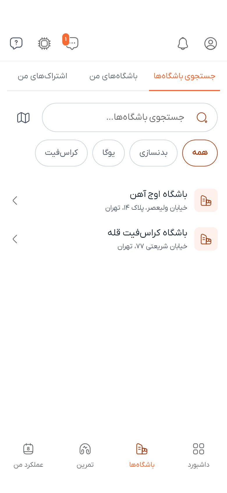
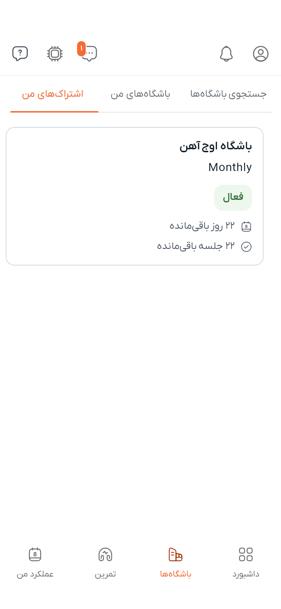
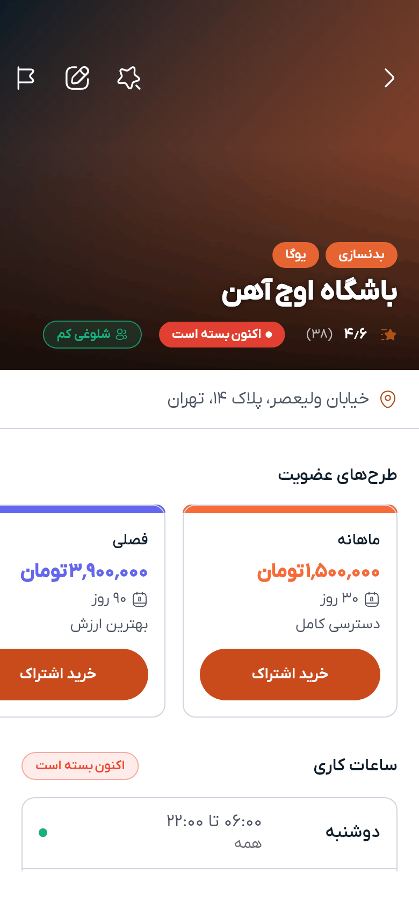
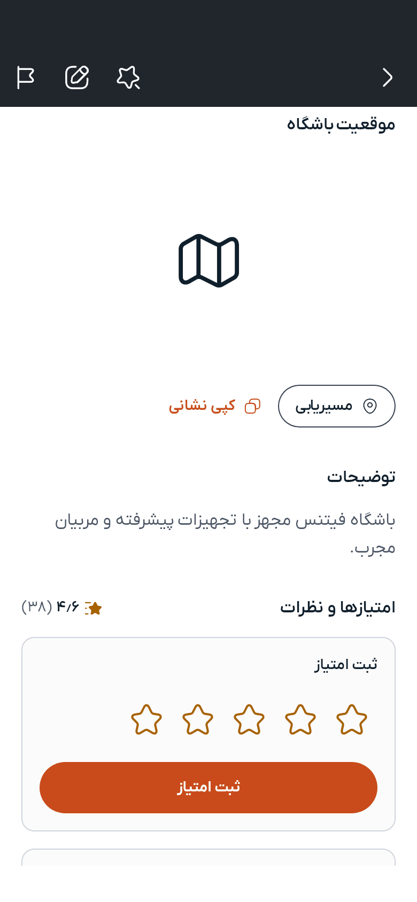
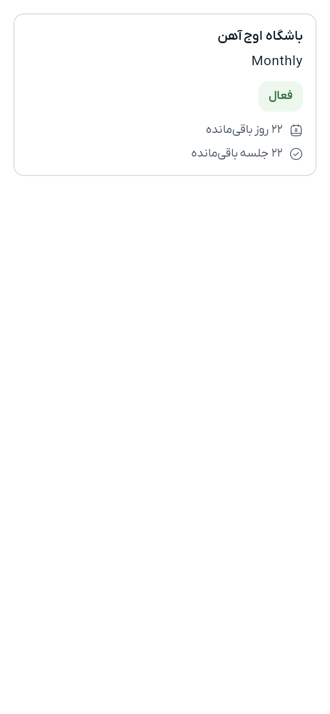
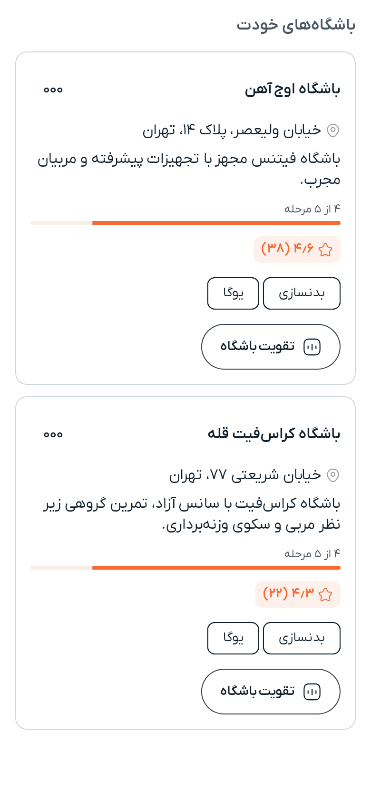
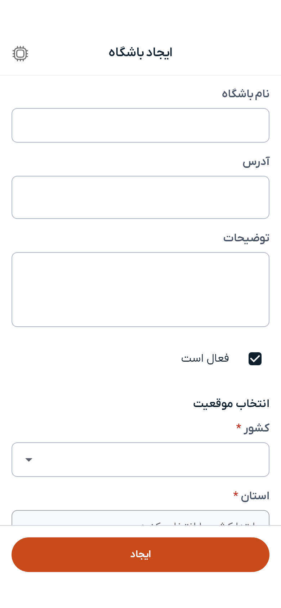
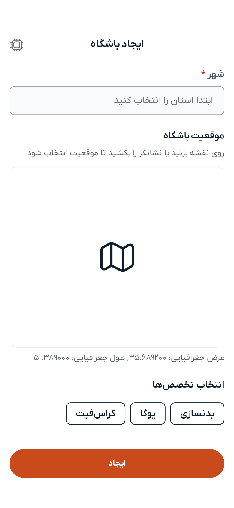
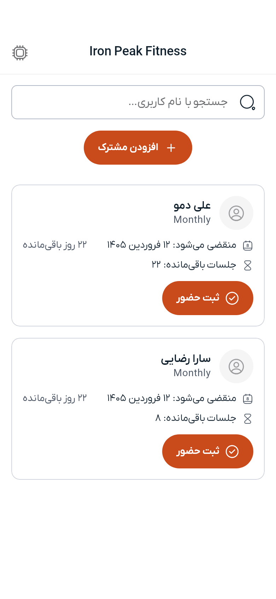
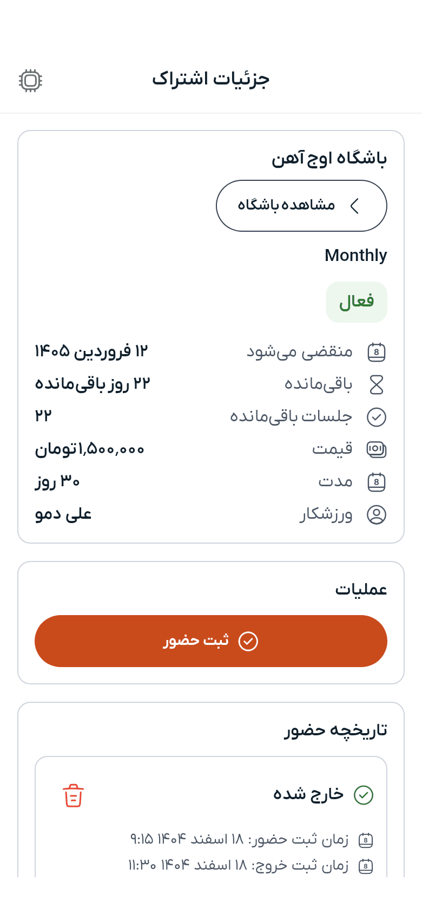

# باشگاه‌ها

بخش «باشگاه‌ها» گرد یک نقشه ساخته شده است. باشگاه‌های نزدیک خود را پیدا کنید، ببینید چه دارند، و همان‌جا اشتراک بگیرید.

---

## پیدا کردن باشگاه

### نقشه

بخش «باشگاه‌ها» روی نقشه باز می‌شود. نشانگرهای باشگاه رنگ‌بندی شده‌اند و راهنمایی روی نقشه می‌گوید هر رنگ چه معنایی دارد، تا برای فهمیدنش لازم نباشد نشانگر را بزنید:

| رنگ | معنی |
|---|---|
| سبز | اکنون باز است |
| زرد | امروز دیرتر باز می‌شود |
| قرمز | بسته است |
| نارنجی، با نشان | آگهی تقویت‌شده |

یک نشانگر را بزنید تا خلاصه‌ای ببینید و خلاصه را بزنید تا باشگاه باز شود.

### فهرست

نقشه تنها نمای موجود نیست. «فهرست» نتایج را به فهرستی تبدیل می‌کند که پشت سر هم می‌خوانید و «نقشه» آنها را برمی‌گرداند. زیر نقشه هم برگه‌ای از باشگاه‌های هم‌خوان هست، با پیوندی به دیدن همهٔ آنها در فهرست.

### جستجو و فیلتر

از نوار جستجوی بالا باشگاه را با نام پیدا کنید. زیر آن، ردیفی از چیپ‌ها نتایج را بر پایهٔ رشتهٔ ورزشی محدود می‌کند — بدنسازی، کراس‌فیت، یوگا و بقیه — و «همه» آنها را پاک می‌کند. صفحهٔ فیلتر جداگانه‌ای وجود ندارد.

### موقعیت شما

دکمهٔ موقعیت را بزنید تا نقشه روی محل شما بزرگ‌نمایی کند.

### اگر نقشه بالا نیامد

نقشه‌ای که بالا نیاید همین را می‌گوید و امکان تلاش مجدد می‌دهد؛ در این میان جستجو، چیپ‌ها و فهرست همچنان کار می‌کنند.

---

## جزئیات باشگاه

صفحهٔ جزئیات یک باشگاه این‌ها را نشان می‌دهد:
- نام، نشانی و عکس‌ها
- **ساعات کاری**، به شکل جدول یک هفته، که می‌گوید باشگاه همین حالا باز است یا نه و کِی باز می‌شود
- **جای باشگاه** — با «مسیریابی»، که نشانی را به اپلیکیشن نقشهٔ شما می‌سپارد، و «کپی نشانی»
- رشته‌های ورزشی، تجهیزات، و هر چه بوفه می‌فروشد
- طرح‌های عضویت و قیمتشان
- امتیاز ستاره‌ای مشترکان و نظرهای آنان

### آیا برنامهٔ من اینجا اجرا می‌شود؟

از صفحهٔ یک باشگاه می‌توانید پیش از عضویت، یکی از برنامه‌های تمرینی خود را با تجهیزات آن باشگاه بسنجید. برنامه را انتخاب کنید و دمبل می‌گوید چه چیزی لازم دارد که باشگاه ندارد.

### اگر آگهی مشکلی دارد

«گزارش» روی صفحهٔ باشگاه، آن را با توضیحی کوتاه برای ما می‌فرستد. [گزارش](reporting.md) را ببینید.

---

## اشتراک در باشگاه

در صفحهٔ جزئیات باشگاه، یک طرح عضویت انتخاب کنید و پرداخت را از کیف پول خود انجام دهید. اشتراک فعال شما روی داشبورد دیده می‌شود و همهٔ اشتراک‌هایتان در «اشتراک‌های من» است.

صفحهٔ یک باشگاه برای همه باز می‌شود، چه وارد شده باشند و چه نه؛ می‌توانید پیوند یک باشگاه را برای کسی بفرستید و او آن را می‌بیند. آنچه به حساب نیاز دارد خرید اشتراک است، و کارت طرح همین را می‌گوید و ناموفق نمی‌شود.

---

## مدیریت باشگاه خودتان

اگر مالک باشگاه هستید، باشگاه‌های خود را از «باشگاه‌های من» اداره می‌کنید.

### ایجاد باشگاه

به «باشگاه‌های من ← +» بروید. ایجاد باشگاه تنها چیزهایی را می‌پرسد که باشگاه را معرفی می‌کنند:

- نام، نشانی و توضیحات
- کشور، استان و شهر
- محل باشگاه روی نقشه
- رشته‌های ورزشی

ذخیره کنید تا باشگاه ایجاد شود. فرم بسته نمی‌شود و به فرم ویرایش تبدیل می‌شود؛ حالا هر چیز دیگری که یک باشگاه لازم دارد در همین فرم است — عکس‌ها، ساعات کاری، طرح‌های عضویت، آیتم‌های بوفه، تجهیزات، مدیران و مجوز — و یادداشتی در بالای صفحه همین را می‌گوید.

هر وقت خواستید می‌توانید بیرون بروید و بعد برگردید. تا زمانی که باشگاه عکس، ساعات کاری، طرح عضویت و مجوز نداشته باشد، کارت آن در «باشگاه‌های من» نشان می‌دهد چند مرحله از پنج مرحله انجام شده است، تا باشگاه نیمه‌کاره غافلگیرتان نکند.

اگر حساب شما یک باشگاه دارد و نمی‌تواند باشگاه دیگری بیفزاید، دکمهٔ «+» پیشنهاد نمی‌شود و فهرست دلیلش را می‌گوید.

درون فرم، دو نیمه به دو شکل ذخیره می‌شوند و هر کدام می‌گوید کدام است. اطلاعات خود باشگاه — نام، نشانی، توضیحات، موقعیت و رشته‌ها — با دکمهٔ «ذخیره» که پایین صفحه ثابت است نوشته می‌شود. باقی بخش‌ها، از طرح‌های عضویت تا ساعات کاری، همان لحظه که آنها را اضافه می‌کنید ذخیره می‌شوند و زیر عنوانشان یادداشتی همین را می‌گوید. «حذف باشگاه» در منوی انتهای نوار بالای صفحه است، دور از دکمهٔ ذخیره. اگر با تغییر ذخیره‌نشده‌ای در نیمهٔ بالایی — از جمله جابه‌جایی نشانگر روی نقشه — برگردید، دمبل پیش از رها کردن آن می‌پرسد.

### مجوز باشگاه

هر باشگاه باید مجوز فعالیتش ثبت شده باشد. باشگاه را برای ویرایش باز کنید و کادر **مجوز باشگاه** را پیدا کنید؛ این کادر زیر گالری عکس‌ها و جدا از آن قرار دارد — عکس‌های گالری عمومی هستند، اما مجوز هرگز عمومی نیست.

«بارگذاری مدرک» را بزنید تا از مدرک عکس بگیرید یا از گالری انتخاب کنید. وضعیت زیر آن نشان می‌دهد کار در چه مرحله‌ای است:

| وضعیت | یعنی چه |
|---|---|
| **بارگذاری نشده** | هنوز مدرکی ثبت نشده است. |
| **در انتظار بررسی** | مدرک را دریافت کرده‌ایم و تیم ما در حال بررسی آن است. |
| **تأیید شده** | مجوز باشگاه تأیید شده است. |
| **رد شده** | مشکلی در مدرک وجود داشته. دلیل آن زیر وضعیت نمایش داده می‌شود. |

«تعویض مدرک» مدرک تازه‌ای جایگزین می‌کند و «حذف» آن را برمی‌دارد؛ در هر دو حالت مجوز دوباره به وضعیت در انتظار بررسی بازمی‌گردد، چون مدرک تازه نیاز به بررسی دوباره دارد.

هر وضعیتی به‌جز تأیید شده، به شکل یک نشان کوچک روی کارت باشگاه در **باشگاه‌های من** هم دیده می‌شود تا بدون باز کردن باشگاه متوجه رد شدن مجوز شوید. پس از پایان بررسی، اعلان دریافت می‌کنید.

تنها شما و تیم بررسی ما به این مدرک دسترسی داریم.

### دیده‌شدن

«تقویت» در فرم باشگاه، آگهی شما را برای چند روز مشخص بالای نتایج می‌آورد، با نشانی روی نشانگر و کارت. از کیف پول شما پرداخت می‌شود. [اشتراک ویژه، تقویت و پول](monetization.md) را ببینید.

### باشگاه شما چطور پیش می‌رود

پس از ایجاد باشگاه، فرم آن بخشی به نام «گزارش‌های داده» دارد: چند بار در جستجو آمده، چند بار باز شده، و شلوغ‌ترین ساعت‌ها کدام‌اند. [گزارش‌های داده](analytics.md) را ببینید.

### مشاهده مشترکان

باشگاه خود را باز کنید و «مشترکان» را بزنید تا فهرست همهٔ اعضای فعال با جزئیات اشتراکشان را ببینید. با وارد کردن نام کاربری در کادر جستجو می‌توانید مشترک مشخصی را پیدا کنید.

### افزودن مشترک

اگر عضوی هزینه را حضوری در باشگاه پرداخته است، در فهرست مشترکان «افزودن مشترک» را بزنید، نام او را جستجو کنید و طرح عضویتی را که بابتش پرداخته انتخاب کنید. اشتراک بی‌درنگ آغاز می‌شود و تاریخ پایان و شمار جلسات از همان طرح گرفته می‌شود.

کارمزد دمبل برای این طرح از کیف پول مالک باشگاه کم می‌شود، چون عضو در اپلیکیشن مبلغی نمی‌پردازد. نرخ کارمزد پیش از تأیید نشان داده می‌شود.

### مدیریت اشتراک

هر مشترک را بزنید تا جزئیات اشتراکش را ببینید یا ویرایش کنید.

### مدیران باشگاه

لازم نیست باشگاه را تنها بگردانید. از صفحهٔ باشگاه می‌توانید کاربران دیگر دمبل را به‌عنوان مدیر باشگاه بیفزایید و دقیق تعیین کنید هر کدام چه می‌توانند بکنند — افزودن مشترک، ثبت حضور و ثبت خروج، یا به‌روز نگه‌داشتن طرح‌های عضویت، تجهیزات، آیتم‌های بوفه و ساعات کاری. می‌توانید برای هر مدیر عنوان دلخواه خودتان را بگذارید، مثل «پذیرش»، تا با یک نگاه بدانید هر کسی چه کاره است.

افزودن مدیر به اشتراک ویژه نیاز دارد و این نیاز همیشگی است: تا وقتی اشتراک ویژهٔ شما فعال باشد، مدیران هر کاری را که به آنها سپرده‌اید می‌توانند انجام دهند، و اگر اشتراک تمام شود دسترسی‌هایشان تا زمان تمدید از کار می‌افتد. در این میان چیزی از دست نمی‌رود؛ به‌محض تمدید، دقیقاً از همان‌جا ادامه می‌دهند.

مدیران، باشگاه را در «باشگاه‌های من» و زیر عنوان «باشگاه‌هایی که مدیر آن هستید» پیدا می‌کنند، کنار باشگاه‌های خودشان. آنها تنها همان بخش‌هایی را می‌بینند که به آنها سپرده‌اید، و هرگز تنظیمات، مجوز یا فهرست مدیران باشگاه را نمی‌بینند؛ آنها در اختیار خود شما می‌مانند.

---

> **بعدی:** [مربی پیدا کنید](trainers.md) یا [ببینید باشگاه شما چطور پیش می‌رود](analytics.md)

---

[→ قبلی: مربیان](trainers.md) | [بعدی: گزارش ←](reporting.md)
