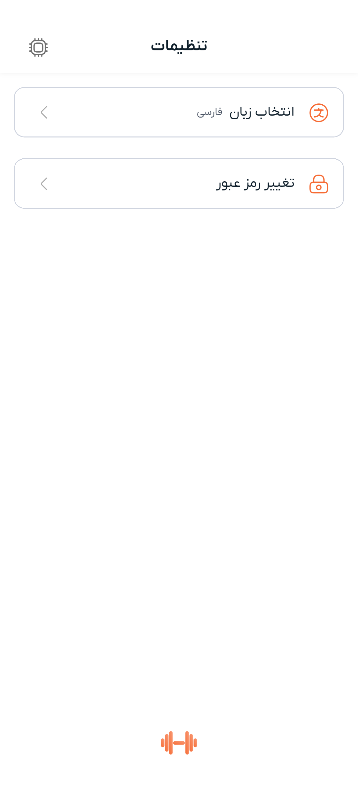
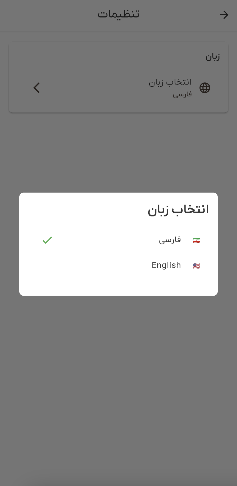

# راهنمای چندزبانه

این راهنما نحوه تغییر زبان اپلیکیشن در دمبل را توضیح می‌دهد. اپلیکیشن از زبان‌های انگلیسی و فارسی پشتیبانی می‌کند و کاربران می‌توانند به راحتی بین آن‌ها تغییر دهند.

## نمای کلی

دمبل از چندین زبان پشتیبانی می‌کند و به طور خودکار ترجیح زبان دستگاه شما را تشخیص می‌دهد. می‌توانید زبان را به صورت دستی و در هر زمان از طریق صفحه تنظیمات تغییر دهید.

## زبان‌های پشتیبانی شده

- **انگلیسی (English)**: زبان پیش‌فرض برای کاربران بین‌المللی
- **فارسی (فارسی)**: زبان اصلی برای کاربران فارسی

## نحوه تغییر زبان اپلیکیشن

### مرحله ۱: دسترسی به تنظیمات

از صفحه اصلی اپلیکیشن:

۱. دنبال تب یا گزینه **تنظیمات** در نوار ناوبری پایین بگردید
۲. روی **تنظیمات** تپ کنید تا صفحه تنظیمات باز شود

همچنین می‌توانید از طریق این مسیرها به تنظیمات دسترسی پیدا کنید:
- تب **پروفایل** → گزینه تنظیمات
- **منوی پروفایل** در گوشه بالا سمت راست

### مرحله ۲: یافتن تنظیمات زبان

در صفحه تنظیمات، بخش **زبان** را خواهید دید که شامل:
- سربرگ بخش با برچسب "زبان" (یا "زبان" به فارسی)
- گزینه انتخاب زبان که زبان فعلی شما را نشان می‌دهد

### مرحله ۳: انتخاب زبان جدید

۱. روی گزینه **زبان** یا **انتخاب زبان** تپ کنید
۲. دیالوگی با گزینه‌های زبان ظاهر می‌شود:
   - **🇮🇷 فارسی** برای فارسی/فارسی
   - **🇺🇸 English** برای انگلیسی
   
   زبان فعلی شما با علامت تیک سبز ✓ مشخص می‌شود

۳. روی زبانی که می‌خواهید تغییر دهید تپ کنید

### مرحله ۴: اعمال زبان

تغییر زبان فوراً اعمال خواهد شد:
- همه متن‌های اپلیکیشن به زبان انتخاب شده به‌روزرسانی می‌شوند
- جهت رابط کاربری به طور خودکار تنظیم می‌شود:
  - **فارسی**: چیدمان راست به چپ (RTL)
  - **انگلیسی**: چیدمان چپ به راست (LTR)
- ترجیح شما به طور خودکار ذخیره می‌شود

## راهنمای تصویری

اینکه فرآیند انتخاب زبان چگونه به نظر می‌رسد:

**صفحه تنظیمات نمایش بخش زبان**

**دیالوگ انتخاب زبان با زبان فعلی مشخص شده**

## رفتار زبان پیش‌فرض

- **اولین راه‌اندازی**: اپلیکیشن به طور پیش‌فرض به فارسی تنظیم می‌شود
- **تشخیص زبان دستگاه**: دستگاه‌های اندروید و iOS تا حد امکان تنظیمات زبان سیستم را در نظر می‌گیرند
- **انتخاب قبلی**: آخرین انتخاب زبان شما در حافظه نگه داشته می‌شود و در راه‌اندازی‌های بعدی اپلیکیشن استفاده می‌شود

## شاخص‌های زبان

اپلیکیشن شاخص‌های بصری واضحی ارائه می‌دهد:

- **پرچم‌ها**: پرچم‌های 🇮🇷 (فارسی) و 🇺🇸 (انگلیسی) در دیالوگ‌های انتخاب
- **تیک‌ها**: تیک سبز ✓ در کنار زبان انتخاب شده فعلی
- **حروفچینی**: نحوه رندر فونت مختلف برای اسکریپت‌های مختلف (لاتین در مقابل عربی/فارسی)

## رفع مشکلات مربوط به زبان

### عدم تغییر زبان

اگر زبان پس از انتخاب تغییر نکرد:

۱. **اطمینان از تکمیل فرآیند**: مطمئن شوید که روی گزینه زبان تپ کرده‌اید، نه فقط دیالوگ را باز کرده‌اید
۲. **بررسی اتصال اینترنت**: فایل‌های زبان از منابع اپلیکیشن بارگذاری می‌شوند، اما اطمینان حاصل کنید که اتصال پایدار دارید
۳. **راه‌اندازی مجدد اپلیکیشن**: اپلیکیشن را کامل ببندید و دوباره باز کنید تا رابط تازه شود
۴. **به‌روزرسانی اپلیکیشن**: اطمینان حاصل کنید که آخرین نسخه دمبل را نصب کرده‌اید

### ترجمه‌های ناقص

اگر برخی متن‌ها ترجمه نشده باشند:

۱. **ترجمه جزئی**: برخی ویژگی‌های جدید ممکن است هنوز در حال توسعه باشند
۲. **اصطلاحات فنی**: برخی اصطلاحات فنی ممکن است برای سازگاری در انگلیسی باقی بمانند
۳. **به‌روزرسانی اپلیکیشن**: بررسی کنید که به‌روزرسانی‌های اپلیکیشن شامل ترجمه‌های جامع‌تر باشد

### مشکلات چیدمان رابط کاربری

اگر چیدمان پس از تغییر زبان مشکل داشته باشد:

۱. **راه‌اندازی مجدد اپلیکیشن**: اپلیکیشن را کاملاً ببندید و دوباره باز کنید
۲. **پاک کردن کش**: در صورت ادامه مشکل، کش اپلیکیشن را در تنظیمات دستگاه پاک کنید
۳. **گزارش مشکل**: در صورت ادامه مشکلات چیدمان، با پشتیبانی تماس بگیرید

## ویژگی‌های خاص زبان

### ویژگی‌های زبان فارسی
- **چیدمان RTL**: کل رابط به جهت خواندن راست به چپ تغییر می‌کند
- **حروفچینی فارسی**: رندر متن بهینه‌شده برای اسکریپت فارسی
- **سازگاری فرهنگی**: فرمت‌های تاریخ، فرمت‌های اعداد و قراردادهای فرهنگی

### ویژگی‌های زبان انگلیسی
- **چیدمان LTR**: چیدمان رابط استاندارد چپ به راست
- **استانداردهای بین‌المللی**: فرمت‌های تاریخ و اعداد انگلیسی
- **اصطلاحات فنی**: اصطلاحات فنی انگلیسی برای شفافیت حفظ می‌شوند

## تنظیمات پیشرفته

برای توسعه‌دهندگان و کاربران پیشرفته:

- **فایل‌های زبان**: در `src/lib/l10n/` قرار دارند
- **رفتار بازگشت**: در صورت عدم دسترسی زبان درخواستی، به انگلیسی بازمی‌گردد
- **تغییر زمان واقعی**: تغییرات زبان فوراً و بدون راه‌اندازی مجدد اپلیکیشن اعمال می‌شوند
- **ذخیره دائمی**: ترچیح زبان امن و در دستگاه ذخیره می‌شود

## دریافت راهنمایی

اگر همچنان با تنظیمات زبان مشکل دارید:

۱. **بررسی نسخه اپلیکیشن**: اطمینان حاصل کنید که آخرین نسخه را اجرا می‌کنید
۲. **زبان دستگاه**: تنظیمات زبان اصلی دستگاه خود را تأیید کنید
۳. **تماس با پشتیبانی**: با جزئیات خاص مشکل خود با تیم پشتیبانی ما تماس بگیرید
۴. **پاک کردن داده‌ها**: به عنوان آخرین راه‌حل، داده‌های اپلیکیشن را پاک کنید و دوباره پیکربندی کنید (باید دوباره وارد شوید)

به یاد داشته باشید که ترجیحات زبان تنظیمات شخصی هستند و تغییر آن‌ها تنها حساب کاربری شما را در دستگاه شما تحت تأثیر قرار می‌دهد.
