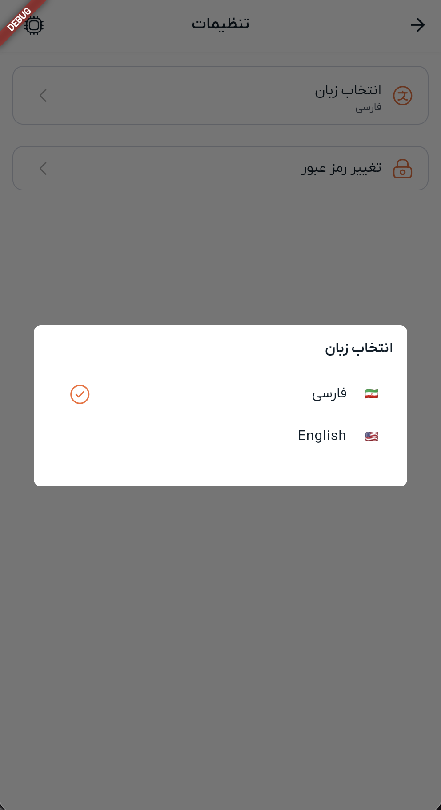

# تنظیمات زبان

اپ به فارسی و انگلیسی حرف می‌زنه. هر وقت خواستی می‌تونی عوضش کنی – دو ثانیه بیشتر طول نمی‌کشه.

## عوض کردن زبان

از منوی پایین برو تو تنظیمات. بالای صفحه یه گزینه زبان با آیکون کره زمین می‌بینی. بزن روش و زبونت رو انتخاب کن – یا فارسی (🇮🇷 فارسی) یا انگلیسی (🇺🇸 English). زبان فعلیت یه تیک کنارش داره.

همین که روی یه زبان بزنی، همه چی عوض میشه. تمام متن‌ها آپدیت میشن، و اگه داری میری سمت فارسی، کل صفحه راست به چپ میشه. اگه میری سمت انگلیسی، برمی‌گرده چپ به راست. انتخابت خودکار ذخیره میشه، پس دفعه بعد که اپ رو باز کنی، همون زبونی که انتخاب کردی رو داره.

## چی عوض میشه

وقتی زبان رو عوض می‌کنی، تقریبا همه چیز تطبیق پیدا می‌کنه. تمام دکمه‌ها، برچسب‌ها، پیام‌ها و صفحات به زبونی که انتخاب کردی نمایش داده میشن. جهت صفحه هم عوض میشه – فارسی راست به چپ خونده میشه، انگلیسی چپ به راست. حتی چیزایی مثل فرمت تاریخ هم با قراردادهای اون زبان تنظیم میشن.

اپ وقتی اولین بار نصبش می‌کنی، پیش‌فرض فارسیه، ولی بعد از اینکه یه بار انتخاب کردی، یادش می‌مونه. ترجیح زبانت حتی اگه اپ رو ببندی یا گوشیت رو ریستارت کنی، باقی می‌مونه.

## هوش مصنوعی می‌تونه کمک کنه

دستیار هوش مصنوعی می‌تونه برات زبان رو عوض کنه. فقط وقتی تو صفحه تنظیمات هستی، اون رو باز کن (روی آیکون ربات 🤖 بزن) و یه چیزی مثل "زبان رو عوض کن به انگلیسی" یا "برو فارسی" بگو. هوش مصنوعی خودش انجامش میده و یه نوتیفیکیشن بهت نشون میده که کارش تموم شده.

## وقتی مشکل پیش میاد

زبان عوض نمیشه؟ مطمئن شو که واقعا روی یکی از گزینه‌های زبان تو دیالوگ زدی، نه اینکه فقط بازش کردی و بستیش. اگه هنوز گیر کرده، اپ رو کامل ببند و دوباره بازش کن.

بعضی متن‌ها ترجمه نشدن؟ ممکنه بعضی از قابلیت‌های جدیدتر هنوز دارن ترجمه‌شون رو کامل می‌کنن. چک کن ببین آپدیت جدیدی برای اپ هست یا نه – همیشه داریم ترجمه‌های کامل‌تر اضافه می‌کنیم.

چیدمان صفحه بعد از عوض کردن زبان عجیب شده؟ اپ رو ببند و دوباره باز کن. اگه درست نشد، کش اپ رو از تنظیمات گوشیت پاک کن. هنوز مشکل داری؟ به پشتیبانی پیام بده.

## بخش فنی

اپ از دو زبان پشتیبانی می‌کنه: فارسی (fa) و انگلیسی (en). انتخاب زبانت به صورت امن روی گوشیت ذخیره میشه. وقتی عوض می‌کنی، تغییر فورا اعمال میشه و نیازی نیست چیزی رو ریستارت کنی. اپ ترجیح زبانت رو به سرور هم می‌فرسته تا چیزایی مثل نوتیفیکیشن‌ها و ایمیل‌ها به زبان درست برات بیان.

اگه کنجکاوی، فایل‌های زبان تو پوشه localization اپ هستن، و یه fallback به انگلیسی هم هست اگه مشکلی تو لود کردن ترجمه‌ها پیش بیاد.
