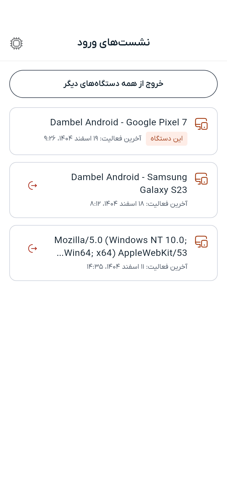

# نشست‌های ورود

---

## نشست ورود چیست

هر بار که وارد دمبل می‌شوید — روی گوشی، تبلت یا در مرورگر — حساب شما آن دستگاه را به عنوان یک **نشست ورود** به خاطر می‌سپارد. صفحهٔ نشست‌های ورود همهٔ دستگاه‌هایی را که در این لحظه به حساب شما وارد هستند نشان می‌دهد و دستگاهی که هم‌اکنون با آن کار می‌کنید با برچسب **این دستگاه** مشخص می‌شود.

هر وقت جایی وارد شده‌اید که در اختیار خودتان نیست، یا اعلانی دربارهٔ ورودی ناآشنا گرفتید، سری به این صفحه بزنید.

---

## پیدا کردن فهرست

۱. **تنظیمات** را باز کنید
۲. «نشست‌های ورود» را بزنید

دستگاه‌ها از فعال‌ترین به قدیمی‌ترین مرتب شده‌اند. هر ردیف نام دستگاه و زمان آخرین فعالیت آن را نشان می‌دهد. نشستی که پس از ورود استفاده نشده باشد، به جای زمان همین را می‌گوید.

---

## خارج کردن یک دستگاه

نشان خروج را در هر ردیفی جز «این دستگاه» بزنید و تأیید کنید. آن دستگاه بی‌درنگ از حساب خارج می‌شود: کار بعدی‌اش هرچه باشد، به صفحهٔ ورود برمی‌گردد.

دستگاه کنونی را نمی‌توانید از این فهرست خارج کنید؛ کار «خروج از حساب» در منوی پشت تصویر شما همین است، و جدا نگه‌داشتن این دو یعنی هرگز ناخواسته سر از صفحهٔ ورود درنمی‌آورید.

---

## خروج از همه جای دیگر

«خروج از همه دستگاه‌های دیگر» همهٔ نشست‌ها را جز نشستی که با آن کار می‌کنید پایان می‌دهد. اگر گمان می‌کنید کسی رمز شما را دارد، سریع‌ترین کار همین است: از همه جای دیگر خارج شوید و بعد رمز عبورتان را عوض کنید.

وقتی تنها دستگاه واردشده همین یکی باشد، این دکمه دیده نمی‌شود.

---

## روی دستگاهی که خارجش کردید چه می‌گذرد

نه اتفاق عجیبی می‌افتد و نه بی‌درنگ. دفعهٔ بعد که آن دستگاه چیزی از دمبل بخواهد، به صفحهٔ ورود بازگردانده می‌شود. ورود دوباره مثل همیشه کار می‌کند و نشست تازه‌ای می‌سازد.

هر چیزی که فقط روی آن دستگاه بوده و ذخیره نشده — مثلاً فرمی که نیمه‌کاره پر شده — از دست می‌رود، درست مثل وقتی که برنامه بسته شود.

---

## اعلان ورود از دستگاه جدید

وقتی حساب شما از دستگاهی وارد شود که تا کنون دیده نشده، اعلانی می‌گیرید. با زدن آن مستقیم به همین صفحه می‌آیید تا هر چه را نمی‌شناسید خارج کنید.

---

> **بعدی:** [دربارهٔ دستیار هوشمند بخوانید](ai-assistant.md) یا [به فهرست راهنما برگردید](README.md)

---

[→ قبلی: تنظیمات](settings.md) | [بعدی: داشبورد ←](dashboard.md)
