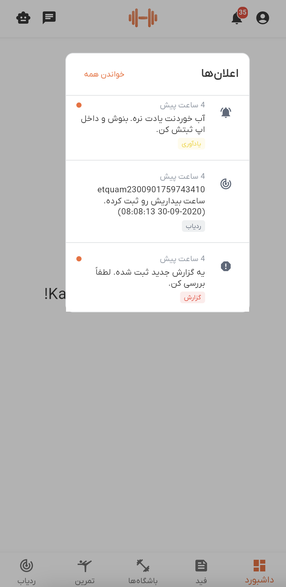

# راهنمای اعلان‌ها

با سفر تناسب اندامتان به‌روز بمانید! دمبل اعلان‌هایی درباره فعالیت‌های مهم مثل نظرات، پرداخت‌ها، به‌روزرسانی‌های باشگاه و یادآوری‌های تمرین برایتان می‌فرستد.

## نحوه مشاهده اعلان‌ها

روی آیکون زنگ اعلان در برنامه کلیک کنید تا همه اعلان‌هایتان را ببینید. جدیدترین‌ها در بالا نمایش داده می‌شوند.

هر اعلان نشان می‌دهد:
- **آیکون** - نوع اعلان را مشخص می‌کند
- **زمان** - زمان دریافت (مثل "۲ ساعت پیش")
- **پیام** - محتوای اعلان
- **نقطه نارنجی** - یعنی هنوز نخوانده‌اید

## انواع اعلان‌ها

آیکون‌های مختلف برای انواع مختلف اعلان‌ها خواهید دید:

- 💬 **نظرات** - کسی روی پست شما نظر داده
- 💳 **پرداخت‌ها** - به‌روزرسانی‌های پرداخت یا صورتحساب
- ⭐ **امتیازات** - امتیازات یا نظرات جدید
- 👤 **کاربران** - درخواست دوستی یا به‌روزرسانی پروفایل
- 🏋️ **باشگاه** - اعلانات باشگاه یا تغییرات برنامه
- 📊 **گزارش‌ها** - گزارش‌ها یا مسائل مهم
- 💬 **چت** - پیام‌های جدید
- 🤸 **تمرین** - به‌روزرسانی‌های تمرین
- 📊 **عملکرد من** - به‌روزرسانی‌های پیشرفت
- 🔔 **یادآوری‌ها** - یادآوری‌های تمرین

## مدیریت اعلان‌ها

### علامت‌گذاری به عنوان خوانده شده
- **روی هر اعلان کلیک کنید** تا به عنوان خوانده شده علامت‌گذاری شود (نقطه نارنجی ناپدید می‌شود)
- **از دکمه "علامت‌گذاری همه به عنوان خوانده شده"** استفاده کنید تا همه اعلان‌ها را یکجا پاک کنید

### دریافت اعلان‌های بیشتر
- **به پایین اسکرول کنید** تا اعلان‌های قدیمی‌تر بارگذاری شوند
- **به پایین بکشید** تا به‌روزرسانی شده و اعلان‌های جدید دریافت کنید

## رفع مشکلات

**اعلان‌ها نمایش داده نمی‌شوند؟**
- اتصال اینترنت خود را بررسی کنید
- فهرست را به‌روزرسانی کنید
- مطمئن شوید که وارد شده‌اید

**نیاز به کمک دارید؟**
- اگر مشکلی دارید با پشتیبانی تماس بگیرید
- تنظیمات اعلان خود را در برنامه بررسی کنید

همین! اعلان‌ها به شما کمک می‌کنند با جامعه تناسب اندامتان در ارتباط بمانید و هیچ به‌روزرسانی مهمی را از دست ندهید.
