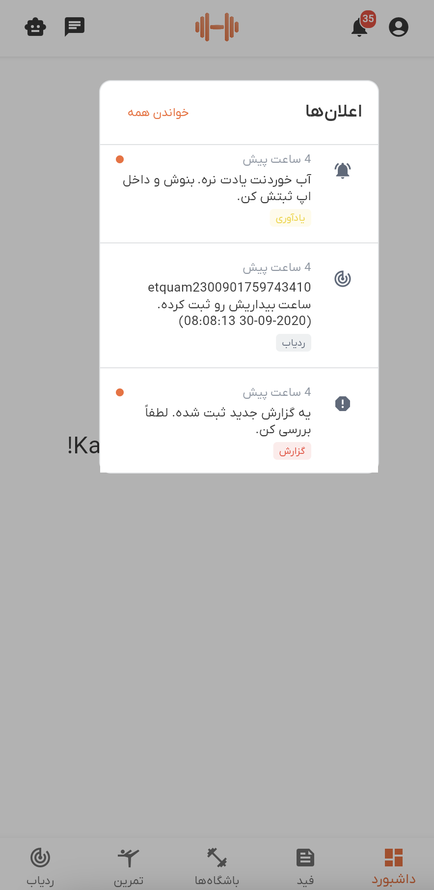

# اعلان‌ها

اعلان‌ها کمک می‌کنن همیشه از اتفاقات دنیای ورزشیت باخبر باشی. پیام‌های جدید، یادآوری تمرین‌ها، آپدیت‌های مربی، پیشرفت‌هات – همه‌شون اینجا نمایش داده میشن تا هیچی رو از دست ندی.

## رفتن به اعلان‌ها

روی آیکون زنگ بالای صفحه بزن. اگه اعلان خونده نشده داشته باشی، یه نشان کوچیک با تعداد اعلان‌ها نمایش داده میشه.

## چی میبینی

وقتی پنل اعلان‌ها رو باز می‌کنی، جدیدترین اعلان‌ها بالای لیست هستن. هر کدوم یه آیکون داره که نوعش رو نشون میده، خود پیام، و اینکه چقدر وقته رسیده (مثلا «۲ ساعت پیش» یا «همین الان»).

اعلان‌های خونده نشده یه نقطه رنگی کوچیک سمت راستشون دارن. وقتی روی یه اعلان بزنی، اون نقطه ناپدید میشه و به عنوان خونده شده علامت‌گذاری میشه.

پنل هر بار ۲۰ تا اعلان نشون میده. به پایین اسکرول کن تا ته لیست، اگه اعلان قدیمی‌تر داشته باشی خودکار لود میشن.

## انواع اعلان‌ها

اتفاقات مختلف توی برنامه اعلان‌های مختلفی میفرستن. اینا چیزایی هستن که ممکنه ببینی:

کامنت‌ها روی پست‌ها یا فعالیت‌هات. تاییدیه پرداخت وقتی اشتراک پرمیوم یا باشگاه می‌خری. امتیازها و نظرات از کاربرای دیگه. تخصیص نقش اگه مربی بشی یا دسترسی خاصی بگیری. جوایز معرفی وقتی دوستات با کد تو عضو میشن.

چیزای مربوط به باشگاه مثل ورود، خروج، اشتراک جدید، یا تغییر برنامه‌ها. شاگردای جدید اگه مربی هستی، یا آپدیت‌ها وقتی مربیت برنامه تمرینی یا رژیم غذاییت رو میسازه یا تغییر میده.

پیام‌های چت از گفتگوهات. آپدیت‌های تمرینی درباره برنامه‌های ورزشی و رژیم. اعلان‌های عملکرد من وقتی خودت یا آدمایی که دنبال می‌کنی فعالیت‌هایی مثل غذا، آب، تمرین، خواب، مکمل، یا وزن ثبت می‌کنن.

یادآوری‌هایی که تنظیم کردی برای تمرین‌ها، غذاها، آب خوردن، خواب، ثبت وزن، مکمل‌ها، یا زمان بیدار شدن.

هر نوع اعلان آیکون مخصوص خودش رو داره که بتونی سریع نگاه کنی و بفهمی چیه.

## مدیریت اعلان‌ها

روی هر اعلان بزن تا به عنوان خونده شده علامت‌گذاری بشه. نقطه رنگی ناپدید میشه و میره توی لیست خونده شده‌ها.

یه عالمه اعلان خونده نشده داری؟ دکمه «علامت‌گذاری همه به عنوان خوانده شده» بالا سمت راست پنل رو بزن. یه دفعه همه رو پاک می‌کنه.

از بالای لیست به پایین بکش تا رفرش بشه و اعلان‌های جدید چک بشن. به پایین اسکرول کن تا اعلان‌های قدیمی‌تر لود بشن.

## آپدیت‌های لحظه‌ای

اعلان‌ها وقتی داری از برنامه استفاده می‌کنی لحظه‌ای میرسن. نیازی نیست دستی رفرش کنی – خودشون همینطوری که اتفاق می‌افتن نمایش داده میشن. نشان روی آیکون زنگ هم خودکار آپدیت میشه.

## وقتی مشکلی پیش میاد

اعلان‌ها لود نمیشن؟ اتصال اینترنتت رو چک کن و سعی کن از بالا به پایین بکشی تا رفرش بشه. اگه پیغام خطا دیدی، معمولا یه دکمه «تلاش مجدد» هست که می‌تونی بزنی.

اگه پنل خالیه و انتظار اعلان داری، مطمئن شو که لاگین کردی. بعضی وقتا خروج و ورود دوباره کمک می‌کنه همه چی ریست بشه.

هنوز مشکل داری؟ تیم پشتیبانی می‌تونه کمک کنه – منوی تنظیمات رو برای گزینه‌های تماس چک کن.

## نکته‌ها

پنل اعلان‌ها طوری طراحی شده که سریع باشه و مزاحمت ایجاد نکنه. بازش کن، یه نگاه به چیزای جدید بنداز، روی چیزای مهم بزن، و برگرد سر کارت.

اگه مربی هستی و شاگردای زیادی داری، ممکنه جریان مداوم اعلان داشته باشی. دکمه علامت‌گذاری همه به عنوان خوانده شده دوست خوبیه.

اعلان‌ها تا وقتی آماده باشی باهاشون کار کنی میمونن. نیازی نیست فورا پاکشون کنی – وقتی نیازشون داشتی همونجا هستن.
