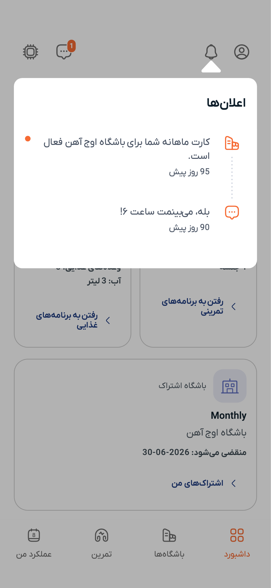

# اعلان‌ها

اعلان‌ها شما رو در جریان نگه می‌دارن — پرداخت‌ها، آپدیت‌های مربی، خبرهای باشگاه و بیشتر.

---

## دسترسی به اعلان‌ها

روی **آیکون زنگ** در بالای صفحه ضربه بزنید. یک نشان قرمز تعداد اعلان‌های خوانده‌نشده را نشان می‌دهد.

---

## چه چیزهایی اعلان ایجاد می‌کنند

| نوع | مثال |
|---|---|
| **پرداخت‌ها** | «اشتراک شما تمدید شد» |
| **امتیاز و نظرات** | «علی به شما ۵ ستاره داد» |
| **تغییر نقش** | «مجوز مربیگری به شما اعطا شد» |
| **معرفی** | «کسی با کد معرف شما ثبت‌نام کرد» |
| **رویدادهای باشگاه** | «اشتراک باشگاه شما ۳ روز دیگر منقضی می‌شود» |
| **چت** | «پیام جدید از مربی شما» |
| **به‌روزرسانی تمرینی** | «مربی شما برنامه تمرینی را به‌روز کرد» |
| **یادآوری ردیاب** | «فراموش نکنید تمرین امروز را ثبت کنید» |
| **نظرات** | «مربی شما روی پیشرفتتان نظر داد» |

---

## خواندن اعلان‌ها

- روی یک اعلان ضربه بزنید تا به عنوان خوانده‌شده علامت‌گذاری شود و به صفحه مربوطه بروید
- روی **علامت‌گذاری همه به عنوان خوانده‌شده** ضربه بزنید تا همه را یکجا پاک کنید

---

## بارگذاری اعلان‌های قدیمی‌تر

اعلان‌ها ۲۰ تا ۲۰ تا بارگذاری می‌شوند. به پایین لیست اسکرول کنید تا قدیمی‌تر‌ها به صورت خودکار بارگذاری شوند.

---

## اعلان‌های Push

دمبل از Firebase Cloud Messaging (FCM) برای ارسال اعلان‌های Push حتی وقتی اپ بسته است استفاده می‌کند. در اولین راه‌اندازی از شما خواسته می‌شود اعلان‌ها را مجاز کنید — پیشنهاد می‌کنیم آن را فعال کنید تا از تمرین عقب نمانید.

---

> **بعدی:** [چت را بررسی کنید](chat.md) یا [پروفایل را ویرایش کنید](profile.md)
