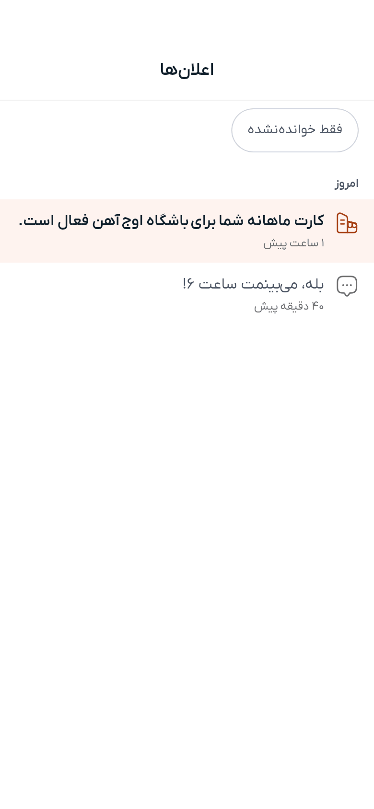
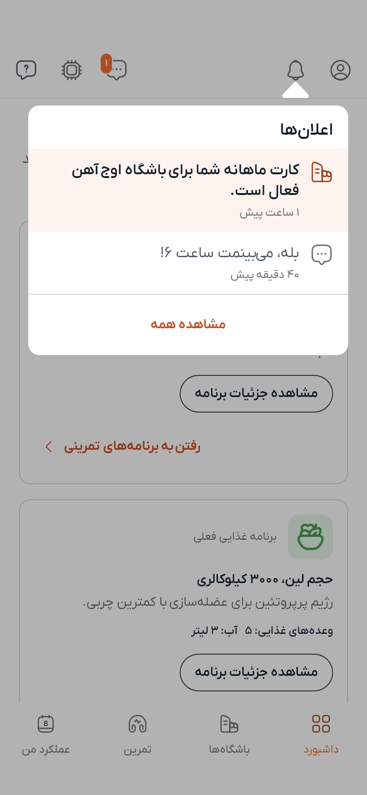

# اعلان‌ها

اعلان‌ها شما را در جریان می‌گذارند — پرداخت‌ها، خبرهای مربی، رویدادهای باشگاه و بیشتر.

---

## زنگ، و صندوقی که پشت آن است

نشان زنگ را در بالای صفحه بزنید. نشانی روی آن، شمار اعلان‌های خوانده‌نشده را می‌گوید.

زنگ یک **پیش‌نمایش** باز می‌کند: چند اعلان تازه و راهی به بقیه. کارش این است که بگوید چه چیزی تازه است و بعد کنار برود. «مشاهده همه» در پایین آن، صندوق اعلان‌ها را باز می‌کند که صفحه‌ای مستقل است و هر چه در ادامه می‌آید آنجا رخ می‌دهد.

---

## چه چیزهایی اعلان می‌سازند

| نوع | نمونه |
|---|---|
| **پرداخت‌ها** | «اشتراک شما تمدید شد» |
| **امتیاز و نظر** | «علی به شما ۵ ستاره داد» |
| **تغییر نقش** | «نقش مربی به شما داده شد» |
| **دعوت از دوستان** | «کسی با کد معرف شما ثبت‌نام کرد» |
| **بررسی مدارک** | «مدرک مربیگری شما تأیید شد» |
| **رویدادهای باشگاه** | «اشتراک باشگاه شما ۳ روز دیگر تمام می‌شود» |
| **گفتگو** | «پیام تازه از مربی شما» |
| **به‌روزرسانی تمرینی** | «مربی شما برنامهٔ تمرینی را ویرایش کرد» |
| **یادآوری عملکرد** | «تمرین امروز خود را ثبت کنید» |
| **نظرها** | «مربی شما دربارهٔ پیشرفت شما نظر داد» |

---

## خواندن اعلان‌ها

- روی یک اعلان بزنید تا خوانده‌شده علامت بخورد و به آنچه دربارهٔ آن است بروید. این هم در پیش‌نمایش کار می‌کند و هم در صندوق.
- «خواندن همه» نشان تیک در نوار بالای صندوق است و فقط تا وقتی چیزی خوانده‌نشده باشد دیده می‌شود.
- «فقط خوانده‌نشده» در بالای صندوق، هر چه را دیده‌اید پنهان می‌کند.

---

## حذف یک اعلان

در صندوق، اعلان را به کناری بکشید. بی‌درنگ حذف می‌شود و پیامی چند ثانیه امکان بازگرداندنش را می‌دهد؛ پس از آن دیگر برنمی‌گردد.

---

## اعلان‌های قدیمی‌تر

صندوق با پایین رفتن شما اعلان‌های بیشتری می‌آورد. پیش‌نمایشِ پشت زنگ این کار را نمی‌کند و همیشه فقط چند اعلان تازه است.

---

## اعلان‌های فوری

دمبل حتی وقتی برنامه بسته است اعلان می‌فرستد. در نخستین اجرا از شما اجازه خواسته می‌شود؛ پیشنهاد می‌کنیم اجازه بدهید تا از تمرین‌های خود عقب نمانید.

---

> **بعدی:** [گفتگوها را ببینید](chat.md) یا [پروفایل خود را ویرایش کنید](profile.md)

---

[→ قبلی: گفتگو](chat.md) | [بعدی: کیف پول ←](wallet.md)
