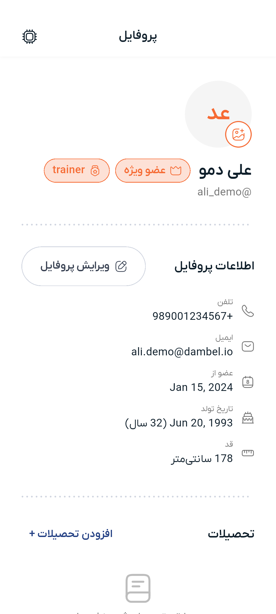
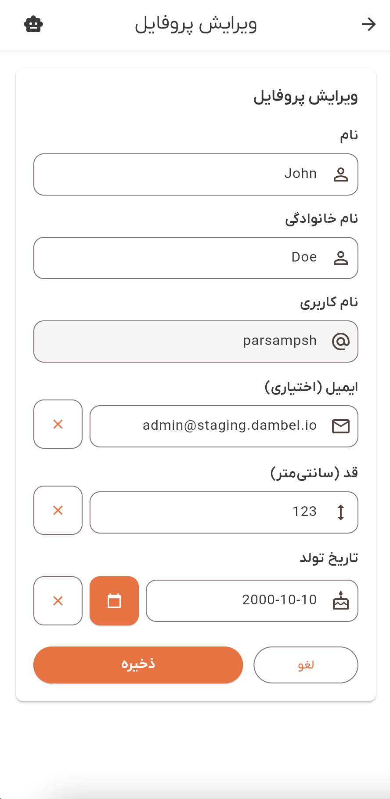
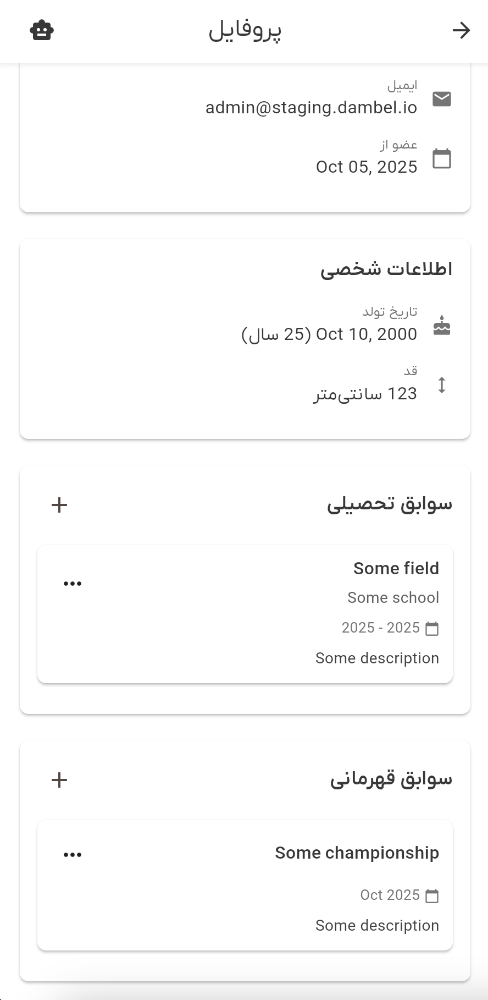
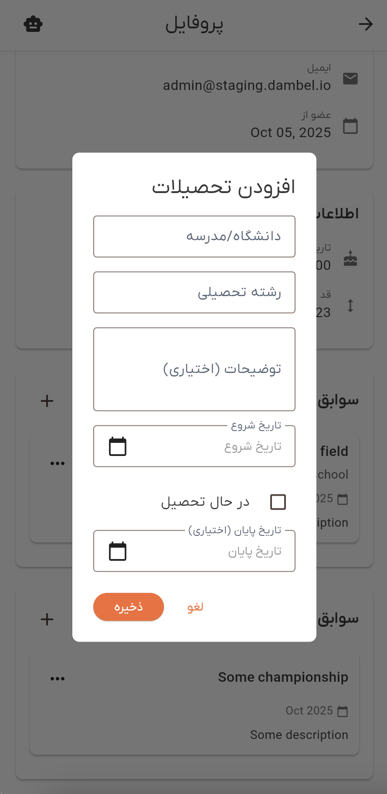
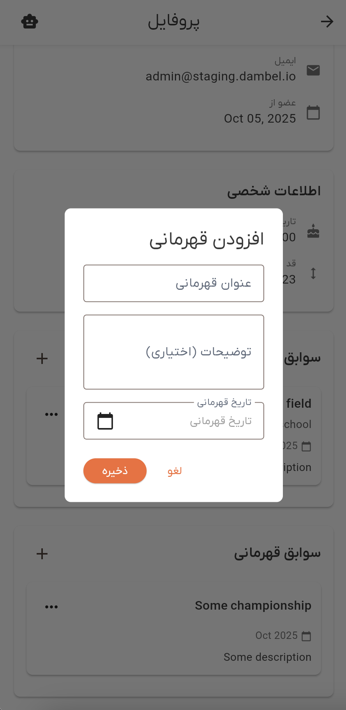

# راهنمای پروفایل

به بخش پروفایل دمبل خوش آمدید. این راهنمای جامع شما را با تمام ویژگی‌های پروفایل آشنا می‌کند، از جمله مشاهده اطلاعات، ویرایش جزئیات، مدیریت سوابق تحصیلی، پیگیری قهرمانی‌ها و درک نشان‌ها.

## نمای کلی

بخش پروفایل، ویترین شخصی شما در دمبل است. این بخش اعتبارنامه‌های فیتنس، دستاوردها و اطلاعات شخصی شما را نمایش می‌دهد. می‌توانید پروفایل خود را مشاهده کنید، جزئیات را ویرایش کنید، سوابق تحصیلی را مدیریت کنید، قهرمانی‌های خود را پیگیری کنید و نشان‌های به دست آورده را نمایش دهید.

پروفایل شما اهداف مختلفی دارد:
- **مدیریت اطلاعات شخصی**: جزئیات خود را به‌روز نگه دارید
- **اعتبارنامه‌های حرفه‌ای**: تحصیلات و گواهینامه‌های خود را به نمایش بگذارید
- **دستاوردها**: برد‌های قهرمانی و موفقیت‌های خود را نمایش دهید
- **وضعیت و شناخت**: عضویت پریمیوم و نقش‌های ویژه خود را نشان دهید
- **عکس‌های پروفایل**: چندین عکس در گالری پروفایل خود نمایش دهید

## دسترسی به پروفایل

می‌توانید از هر جای برنامه به پروفایل خود دسترسی پیدا کنید:

1. به دنبال **عکس پروفایل** یا **آواتار** خود در گوشه بالا-راست نوار برنامه بگردید
2. روی عکس پروفایل خود کلیک کنید تا منوی پروفایل باز شود
3. **"پروفایل"** را از منوی کشویی انتخاب کنید

همچنین می‌توانید از منوی اصلی یا نوار کناری به بخش پروفایل بروید.

## صفحه نمای کلی پروفایل

وقتی پروفایل خود را باز می‌کنید، نمای جامعی از تمام اطلاعات خود را که در چندین بخش سازماندهی شده، خواهید دید.

*نمای کلی پروفایل که تمام بخش‌ها را نشان می‌دهد: هدر با آواتار و نشان‌ها، اطلاعات حساب، اطلاعات شخصی، تحصیلات و قهرمانی‌ها*

### هدر پروفایل

هدر پروفایل اولین بخشی است که می‌بینید و شامل موارد زیر است:

#### عکس پروفایل
- عکس پروفایل شما به صورت یک آواتار دایره‌ای در بالا نمایش داده می‌شود
- عکس پروفایل یا حروف اول نام را نشان می‌دهد (اگر عکسی آپلود نشده باشد)
- **نشان پریمیوم**: یک آیکون ستاره طلایی در گوشه پایین-راست ظاهر می‌شود اگر اشتراک پریمیوم داشته باشید
- **چند عکس**: اگر چندین عکس دارید، یک نشان تعداد (مثلاً "🖼️ 3") و یک حاشیه رنگی ظاهر می‌شود
- روی آواتار کلیک کنید تا تمام عکس‌ها را در یک گالری با ناوبری کشیدنی و بند انگشتی مشاهده کنید

#### نام نمایشی و نام کاربری
- **نام نمایشی**: به طور برجسته نمایش داده می‌شود (ساخته شده از نام، نام خانوادگی یا نام کاربری)
- **نام کاربری**: در زیر با پیشوند "@" نمایش داده می‌شود (مثلاً "@johndoe")

#### نشان‌ها
نشان‌ها در زیر نام کاربری شما در ظروف قرص‌مانند رنگارنگ ظاهر می‌شوند:

**نشان پریمیوم**: 
- رنگ طلایی/کهربایی با آیکون ستاره (⭐)
- متن: "عضو پریمیوم"
- نشان می‌دهد که اشتراک پریمیوم فعال دارید
- دسترسی به ویژگی‌های پریمیوم در سراسر برنامه

**نشان‌های نقش**:
- رنگ بنفش با آیکون نشان (🏅)
- نام نقش را نشان می‌دهد (مثلاً "مدیر"، "مربی"، "مربی ورزشی")
- مجوزها و مسئولیت‌های ویژه را نشان می‌دهد
- چندین نشان نقش را می‌توان نمایش داد

### بخش اطلاعات حساب کاربری

این کارت اطلاعات مربوط به حساب کاربری شما را نمایش می‌دهد:

- **شماره تلفن** (📱): شماره تلفن ثبت‌شده برای ورود
- **آدرس ایمیل** (✉️): آدرس ایمیل شما (در صورت ارائه، اختیاری)
- **عضویت از** (📅): تاریخ ایجاد حساب کاربری (فرمت: "روز ماه، سال")

### بخش اطلاعات شخصی

این کارت جزئیات شخصی شما را نمایش می‌دهد:

- **تاریخ تولد** (🎂): تاریخ تولد با سن محاسبه شده (فرمت: "روز ماه، سال (XX سال)")
  - "تنظیم نشده" نشان داده می‌شود اگر ارائه نشده باشد
- **قد** (📏): قد شما به سانتی‌متر (فرمت: "XXX سانتی‌متر")
  - "تنظیم نشده" نشان داده می‌شود اگر ارائه نشده باشد

## ویرایش پروفایل

برای به‌روزرسانی اطلاعات پروفایل، روی دکمه **"ویرایش پروفایل"** در زیر هدر پروفایل کلیک کنید.

*صفحه ویرایش پروفایل که تمام فیلدهای قابل ویرایش را در یک فرم تمیز نشان می‌دهد*

### فیلدهای قابل ویرایش

#### نام (اختیاری)
- ورودی متن با آیکون شخص (👤)
- برای ساخت نام نمایشی استفاده می‌شود
- دکمه پاک کردن وقتی فیلد محتوا دارد ظاهر می‌شود

#### نام خانوادگی (اختیاری)
- ورودی متن با آیکون شخص (👤)
- برای ساخت نام نمایشی استفاده می‌شود
- دکمه پاک کردن وقتی فیلد محتوا دارد ظاهر می‌شود

#### نام کاربری (الزامی)
- ورودی متن با آیکون نماد @
- باید حداقل ۳ کاراکتر باشد
- باید در سیستم منحصر به فرد باشد
- خطاها: "نام کاربری الزامی است"، "نام کاربری باید حداقل ۳ کاراکتر باشد"، "این نام کاربری قبلاً استفاده شده است"

#### ایمیل (اختیاری)
- ورودی ایمیل با آیکون پاکت‌نامه (✉️)
- باید فرمت ایمیل معتبر باشد اگر ارائه شود
- دکمه پاک کردن وقتی فیلد محتوا دارد ظاهر می‌شود
- خطاها: "لطفاً یک آدرس ایمیل معتبر وارد کنید"، "این ایمیل قبلاً استفاده شده است"

#### قد (اختیاری)
- ورودی عدد با آیکون قد (📏)
- باید یک عدد مثبت به سانتی‌متر باشد
- دکمه پاک کردن وقتی فیلد محتوا دارد ظاهر می‌شود
- خطا: "قد باید یک عدد مثبت باشد"

#### تاریخ تولد (اختیاری)
- انتخابگر تاریخ با آیکون کیک (🎂)
- فرمت: "YYYY-MM-DD"
- محدوده: 1900 تا تاریخ فعلی
- روی دکمه تقویم کلیک کنید تا انتخابگر تاریخ باز شود
- دکمه پاک کردن وقتی تاریخ تنظیم شده ظاهر می‌شود

### ذخیره تغییرات

پس از اعمال تغییرات:

1. تمام فیلدهای تغییر یافته را بررسی کنید
2. اطمینان حاصل کنید که تمام فیلدهای الزامی (نام کاربری) پر شده‌اند
3. روی دکمه **"ذخیره"** کلیک کنید

**چه اتفاقی می‌افتد**:
- نشانگر بارگذاری نشان می‌دهد: "در حال ذخیره تغییرات..."
- داده‌ها به سرور ارسال می‌شوند
- **اگر موفق باشد**: پیام موفقیت ظاهر می‌شود، به نمای پروفایل با تغییرات قابل مشاهده هدایت می‌شوید
- **اگر خطا**: پیام خطا مشکل را توضیح می‌دهد، در صفحه ویرایش باقی می‌مانید تا رفع و تلاش مجدد کنید

### لغو تغییرات

روی دکمه **"لغو"** کلیک کنید تا تغییرات را لغو کرده و به نمای پروفایل بازگردید.

### یکپارچگی دستیار هوش مصنوعی

صفحه ویرایش پروفایل با دستیار هوش مصنوعی یکپارچه است:

**هوش مصنوعی می‌تواند کمک کند**:
- فیلدهای فرم را بر اساس گفتگو پر کند
- مقادیر را برای فیلدهای خالی پیشنهاد دهد
- مشکلات قالب‌بندی را اصلاح کند
- از طریق فیلدهای الزامی راهنمایی کند

**نحوه استفاده**:
1. دستیار هوش مصنوعی را در حین حضور در صفحه ویرایش باز کنید (روی آیکون ربات کلیک کنید 🤖)
2. درخواست کمک کنید: "به من در پر کردن پروفایلم کمک کن"
3. اطلاعات را در گفتگو ارائه دهید
4. هوش مصنوعی به طور خودکار فیلدهای فرم را پر می‌کند
5. بررسی کرده و در صورت نیاز تنظیم کنید
6. وقتی راضی بودید ذخیره کنید

وقتی هوش مصنوعی فرم را به‌روزرسانی می‌کند، یک اعلان آبی ظاهر می‌شود: "هوش مصنوعی فرم را به‌روزرسانی کرد"

## سوابق تحصیلی و قهرمانی

هر دو بخش تحصیلات و قهرمانی به طور مشابه کار می‌کنند و به شما امکان می‌دهند اعتبارنامه‌ها و دستاوردهای خود را به نمایش بگذارید.

*بخش‌های تحصیلات و قهرمانی که رکوردها را با دکمه‌های افزودن نمایش می‌دهند*

### سوابق تحصیلی

بخش تحصیلات سوابق تحصیلی، گواهینامه‌ها و اعتبارنامه‌های آموزشی شما را به نمایش می‌گذارد.

**آنچه نمایش داده می‌شود**:
- **نام مدرسه/موسسه**: عنوان پررنگ (مثلاً "دانشگاه دولتی")
- **رشته تحصیلی**: تخصص یا برنامه (مثلاً "علوم ورزشی")
- **بازه زمانی**: "YYYY - YYYY" یا "YYYY - تاکنون" برای تحصیلات در حال انجام
- **توضیحات** (اختیاری): جزئیات اضافی، افتخارات، دستاوردها

**حالت خالی**:
اگر رکورد تحصیلی وجود نداشته باشد، آیکون مدرسه (🎓) با پیام را خواهید دید: "هنوز سوابق تحصیلی وجود ندارد" و "اولین رکورد تحصیلی خود را اضافه کنید"

### سوابق قهرمانی

بخش قهرمانی برد‌های مسابقات، جوایز و دستاوردهای شما را به نمایش می‌گذارد.

**آنچه نمایش داده می‌شود**:
- **عنوان قهرمانی**: عنوان پررنگ (مثلاً "قهرمانی پاورلیفتینگ استانی")
- **تاریخ**: فرمت "ماه yyyy" (مثلاً "ژوئن 2023")
- **توضیحات** (اختیاری): جزئیات اضافی مانند رتبه، دسته، مدال‌ها

**حالت خالی**:
اگر رکورد قهرمانی وجود نداشته باشد، آیکون جام (🏆) با پیام را خواهید دید: "هنوز سوابق قهرمانی وجود ندارد" و "اولین رکورد قهرمانی خود را اضافه کنید"

### افزودن و ویرایش رکوردها

هر دو بخش روند کاری مشابهی دارند:

1. **برای افزودن**: روی آیکون **+ (پلاس)** در هدر بخش کلیک کنید
2. **برای ویرایش**: روی منوی **⋮ (سه نقطه)** در هر رکورد کلیک کنید، "ویرایش" را انتخاب کنید
3. **برای حذف**: روی منوی **⋮ (سه نقطه)** در هر رکورد کلیک کنید، "حذف" را انتخاب کنید (نیاز به تأیید دارد)

### فیلدهای رکورد تحصیلات

*دیالوگ افزودن/ویرایش برای رکوردهای تحصیلات*

**فیلدهای الزامی**:
- **مدرسه** (الزامی): نام موسسه
  - خطا: "لطفاً نام مدرسه را وارد کنید"
- **رشته** (الزامی): رشته تحصیلی یا برنامه
  - خطا: "لطفاً رشته تحصیلی را وارد کنید"
- **تاریخ شروع** (الزامی): زمان شروع برنامه (نمایش به صورت "ماه YYYY")
  - خطا: "لطفاً تاریخ شروع را انتخاب کنید"

**فیلدهای اختیاری**:
- **توضیحات** (اختیاری): متن چند خطی برای اطلاعات اضافی
- **تاریخ پایان** (اختیاری): زمان تکمیل برنامه (نمایش به صورت "ماه YYYY")
- **در حال انجام** (چک‌باکس): اگر در حال حاضر ثبت‌نام کرده‌اید تیک بزنید (تاریخ پایان را مخفی می‌کند، "تاکنون" را نشان می‌دهد)

### فیلدهای رکورد قهرمانی

*دیالوگ افزودن/ویرایش برای رکوردهای قهرمانی*

**فیلدهای الزامی**:
- **عنوان قهرمانی** (الزامی): نام قهرمانی یا مسابقه
  - خطا: "لطفاً عنوان قهرمانی را وارد کنید"
- **تاریخ قهرمانی** (الزامی): زمان برگزاری (نمایش به صورت "ماه yyyy")
  - محدوده: 1950 تا 10 سال در آینده
  - خطا: "لطفاً تاریخ قهرمانی را انتخاب کنید"

**فیلدهای اختیاری**:
- **توضیحات** (اختیاری): متن چند خطی برای اطلاعات اضافی (رتبه، دسته، مدال‌ها)

### ذخیره رکوردها

پس از پر کردن دیالوگ:
1. روی **"ذخیره"** کلیک کنید
2. پیام موفقیت ظاهر می‌شود: "رکورد تحصیلی/قهرمانی با موفقیت ایجاد/به‌روزرسانی شد"
3. دیالوگ بسته می‌شود و پروفایل به‌روزرسانی می‌شود
4. رکورد جدید/به‌روزشده در لیست ظاهر می‌شود

### حذف رکوردها

هنگام حذف:
1. دیالوگ تأیید ظاهر می‌شود: "آیا مطمئن هستید که می‌خواهید این رکورد را حذف کنید؟"
2. **"لغو"**: رکورد را حفظ می‌کند
3. **"حذف"** (قرمز): رکورد را برای همیشه حذف می‌کند
4. پیام موفقیت: "رکورد با موفقیت حذف شد"
5. این عمل قابل بازگشت نیست

### مجوزها

هر دو بخش تحصیلات و قهرمانی از کنترل دسترسی مبتنی بر مجوز استفاده می‌کنند:

**برای پروفایل خودتان**:
- مشاهده: نیاز به مجوز `education.view` یا `championships.view` دارد
- ایجاد: نیاز به مجوز `education.create` یا `championships.create` دارد
- به‌روزرسانی: نیاز به مجوز `education.update` یا `championships.update` دارد
- حذف: نیاز به مجوز `education.delete` یا `championships.delete` دارد

**برای پروفایل‌های کاربران دیگر** (با نقش‌های ویژه):
- نیاز به نوع "_any" مجوزها دارد (مثلاً `education.view_any`)

**توجه**: اگر مجوز مشاهده ندارید، کل بخش مخفی است.

## عکس‌های پروفایل و رسانه

پروفایل شما می‌تواند شامل چندین عکس برای نمایش خودتان باشد.

**ویژگی‌ها**:
- نمایش آواتار دایره‌ای با حروف اول به عنوان جایگزین
- پوشش نشان پریمیوم (در صورت وجود)
- نشانگر تعداد عکس و حاشیه رنگی برای چند عکس
- روی آواتار کلیک کنید تا گالری تمام صفحه باز شود
- گالری از ناوبری کشیدنی، بند انگشتی، بزرگنمایی با دو انگشت پشتیبانی می‌کند

**فرمت‌های پشتیبانی شده**: JPEG/JPG، PNG با شفافیت

## بازخوانی پروفایل

برای اطمینان از مشاهده آخرین اطلاعات:

**بکشید برای بازخوانی**:
1. در صفحه پروفایل خود، از بالا به پایین بکشید
2. یک نشانگر بازخوانی ظاهر می‌شود
3. برنامه داده‌های پروفایل شما را دوباره بارگذاری می‌کند

این پس از اعمال تغییرات از دستگاه دیگری یا پس از به‌روزرسانی‌های سیستم مفید است.

## رفع مشکلات

### پروفایل بارگذاری نمی‌شود

**راه‌حل‌ها**:
1. اتصال اینترنت را بررسی کنید
2. برای بازخوانی به پایین بکشید
3. اگر صفحه خطا ظاهر شد، روی دکمه "تلاش مجدد" کلیک کنید
4. خارج شوید و دوباره وارد شوید
5. حافظه پنهان برنامه را در تنظیمات پاک کنید
6. به آخرین نسخه برنامه به‌روزرسانی کنید

### نمی‌توانم پروفایل را ویرایش کنم

**راه‌حل‌ها**:
1. بررسی کنید که مجوزهای به‌روزرسانی دارید
2. اطمینان حاصل کنید که وارد شده‌اید
3. برنامه را ببندید و دوباره باز کنید
4. اگر مشکل ادامه دارد با پشتیبانی تماس بگیرید

### تغییرات ذخیره نمی‌شوند

**راه‌حل‌ها**:
1. خطاهای اعتبارسنجی را بررسی کنید (پیام‌های قرمز در فیلدها)
2. اطمینان حاصل کنید که فیلد نام کاربری پر شده است
3. اگر خطای "قبلاً استفاده شده" ظاهر شد، نام کاربری دیگری امتحان کنید
4. اگر خطای تضاد ظاهر شد، ایمیل دیگری امتحان کنید
5. اتصال اینترنت پایدار را تأیید کنید
6. صبر کنید و دوباره امتحان کنید

### بخش‌های تحصیلات/قهرمانی قابل مشاهده نیستند

**راه‌حل‌ها**:
1. بررسی کنید که مجوزهای مشاهده دارید
2. درباره مجوزها با مدیر تماس بگیرید
3. پروفایل‌های دیگر را برای مقایسه دیدگاه بررسی کنید

### نمی‌توانم رکوردها را اضافه/ویرایش/حذف کنم

**راه‌حل‌ها**:
1. مجوزهای مناسب را تأیید کنید
2. برای پروفایل خودتان: به مجوزهای ایجاد/به‌روزرسانی/حذف نیاز دارید
3. برای پروفایل‌های دیگر: به نوع "_any" مجوزها نیاز دارید
4. برای درخواست مجوزها با مدیر تماس بگیرید

### عکس‌ها بارگذاری نمی‌شوند

**راه‌حل‌ها**:
1. اتصال اینترنت پایدار را تأیید کنید
2. برای بارگذاری تصاویر صبر کنید
3. برای بازخوانی به پایین بکشید
4. حافظه پنهان برنامه را پاک کنید
5. مشکلات مداوم را به پشتیبانی گزارش دهید

### دستیار هوش مصنوعی فرم را به‌روزرسانی نمی‌کند

**راه‌حل‌ها**:
1. اطمینان حاصل کنید که مجوزهای دستیار هوش مصنوعی دارید
2. صریح باشید: "لطفاً فیلد نام را با جان پر کن"
3. تأیید کنید که در صفحه ویرایش پروفایل هستید
4. دستیار هوش مصنوعی را ببندید و دوباره باز کنید
5. پاسخ هوش مصنوعی را برای پیام‌های خطا بررسی کنید

## حریم خصوصی و داده‌ها

### چه اطلاعاتی قابل مشاهده است

**پروفایل شما نشان می‌دهد**:
- عکس‌های پروفایل (اگر آپلود شده باشد)
- نام نمایشی، نام کاربری
- نشان‌ها (پریمیوم، نقش‌ها)
- اطلاعات حساب (بر اساس تنظیمات حریم خصوصی)
- اطلاعات شخصی (بر اساس تنظیمات حریم خصوصی)
- سوابق تحصیلی و قهرمانی (بر اساس مجوزها)

**چه کسی می‌تواند ببیند**: بستگی به تنظیمات حریم خصوصی دارد. سایر کاربران برنامه ممکن است بر اساس این تنظیمات پروفایل شما را مشاهده کنند.

### ویرایش و حذف اطلاعات

- شما اطلاعات شخصی خود را کنترل می‌کنید
- بیشتر فیلدها را می‌توان در هر زمان ویرایش کرد
- فیلدهای اختیاری (ایمیل، قد، تاریخ تولد) را می‌توان پاک کرد
- رکوردهای تحصیلات و قهرمانی را می‌توان حذف کرد
- برخی اطلاعات اصلی قابل حذف نیستند (نام کاربری، تلفن)
- برای درخواست‌های حذف حساب با پشتیبانی تماس بگیرید

## بهترین روش‌ها

### پروفایل خود را به‌روز نگه دارید
- اطلاعات شخصی را به طور منظم به‌روزرسانی کنید
- تحصیلات و گواهینامه‌های جدید را به سرعت اضافه کنید
- قهرمانی‌ها و دستاوردها را همینطور که اتفاق می‌افتند ثبت کنید
- عکس پروفایل را به طور دوره‌ای به‌روزرسانی کنید

### ارائه حرفه‌ای
- از عکس پروفایل واضح و حرفه‌ای استفاده کنید
- تمام بخش‌های مرتبط را پر کنید
- توضیحات دقیق ارائه دهید
- اطلاعات را دقیق و جاری نگه دارید

### به نمایش گذاشتن دستاوردها
- تمام قهرمانی‌های مرتبط را اضافه کنید
- تحصیلات و گواهینامه‌ها را شامل کنید
- زمینه را در توضیحات ارائه دهید
- صلاحیت‌های منحصر به فرد را برجسته کنید

### ملاحظات حریم خصوصی
- نسبت به اطلاعات شخصی به اشتراک گذاشته شده هوشیار باشید
- از تنظیمات حریم خصوصی برای کنترل دیدگاه استفاده کنید
- پروفایل را از دیدگاه کاربر دیگری بررسی کنید

## دریافت کمک

اگر به کمک نیاز دارید:

1. **دستیار هوش مصنوعی**: درخواست کمک کنید (روی آیکون ربات کلیک کنید 🤖)
2. **پشتیبانی درون‌برنامه‌ای**: گزینه‌های پشتیبانی را در تنظیمات بررسی کنید
3. **مستندات**: سایر مقالات کمک را مرور کنید
4. **تماس با پشتیبانی**: با تیم پشتیبانی دمبل تماس بگیرید
5. **جامعه**: برای نکات به جامعه دمبل بپیوندید

پروفایل شما بخش مهمی از تجربه دمبل شماست. آن را به‌روز نگه دارید و سفر فیتنس خود را به نمایش بگذارید!
