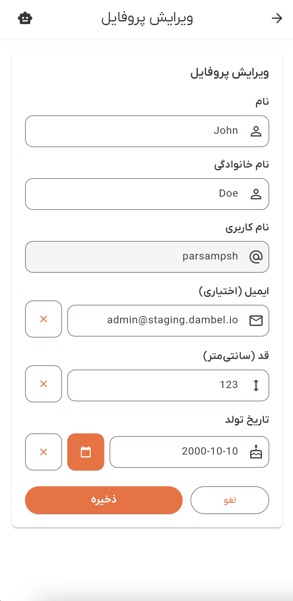
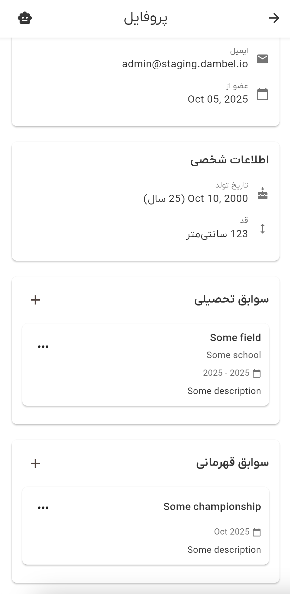
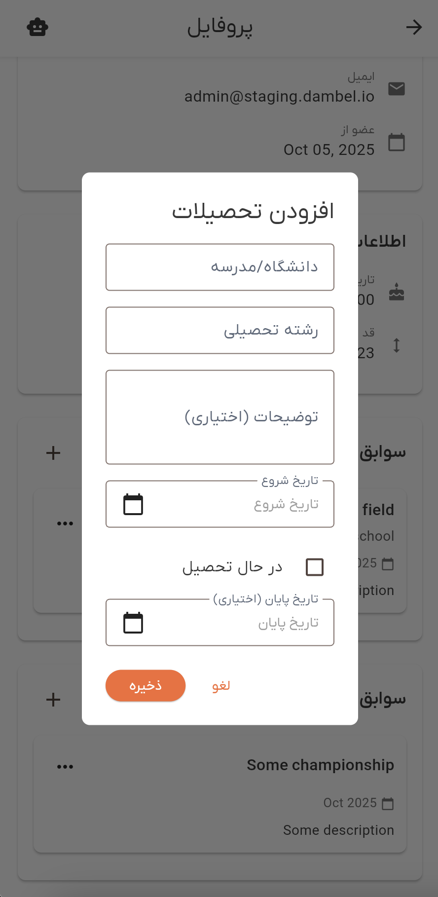
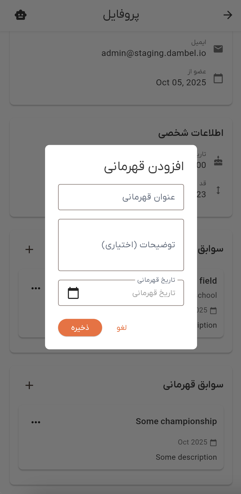

# پروفایل

پروفایل یعنی جایی که خودتون رو توی دنیای فیتنس نشون بدید. فکرش رو بکنید مثل یه کارت شناسایی دیجیتال – اطلاعات شخصی، دستاوردها، تحصیلات و همه قهرمانی‌هایی که تا حالا کسب کردید اینجاست.

## چطوری برم پروفایلم؟

ساده‌ست. روی عکس پروفایلتون که گوشه بالا سمت راست هست بزنید، بعد از منو گزینه "پروفایل" رو انتخاب کنید.

## چی توی پروفایل هست؟

وقتی پروفایلتون رو باز می‌کنید، اینا رو می‌بینید:

عکس پروفایلتون بالای صفحه هست (یا اگه عکسی آپلود نکرده باشید، حروف اول اسمتون). اگه عضویت پریمیوم دارید، یه ستاره طلایی کنار عکستون نشون داده میشه. چند تا عکس آپلود کردید؟ یه حاشیه رنگی دور عکستون میاد و تعداد عکس‌ها رو نشون میده. روی عکس بزنید تا همه عکس‌هاتون رو توی یه گالری تمام صفحه ببینید و بتونید بینشون جابجا بشید.

درست زیرش اسم نمایشی و یوزرنیمتون هست (همونی که با @ شروع میشه). اگه نقش خاصی دارید مثل "مربی" یا "ادمین"، به صورت نشون‌های بنفش نمایش داده میشن. اعضای پریمیوم هم نشون طلایی خودشون رو دارن.

بقیه صفحه به چند تا بخش تقسیم شده:

اطلاعات حسابتون شامل شماره تلفن، ایمیل (اگه اضافه کرده باشید) و تاریخی که عضو شدید. اطلاعات شخصی هم شامل تاریخ تولد (که سنتون رو خودکار حساب می‌کنه) و قدتون به سانتی‌متره. این دوتا اختیاری هستن، پس اگه "تنظیم نشده" می‌بینید یعنی هنوز پرشون نکردید.

## ویرایش پروفایل

می‌خواید چیزی رو عوض کنید؟ روی دکمه "ویرایش پروفایل" بزنید.

می‌تونید اسم، فامیل، یوزرنیم، ایمیل، قد و تاریخ تولدتون رو آپدیت کنید. یوزرنیم تنها چیزی هست که حتماً باید پر بشه – باید حداقل ۳ حرف باشه و یونیک باشه. بقیه دلخواهن.

واسه تاریخ تولد، روی آیکون تقویم بزنید تا یه تاریخ انتخاب کنید. قد رو به سانتی‌متر وارد کنید. هر فیلد یه دکمه × کوچولو داره که وقتی چیزی تایپ کردید نشون داده میشه تا بتونید پاکش کنید.

تموم شد؟ روی "ذخیره" بزنید. اگه مشکلی باشه برنامه بهتون میگه (مثلاً اگه اون یوزرنیم قبلاً گرفته شده باشه). اگه همه چی اوکی باشه، تغییراتتون ذخیره میشه و برمی‌گردید به صفحه پروفایل.

پشیمون شدید؟ فقط "لغو" رو بزنید.

### هوش مصنوعی میاد کمکتون

دستیار هوش مصنوعی می‌تونه پروفایلتون رو براتون پر کنه. فقط بازش کنید (روی آیکون ربات بزنید 🤖) وقتی توی صفحه ویرایش هستید و بهش بگید چی می‌خواید. مثلاً بگید "اسمم رو علی بذار و قدم رو ۱۸۰" خیلی خوب کار می‌کنه. هوش مصنوعی فیلدها رو پر می‌کنه، بعد شما چک می‌کنید و ذخیره می‌کنید. وقتی هوش مصنوعی چیزی رو آپدیت کنه یه نوتیفیکیشن آبی می‌بینید.

## تحصیلات و قهرمانی‌ها

این دو تا بخش تقریباً شبیه هم کار می‌کنن – جایی هستن که مدارکتون و برد‌هاتون رو نشون بدید.

### تحصیلات

اینجا سوابق تحصیلیتون هست – مدارک، گواهینامه‌ها، دوره‌های آموزشی، همه اینا.

هر مورد تحصیلی اسم مدرسه، رشته تحصیلی و بازه زمانی رو نشون میده. اگه الان جایی درس می‌خونید، به جای تاریخ پایان "تاکنون" می‌نویسه. می‌تونید یه توضیحات هم اضافه کنید واسه جزئیات بیشتر مثل افتخارات یا دستاوردهای خاص.

اگه هنوز هیچ رکورد تحصیلی ندارید، یه آیکون مدرسه با یه پیام دوستانه می‌بینید که میگه اولین موردتون رو اضافه کنید.

### قهرمانی‌ها

جایگاه جام‌هاتون. برد‌های مسابقات، جوایز، دستاوردها – هر چیزی که بهش افتخار می‌کنید اینجا میاد.

هر قهرمانی عنوان، تاریخ (به فرمت "ماه سال") و یه توضیحات اختیاری داره که می‌تونید جزئیاتی مثل رتبه، دسته یا مدال‌هایی که بردید رو اضافه کنید.

هنوز قهرمانی ندارید؟ یه آیکون جام با یه پیام دوستانه می‌بینید که میگه اولین موردتون رو اضافه کنید.

### اضافه کردن و ویرایش

می‌خواید یه رکورد جدید اضافه کنید؟ روی آیکون + توی سرتیتر بخش بزنید. می‌خواید یه مورد رو ویرایش یا حذف کنید؟ روی منوی سه نقطه (⋮) روی اون رکورد بزنید.

واسه تحصیلات، باید اسم مدرسه، رشته تحصیلی و تاریخ شروع رو پر کنید. تاریخ پایان و توضیحات اختیاری هستن. یه چک‌باکس "در حال انجام" هم هست که اگه الان درس می‌خونید تیکش بزنید – تیک بزنید و فیلد تاریخ پایان ناپدید میشه.

واسه قهرمانی‌ها، به عنوان و تاریخ نیاز دارید. توضیحات اختیاریه. انتخابگر تاریخ بهتون اجازه میده هر چیزی از ۱۹۵۰ تا ۱۰ سال آینده رو انتخاب کنید (در صورتی که از قبل برنامه‌ریزی می‌کنید).

وقتی ذخیره می‌کنید، یه پیام موفقیت می‌بینید و رکورد جدید توی لیستتون ظاهر میشه. حذف کردن نیاز به تأیید داره – فقط مطمئن می‌شیم واقعاً می‌خواید این کار رو بکنید، چون برگشتی نداره.

## عکس‌های پروفایل

می‌تونید چند تا عکس پروفایل داشته باشید. آخرین عکسی که آپلود می‌کنید میشه عکس اصلی پروفایلتون – همونی که توی آواتارتون نشون داده میشه.

وقتی چند تا عکس دارید، آواتارتون یه حاشیه رنگی میگیره و تعداد رو نشون میده. روی آواتار بزنید تا گالری باز بشه و بتونید همه عکس‌هاتون رو ببینید، بینشون جابجا بشید و حتی با دو تا انگشت زوم کنید.

برنامه از فایل‌های JPEG، JPG و PNG پشتیبانی می‌کنه.

## رفرش کردن

از بالای صفحه پروفایل به پایین بکشید تا رفرش بشه و آخرین اطلاعات بارگذاری بشه. مفیده اگه تازه از گوشی یا کامپیوتر دیگه‌ای تغییری دادید.

## وقتی مشکلی پیش میاد

پروفایل لود نمیشه؟ اینترنتتون رو چک کنید و امتحان کنید به پایین بکشید تا رفرش بشه. اگه صفحه خطا دیدید، معمولاً یه دکمه "تلاش مجدد" هست. هنوز درست نشد؟ یه بار خارج بشید و دوباره وارد بشید.

نمی‌تونید پروفایل رو ویرایش کنید؟ مطمئن بشید که وارد شدید. گاهی وقتا بستن و باز کردن دوباره برنامه کمک می‌کنه.

تغییرات ذخیره نمیشن؟ دنبال پیام‌های خطای قرمز روی فیلدها بگردید – بهتون میگن مشکل چیه. مشکلات معمول اینا هستن: یوزرنیم قبلاً گرفته شده، فرمت ایمیل اشتباهه، یا فیلدهای اجباری خالی مونده. مطمئن بشید اینترنت پایداری دارید.

بخش تحصیلات یا قهرمانی نشون داده نمیشه؟ این ممکنه یه مشکل فنی باشه. امتحان کنید رفرش کنید یا برنامه رو ریستارت کنید. اگه ادامه داشت، با پشتیبانی تماس بگیرید.

عکس‌ها لود نمیشن؟ یه لحظه صبر کنید – گاهی وقتا کمی طول می‌کشه تا دانلود بشن. اگه گیر کردن به پایین بکشید تا رفرش بشه. اگه همچنان ادامه داره، حافظه پنهان برنامه رو توی تنظیمات پاک کنید.

هوش مصنوعی فرم رو آپدیت نمی‌کنه؟ مطمئن بشید وقتی ازش کمک می‌خواید روی صفحه ویرایش هستید، و دقیق بگید چی می‌خواید. "فیلد اسم رو با علی پر کن" بهتر از "اسمم رو عوض کن" کار می‌کنه. اگه هنوز کار نکرد، دستیار هوش مصنوعی رو ببندید و دوباره باز کنید.

## موضوع حریم خصوصی

چیزایی که روی پروفایلتون نشون داده میشه به تنظیمات حریم خصوصیتون بستگی داره. کاربرای دیگه ممکنه بتونن پروفایلتون رو ببینن، ولی چی می‌بینن با اون تنظیمات کنترل میشه.

شما کنترل اطلاعاتتون رو دارید. بیشتر فیلدها رو می‌تونید هر وقت خواستید ویرایش کنید، و فیلدهای اختیاری رو می‌تونید پاک کنید اگه نظرتون عوض شد. رکوردهای تحصیلات و قهرمانی رو می‌تونید هر وقت خواستید حذف کنید. بعضی چیزای اصلی مثل یوزرنیم و شماره تلفن رو نمیشه حذف کرد، ولی اگه نیاز دارید کل اکانتتون رو حذف کنید، با پشتیبانی تماس بگیرید.

## نکته‌ها

پروفایلتون رو به‌روز نگه دارید – گواهینامه‌ها و قهرمانی‌های جدید رو همینطور که اتفاق میفتن اضافه کنید. از یه عکس پروفایل واضح استفاده کنید. بخش‌هایی که براتون مهمن رو پر کنید. هر چی پروفایلتون کامل‌تر باشه، بهتر شما رو توی برنامه نشون میده.

اگه به کمک نیاز دارید، دستیار هوش مصنوعی همیشه اونجاست (روی آیکون ربات بزنید 🤖)، یا گزینه‌های پشتیبانی رو توی تنظیمات چک کنید.
