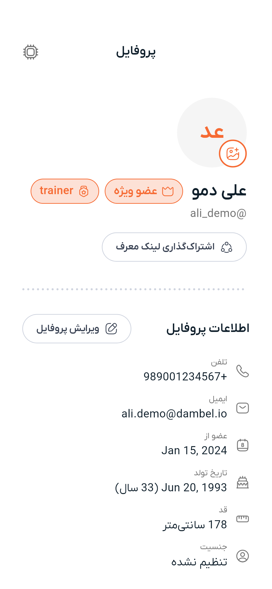

# پروفایل

پروفایل شما همونیه که بقیه می‌بینن — مربی‌ها، صاحبان باشگاه، هر کسی که سرچتون کنه.

---

## ویرایش پروفایل

روی **آیکون مداد** یا دکمه **ویرایش پروفایل** در صفحه پروفایل ضربه بزنید.

می‌توانید به‌روز کنید:
- **نام نمایشی** و نام کاربری
- **شماره موبایل** و ایمیل
- **تاریخ تولد** (سن به صورت خودکار محاسبه می‌شود)
- **قد** به سانتی‌متر
- **عکس پروفایل** — عکس جدید بگیرید یا از گالری انتخاب کنید

پروفایل‌های چندگانه پشتیبانی می‌شوند. می‌توانید یک گالری از عکس‌ها آپلود کنید که دیگران بتوانند اسکرول کنند.

---

## نقش‌ها و نشان‌ها

پروفایل شما نقش‌های فعال را نشان می‌دهد:
- **کوچ** — سرویس‌های تمرینی ارائه می‌دهید
- **مربی** — با یک باشگاه یا سازمان همکاری می‌کنید

نقش‌ها رو دمبل میده — اگه چیزی تغییر کنه، اعلان می‌گیرید.

اگر عضو **پرمیوم** باشید، یک نشان پرمیوم روی پروفایلتان ظاهر می‌شود.

---

## تحصیلات

سابقه تحصیلیتون رو اضافه کنید تا مشتری‌های احتمالی بدونن با کی طرفن.

روی **افزودن تحصیلات** ضربه بزنید تا وارد کنید:
- نام دانشگاه یا مؤسسه
- رشته تحصیلی
- تاریخ شروع و پایان
- توضیح کوتاه

---

## افتخارات

دستاوردهای رقابتی خود را به نمایش بگذارید.

روی **افزودن افتخار** ضربه بزنید تا وارد کنید:
- نام رقابت
- تاریخ
- توضیح کوتاه از نتیجه

---

## آنچه دیگران می‌بینند

وقتی کسی پروفایل شما را می‌بیند — یک مربی که ورزشکاران را مرور می‌کند، یا یک ورزشکار که مربی را بررسی می‌کند — نام، عکس، نقش‌ها، بیوگرافی، تحصیلات و افتخارات را می‌بینند. اطلاعات تماس شما (موبایل/ایمیل) خصوصی می‌ماند.

---

> **بعدی:** [تنظیمات را تغییر دهید](settings.md) یا [کیف پول را ببینید](wallet.md)
