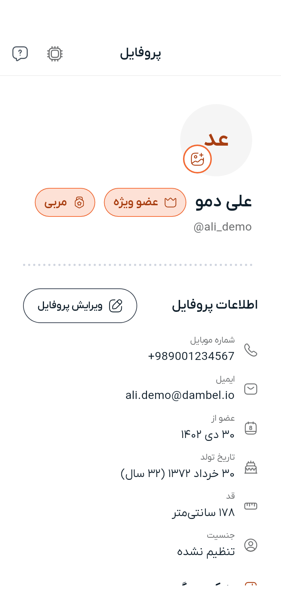
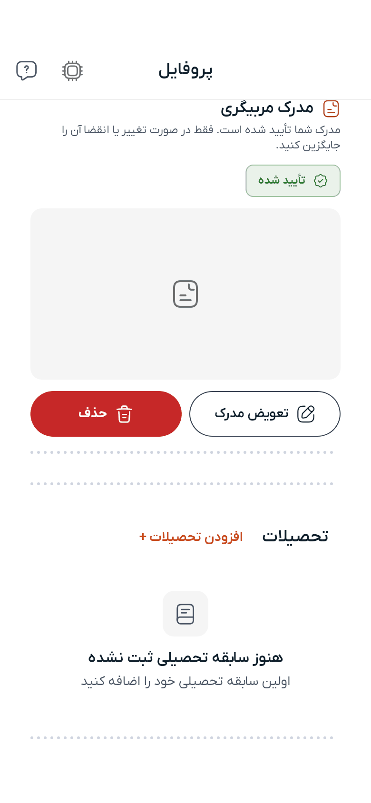

# پروفایل

پروفایل شما همان چیزی است که دیگران می‌بینند — مربیان، مالکان باشگاه، و هر کسی که شما را جستجو کند.

---

## ویرایش پروفایل

در صفحهٔ پروفایل، نشان مداد یا دکمهٔ «ویرایش پروفایل» را بزنید.

می‌توانید این‌ها را ویرایش کنید:
- **نام نمایشی** و نام کاربری
- **شماره موبایل** و ایمیل
- **تاریخ تولد** (سن به صورت خودکار محاسبه می‌شود)
- **قد** به سانتی‌متر
- **جنسیت** — مرد، زن یا سایر را انتخاب کنید
- **عکس پروفایل** — از گالری انتخاب کنید

با زدن نشان عکس روی تصویر خود، گالری باز می‌شود و سپس آن را قاب‌بندی می‌کنید: بکشید و بزرگ‌نمایی کنید تا دایره همان چیزی را نشان دهد که می‌خواهید — یا منصرف شوید و چیزی ارسال نمی‌شود.

می‌توانید بیش از یک عکس داشته باشید: گالری‌ای از عکس‌ها آپلود کنید که دیگران بتوانند میانشان بگردند.

### نقش شما در دمبل

دو کلید در فرم ویرایش مشخص می‌کند که از دمبل چگونه استفاده می‌کنید:

- «مربی هستم» — بخش‌های مربی را روشن می‌کند: خدمات خودتان، خدماتی که خریده‌اید، و شاگردانتان.
- «صاحب باشگاه هستم» — بخش‌های مالک باشگاه را روشن می‌کند تا باشگاه‌های خودتان یک قدم فاصله داشته باشند.

اگر هر دو خاموش باشند، دمبل همان بخش‌هایی را نگه می‌دارد که همه به کار می‌برند — جستجوی باشگاه و مربی، اشتراک‌ها، و عملکرد شما.

خاموش کردن هر کلید تنها آن بخش را **پنهان** می‌کند. چیزی حذف نمی‌شود: خدمات، باشگاه‌ها، شاگردان و اشتراک‌های شما دقیقاً سر جای خود می‌مانند و با روشن کردن دوباره، آن بخش بازمی‌گردد. پیوندهایی هم که از یک اعلان یا صفحهٔ به‌اشتراک‌گذاشته‌شده باز می‌کنید، در هر حالت کار می‌کنند.

---

## نقش‌ها و نشان‌ها

پروفایل شما نقش‌های فعال را نشان می‌دهد:
- **مربی** — خدمات تمرینی ارائه می‌دهید
- **مدیر باشگاه** — در اداره یک باشگاه نقش دارید

نقش‌ها را دمبل تعیین می‌کند؛ اگر نقش شما تغییر کند، اعلان می‌گیرید.

اگر اشتراک ویژه داشته باشید، نشان «عضو ویژه» روی پروفایل شما دیده می‌شود.

---

## مدرک مربیگری

اگر خدمات تمرینی ارائه می‌دهید، مدرک مربیگری خود را اینجا بارگذاری کنید تا تأییدتان کنیم. اگر به کسی تمرین نمی‌دهید، می‌توانید از این بخش رد شوید — هیچ بخش دیگری از پروفایل به آن وابسته نیست.

«بارگذاری مدرک» را بزنید و از مدرک عکس بگیرید یا از گالری انتخاب کنید. مدرک شما یکی از این چهار وضعیت را خواهد داشت:

| وضعیت | یعنی چه |
|---|---|
| **بارگذاری نشده** | هنوز مدرکی ثبت نشده. امکان انتشار خدمات تمرینی وجود ندارد. |
| **در انتظار بررسی** | مدرک را دریافت کرده‌ایم و تیم ما در حال بررسی آن است. |
| **تأیید شده** | تأیید شده‌اید و می‌توانید خدمات تمرینی منتشر کنید. |
| **رد شده** | مشکلی در مدرک وجود داشته. دلیل آن درست زیر وضعیت نمایش داده می‌شود. |

اگر مدرک شما رد شد، دلیل را بخوانید، «تعویض مدرک» را بزنید و مدرکی خواناتر یا تازه‌تر بارگذاری کنید.

خط زیر عنوان این بخش می‌گوید قدم بعدی چیست، نه اینکه این بخش برای چیست: اینکه هنوز در حال بررسی هستیم، اینکه تأیید شده و کاری لازم نیست، یا اینکه باید جایگزین شود.

هر زمان می‌توانید با «حذف» مدرک را بردارید. با این کار وضعیت تأیید هم پاک می‌شود و برای تأیید دوباره باید مدرک جدیدی بارگذاری کنید. تعویض مدرک هم همین اثر را دارد و دوباره به حالت در انتظار بررسی بازمی‌گردد.

مدرک شما محرمانه است. تنها شما و تیم بررسی ما آن را می‌بینیم و هرگز در پروفایل عمومی‌تان نمایش داده نمی‌شود.

به‌محض تأیید یا رد شدن مدرک، اعلان دریافت می‌کنید.

---

## تحصیلات

سابقهٔ تحصیلی خود را بیفزایید تا شاگردان احتمالی بدانند با چه کسی طرف‌اند.

«افزودن تحصیلات» را بزنید و این‌ها را وارد کنید:
- نام دانشگاه یا مؤسسه
- رشته تحصیلی
- تاریخ شروع و پایان
- توضیح کوتاه

---

## قهرمانی‌ها

سوابق قهرمانی خود را نشان دهید.

«افزودن قهرمانی» را بزنید و این‌ها را وارد کنید:
- نام رقابت
- تاریخ
- توضیح کوتاه از نتیجه

---

## لینک معرف

با لینک معرف شخصی خود دوستانتان را به دمبل دعوت کنید.

«اشتراک‌گذاری لینک معرف» را بزنید تا لینک کپی شود. آن را برای هر کسی بفرستید؛ وقتی بازش کند، صفحهٔ ثبت‌نام با کد معرف شما از پیش پرشده باز می‌شود. کارت دعوت می‌شمارد چند نفر آن را پذیرفته‌اند.

پاداش، زمان اشتراک ویژه است و نه پول: به ازای هر **۵ امتیاز**، **۷ روز اشتراک ویژهٔ رایگان**. [اشتراک ویژه، تقویت و پول](monetization.md) را ببینید.

---

## آنچه دیگران می‌بینند

وقتی کسی پروفایل شما را می‌بیند — مربی‌ای که ورزشکاران را می‌گردد، یا ورزشکاری که مربی را بررسی می‌کند — نام، عکس، نقش‌ها، معرفی، تحصیلات و قهرمانی‌های شما را می‌بیند. شمارهٔ موبایل و ایمیل شما خصوصی می‌ماند.

پروفایل دیگران دو گزینه دارد که پروفایل خودتان ندارد: «پیام»، که گفتگوی شما با او را باز می‌کند یا می‌سازد، و «گزارش»، اگر چیزی درست نباشد. [گزارش](reporting.md) را ببینید.

---

> **بعدی:** [تنظیمات را تغییر دهید](settings.md) یا [کیف پول را ببینید](wallet.md)

---

[→ قبلی: راهنمای ورود و ثبت‌نام](authentication.md) | [بعدی: دستیار هوشمند ←](ai-assistant.md)
