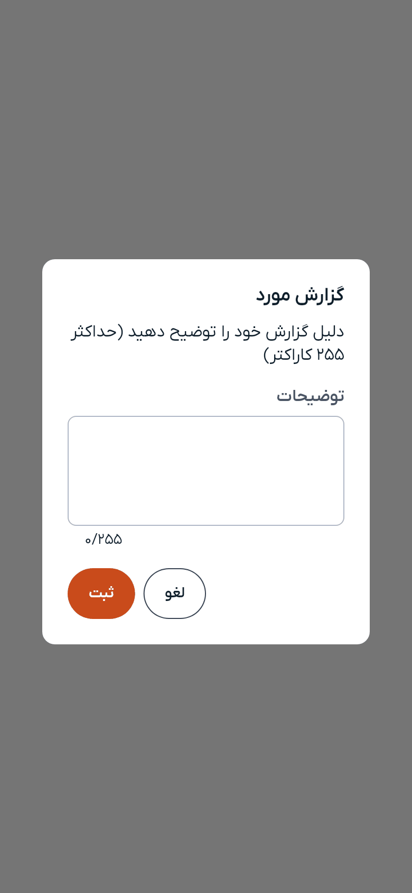

# گزارش

اگر چیزی در دمبل درست نیست — باشگاهی که وجود ندارد، خدمتی که آنچه می‌گوید نیست، یا رفتار نادرست کسی — به ما بگویید. گزارش چند ثانیه طول می‌کشد و مستقیم به تیمی می‌رسد که آن را بررسی می‌کند.

---

## چه چیزهایی را می‌توانید گزارش کنید

| مورد | جای دکمهٔ گزارش |
|---|---|
| **یک کاربر** | «گزارش» در پروفایل او، کنار «پیام» |
| **یک باشگاه** | نشان پرچم روی تصویر باشگاه |
| **یک خدمت** | نشان پرچم روی تصویر خدمت |

همین سه مورد. گزارش یک پیام در گفتگو فعلاً ممکن نیست؛ اگر مشکل از یک گفتگو است، خودِ کاربر را گزارش کنید.

«گزارش» فقط در پروفایل دیگران دیده می‌شود و در پروفایل خودتان نیست. پرچمِ روی باشگاه و خدمت این‌طور نیست و روی باشگاه و خدمت خودتان هم دیده می‌شود.

---

## چگونه گزارش کنیم

۱. پروفایل، باشگاه یا خدمت را باز کنید
۲. «گزارش» را بزنید
۳. مشکل را با زبان خودتان بنویسید — **حداکثر ۲۵۵ کاراکتر**
۴. «ثبت» را بزنید

فهرستی از دلایل آماده وجود ندارد؛ همان توضیح، گزارش شماست. بنویسید چه چیزی درست نیست و اگر کمک می‌کند، چه زمانی آن را دیده‌اید. نوشتن توضیح الزامی است و گزارش خالی پذیرفته نمی‌شود.

---

## بعد از آن چه می‌شود

گزارش شما برای تیم بررسی دمبل ارسال می‌شود و پیامی تأیید می‌کند که رسیده است.

از آن‌جا به بعد بررسی بر عهدهٔ ماست و **نتیجه به شما اعلام نمی‌شود** — اعلانی نمی‌گیرید که بگوید گزارشی پذیرفته یا رد شد. این تصمیمی آگاهانه است: آنچه بر سر حساب فرد دیگری می‌آید چیزی نیست که به گزارش‌دهنده گفته شود.

گزارش دوبارهٔ یک مورد ضرری ندارد، اما چیزی را هم سریع‌تر نمی‌کند.

---

## گزارش چه چیزی نیست

- **راه پشتیبانی نیست.** اگر خودِ دمبل مشکلی دارد یا پرداختی اشتباه انجام شده، از «تنظیمات ← پشتیبانی» استفاده کنید.
- **مسدودکردن نیست.** گزارش یک کاربر او را از دید شما پنهان نمی‌کند.
- **برای ما ناشناس نیست.** هر گزارش به حسابی که آن را ثبت کرده متصل است و همین است که جلوی سوءاستفاده از این امکان را می‌گیرد.

---

> **بعدی:** اگر به پشتیبانی نیاز دارید [تنظیمات](settings.md)، یا [بازگشت به فهرست راهنما](README.md)

---

[→ قبلی: باشگاه‌ها](gyms.md) | [بعدی: گزارش‌های داده ←](analytics.md)
