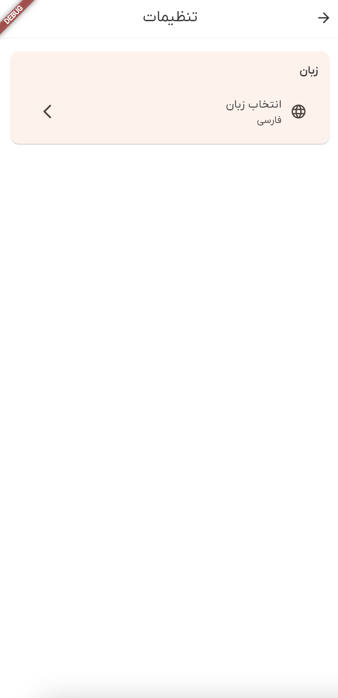
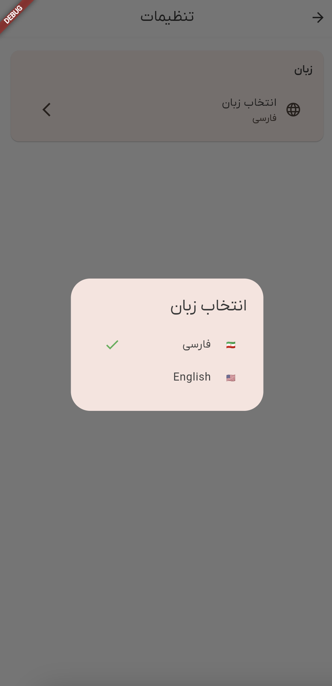

# راهنمای تنظیمات

صفحه تنظیمات در دمبل به شما امکان سفارشی‌سازی تجربه استفاده از اپلیکیشن را می‌دهد. در اینجا همه چیزهایی که باید در مورد پیکربندی تنظیمات خود بدانید آورده شده است.

## دسترسی به تنظیمات

برای باز کردن صفحه تنظیمات:

1. از ناوبری اصلی، روی تب **تنظیمات** لمس کنید
2. صفحه تنظیمات با گزینه‌های پیکربندی مختلف را خواهید دید

## تنظیمات زبان

یکی از مهم‌ترین تنظیمات، ترجیح زبان شماست. دمبل از چندین زبان پشتیبانی می‌کند و می‌توانید آن را در هر زمان تغییر دهید.

### تغییر زبان

1. در صفحه تنظیمات، بخش **زبان** را پیدا کنید
2. روی **"انتخاب زبان"** لمس کنید
3. یک دیالوگ با گزینه‌های زبان موجود ظاهر می‌شود
4. زبان مورد نظر خود را انتخاب کنید:
   - **🇮🇷 فارسی** - فارسی
   - **🇺🇸 English** - انگلیسی

5. اپلیکیشن بلافاصله به زبان انتخابی شما تغییر می‌کند
6. تغییر به طور خودکار برای جلسات آینده ذخیره می‌شود

### نمایش زبان فعلی

صفحه تنظیمات انتخاب زبان فعلی شما را نشان می‌دهد:
- نام زبان زیر "انتخاب زبان" نمایش داده می‌شود
- یک علامت تیک (✓) در کنار انتخاب فعلی شما در دیالوگ ظاهر می‌شود

## ویژگی‌های زبان

### زبان‌های پشتیبانی شده

در حال حاضر، دمبل از موارد زیر پشتیبانی می‌کند:
- **انگلیسی (EN)**: رابط کامل به انگلیسی
- **فارسی (FA)**: رابط کامل به فارسی با پشتیبانی RTL

### جهت متن خودکار

اپلیکیشن به طور خودکار جهت متن را بر اساس زبان شما تنظیم می‌کند:
- **انگلیسی**: جهت متن چپ به راست (LTR)
- **فارسی**: جهت متن راست به چپ (RTL)

### ماندگاری زبان

انتخاب زبان شما:
- بلافاصله هنگام تغییر ذخیره می‌شود
- در جلسات اپلیکیشن به خاطر سپرده می‌شود
- به تمام صفحات و ویژگی‌ها اعمال می‌شود
- با حساب کاربری شما همگام‌سازی می‌شود (وقتی وارد شده‌اید)

## تنظیمات آینده

صفحه تنظیمات برای گسترش با ویژگی‌های بیشتر در به‌روزرسانی‌های آینده طراحی شده است. تنظیمات احتمالی آینده ممکن است شامل موارد زیر باشد:

- **مدیریت حساب**: تنظیمات پروفایل، تغییر رمز عبور
- **اعلان‌ها**: ترجیحات اعلان‌های فشاری
- **حریم خصوصی**: کنترل‌های اشتراک‌گذاری داده و حریم خصوصی
- **ظاهر**: انتخاب تم، اندازه فونت
- **داده و ذخیره‌سازی**: مدیریت کش، تنظیمات آفلاین
- **درباره**: نسخه اپلیکیشن، شرایط، سیاست حریم خصوصی

## عیب‌یابی تنظیمات

### تغییر نکردن زبان

اگر زبان پس از انتخاب تغییر نمی‌کند:

1. **انتخاب خود را بررسی کنید**: مطمئن شوید گزینه زبان صحیح را لمس کرده‌اید
2. **کمی صبر کنید**: تغییر زبان ممکن است یک ثانیه طول بکشد
3. **اپلیکیشن را راه‌اندازی مجدد کنید**: اگر تغییر ظاهر نشد، اپلیکیشن را ببندید و دوباره باز کنید
4. **به‌روزرسانی‌ها را بررسی کنید**: مطمئن شوید از آخرین نسخه اپلیکیشن استفاده می‌کنید

### ذخیره نشدن تنظیمات

اگر تنظیمات شما ماندگار نمی‌شوند:

1. **اتصال اینترنت را بررسی کنید**: برخی تنظیمات برای همگام‌سازی نیاز به اینترنت دارند
2. **اپلیکیشن را راه‌اندازی مجدد کنید**: برای تازه‌سازی تنظیمات، اپلیکیشن را ببندید و دوباره باز کنید
3. **کش اپلیکیشن را پاک کنید**: اگر مشکل ادامه داشت، کش اپلیکیشن را پاک کنید
4. **با پشتیبانی تماس بگیرید**: اگر مشکلات ادامه داشت، با تیم پشتیبانی ما تماس بگیرید

### گزینه‌های زبان گمشده

اگر زبان مورد نظر خود را نمی‌بینید:

1. **نسخه اپلیکیشن را بررسی کنید**: زبان‌های جدید در به‌روزرسانی‌های اپلیکیشن اضافه می‌شوند
2. **اپلیکیشن را به‌روزرسانی کنید**: آخرین نسخه را از فروشگاه اپلیکیشن دانلود کنید
3. **درخواست زبان**: برای درخواست پشتیبانی از زبان خود با ما تماس بگیرید

## نکات استفاده از تنظیمات

### تغییر سریع زبان

- می‌توانید زبان را از صفحه ورود نیز تغییر دهید
- انتخابگر زبان را در گوشه بالا راست پیدا کنید
- تغییرات بلافاصله اعمال می‌شوند بدون نیاز به راه‌اندازی مجدد

### یادگیری زبان

- تغییر بین زبان‌ها می‌تواند به یادگیری شما کمک کند
- سعی کنید اپلیکیشن را به زبان‌های مختلف استفاده کنید
- همه ویژگی‌ها بدون توجه به زبان یکسان کار می‌کنند

### دسترسی‌پذیری

- تنظیمات زبان به دسترسی‌پذیرتر شدن اپلیکیشن کمک می‌کند
- زبانی را انتخاب کنید که با آن راحت‌تر هستید
- زبان‌های RTL مانند فارسی به طور کامل پشتیبانی می‌شوند

## دریافت کمک

اگر در تنظیمات به کمک نیاز دارید:

1. **این راهنما را بررسی کنید**: بخش عیب‌یابی بالا را مرور کنید
2. **راهنمای اپلیکیشن**: گزینه‌های کمک در اپلیکیشن را جستجو کنید
3. **تماس با پشتیبانی**: با تیم پشتیبانی ما تماس بگیرید
4. **انجمن**: انجمن‌های ما را برای نکات بررسی کنید

## بهترین شیوه‌های تنظیمات

### به‌روزرسانی‌های منظم

- اپلیکیشن خود را به‌روز نگه دارید تا به تنظیمات جدید دسترسی پیدا کنید
- گزینه‌های زبان جدید را در به‌روزرسانی‌ها بررسی کنید
- تنظیمات را پس از به‌روزرسانی‌های مهم اپلیکیشن مرور کنید

### امنیت

- هنگام تغییر تنظیمات مربوط به حساب محتاط باشید
- همیشه از به‌روزرسانی‌های رسمی اپلیکیشن استفاده کنید
- هر رفتار مشکوک در تنظیمات را گزارش دهید

### عملکرد

- تغییر زبان بر عملکرد اپلیکیشن تأثیر نمی‌گذارد
- تنظیمات به صورت محلی برای دسترسی سریع ذخیره می‌شوند
- تغییرات بزرگ تنظیمات ممکن است نیاز به زمان بارگذاری کوتاه داشته باشد

---

*آخرین به‌روزرسانی: [تاریخ فعلی]*
