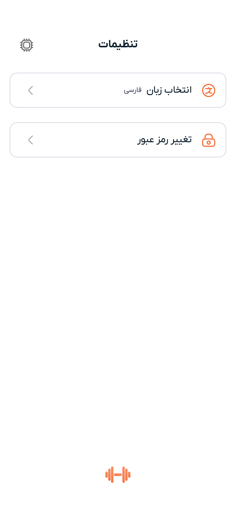

# تنظیمات

---

## زبان

دمبل از **فارسی** و **انگلیسی** پشتیبانی می‌کند. هر زمان می‌توانید زبان را تغییر دهید — تغییر فوری است و چیدمان به صورت خودکار تنظیم می‌شود (راست به چپ برای فارسی، چپ به راست برای انگلیسی).

برای تغییر:
۱. به **تنظیمات** بروید
۲. روی **زبان** ضربه بزنید
۳. زبان موردنظر را انتخاب کنید

انتخاب شما ذخیره می‌شود و در هر راه‌اندازی اعمال می‌شود.

---

## دستیار هوش مصنوعی

اگر می‌خواهید گفتگوی تازه‌ای شروع کنید یا تردهای هوش مصنوعی خود را مدیریت کنید، از تنظیمات به دستیار دسترسی داشته باشید. همچنین از داخل هر صفحه ویژگی از طریق آیکون جرقه می‌توانید به دستیار دسترسی داشته باشید.

---

## پشتیبانی

سوالی دارید یا مشکلی پیش آمده؟ از لینک **پشتیبانی** در تنظیمات با تیم دمبل در ارتباط باشید.

---

## خروج از حساب

روی **خروج** در پایین صفحه تنظیمات ضربه بزنید تا از حساب کاربری خارج شوید و به صفحه ورود برگردید.

---

> **بعدی:** [درباره دستیار هوش مصنوعی بیشتر بدانید](ai-assistant.md) یا [به فهرست مستندات برگردید](README.md)
