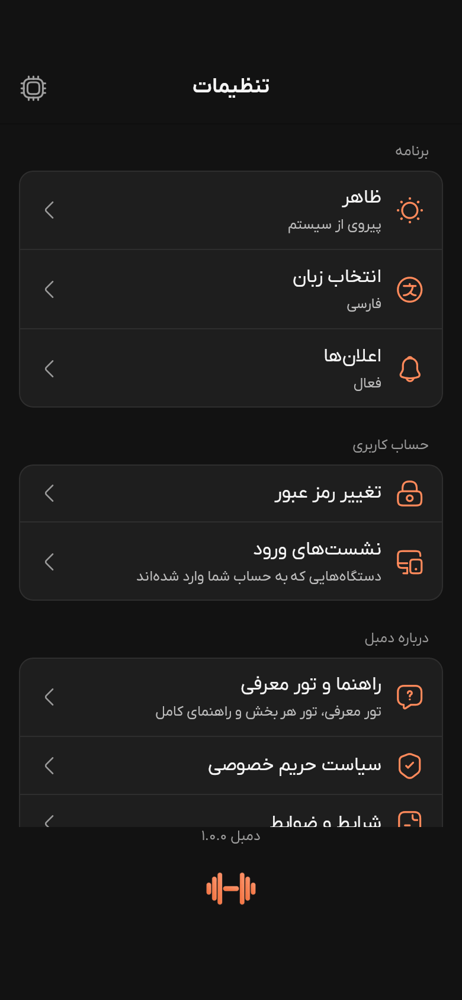

# تنظیمات

تنظیمات از تصویر شما در نوار بالا باز می‌شود. گزینه‌هایش در سه گروه‌اند: **برنامه**، **حساب کاربری** و **درباره دمبل**.

---

## برنامه

### ظاهر

دمبل دو ظاهر روشن و تیره دارد و به‌صورت پیش‌فرض **از دستگاه شما پیروی می‌کند**: وقتی گوشی یا رایانه‌تان به حالت تیره می‌رود، دمبل هم تیره می‌شود.

برای انتخاب دستی:
۱. به «تنظیمات» بروید
۲. «ظاهر» را بزنید
۳. یکی از «پیروی از سیستم»، «روشن» یا «تیره» را انتخاب کنید

تغییر بی‌درنگ اعمال می‌شود و انتخاب شما روی همین دستگاه به یاد می‌ماند.

### زبان

دمبل از **فارسی** و **انگلیسی** پشتیبانی می‌کند. هر زمان می‌توانید زبان را عوض کنید؛ تغییر بی‌درنگ است و چیدمان خودش تنظیم می‌شود — راست‌به‌چپ برای فارسی و چپ‌به‌راست برای انگلیسی.

برای تغییر:
۱. به «تنظیمات» بروید
۲. «زبان» را بزنید
۳. زبان مورد نظر را انتخاب کنید

انتخاب شما ذخیره می‌شود و در هر اجرا اعمال می‌شود.

### اعلان‌ها

گزینهٔ «اعلان‌ها» می‌گوید دمبل اجازهٔ فرستادن اعلان دارد یا نه: فعال، غیرفعال، یا مسدود. اگر بار اول که گوشی‌تان پرسید «فعلاً نه» را زده‌اید، با زدن این گزینه دوباره از شما پرسیده می‌شود؛ و اگر اعلان‌ها را مسدود کرده‌اید، شما را به تنظیمات دستگاه می‌برد، که تنها جایی است که می‌تواند آن را برگرداند.

---

## حساب کاربری

### تغییر رمز عبور

رمز عبور کنونی و رمز تازه را دو بار وارد کنید. رمز تازه باید دست‌کم ۸ کاراکتر باشد. روی همین دستگاه وارد می‌مانید و دستگاه‌های دیگر تغییری نمی‌کنند؛ اگر می‌خواهید آنها را خارج کنید، از «نشست‌های ورود» استفاده کنید.

### نشست‌های ورود

«نشست‌های ورود» همهٔ دستگاه‌هایی را که در این لحظه به حساب شما وارد هستند نشان می‌دهد و می‌توانید هرکدام را خارج کنید — [نشست‌های ورود](login-sessions.md) را ببینید.

### دسترسی‌های دستیار هوشمند

اگر به دستیار گفته باشید که یک اقدام را همیشه اجازه بدهد، گزینهٔ «دسترسی‌های دستیار هوشمند» اینجا ظاهر می‌شود و تعداد اقدام‌هایی را که این‌طور تأیید کرده‌اید نشان می‌دهد. دکمهٔ «پرسیدن دوباره» دارد — صفحه‌ای برای باز کردن نیست، کاری برای برگرداندن است — و با زدن آن، دستیار دوباره پیش از هر اقدام از شما اجازه می‌گیرد. تا وقتی هیچ اقدامی را همیشه مجاز نکرده باشید، این گزینه دیده نمی‌شود.

---

## درباره دمبل

### راهنما و تور معرفی

«راهنما و تور معرفی» جایی است که راهنماها را دوباره می‌بینید. سه چیز پیشنهاد می‌دهد:

- **تور معرفی اولیه** — همان پرسش‌های خوش‌آمد، از ابتدا
- **تور یک بخش** — راهنمای گام‌به‌گام داشبورد، باشگاه‌ها، تمرین، عملکرد من، کیف پول، پروفایل، گفتگو یا دستیار هوشمند
- **نمایش دوبارهٔ همه راهنماها** — همه را از نو فعال می‌کند تا با رسیدن به هر صفحه دوباره پیشنهاد شوند

همهٔ این‌ها فقط روی همین دستگاه به یاد می‌ماند و به همین دلیل اینجاست و نه روی حساب شما.

### سیاست حریم خصوصی · شرایط و ضوابط · درباره ما · پشتیبانی

چهار گزینه که صفحهٔ مربوط را در dambel.io و به همان زبانی که برنامه را می‌خوانید باز می‌کنند. «پشتیبانی» جایی است که پرسش یا مشکل خود را برای ما بنویسید.

---

## پایین صفحه

زیر آخرین گروه، **نسخهٔ دمبلی که اجرا می‌کنید** آمده است — اگر روزی مشکلی گزارش کنید، به کار می‌آید — و نشان دمبل، که وب‌سایت dambel.io را باز می‌کند.

---

## آنچه اینجا نیست

«خروج از حساب» در تنظیمات نیست. در منوی پشت تصویر شما در نوار بالاست و آگاهانه از گزینه‌هایی که برای تغییرشان به اینجا می‌آیید جدا نگه داشته شده است. [ورود و ثبت‌نام](authentication.md) را ببینید.

---

> **بعدی:** [دربارهٔ دستیار هوشمند بخوانید](ai-assistant.md) یا [به فهرست راهنما برگردید](README.md)

---

[→ قبلی: کیف پول](wallet.md) | [بعدی: نشست‌های ورود ←](login-sessions.md)
