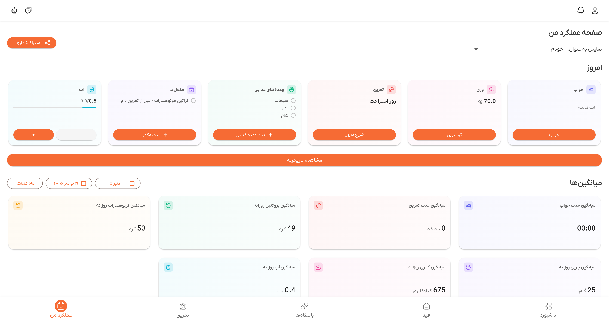
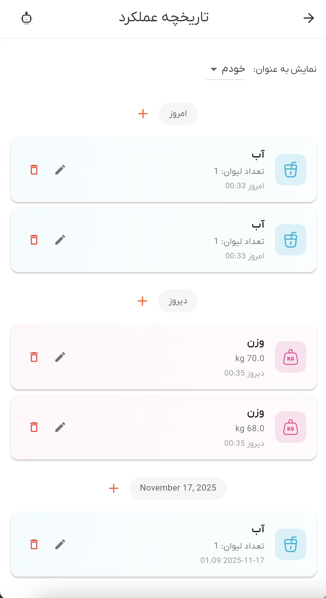

# راهنمای سیستم ثبت عملکرد

به سیستم ثبت عملکرد دمبل خوش آمدید. این راهنمای جامع شما را با ثبت عملکرد فعالیت‌های روزانه، از جمله وعده‌های غذایی، تمرینات، خواب، وزن، مصرف آب، مکمل‌ها و موارد دیگر آشنا می‌کند.

## نمای کلی

سیستم ثبت عملکرد به شما امکان ثبت و نظارت بر تمام جنبه‌های سفر فیتنس خود را می‌دهد. می‌توانید انواع مختلفی از فعالیت‌ها را ثبت عملکرد کنید، آن‌ها را در یک جدول زمانی یکپارچه مشاهده کنید و داده‌های خود را در طول زمان مدیریت کنید. سیستم از ثبت عملکرد شخصی و ثبت عملکرد مشترک با مربیان یا مربیان ورزشی پشتیبانی می‌کند.

عملکرد من از موارد زیر پشتیبانی می‌کند:
- **وعده‌های غذایی**: ثبت وعده‌های غذایی با اطلاعات تغذیه‌ای
- **تمرینات**: ثبت عملکرد جلسات تمرینی با تمرینات و ست‌ها
- **خواب**: ثبت زمان‌های خواب
- **بیداری**: ثبت عملکرد زمان‌های بیدار شدن
- **وزن**: ثبت اندازه‌گیری‌های وزن بدن
- **آب**: ثبت عملکرد مصرف روزانه آب
- **مکمل‌ها**: ثبت مصرف مکمل

## دسترسی به عملکرد من

می‌توانید از چندین مکان به عملکرد من دسترسی پیدا کنید:

1. **بخش امروز**: مشاهده و ثبت فعالیت‌های امروز از داشبورد اصلی
2. **تاریخچه عملکرد من**: مشاهده تمام سوابق ثبت عملکرد گذشته به ترتیب زمانی
3. **جزئیات تمرین**: نمای جزئیات برای جلسات تمرینی فردی

*بخش امروز که تمام کارت‌های عملکرد من را برای دسترسی سریع نشان می‌دهد*

## بخش امروز

بخش امروز دسترسی سریع به ثبت عملکرد فعالیت‌های امروز را فراهم می‌کند:

### عملکرد من‌های موجود

**خواب** (نیلی):
- ثبت زمان خواب
- مشاهده آخرین سوابق خواب
- افزودن ورودی خواب جدید

**وزن** (صورتی):
- ثبت وزن فعلی
- مشاهده آخرین اندازه‌گیری وزن
- ثبت عملکرد وزن در طول زمان

**تمرین** (قرمز):
- شروع یک تمرین جدید
- مشاهده تمرین فعال
- دسترسی به جزئیات تمرین

**وعده‌های غذایی** (سبز):
- ثبت وعده‌های غذایی
- مشاهده وعده‌های غذایی ثبت شده امروز
- ثبت عملکرد دریافت تغذیه‌ای

**مکمل‌ها** (بنفش):
- ثبت مصرف مکمل
- مشاهده مکمل‌های مصرف شده امروز
- پیوند به مکمل‌های برنامه غذایی

**آب** (فیروزه‌ای):
- ثبت عملکرد مصرف آب بر اساس لیوان
- مشاهده پیشرفت آب روزانه
- تنظیم اهداف آب

### استفاده از بخش امروز

1. روی هر کارت عملکرد من ضربه بزنید
2. فرم ثبت عملکرد را پر کنید
3. برای ثبت فعالیت ذخیره کنید
4. پیشرفت خود را برای روز مشاهده کنید

## تاریخچه عملکرد من

صفحه تاریخچه عملکرد من تمام سوابق ثبت عملکرد شما را به ترتیب زمانی نشان می‌دهد:

### نمای جدول زمانی

**هدرهای تاریخ**:
- سوابق بر اساس تاریخ گروه‌بندی می‌شوند
- هدرهای تاریخ "امروز"، "دیروز" یا تاریخ‌های خاص را نشان می‌دهند
- هر تاریخ یک دکمه افزودن (+) برای ثبت سریع فعالیت‌ها دارد

**کارت‌های فعالیت**:
هر فعالیت به صورت یک کارت با موارد زیر نمایش داده می‌شود:
- **آیکون**: آیکون رنگی برای نوع فعالیت
- **عنوان**: نام یا توضیحات فعالیت
- **جزئیات**: اطلاعات مرتبط (وزن، مدت زمان، و غیره)
- **برچسب زمان**: زمانی که فعالیت رخ داده است
- **اقدامات**: دکمه‌های ویرایش و حذف (در صورت موجود بودن)

*تاریخچه عملکرد من که یک جدول زمانی از تمام فعالیت‌ها را با هدرهای تاریخ نشان می‌دهد*

### انواع فعالیت

**وعده‌های غذایی**:
- یادداشت‌های وعده غذایی یا اطلاعات تغذیه‌ای را نشان می‌دهد
- پروتئین، کربوهیدرات، چربی و کالری را در صورت موجود بودن نمایش می‌دهد
- تم رنگی سبز

**خواب**:
- یادداشت‌های خواب را نشان می‌دهد
- تم رنگی نیلی

**بیداری**:
- یادداشت‌های بیداری را نشان می‌دهد
- تم رنگی نیلی

**آب**:
- تعداد لیوان را نشان می‌دهد
- یادداشت‌ها را در صورت موجود بودن نمایش می‌دهد
- تم رنگی فیروزه‌ای

**وزن**:
- وزن را به کیلوگرم نشان می‌دهد
- یادداشت‌ها را در صورت موجود بودن نمایش می‌دهد
- تم رنگی صورتی

**مکمل‌ها**:
- یادداشت‌های مکمل را نشان می‌دهد
- تم رنگی بنفش

**تمرینات**:
- عنوان تمرین را نشان می‌دهد
- مدت زمان را در صورت پایان تمرین نمایش می‌دهد
- یادداشت‌ها را در صورت موجود بودن نشان می‌دهد
- تم رنگی قرمز
- برای مشاهده اطلاعات جزئی تمرین ضربه بزنید

### افزودن فعالیت‌ها

برای افزودن یک فعالیت از تاریخچه:

1. هدر تاریخ را برای تاریخ مورد نظر پیدا کنید
2. روی دکمه **+ (به علاوه)** کنار تاریخ ضربه بزنید
3. نوع فعالیت را از منو انتخاب کنید
4. فرم را پر کنید
5. برای ثبت فعالیت ذخیره کنید

### ویرایش فعالیت‌ها

1. روی **آیکون ویرایش** (مداد) روی هر کارت فعالیت ضربه بزنید
2. اطلاعات را تغییر دهید
3. تغییرات را ذخیره کنید

**نکته**: فقط می‌توانید فعالیت‌هایی را که ایجاد کرده‌اید ویرایش کنید.

### حذف فعالیت‌ها

1. روی **آیکون حذف** (سطل زباله) روی هر کارت فعالیت ضربه بزنید
2. حذف را تأیید کنید
3. فعالیت به طور دائم حذف خواهد شد

**نکته**: حذف قابل بازگشت نیست.

## جزئیات تمرین

وقتی روی یک تمرین در تاریخچه ضربه می‌زنید، صفحه جزئیات تمرین را خواهید دید:

### اطلاعات تمرین

**تایمر مدت زمان**:
- زمان سپری شده برای تمرینات فعال را نشان می‌دهد
- به صورت بلادرنگ به‌روزرسانی می‌شود
- مدت زمان کل را برای تمرینات تمام شده نمایش می‌دهد

**بخش تمرینات**:
- تمام تمرینات انجام شده را فهرست می‌کند
- ست‌ها را با وزن و تکرار نشان می‌دهد
- زمان استراحت بین ست‌ها را نمایش می‌دهد
- تمرینات را از برنامه تمرین در صورت پیوند سازماندهی می‌کند

**یکپارچه‌سازی برنامه تمرین**:
- اگر تمرین به یک جلسه برنامه پیوند خورده باشد، تمرینات برنامه‌ریزی شده را نشان می‌دهد
- چک‌باکس‌ها تمرینات تکمیل شده را نشان می‌دهند
- می‌تواند مستقیماً از تمرینات برنامه ست اضافه کند

### افزودن ست‌ها

1. روی دکمه **"افزودن تمرین"** یا آیکون + روی یک تمرین برنامه ضربه بزنید
2. تمرین را از منوی کشویی انتخاب کنید (اگر از برنامه نباشد)
3. وزن را وارد کنید (اختیاری)
4. تکرارها را وارد کنید
5. زمان شروع و پایان به طور خودکار محاسبه می‌شوند
6. یادداشت‌ها را اضافه کنید (اختیاری)
7. ست را ذخیره کنید

### ویرایش ست‌ها

1. روی هر کارت ست یا آیکون ویرایش ضربه بزنید
2. وزن، تکرار، زمان‌ها یا یادداشت‌ها را تغییر دهید
3. تغییرات را ذخیره کنید

### حذف ست‌ها

1. روی آیکون حذف روی یک ست ضربه بزنید
2. حذف را تأیید کنید
3. ست حذف خواهد شد

### پایان دادن به تمرین

1. روی دکمه **"پایان تمرین"** ضربه بزنید
2. پایان تمرین را تأیید کنید
3. زمان پایان به طور خودکار به زمان فعلی تنظیم می‌شود
4. تمرین به عنوان تمام شده علامت‌گذاری می‌شود

### ابرداده تمرین

می‌توانید ویرایش کنید:
- **زمان شروع**: زمانی که تمرین شروع شد
- **زمان پایان**: زمانی که تمرین به پایان رسید (برای تمرینات تمام شده)
- **عنوان تمرین**: نام تمرین
- **جلسه برنامه تمرین**: پیوند به یک جلسه برنامه تمرین
- **یادداشت‌ها**: اطلاعات اضافی

## ثبت عملکرد مشترک

اگر داده‌های ثبت عملکرد با شما به اشتراک گذاشته شده باشد، می‌توانید آن‌ها را مشاهده کنید:

### مشاهده داده‌های مشترک

1. در تاریخچه عملکرد من، از منوی کشویی **"مشاهده به عنوان"** در بالا استفاده کنید
2. **"من"** را برای داده‌های خود یا نام عملکرد من مشترک انتخاب کنید
3. جدول زمانی به‌روزرسانی می‌شود تا داده‌های آن شخص را نشان دهد

**حالت فقط خواندنی**:
- هنگام مشاهده داده‌های مشترک، نمی‌توانید سوابق را اضافه، ویرایش یا حذف کنید
- تمام دکمه‌های اقدام پنهان هستند
- فقط می‌توانید داده‌ها را مشاهده کنید

## یکپارچه‌سازی دستیار هوش مصنوعی

صفحات عملکرد من با دستیار هوش مصنوعی یکپارچه شده‌اند:

**هوش مصنوعی می‌تواند کمک کند**:
- پیشنهاد فعالیت‌ها برای ثبت
- کمک به پر کردن فرم‌های ثبت عملکرد
- تجزیه و تحلیل الگوهای ثبت عملکرد شما
- ارائه بینش در مورد پیشرفت شما

**نحوه استفاده**:
1. دستیار هوش مصنوعی را هنگام مشاهده عملکرد من باز کنید (روی آیکون ربات 🤖 ضربه بزنید)
2. برای کمک بپرسید: "امروز چه چیزی باید ثبت عملکرد کنم؟"
3. هوش مصنوعی بر اساس اهداف شما راهنمایی ارائه می‌دهد
4. از پیشنهادات هوش مصنوعی برای ثبت فعالیت‌ها استفاده کنید

## عیب‌یابی

### فعالیت‌ها بارگذاری نمی‌شوند

**راه‌حل‌ها**:
1. اتصال اینترنت را بررسی کنید
2. برای به‌روزرسانی به پایین بکشید
3. بررسی کنید که آیا داده‌های مشترک را مشاهده می‌کنید (حالت فقط خواندنی)
4. دوباره وارد شوید
5. اگر مشکل ادامه داشت، با پشتیبانی تماس بگیرید

### نمی‌توان فعالیت‌ها را افزود

**راه‌حل‌ها**:
1. اطمینان حاصل کنید که در حالت فقط خواندنی نیستید (مشاهده داده‌های مشترک)
2. بررسی کنید که تمام فیلدهای الزامی پر شده‌اند
3. بعد از یک لحظه دوباره تلاش کنید
4. اگر مشکل ادامه داشت، با پشتیبانی تماس بگیرید

### نمی‌توان فعالیت‌ها را ویرایش/حذف کرد

**راه‌حل‌ها**:
1. اطمینان حاصل کنید که داده‌های مشترک را مشاهده نمی‌کنید (فقط خواندنی)
2. بررسی کنید که فعالیت متعلق به شما است
3. صفحه را به‌روزرسانی کنید
4. اگر مشکل ادامه داشت، با پشتیبانی تماس بگیرید

### تمرین ذخیره نمی‌شود

**راه‌حل‌ها**:
1. اطمینان حاصل کنید که عنوان تمرین پر شده است
2. فرمت زمان شروع را بررسی کنید (YYYY-MM-DD HH:MM:SS)
3. فرمت زمان پایان را در صورت ارائه بررسی کنید
4. خطاهای اعتبارسنجی را بررسی کنید
5. دوباره ذخیره کنید

### ست‌ها افزوده نمی‌شوند

**راه‌حل‌ها**:
1. اطمینان حاصل کنید که تمرین انتخاب شده است
2. بررسی کنید که تکرار یک عدد مثبت است
3. بررسی کنید که تمرین ابتدا ذخیره شده است
4. به‌روزرسانی کنید و دوباره اضافه کنید

## بهترین روش‌ها

### ثبت عملکرد روزانه

- فعالیت‌ها را در اسرع وقت پس از وقوع ثبت کنید
- در ثبت عملکرد زمان‌ها ثابت باشید
- یادداشت‌ها را برای زمینه یا مشاهدات اضافه کنید
- داده‌های ثبت عملکرد خود را به طور منظم بررسی کنید

### ثبت عملکرد تمرین

- تمرین را زمانی که شروع به ورزش می‌کنید شروع کنید
- ست‌ها را همانطور که تکمیل می‌کنید اضافه کنید
- وزن و تکرارهای دقیق را ثبت کنید
- یادداشت‌ها را درباره فرم یا دشواری اضافه کنید
- تمرین را زمانی که تمام شد پایان دهید

### ثبت عملکرد تغذیه

- وعده‌های غذایی را بلافاصله پس از خوردن ثبت کنید
- تمام اطلاعات تغذیه‌ای را در صورت موجود بودن شامل کنید
- وعده‌های غذایی را به وعده‌های برنامه غذایی در صورت کاربرد پیوند دهید
- مکمل‌ها را با وعده‌های غذایی ثبت عملکرد کنید

### مدیریت داده

- تاریخچه را به طور منظم برای شناسایی الگوها بررسی کنید
- از ثبت عملکرد مشترک برای پاسخگویی استفاده کنید
- یادداشت‌ها را برای مرجع آینده دقیق نگه دارید
- ورودی‌های تکراری یا نادرست را پاک کنید

## دریافت کمک

اگر به کمک نیاز دارید:

1. **دستیار هوش مصنوعی**: برای کمک بپرسید (روی آیکون ربات 🤖 ضربه بزنید)
2. **پشتیبانی درون برنامه**: گزینه‌های پشتیبانی را در تنظیمات بررسی کنید
3. **مستندات**: سایر مقالات راهنما را مرور کنید
4. **تماس با پشتیبانی**: با تیم پشتیبانی دمبل تماس بگیرید

سیستم ثبت عملکرد مجله فیتنس شما است. از آن به طور مداوم برای نظارت بر پیشرفت و دستیابی به اهداف خود استفاده کنید!

