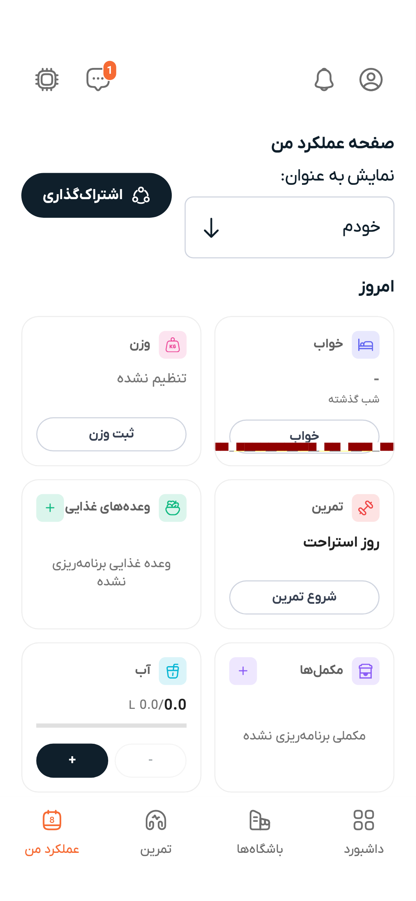
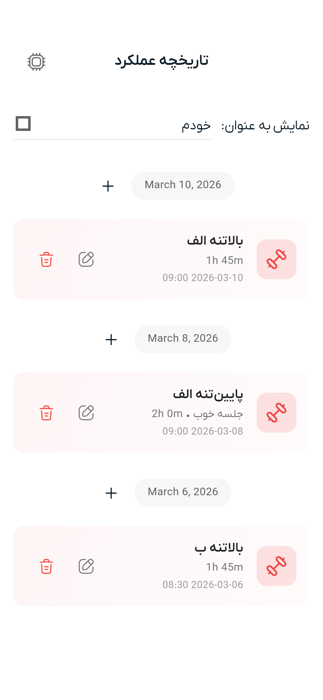
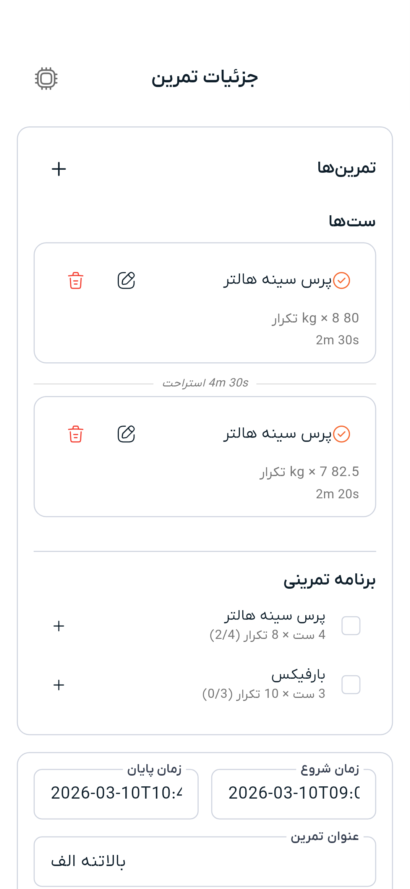

# ردیاب

هر چیزی که ثبت می‌کنید — تمرین، وعده، خواب، آب — همه‌اش اینجاست و بر اساس تاریخ مرتبه تا ببینید چه کرده‌اید.

---

## ثبت از داشبورد

سریع‌ترین راه ثبت، از طریق شش کارت سریع داشبورد است. روی هر کارت ضربه بزنید و جزئیات را پر کنید.

---

## انواع فعالیت

### تمرین

یک جلسه تمرینی را با این اطلاعات ثبت کنید:
- **مدت** — چقدر تمرین کردید
- **تمرین‌ها** — ست‌ها، تکرارها و وزن هر حرکت
- **یادداشت** — هر چیزی که ارزش ذخیره دارد
- **لینک به پلن** — اختیاری، می‌توانید به یک جلسه از برنامه تمرینی فعال وصل کنید

هنگام ثبت، می‌توانید از **تایمر تمرین فعال** برای ردیابی زمان استراحت یا کل جلسه استفاده کنید.

### وعده‌ها

آنچه خوردید را ثبت کنید:
- **یادداشت** — توضیح وعده
- **ماکروها** — پروتئین، کربوهیدرات، چربی و کالری
- **لینک به پلن غذایی** — به یک وعده از برنامه غذایی فعال وصل کنید
- **علامت تقلب** — اگر این وعده خارج از برنامه بود

### خواب

خوابتان را ثبت کنید:
- **مدت** — چند ساعت
- **یادداشت** — کیفیت خواب، هر چیز غیرعادی

### وزن

وزن بدن را به **کیلوگرم** با یادداشت اختیاری ثبت کنید.

### آب

تعداد **لیوان‌های** آبی که امروز نوشیدید را ثبت کنید. اگر هدف آب در برنامه غذایی تنظیم کرده‌اید، پیشرفت به سمت هدف نمایش داده می‌شود.

### مکمل‌ها

مکمل‌هایی که مصرف کردید را ثبت کنید:
- **انتخاب مکمل** از لیست
- **لینک به پلن غذایی** — اختیاری
- **یادداشت**

---

## تاریخچه ردیاب

تب ردیاب یک خط زمانی از همه فعالیت‌های ثبت‌شده، گروه‌بندی‌شده بر اساس تاریخ نشان می‌دهد. به بالا اسکرول کنید تا ورودی‌های قدیمی‌تر ببینید. روی هر ورودی ضربه بزنید تا جزئیات را ببینید یا ویرایش کنید.

---

## جزئیات تمرین

روی یک تمرین ثبت‌شده ضربه بزنید تا تفکیک کامل را ببینید:
- مدت کل
- هر تمرین با همه ست‌ها (وزن × تکرار)
- یادداشت‌ها

---

## دسترسی مربی

اگر با یک مربی کار می‌کنید، آن‌ها می‌توانند داده‌های ردیاب شما را در **حالت فقط‌خواندنی** ببینند. شما کنترل دارید — آن‌ها تاریخچه را می‌بینند اما نمی‌توانند ویرایش کنند.

---

> **بعدی:** [پلن‌هایی که ردیاب به آن‌ها لینک می‌کند را بسازید](workout-plans.md) یا [به داشبورد برگردید](dashboard.md)
