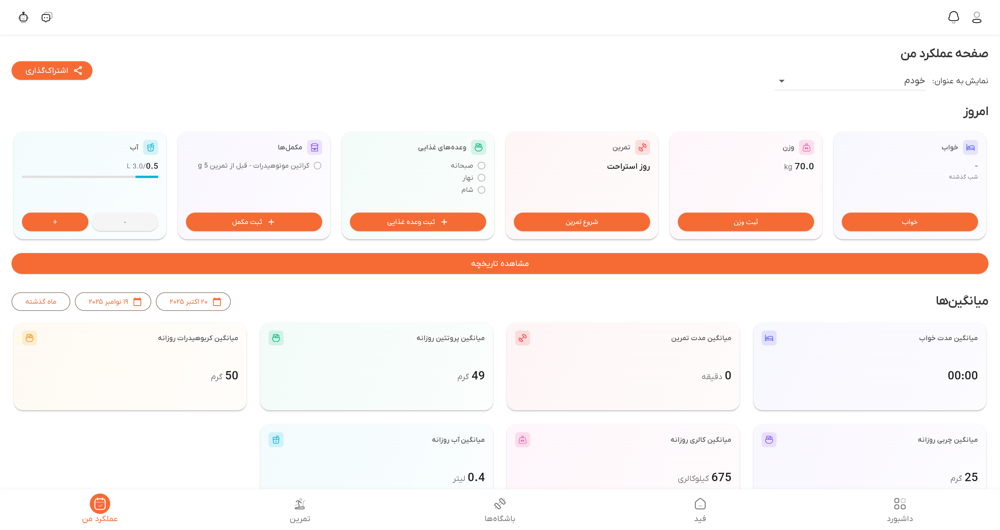
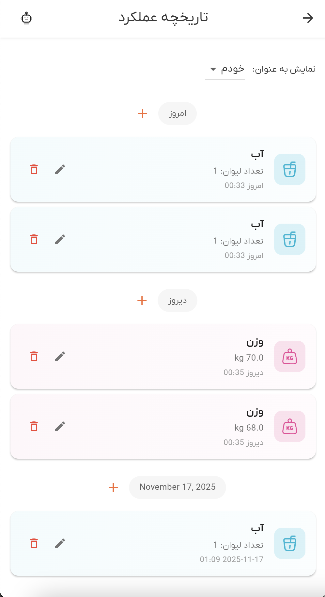

# ثبت فعالیت‌ها

دفترچه فیتنس شما اینجاست. از وعده‌های غذایی و تمرینات گرفته تا خواب و مصرف آب، همه چیز رو اینجا ثبت کنید. فکرش رو بکنید مثل یه لاگ شخصی که پیشرفتتون رو زیر نظر داره و کمک می‌کنه منظم باشید.

## چطوری برم اونجا؟

دو تا جای اصلی دارید که می‌تونید به ثبت فعالیت‌هاتون دسترسی داشته باشید. بخش "امروز" توی داشبورد اصلی نشون داده میشه با کارت‌های سریع واسه ثبت فعالیت‌های امروز. واسه تایم‌لاین کامل همه چیزی که تا حالا ثبت کردید، از منوی اصلی برید به صفحه تاریخچه.

## بخش امروز

اینجا مرکز دسترسی سریع شماست واسه ثبت چیزایی که الان دارن اتفاق می‌افتن. شش تا کارت رنگی بهتون دسترسی یک‌ضربه‌ای میدن به ثبت چیزهای مختلف.

خواب (کارت نیلی) آخرین رکورد خوابتون رو نشون میده و میذاره خواب جدید ثبت کنید. وزن (صورتی) آخرین وزن‌کشیتون رو نمایش میده. تمرین (قرمز) نشون میده اگه تمرین فعالی دارید یا میذاره یکی جدید شروع کنید. وعده‌های غذایی (سبز) چیزایی که توی روز می‌خورید رو ثبت می‌کنه. مکمل‌ها (بنفش) مصرف مکمل‌هاتون رو لاگ می‌کنه. آب (فیروزه‌ای) لیوان‌هاتون رو می‌شمره و پیشرفت روزانه رو نشون میده.

هر کارت طوری طراحی شده که سریع کارتون رو انجام بدید و برید. روش بزنید، چیزی که لازمه رو پر کنید، ذخیره کنید، تموم. کارت‌ها با سایز صفحه شما هم تطبیق پیدا می‌کنن – روی گوشی به صورت گرید می‌بینیدشون، روی تبلت و دسکتاپ پخش می‌شن واسه دسترسی راحت‌تر.

## تاریخچه

اینجا جایی هست که همه فعالیت‌های ثبت‌شده‌تون توی یه تایم‌لاین پیوسته زندگی می‌کنن. همه چیز بر اساس تاریخ مرتب شده با جدیدترین چیزها بالای صفحه.

هر تاریخ یه هدر مخصوص به خودش داره که "امروز"، "دیروز" یا تاریخ واقعی رو واسه ورودی‌های قدیمی‌تر نشون میده. کنار هر هدر تاریخ یه دکمه + هست – روش بزنید تا سریع چیزی واسه اون روز خاص ثبت کنید. خیلی کاربردیه وقتی یادتون رفته قبلاً چیزی رو ثبت کنید.

فعالیت‌هاتون به صورت کارت با آیکون‌های رنگی نشون داده میشن که با بخش امروز هماهنگن. وعده‌های غذایی سبزن، تمرینات قرمز، خواب نیلی، می‌فهمید دیگه. هر کارت جزئیات مربوطه رو نشون میده – یادداشت‌های وعده غذایی و اطلاعات تغذیه، مدت تمرین، اندازه‌گیری وزن، تعداد لیوان آب، هر چی که واسه اون نوع فعالیت منطقی باشه.

اگه می‌تونید یه فعالیت رو ویرایش یا حذف کنید، آیکون‌های کوچولوی مداد و سطل زباله روی کارت می‌بینید. روی مداد بزنید تا تغییر بدید، روی سطل زباله بزنید تا حذف کنید (یه پیام تأیید میاد اول، چون برگشتی نداره).

### دیدن اطلاعات یکی دیگه

مربی یا تریینری دارید که اطلاعات ثبت فعالیت‌هاشون رو باهاتون به اشتراک گذاشته؟ یا شاید خودتون مربی هستید و می‌خواید لاگ یه مشتری رو ببینید؟ یه منوی کشویی بالای صفحه تاریخچه هست که میذاره بین دیدن اطلاعات خودتون و هر ثبت فعالیت مشترکی که بهش دسترسی دارید جابجا بشید.

وقتی اطلاعات یکی دیگه رو می‌بینید، همه چیز فقط‌خواندنی میشه. می‌تونید تایم‌لاینشون رو ببینید ولی نمی‌تونید چیزی اضافه، ویرایش یا حذف کنید. همه دکمه‌های اکشن ناپدید میشن. برگردید به "من" توی منوی کشویی تا به اطلاعات خودتون برگردید.

## جزئیات تمرین

تمرینات یه صفحه جزئیات مخصوص به خودشون دارن چون چیزهای بیشتری هست که باید ثبت بشه، نه فقط "امروز تمرین کردم". روی هر کارت تمرین توی تاریخچه بزنید تا همه جزئیات رو ببینید.

بالای صفحه یه تایمر مدت زمان می‌بینید. اگه تمرین هنوز فعاله، به صورت زنده شمارش می‌کنه. تمرینات تموم شده کل زمانی که صرف کردید رو نشون میدن.

زیرش جایی هست که همه تمرینات و ست‌هاتون زندگی می‌کنن. هر تمرینی که انجام دادید با ست‌هاش زیرش لیست میشه – وزن، تکرار، زمان استراحت بین ست‌ها، همه اینا. اگه تمرین رو به یه جلسه برنامه تمرین لینک کرده باشید، تمرینات برنامه‌ریزی شده رو با چک‌باکس‌هایی می‌بینید که نشون میدن چی رو تکمیل کردید.

### اضافه کردن ست‌ها

روی دکمه "افزودن تمرین" بزنید تا یه ست جدید ثبت کنید. اگه تمرینتون به یه برنامه لینک شده، می‌تونید روی آیکون + کنار هر تمرین برنامه‌ریزی شده هم بزنید تا سریع یه ست واسه اون تمرین اضافه کنید.

تمرینتون رو از منوی کشویی انتخاب کنید (یا اگه از تمرین برنامه زدید از قبل انتخاب شده)، وزن و تکرار رو وارد کنید، هر یادداشتی که می‌خواید اضافه کنید، و ذخیره کنید. زمان شروع و پایان خودکار بر اساس زمانی که ست رو اضافه می‌کنید محاسبه میشه.

### ویرایش و حذف ست‌ها

روی هر کارت ست بزنید تا ویرایشش کنید. وزن، تکرار، زمان‌ها یا یادداشت‌ها رو عوض کنید، بعد ذخیره کنید. واسه حذف یه ست، روی آیکون سطل زباله بزنید و تأیید کنید.

### تموم کردن تمرین

وقتی کارتون تموم شد، روی دکمه "پایان تمرین" بزنید. زمان پایان روی همین الان تنظیم میشه و تمرین به عنوان تموم شده علامت‌گذاری میشه. تایمر متوقف میشه و کل مدت زمانتون رو نشون میده.

حتی بعد از تموم شدن هم می‌تونید جزئیات تمرین رو ویرایش کنید – عنوان رو عوض کنید، زمان شروع یا پایان رو تنظیم کنید، یادداشت‌ها رو آپدیت کنید، یا به یه جلسه برنامه تمرین دیگه لینکش کنید. متادیتا قابل ویرایش میمونه، فقط نمی‌تونید بعد از تموم شدن ست جدید اضافه کنید.

## ثبت انواع فعالیت‌ها

هر نوع فعالیت یه فرم مخصوص به خودش داره با فیلدهایی که واسه اون چیزی که دارید ثبت می‌کنید منطقیه.

وعده‌های غذایی میذارن یادداشت بنویسید، به یه وعده غذایی برنامه غذایی لینک کنید (که اطلاعات تغذیه رو خودکار پر می‌کنه)، و دستی پروتئین، کربوهیدرات، چربی و کالری وارد کنید. یه چک‌باکس "وعده تقلبی" هم هست اگه اونا رو جدا ثبت می‌کنید.

خواب و بیداری فقط به یه زمان و یادداشت اختیاری نیاز دارن. ساده.

وزن وزنتون رو به کیلوگرم و یادداشت اختیاری می‌خواد.

آب حتی ساده‌تره – فقط تعداد لیوان و یادداشت اختیاری.

مکمل‌ها نیاز دارن که کدوم مکمل رو از یه منوی کشویی انتخاب کنید، اختیاری به یه مکمل برنامه غذایی لینکش کنید، و یادداشت اضافه کنید.

تمرینات به یه عنوان، زمان شروع و زمان پایان اختیاری نیاز دارن. می‌تونید بهشون به یه جلسه برنامه تمرین لینک بدید که تمرینات برنامه‌ریزی شده رو میاره. یادداشت‌ها اختیاریه.

## دستیار هوش مصنوعی

دستیار هوش مصنوعی می‌تونه کمک کنه سریع‌تر چیزها رو ثبت کنید. بازش کنید (روی آیکون ربات بزنید 🤖) وقتی روی هر صفحه ثبت فعالیت هستید و بهش بگید چی می‌خواید ثبت کنید. "یه وعده غذایی با ۳۰ گرم پروتئین و ۴۰ گرم کربوهیدرات ثبت کن" یا "یه تمرین شروع کن" خیلی خوب کار می‌کنه. هوش مصنوعی فرم مناسب رو باز می‌کنه و هر چی که می‌تونه پر می‌کنه، بعد شما چک می‌کنید و ذخیره می‌کنید.

## وقتی مشکلی پیش میاد

تایم‌لاین لود نمیشه؟ اینترنتتون رو چک کنید و به پایین بکشید تا رفرش بشه.

نمی‌تونید فعالیت اضافه کنید؟ مطمئن بشید که توی حالت فقط‌خواندنی نیستید (دیدن اطلاعات یکی دیگه). چک کنید که همه فیلدهای اجباری رو پر کردید.

فعالیت‌ها ذخیره نمیشن؟ دنبال پیام‌های خطا روی فیلدهای فرم بگردید. مشکلات معمول فرمت تاریخ اشتباه، فیلدهای اجباری خالی، یا مشکلات شبکه هستن. برنامه انتظار داره تاریخ‌ها به فرمت YYYY-MM-DD HH:MM:SS باشن.

ست‌های تمرین اضافه نمیشن؟ مطمئن بشید که خود تمرین اول ذخیره شده. باید یه تمرین انتخاب کنید و حداقل تکرار رو وارد کنید. وزن اختیاریه.

منوی کشویی ثبت فعالیت مشترک نشون داده نمیشه؟ شاید هیچ ثبت فعالیت مشترکی تنظیم نکردید. با مربیتون چک کنید اگه فکر می‌کنید باید به اطلاعاتشون دسترسی داشته باشید.

## نکته‌ها

چیزها رو همینطور که اتفاق می‌افتن ثبت کنید. وقتی جزئیات تازه‌ان راحت‌تر یادتون میمونه. بخش امروز این کار رو سریع می‌کنه – فقط بزنید، پر کنید، ذخیره کنید.

واسه تمرینات، وقتی شروع می‌کنید تمرین رو استارت بزنید و ست‌ها رو همینطور که تکمیل می‌کنید اضافه کنید. این کار زمان‌بندی دقیق بهتون میده و ثبت دوره‌های استراحت رو راحت‌تر می‌کنه.

از یادداشت‌ها خیلی استفاده کنید. خود آینده‌تون ازتون ممنون میشه. "امروز قوی بودم" یا "کمر پایینم سفت بود" می‌تونه کمک کنه الگوها رو با گذشت زمان تشخیص بدید.

اگه با یه مربی کار می‌کنید، ثبت منظم داده‌های بهتری بهشون میده که باهاش کار کنن. می‌تونن ببینن واقعاً چی داره اتفاق می‌افته و برنامه‌تون رو بر اساس اون تنظیم کنن.

تایم‌لاین با اسکرول قابل جستجوست، ولی اگه دنبال الگوها می‌گردید، دستیار هوش مصنوعی می‌تونه کمک کنه اطلاعاتتون رو تحلیل کنه. فقط ازش سوال بپرسید مثل "این هفته چند تا تمرین کردم؟" یا "میانگین پروتئین من چقدره؟"

به کمک نیاز دارید؟ دستیار هوش مصنوعی همیشه در دسترسه (روی آیکون ربات بزنید 🤖)، یا گزینه‌های پشتیبانی رو توی تنظیمات چک کنید.

