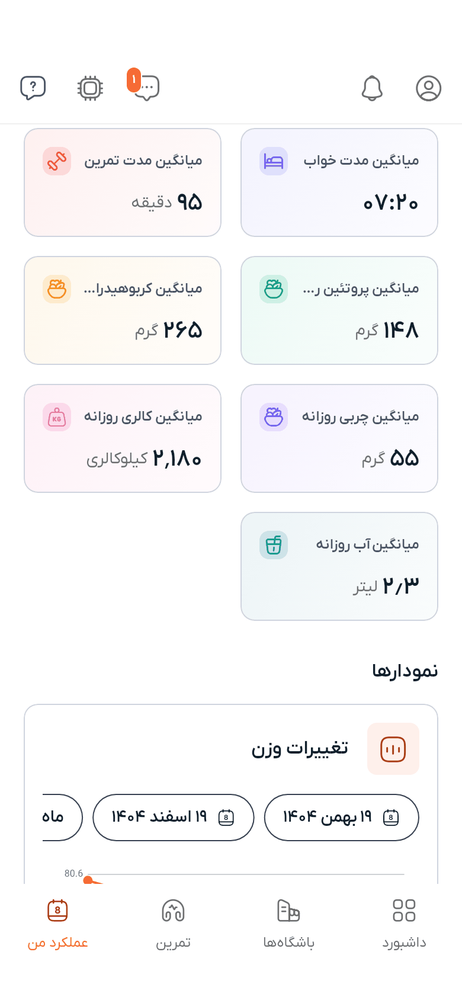

# عملکرد من

هر چه ثبت می‌کنید — تمرین، وعدهٔ غذایی، خواب، آب — همین‌جا جمع می‌شود و بر پایهٔ تاریخ مرتب است تا ببینید در گذر زمان چه کرده‌اید.

---

## امروز

ثبت در «عملکرد من» و در بالای همین بخش انجام می‌شود، در قسمتی به نام «امروز»: شش کارت، هر کدام برای یک نوع ثبت. کارت را بزنید و جزئیات را پر کنید.

داشبورد خلاصه‌ای یک‌خطی از همین روز را با پیوند «ثبت امروز» به اینجا دارد. داشبورد گزارش می‌دهد، عملکرد من ثبت می‌کند.

---

## شش کارت

### تمرین

یک جلسهٔ تمرینی را با این‌ها ثبت کنید:
- مدت — چقدر تمرین کردید
- حرکت‌ها — ست، تکرار و وزنهٔ هر کدام
- یادداشت — هر چه ارزش نگه‌داشتن دارد
- پیوند به برنامه — اختیاری، به یک جلسه از برنامهٔ تمرینی فعال

هنگام ثبت می‌توانید زمان‌سنج تمرین را برای اندازه‌گیری استراحت یا کل جلسه به کار ببرید.

کارت تمرین، جلسهٔ در جریان و زمان سپری‌شده را نشان می‌دهد. «پایان تمرین» روی همان کارت است، پس برای بستن یک جلسه لازم نیست نخست بازش کنید. تمرینی که از روزی پیش‌تر باز مانده باشد دیگر شمرده نمی‌شود و به‌جای آن می‌گوید از چه زمانی آغاز شده است؛ همان‌جا پایانش دهید تا مدتش ثبت شود.

### وعده‌های غذایی

آنچه خورده‌اید را ثبت کنید:
- یادداشت — توضیح وعدهٔ غذایی
- درشت‌مغذی‌ها — پروتئین، کربوهیدرات، چربی و کالری
- پیوند به برنامهٔ غذایی — به یک وعده از برنامهٔ غذایی فعال
- نشانهٔ وعدهٔ آزاد — اگر بیرون از برنامه بوده است

### خواب

کارت خواب یک زوج است: «خواب» وقتی می‌خوابید و «بیداری» وقتی بیدار می‌شوید، و کارت ساعت‌های میان این دو را می‌شمارد. مجموع شب گذشته در طول روز روی کارت می‌ماند.

### وزن

وزن بدن خود را به کیلوگرم، با یادداشت اختیاری، ثبت کنید.

### آب

شمار لیوان‌های آبی را که امروز نوشیده‌اید ثبت کنید. اگر در برنامهٔ غذایی هدف آب تعیین کرده باشید، پیشرفت شما تا آن هدف دیده می‌شود؛ عدد بر حسب لیتر است، چون هدف هم بر حسب لیتر تعریف می‌شود، در حالی که دکمه‌های «+ لیوان» و «− لیوان» بر حسب لیوان ثبت می‌کنند. کارت همین را زیر عدد می‌گوید.

### مکمل‌ها

مکمل‌هایی را که مصرف کرده‌اید ثبت کنید:
- انتخاب مکمل از فهرست
- پیوند به برنامهٔ غذایی — اختیاری
- یادداشت

---

## میانگین‌ها

زیر «امروز»، بخش «میانگین‌ها» چند روز پیاپی را خلاصه می‌کند؛ تاریخ شروع و پایان را انتخاب کنید یا به بازهٔ پیش‌فرض برگردید. سریع‌ترین راه است برای دیدن اینکه این ماه شبیه ماه پیش بوده یا نه.

---

## نمودارها

«نمودارها» همان داده‌ها را در بازه‌ای که انتخاب می‌کنید رسم می‌کند تا روند به‌جای عدد، به شکل یک خط دیده شود.

---

## رکوردهای شخصی

«رکوردهای شخصی» بهترین ست شما برای هر حرکت است. کلیدی آن را بر پایهٔ شمار تکرار نشان می‌دهد، تا بهترین تک‌تکرار، بهترین ست پنج‌تایی و مانند آن را جدا ببینید و نه یک عدد برای هر حرکت. فهرست کوتاه شروع می‌شود و باز می‌شود.

---

## تاریخچهٔ عملکرد

«مشاهده تاریخچه» در «عملکرد من» خط زمانی کامل را به شکل صفحه‌ای مستقل و گروه‌بندی‌شده بر پایهٔ تاریخ باز می‌کند. با پایین رفتن، ورودی‌های قدیمی‌تر خودکار و همیشه پایین‌تر از آنچه می‌خوانید افزوده می‌شوند. هر ورودی را بزنید تا جزئیاتش را ببینید یا ویرایشش کنید. ورودی مکمل نام مکمل مصرف‌شده را می‌گوید و ورودی تمرین، مدت آن را.

پایین فهرست می‌گوید خط زمانی تا کجا عقب رفته و چیز بیشتری برای آوردن هست یا نه؛ هفت نوع ورودی جدا از هم خوانده می‌شوند، پس خط زمانی هرجا کم‌عمق‌ترینشان رسیده باشد می‌ایستد و وانمود نمی‌کند همین همه چیز است.

اگر هنوز چیزی ثبت نکرده‌اید، صفحه همین را می‌گوید و صفحه‌ای خالی نشان نمی‌دهد.

---

## جزئیات تمرین

یک تمرین را باز کنید تا حول **حرکتی که همین حالا روی آن هستید** بچرخد:

- سربرگی با نام تمرین، زمان سپری‌شدهٔ زنده، و شمار حرکت‌های برنامه‌ریزی‌شده‌ای که تمام کرده‌اید
- **حرکت کنونی**، با تصویرش، ست و تکرار هدف، و همهٔ ست‌هایی که برایش ثبت کرده‌اید
- دکمهٔ «ثبت ست» درست زیر آن — با زدنش، وزنه و تکرار از **ست پیشین همان حرکت** از پیش پر شده‌اند تا ثبت یک ست معمولی فقط یک تأیید باشد. اگر ست پیشینی نباشد، تکرار هدفِ برنامه جایش می‌نشیند.
- دکمهٔ «افزودن حرکت دیگر» برای هر حرکتی که در برنامه نیست؛ آن را از فهرست حرکت‌ها انتخاب کنید و ست‌هایش را مثل بقیه ثبت کنید
- زمان‌سنج استراحت، که با ثبت هر ست شروع به شمردن می‌کند
- حرکت‌های باقی‌مانده در پایین؛ هرکدام را بزنید تا به آن بروید
- «حرکت‌های اضافه» — هر چه بیرون از برنامه ثبت کرده‌اید، زیر عنوان خودش همراه با شمار ست‌ها؛ هرکدام را بزنید تا به آن بروید، یا با «+» ست تازه‌ای بیفزایید

برای ویرایش وزنه یا تکرار یک ست، مداد همان ردیف را بزنید و عددها را همان‌جا عوض کنید. برای ویرایشگر کامل — حرکت، یادداشت، زمان‌ها — خود ست را بزنید.

مشخصات خود تمرین — عنوان، یادداشت، زمان شروع و پایان، و جلسهٔ برنامهٔ مرتبط — پشت منوی ⋮ در سربرگ است تا هنگام تمرین سر راه شما نباشد. زمان‌ها با قالب خوانا نمایش داده می‌شوند و با انتخابگر تاریخ و ساعت تعیین می‌شوند.

---

## اشتراک‌گذاری عملکرد

تا خودتان به اشتراک نگذارید، کسی عملکرد شما را نمی‌بیند. این کار با شماست، از انتخابگر بالای «عملکرد من»: تعیین کنید چه کسی می‌تواند ببیند و از چه تاریخی تا چه تاریخی. بعداً می‌توانید تاریخ‌ها را ویرایش کنید یا اشتراک را حذف کنید و دسترسی آن شخص بی‌درنگ بسته می‌شود.

همین انتخابگر، راه *خواندن* عملکردی است که کسی با شما به اشتراک گذاشته؛ از عملکرد خودتان به عملکرد او جابه‌جا شوید و کل بخش داده‌های او را نشان می‌دهد.

عملکرد به‌اشتراک‌گذاشته‌شده به‌کلی فقط‌خواندنی است. تاریخچه را می‌بینید اما چیزی ویرایش نمی‌شود، و این تا انتها برقرار است: تمرینی که از آن باز می‌کنید نه «ثبت ست» دارد، نه «پایان تمرین» و نه منوی تنظیمات — تنها آنچه ثبت شده است.

---

> **بعدی:** [برنامه‌هایی را که عملکرد من به آنها پیوند می‌دهد بسازید](workout-plans.md) یا [ببینید مربی با یک اشتراک چه می‌تواند بکند](trainers.md)

---

[→ قبلی: برنامه‌های غذایی](diet-plans.md) | [بعدی: مربیان ←](trainers.md)
