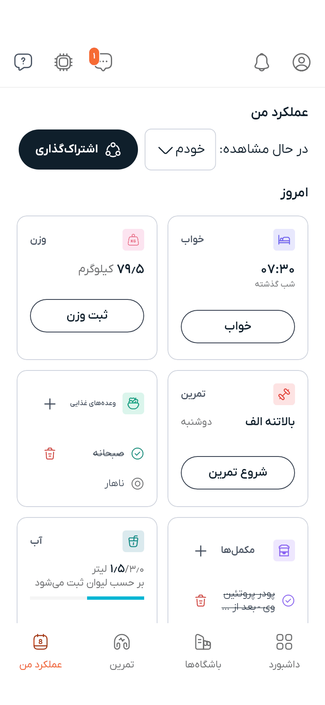
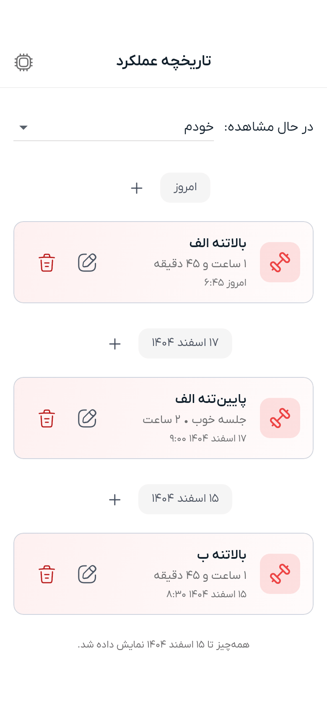
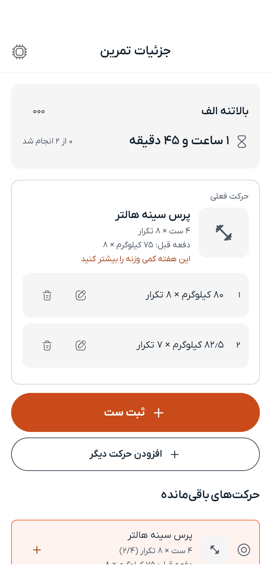

# ردیاب

هر چیزی که ثبت می‌کنید — تمرین، وعده، خواب، آب — همه‌اش اینجاست و بر اساس تاریخ مرتبه تا ببینید چه کرده‌اید.

---

## ثبت از داشبورد

سریع‌ترین راه ثبت، از طریق شش کارت سریع داشبورد است. روی هر کارت ضربه بزنید و جزئیات را پر کنید.

---

## انواع فعالیت

### تمرین

یک جلسه تمرینی را با این اطلاعات ثبت کنید:
- **مدت** — چقدر تمرین کردید
- **تمرین‌ها** — ست‌ها، تکرارها و وزن هر حرکت
- **یادداشت** — هر چیزی که ارزش ذخیره دارد
- **لینک به پلن** — اختیاری، می‌توانید به یک جلسه از برنامه تمرینی فعال وصل کنید

هنگام ثبت، می‌توانید از **تایمر تمرین فعال** برای ردیابی زمان استراحت یا کل جلسه استفاده کنید.

### وعده‌ها

آنچه خوردید را ثبت کنید:
- **یادداشت** — توضیح وعده
- **ماکروها** — پروتئین، کربوهیدرات، چربی و کالری
- **لینک به پلن غذایی** — به یک وعده از برنامه غذایی فعال وصل کنید
- **علامت تقلب** — اگر این وعده خارج از برنامه بود

### خواب

خوابتان را ثبت کنید:
- **مدت** — چند ساعت
- **یادداشت** — کیفیت خواب، هر چیز غیرعادی

### وزن

وزن بدن را به **کیلوگرم** با یادداشت اختیاری ثبت کنید.

### آب

تعداد **لیوان‌های** آبی که امروز نوشیدید را ثبت کنید. اگر هدف آب در برنامه غذایی تنظیم کرده‌اید، پیشرفت به سمت هدف نمایش داده می‌شود.

### مکمل‌ها

مکمل‌هایی که مصرف کردید را ثبت کنید:
- **انتخاب مکمل** از لیست
- **لینک به پلن غذایی** — اختیاری
- **یادداشت**

---

## تاریخچه ردیاب

تب ردیاب یک خط زمانی از همه فعالیت‌های ثبت‌شده، گروه‌بندی‌شده بر اساس تاریخ نشان می‌دهد. با اسکرول کردن، ورودی‌های قدیمی‌تر به‌طور خودکار و همیشه پایین‌تر از چیزی که در حال خواندنش هستید اضافه می‌شوند. روی هر ورودی ضربه بزنید تا جزئیات را ببینید یا ویرایش کنید.

اگر هنوز چیزی ثبت نکرده‌اید، صفحه این را به شما می‌گوید و یک صفحه خالی نشان نمی‌دهد.

---

## جزئیات تمرین

یک تمرین را باز کنید تا حول **تمرینی که همین حالا روی آن هستید** ببینیدش:

- سربرگی با نام تمرین، زمان سپری‌شده به‌صورت زنده و تعداد تمرین‌های برنامه‌ریزی‌شده‌ای که تمام کرده‌اید
- **تمرین فعلی**، همراه با تصویر آن، ست و تکرار هدف، و همه ست‌هایی که برایش ثبت کرده‌اید
- دکمه **ثبت ست** درست زیر آن — با زدنش، وزن و تکرار از **ست قبلی همان تمرین** از پیش پر شده‌اند تا ثبت یک ست معمولی فقط یک تأیید باشد. اگر ست قبلی وجود نداشته باشد، تکرار هدفِ برنامه جایگزین می‌شود.
- دکمه **افزودن تمرین دیگر** برای هر حرکتی که در برنامه نیست — آن را از فهرست قابل‌جست‌وجوی تمرین‌ها انتخاب کنید و ست‌هایش را مثل بقیه ثبت کنید
- یک **تایمر استراحت** که به‌محض ثبت هر ست شروع به شمردن می‌کند
- تمرین‌های باقی‌مانده در پایین — با ضربه روی هرکدام به آن جابه‌جا می‌شوید
- **تمرین‌های اضافه** — هر چیزی که خارج از برنامه ثبت کرده‌اید، زیر عنوان جداگانه خودش همراه با تعداد ست‌ها؛ با ضربه روی هرکدام به آن جابه‌جا می‌شوید یا با **+** ست تازه‌ای اضافه می‌کنید

برای ویرایش وزن یا تکرار یک ست، روی مداد همان ردیف بزنید و عددها را همان‌جا تغییر دهید. برای ویرایشگر کامل (تمرین، یادداشت، زمان‌ها) روی خود ست ضربه بزنید.

مشخصات خود تمرین — عنوان، یادداشت، زمان شروع و پایان و جلسه برنامه مرتبط — پشت منوی **⋮** در سربرگ قرار دارد تا هنگام تمرین سر راهتان نباشد. زمان‌ها با قالب خوانا و بومی‌شده نمایش داده می‌شوند و با انتخابگر تاریخ و ساعت تنظیم می‌شوند.

---

## دسترسی مربی

اگر با یک مربی کار می‌کنید، آن‌ها می‌توانند داده‌های ردیاب شما را در **حالت فقط‌خواندنی** ببینند. شما کنترل دارید — آن‌ها تاریخچه را می‌بینند اما نمی‌توانند ویرایش کنند.

---

> **بعدی:** [پلن‌هایی که ردیاب به آن‌ها لینک می‌کند را بسازید](workout-plans.md) یا [به داشبورد برگردید](dashboard.md)

---

[→ قبلی: برنامه‌های غذایی](diet-plans.md) | [بعدی: مربیان ←](trainers.md)
