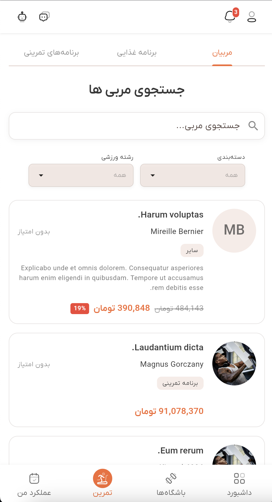

# راهنمای مربیان

به ویژگی جستجوی مربیان در دمبل خوش آمدید. این راهنما به شما کمک می‌کند تا نحوه جستجوی مربیان و کوچ‌ها، فیلتر کردن نتایج بر اساس دسته‌بندی‌ها و تخصص‌ها، و یافتن متخصص تناسب اندام مناسب برای نیازهای خود را بیاموزید.

## نمای کلی

صفحه جستجوی مربیان به شما امکان می‌دهد مربیان و کوچ‌های معتبر را در جامعه دمبل کشف کرده و با آنها ارتباط برقرار کنید. می‌توانید بر اساس نام جستجو کنید، بر اساس دسته‌بندی خدمات (برنامه‌های تمرینی، برنامه‌های غذایی) و تخصص‌ها (رشته‌ها) فیلتر کنید، و در میان خدمات تمرینی موجود مرور کنید.

ویژگی‌های کلیدی:
- **عملکرد جستجو**: یافتن مربیان بر اساس نام یا کلمات کلیدی
- **فیلترهای دسته‌بندی**: فیلتر بر اساس برنامه‌های تمرینی یا برنامه‌های غذایی
- **فیلترهای تخصص**: فیلتر بر اساس تخصص‌ها و زمینه‌های تخصصی مربیان
- **فهرست خدمات**: مشاهده کارت‌های خدمات مربی با جزئیات
- **صفحه‌بندی**: پیمایش در صفحات متعدد نتایج
- **کشیدن برای بازخوانی**: بازخوانی دستی نتایج

## دسترسی به جستجوی مربیان

### مرحله ۱: رفتن به بخش تمرین

۱. منوی ناوبری اصلی را باز کنید
۲. بخش **تمرین** را انتخاب کنید
۳. روی تب **مربیان** ضربه بزنید

### مرحله ۲: مشاهده صفحه جستجوی مربیان

وقتی تب مربیان را باز می‌کنید، رابط جستجو با نوار جستجو، گزینه‌های فیلتر و لیست نتایج را خواهید دید.

*صفحه جستجوی مربیان که نوار جستجو، فیلترها و فهرست خدمات مربی را نشان می‌دهد*

## عملکرد جستجو

### استفاده از نوار جستجو

نوار جستجو در بالای صفحه، زیر عنوان "جستجوی مربیان" قرار دارد.

**نحوه جستجو**:
۱. در فیلد ورودی جستجو ضربه بزنید
۲. نام مربی یا هر کلمه کلیدی را تایپ کنید
۳. نتایج به طور خودکار در حین تایپ به‌روزرسانی می‌شوند (با تأخیر ۳۰۰ میلی‌ثانیه)
۴. جستجو به حروف بزرگ و کوچک حساس نیست و در نام مربیان و توضیحات خدمات جستجو می‌کند

**رفتار جستجو**:
- **به‌روزرسانی‌های بلادرنگ**: نتایج به طور خودکار در حین تایپ فیلتر می‌شوند
- **ورودی تأخیری**: تأخیر کوچک از درخواست‌های بیش از حد API در حین تایپ جلوگیری می‌کند
- **پاک کردن جستجو**: تمام متن را حذف کنید تا دوباره تمام مربیان را ببینید
- **جستجوی خالی**: خالی گذاشتن فیلد تمام مربیان موجود را نشان می‌دهد

## فیلتر کردن نتایج

### فیلترهای دسته‌بندی

می‌توانید مربیان را بر اساس نوع خدماتی که ارائه می‌دهند فیلتر کنید:

**دسته‌بندی‌های موجود**:
- **برنامه‌های تمرینی**: مربیانی که برنامه‌های تمرینی/ورزشی ارائه می‌دهند
- **برنامه‌های غذایی**: مربیانی که خدمات تغذیه و برنامه‌ریزی وعده غذایی ارائه می‌دهند

**نحوه استفاده**:
۱. روی دکمه دسته‌بندی ضربه بزنید تا آن را روشن/خاموش کنید
۲. دسته‌بندی‌های انتخاب شده به صورت برجسته ظاهر می‌شوند
۳. می‌توان چندین دسته‌بندی را همزمان انتخاب کرد
۴. نتایج به طور خودکار با تغییر فیلترها به‌روزرسانی می‌شوند

**برچسب‌های فیلتر انتخاب شده**:
- وقتی دسته‌بندی‌ها انتخاب می‌شوند، به صورت تراشه‌های قابل حذف بالای دکمه‌های فیلتر ظاهر می‌شوند
- روی آیکون X روی یک تراشه ضربه بزنید تا آن فیلتر را حذف کنید
- از دکمه "پاک کردن همه" برای حذف تمام فیلترهای دسته‌بندی یکجا استفاده کنید

### فیلترهای تخصص (رشته‌ها)

مربیان می‌توانند تخصص‌ها یا "رشته‌ها" داشته باشند که نشان‌دهنده زمینه‌های تخصصی آنهاست.

**نحوه استفاده**:
۱. در بخش فیلتر در تخصص‌های موجود پیمایش کنید
۲. روی یک تخصص ضربه بزنید تا آن را روشن/خاموش کنید
۳. تخصص‌های انتخاب شده به صورت برجسته ظاهر می‌شوند
۴. می‌توان چندین تخصص را انتخاب کرد
۵. نتایج به طور خودکار با تغییر فیلترها به‌روزرسانی می‌شوند

**برچسب‌های فیلتر انتخاب شده**:
- تخصص‌های انتخاب شده به صورت تراشه‌های قابل حذف ظاهر می‌شوند
- هر تراشه نام تخصص را نشان می‌دهد
- روی آیکون X ضربه بزنید تا فیلتر تخصص را حذف کنید
- از دکمه "پاک کردن همه" برای حذف تمام فیلترهای تخصص یکجا استفاده کنید

### ترکیب فیلترها

می‌توانید چندین فیلتر را برای نتایج دقیق ترکیب کنید:
- **جستجو + دسته‌بندی‌ها**: جستجوی مربیان خاص که انواع خدمات خاصی ارائه می‌دهند
- **جستجو + تخصص‌ها**: یافتن مربیانی با تخصص خاص که با جستجوی شما مطابقت دارد
- **دسته‌بندی‌ها + تخصص‌ها**: فیلتر بر اساس هم نوع خدمات و هم زمینه تخصص
- **همه فیلترها**: ترکیب جستجو، دسته‌بندی‌ها و تخصص‌ها برای دقیق‌ترین نتایج

## مشاهده نتایج

### کارت‌های خدمات مربی

هر مربی به صورت یک کارت خدمات نمایش داده می‌شود که نشان می‌دهد:

- **اطلاعات مربی**: عکس پروفایل، نام و جزئیات اولیه
- **نوع خدمات**: آیا برنامه‌های تمرینی، برنامه‌های غذایی یا هر دو را ارائه می‌دهند
- **تخصص‌ها**: زمینه‌های تخصصی آنها
- **جزئیات اضافی**: هر اطلاعات مرتبط دیگر درباره خدمات آنها

**تعامل با کارت‌ها**:
- روی یک کارت ضربه بزنید تا جزئیات بیشتر درباره مربی را مشاهده کنید
- کارت‌ها قابل پیمایش هستند و در یک لیست سازماندهی شده‌اند
- هر کارت اطلاعات کافی برای تصمیم‌گیری آگاهانه ارائه می‌دهد

### حالت خالی

اگر هیچ مربی با جستجو یا فیلترهای شما مطابقت نداشته باشد، موارد زیر را خواهید دید:
- یک پیام: "هیچ مربی یافت نشد"
- پیام در یک کانتینر استایل شده ظاهر می‌شود
- می‌توانید جستجو یا فیلترهای خود را تنظیم کنید تا نتایج را پیدا کنید

### حالت خطا

اگر خطایی در بارگذاری مربیان وجود داشته باشد:
- یک پیام خطا ظاهر می‌شود که مشکل را توضیح می‌دهد
- دکمه "تلاش مجدد" به شما امکان می‌دهد دوباره تلاش کنید
- خطا به صورت برجسته با آیکون خطا نمایش داده می‌شود

## صفحه‌بندی

وقتی مربیان زیادی با معیارهای شما مطابقت دارند، نتایج به صفحات تقسیم می‌شوند.

### ناوبری صفحه

**کنترل‌های صفحه‌بندی**:
- **دکمه قبلی** (◀): رفتن به صفحه قبلی (در صفحه اول غیرفعال است)
- **نشانگر صفحه**: صفحه فعلی و کل صفحات را نشان می‌دهد (مثلاً "۲/۵")
- **دکمه بعدی** (▶): رفتن به صفحه بعدی (در صفحه آخر غیرفعال است)
- **اطلاعات ردیف**: نشان می‌دهد کدام نتایج را مشاهده می‌کنید (مثلاً "۱-۱۰ از ۴۵")

**نحوه ناوبری**:
۱. به پایین لیست نتایج پیمایش کنید
۲. کنترل‌های صفحه‌بندی را پیدا کنید
۳. روی قبلی یا بعدی ضربه بزنید تا صفحات تغییر کنند
۴. نشانگر صفحه موقعیت فعلی شما را نشان می‌دهد

**حالت بارگذاری**:
- در حین بارگذاری صفحه جدید، یک نشانگر بارگذاری در بالا ظاهر می‌شود
- نتایج پس از بارگذاری صفحه جدید به‌روزرسانی می‌شوند
- فیلترها و جستجوی فعلی شما هنگام تغییر صفحات حفظ می‌شوند

## بازخوانی نتایج

### کشیدن برای بازخوانی

برای بازخوانی دستی لیست مربیان:
۱. از بالای صفحه به پایین بکشید
۲. یک نشانگر بازخوانی ظاهر می‌شود
۳. برنامه مربیان را با جستجو و فیلترهای فعلی دوباره بارگذاری می‌کند
۴. نتایج پس از بازخوانی به‌روزرسانی می‌شوند

**زمان بازخوانی**:
- پس از تغییر فیلترها یا جستجو
- اگر نتایج قدیمی به نظر می‌رسند
- پس از مشکلات اتصال شبکه
- برای دیدن مربیان تازه اضافه شده

## حالت‌های بارگذاری

### بارگذاری اولیه

وقتی برای اولین بار صفحه را باز می‌کنید:
- یک نشانگر پیشرفت دایره‌ای در مرکز ظاهر می‌شود
- صفحه مربیان و گزینه‌های فیلتر را بارگذاری می‌کند
- پس از بارگذاری، رابط کامل ظاهر می‌شود

### بارگذاری‌های بعدی

وقتی صفحات جدید را بارگذاری می‌کنید یا بازخوانی می‌کنید:
- یک نشانگر پیشرفت خطی در بالا ظاهر می‌شود
- نتایج موجود قابل مشاهده باقی می‌مانند
- نتایج جدید جایگزین یا به لیست اضافه می‌شوند

## رفع مشکلات

### مربیان بارگذاری نمی‌شوند

اگر لیست مربیان بارگذاری نمی‌شود:

۱. **بررسی اینترنت**: اطمینان حاصل کنید که اتصال اینترنت پایدار دارید
۲. **بازخوانی**: برای بازخوانی صفحه به پایین بکشید
۳. **تلاش مجدد**: اگر خطایی ظاهر شد، روی دکمه "تلاش مجدد" ضربه بزنید
۴. **راه‌اندازی مجدد برنامه**: برنامه را ببندید و دوباره باز کنید
۵. **بررسی مجوزها**: تأیید کنید که مجوزهای مناسب برای مشاهده مربیان دارید

### جستجو کار نمی‌کند

اگر جستجو نتایجی برنمی‌گرداند:

۱. **پاک کردن جستجو**: سعی کنید فیلد جستجو را پاک کنید و دوباره جستجو کنید
۲. **بررسی املاء**: تأیید کنید که اصطلاحات جستجوی شما به درستی نوشته شده‌اند
۳. **گسترش جستجو**: کلمات کلیدی عمومی‌تر را امتحان کنید
۴. **حذف فیلترها**: تمام فیلترها را پاک کنید و دوباره جستجو کنید
۵. **بازخوانی**: برای بازخوانی صفحه به پایین بکشید

### فیلترها اعمال نمی‌شوند

اگر فیلترها کار نمی‌کنند:

۱. **بررسی انتخاب**: اطمینان حاصل کنید که فیلترها واقعاً انتخاب شده‌اند (برجسته)
۲. **پاک کردن و اعمال مجدد**: تمام فیلترها را پاک کنید و دوباره آنها را انتخاب کنید
۳. **بازخوانی**: برای بازخوانی صفحه به پایین بکشید
۴. **بررسی اینترنت**: اطمینان حاصل کنید که اتصال اینترنت پایدار دارید

### نتیجه‌ای یافت نشد

اگر "هیچ مربی یافت نشد" را می‌بینید:

۱. **پاک کردن فیلترها**: تمام فیلترهای فعال را حذف کنید
۲. **پاک کردن جستجو**: فیلد جستجو را پاک کنید
۳. **امتحان اصطلاحات مختلف**: از کلمات کلیدی جستجوی مختلف استفاده کنید
۴. **بررسی دسته‌بندی‌ها**: ترکیبات دسته‌بندی مختلف را امتحان کنید
۵. **بازخوانی**: برای بازخوانی به پایین بکشید و تمام مربیان را ببینید

### صفحه‌بندی کار نمی‌کند

اگر نمی‌توانید صفحات را پیمایش کنید:

۱. **بررسی اینترنت**: اطمینان حاصل کنید که اتصال اینترنت پایدار دارید
۲. **صبر برای بارگذاری**: اجازه دهید صفحه فعلی بارگذاری کامل شود
۳. **بازخوانی**: برای بازخوانی صفحه به پایین بکشید
۴. **تلاش مجدد**: دوباره روی دکمه‌های ناوبری ضربه بزنید

## بهترین روش‌ها

### جستجوی مؤثر

نکات برای یافتن مربی مناسب:

۱. **شروع گسترده**: با جستجوی عمومی یا بدون فیلتر شروع کنید
۲. **تدریجی تصفیه**: فیلترها را یکی یکی اضافه کنید تا نتایج را محدود کنید
۳. **استفاده از کلمات کلیدی**: برای زمینه‌های تخصصی یا انواع خدمات خاص جستجو کنید
۴. **ترکیب فیلترها**: از چندین فیلتر برای تطابق دقیق استفاده کنید
۵. **بررسی نتایج**: قبل از تصمیم‌گیری چند مربی را بررسی کنید

### استفاده از فیلترها

بهترین شیوه‌ها برای فیلتر کردن:

۱. **اول دسته‌بندی**: با نوع خدمات (برنامه‌های تمرینی/غذایی) شروع کنید
۲. **افزودن تخصص‌ها**: سپس بر اساس زمینه‌های تخصصی خاص فیلتر کنید
۳. **پاک کردن در صورت نیاز**: در پاک کردن فیلترها و شروع مجدد تردید نکنید
۴. **ترکیب عاقلانه**: فیلترهای زیاد ممکن است نتیجه‌ای برنگرداند

### مدیریت نتایج

نکات برای ناوبری در نتایج:

۱. **استفاده از صفحه‌بندی**: مربیان صفحات بعدی را از دست ندهید
۲. **بازخوانی منظم**: برای دیدن مربیان جدید به پایین بکشید تا بازخوانی شود
۳. **ذخیره علاقه‌مندی‌ها**: مربیانی که به آنها علاقه‌مند هستید را یادداشت کنید
۴. **مقایسه گزینه‌ها**: قبل از انتخاب چند مربی را بررسی کنید

## حریم خصوصی و داده‌ها

### چه اطلاعاتی قابل مشاهده است

هنگام جستجوی مربیان:

- **پروفایل‌های عمومی**: اطلاعات پروفایل مربی برای تمام کاربران قابل مشاهده است
- **جزئیات خدمات**: پیشنهادات خدمات و تخصص‌ها عمومی هستند
- **تاریخچه جستجو**: پرس‌وجوهای جستجوی شما ذخیره یا به اشتراک گذاشته نمی‌شوند

### استفاده از داده‌ها

- **درخواست‌های سرور**: جستجوها و فیلترها درخواست‌هایی به سرورهای دمبل ارسال می‌کنند
- **به‌روزرسانی‌های بلادرنگ**: نتایج بر اساس وضعیت فعلی پایگاه داده به‌روزرسانی می‌شوند
- **کش**: برخی داده‌ها ممکن است برای عملکرد کش شوند

## دریافت کمک

اگر به کمک بیشتری نیاز دارید:

۱. **دستیار هوش مصنوعی**: از دستیار هوش مصنوعی برای کمک در یافتن مربیان درخواست کنید (روی آیکون ربات ضربه بزنید 🤖)
۲. **بررسی راهنماهای دیگر**: مستندات کمک دیگر را در برنامه مرور کنید
۳. **تماس با پشتیبانی**: برای مشکلات فنی با پشتیبانی دمبل تماس بگیرید
۴. **انجمن**: به انجمن دمبل بپیوندید برای نکات و مشاوره کاربران

ویژگی جستجوی مربیان به شما کمک می‌کند متخصص تناسب اندام مناسب برای نیازهای خود را پیدا کنید. از جستجو و فیلترها به طور مؤثر استفاده کنید تا مربیانی را که با اهداف شما مطابقت دارند کشف کنید!

