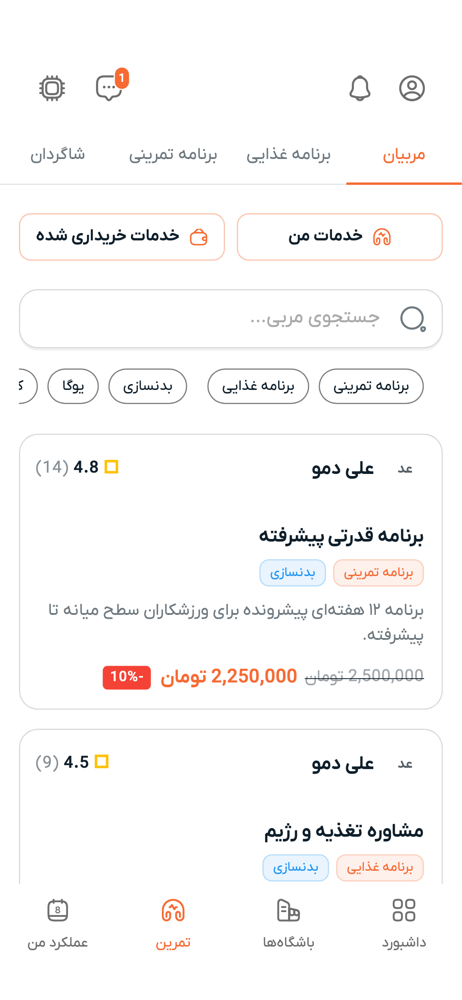
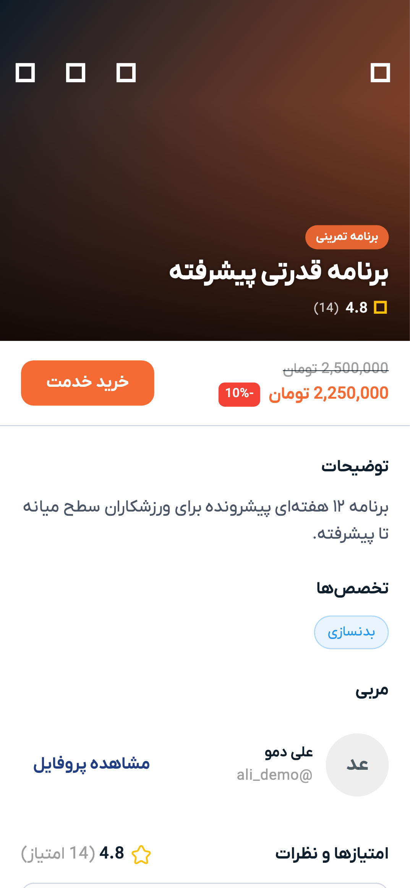
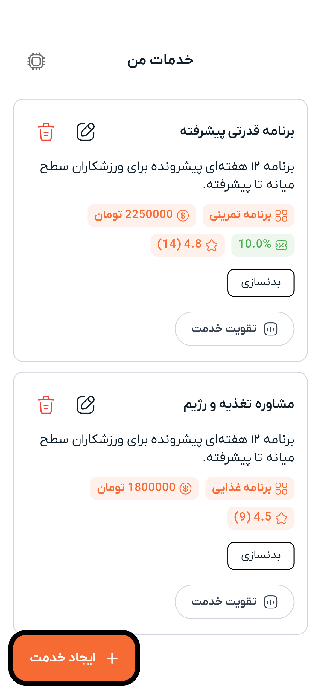
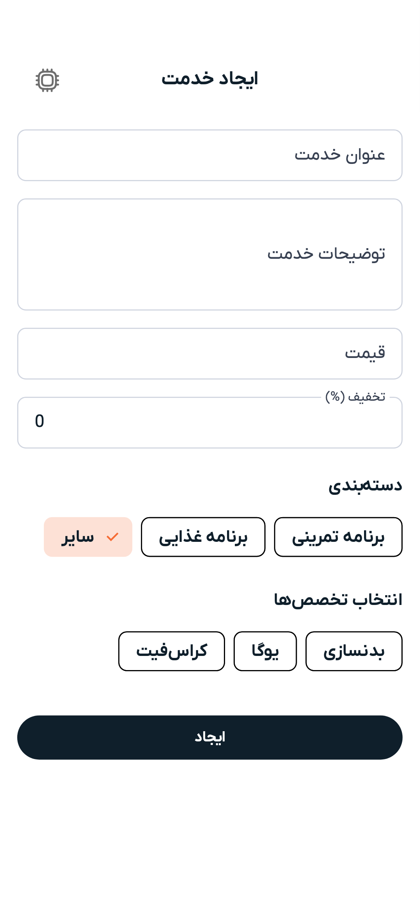
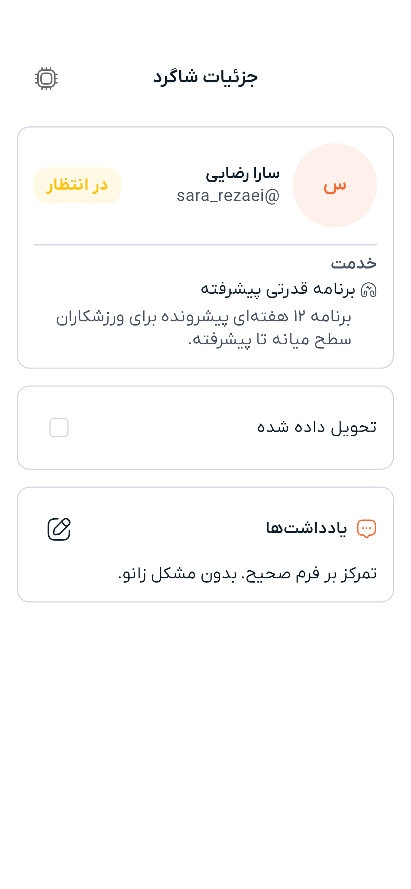

# مربیان

دنبال مربی می‌گردید؟ توی اپ جستجو کنید، پروفایل‌ها رو ببینید، و مستقیم سرویس بخرید.

---

## پیدا کردن مربی

به **تمرین → مربیان** بروید.

می‌توانید:
- **بر اساس نام** یا کلیدواژه جستجو کنید
- **فیلتر بر اساس دسته**: برنامه تمرینی یا برنامه غذایی
- **فیلتر بر اساس رشته ورزشی**: بدنسازی، کراس‌فیت، پاورلیفتینگ، یوگا و بیشتر

مربیانی با لیست تقویت‌شده در بالای نتایج ظاهر می‌شوند. روی هر کارت مربی ضربه بزنید تا پروفایلش را ببینید.

---

## پروفایل مربی

پروفایل یک مربی نشان می‌دهد:
- بیوگرافی، تخصص‌ها و رشته‌های ورزشی
- امتیاز و نظرات مشتریان قبلی
- سرویس‌های موجود با قیمت

---

## خرید سرویس

در پروفایل مربی، روی یک سرویس ضربه بزنید تا جزئیات کامل را ببینید. وقتی آماده شدید:
۱. روی **اشتراک** ضربه بزنید
۲. خرید را از کیف پول دمبل تأیید کنید

---

## اشتراک‌های شما

به **تمرین → اشتراک‌های من** بروید تا همه سرویس‌هایی که فعلاً مشترک آن‌ها هستید را ببینید. روی هر اشتراک ضربه بزنید تا جزئیات ببینید و با مربی در ارتباط باشید.

---

## برای مربیان — ارائه سرویس

اگر مربی هستید، می‌توانید سرویس‌هایی که ارائه می‌دهید را بسازید و مدیریت کنید.

### سرویس‌های من

به **تمرین → سرویس‌های من** بروید تا همه سرویس‌هایی که ساخته‌اید را ببینید.

### ایجاد سرویس

روی **+** ضربه بزنید و اطلاعات را پر کنید:
- نام و توضیح سرویس
- دسته (برنامه تمرینی / برنامه غذایی)
- قیمت و مدت
- رشته ورزشی

### مدیریت شاگردان

به **تمرین → شاگردان** بروید تا همه مشتریان فعلی خود را ببینید. روی هر شاگرد ضربه بزنید تا:
- پروفایل و آمار او را ببینید
- به داده‌های ردیاب‌اش دسترسی داشته باشید (فقط‌خواندنی)
- چت مستقیم باز کنید

---

> **بعدی:** [با مربی چت کنید](chat.md) یا [کیف پول را مشاهده کنید](wallet.md)
